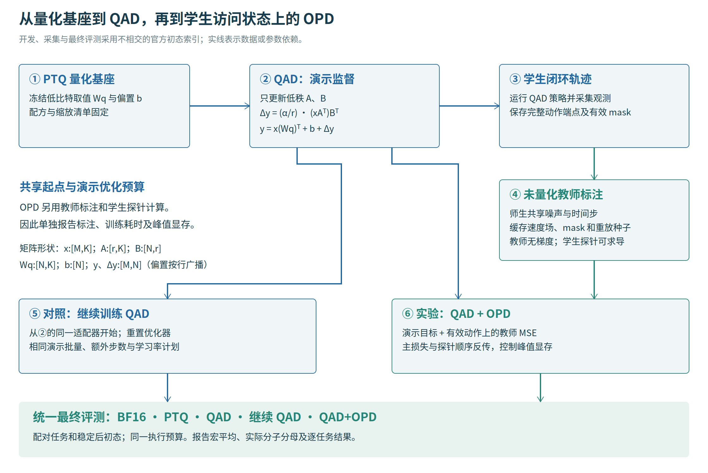

# apxinf-gr00t-fp4fp8-ptqad

**APXInf × GR00T：NVFP4/FP8 混合量化与 QAD→OPD 闭环恢复。** `ptqad` 是 PTQ 与 QAD 的融合写法。

面向 NVIDIA GR00T N1.7 这类视觉—语言—动作模型（VLA），本项目研究一个具体问题：**在逐步提高 FP4 覆盖率时，能否通过少量恢复训练，保住 LIBERO 闭环任务成功率？**

项目基于 [APXInf](https://github.com/infinigence/ApxInf) 与 [APXinf-robo](https://github.com/RLinf/APXinf-robo) 生态验证低精度算子和推理集成，并在完整 GR00T 模型上实现可审计的 **PTQ → QAD → 单轮 on-policy 蒸馏**。评测对象是机器人持续执行动作后的任务成败，离线权重误差和训练损失只作为辅助证据。

- **阅读论文**：[离线 HTML](paper/paper.html) · [知乎 Markdown](paper/zhihu/article.md) · [发布包说明](paper/README.md)
- **复现实验**：[完整运行说明](docs/reproduce-ptqad.md) · [恢复训练细节](rl/RECOVERY.md) · [评测协议](exp/recovery_protocol.json)
- **核对证据**：[编码预算](paper/evidence/recipe_inventory.json) · [版本锁定清单](setup/locks/manifest.json) · [原始实验目录](results/ptqad_20260929)

## 项目意义与贡献

VLA 的动作误差会改变下一时刻的观测，随后再次进入策略。一次动作偏差可能因此累积为抓取失败或任务未完成。只比较量化前后的张量误差，无法证明低精度策略保留了原有能力。本项目把数值格式、模型恢复和闭环评测连接起来，提供以下实现：

1. **可复查的混合量化。** 实现 NVFP4 E2M1 权重格点、块缩放、FP8 E4M3、校准裁剪和 GPTQ；对完整模型收集真实前向的二阶统计，并记录每层申请方法、实际方法、回退原因和误差。
2. **单调扩大的 FP4 配方。** 从 FP8 backbone / FP4 action head 出发，依次加入语言 FFN、语言注意力和视觉模块。每一级保留前一级的 FP4 张量，用开发集选择需要恢复的压缩强度。
3. **冻结量化基座上的恢复。** QAD 用演示数据的流匹配监督训练 LoRA。之后从同一个 QAD 适配器分出 continued-QAD 和 QAD→OPD 两臂，控制额外演示样本与优化器更新次数。
4. **基于学生访问状态的教师监督。** 收集 QAD 学生在模拟器里实际遇到的观测，再由 BF16 教师离线标注；教师与学生共享插值条件、噪声和时间，只对真实动作范围计算可微 MSE。
5. **贯穿训练、导出与评测的证据。** 检查完整模型层数、归一化统计、tied weights、LoRA 缩放和 checkpoint dtype；保留逐集布尔结果、初始状态身份、运行日志及 SHA-256。

APXInf 的原生 kernel 性能和 PyTorch 恢复策略的闭环结果分别记录。当前恢复导出保存的是原 dtype 的**稠密反量化权重加 LoRA 残差**；目标低比特编码预算不等于实际 safetensors 大小，也不自动构成恢复模型的端到端加速结论。

## 方法与实验流程



| 名称 | 本项目中的含义 |
|---|---|
| PTQ | 训练后量化：使用冻结权重和少量校准窗口生成低精度数值基座。 |
| QAD | 本项目采用演示数据监督的量化后低秩恢复：冻结量化基座，仅训练 LoRA A/B。 |
| OPD | 单轮 on-policy 教师蒸馏：在学生访问的观测上匹配教师速度场；本轮缓存不会随每次参数更新自动刷新。 |
| continued-QAD | 从相同 QAD checkpoint 再训练相同步数，只保留演示监督，用于辨别“继续训练”与“加入教师项”的效果。 |
| 闭环成功率 | 策略反复接收观测、输出动作后，LIBERO 环境给出的任务成功结果。主指标为十任务成功率的宏平均。 |

LoRA 的有效权重为 `W = W_PTQ + (alpha / rank) × B @ A`。生产协议设 rank=32、alpha=64、scope=`head+lang_all`，初始 QAD 500 个优化器更新；两个后续分支各 100 个更新。单 GPU 使用 microbatch=1、有效演示 batch=16，通过 16 次梯度累积实现。OPD 每 4 个优化器更新启用一次教师项，在该更新内对每个累积微批执行独立探针前向与反向；教师额外计算单独计量。

所有正式训练臂默认设置 `QAD_ACTIVATION_CHECKPOINTING=1`，对 16 层语言、32 层 DiT 和 4 层 VL 模块执行非重入激活重算。两步 GPU smoke 已验证这一路径能训练并保存；正式完整运行的耗时与显存仍以输出目录的 `runtime_metrics.json` 为准，其中记录真实优化器步数、参数 dtype，以及各设备的 PyTorch allocated/reserved 峰值。这些进程内指标不等同于包含桌面占用的整卡显存。

`rl/gr00t_runtime.py` 读取 checkpoint 保存的 LIBERO 模态定义，保持实际归一化统计。模型的填充动作张量与任务有效动作范围分开处理：教师和学生共享完整 40×132 插值端点与噪声，LIBERO 的有效范围为 **16 个时间步 × 7 个动作维度**。教师 MSE 排除填充位置，以每样本 112 个有效元素归一化；缓存 manifest 保存动作范围及生成依据。

## 硬件与依赖

本次运行平台为 Windows + WSL Ubuntu、RTX 5090 Laptop 24 GB（Blackwell，`sm_120`），WSL 可见 24 个 CPU 线程和约 47 GiB 主机内存。完整 H 校准在 CPU 累积二阶统计，GPU 只临时保留当前层矩阵；按形状计算的 full-scope H 上界约 13.82 GiB。所有 GPU 阶段串行执行，先做小规模冒烟，再运行正式实验。

| 环境 | 固定依赖与用途 |
|---|---|
| 恢复训练 / 模型服务 | Python 3.12.14、PyTorch 2.9.0+cu128、torchvision 0.24.0+cu128、transformers 4.57.3、torchcodec 0.8.0 |
| LIBERO 仿真 | 独立 Python 3.12.14 环境；robosuite 1.4.0、MuJoCo 3.3.1、gym 0.25.2 |
| 视频解码 | 独立 FFmpeg 7.1.1 环境，供本项目的 torchcodec 版本使用 |
| 原生 APXInf 构建 | 独立 APXInf Python 环境、Rust、CUDA toolkit 和可用的 WSL NVIDIA 驱动 |

逐包版本、conda 精确包清单、源码 revision 和校验值见 [setup/locks](setup/locks)。训练、仿真和原生引擎环境不应合并。系统还需要 EGL/OpenGL 动态库；安装步骤不修改 NVIDIA 驱动。

## 安装与权重准备

在仓库根目录执行。`CONDA_EXE` 指向已安装的 conda；使用自己的绝对路径。

```bash
git clone https://github.com/zhaosiying12138/apxinf-gr00t-fp4fp8-ptqad.git
cd apxinf-gr00t-fp4fp8-ptqad
bash setup/01_install_dev_tools.sh
bash setup/03_download_weights.sh --core-only
CONDA_EXE="$HOME/miniforge3/bin/conda" bash setup/06_install_recovery.sh
source setup/recovery-env.sh

export PROJECT=$(pwd)
export PTQAD_BASE="$PROJECT/weights/GR00T-N1.7-LIBERO/libero_10"
export QAD_DATASET="$GR00T_REPO/demo_data/libero_demo"
export PTQAD_RUN_DIR="$PROJECT/weights/reproductions/ptqad_run_01"
```

随固定 GR00T 源码提供的 `libero_demo` 只有 **5 个演示 episode、1,406 帧、3 个任务**；当前数据管线产生 1,331 个有效窗口。三个任务为双杯分盘、白杯与巧克力布丁摆放、杯子放入微波炉。它不是 LIBERO-10 全任务演示集。128 个校准窗口和 QAD 演示监督来自这个小型子集；迭代采样不保证窗口互不重复。

06 在 `third_party/Isaac-GR00T` 创建独立训练和仿真环境，安装 FFmpeg，并生成本机环境变量文件。它固定公开上游 GR00T commit `51d4c89f72fda44cbf77285c6a8114b52676b8a1`，再应用仓内 [运行补丁](patches/gr00t-recovery-runtime.patch)，重建训练实际依赖的源码。LIBERO 固定到 `8f1084e3132a39270c3a13ebe37270a43ece2a01`。

本地 backbone 路径需要保留 `nvidia/Cosmos-Reason2` 字符串，因为上游工厂据此选择 backbone 类型。安装脚本创建 `weights/nvidia/Cosmos-Reason2-2B` 命名链接；不要将 `GR00T_BACKBONE_MODEL` 改为仅含 snapshot hash 的路径。权重身份由实验产物中的逐 shard SHA-256 记录。[权重来源与校验说明](docs/weight-provenance.md) 列出已核验的 23 项资源：Cosmos 与可选 π0.5 固定到有本地来源凭据的 HF revision；GR00T 固定到已核验七个文件内容相同的 revision `2ea293aa20ba7cf5bbf3ba17a5fbcb1a01cbfe21`，下载后仍核对保存的内容哈希；原始下载 revision 未恢复。`--core-only` 只准备 GR00T 与 Cosmos；原生 π0.5 参考实验另运行不带该选项的下载入口。

可用 `bash setup/05_restore_all.sh --with-engine` 同时准备原生 APXInf 构建；已有权重时加 `--skip-download`。脚本采用失败立即退出，拒绝覆盖其他 revision 的 checkout。**源码补丁、锁文件和脚本语法已检查；尚未在另一台空白机器执行全套安装。** 环境版本检查通过后，仍需验证模型加载、校准与 LIBERO 仿真。

## 执行实验

### 1. CPU 检查与 GPU 冒烟

```bash
CUDA_VISIBLE_DEVICES= "$PTQAD_PYTHON" -m unittest discover -s tests -v

# 使用新目录；2 窗口只检查执行链路，不能充当正式校准集。
(cd "$GR00T_REPO"; "$PTQAD_PYTHON" "$PROJECT/quant/ptq/collector.py" \
  --base "$PTQAD_BASE" --dataset "$QAD_DATASET" \
  --out "$PTQAD_RUN_DIR/calibration_smoke" \
  --recipe calib --windows 2 --batch 1)
```

完整模型必须加载 16 层语言栈、32 层 DiT 和 4 层 VL 模块。校准器通过 `training.start_from_checkpoint` 加载权重，保留基座统计，记录实际窗口数、每层样本行数、调用次数及源权重散列。真实 Linear 缺少 H 时，`required` 模式直接失败；非 Linear 回退由真实模块类型单独记录。

### 2. 构建配方并在开发集选择压缩强度

```bash
# 一份 full-scope H 支持后续整个阶梯；先完成校准，不预先评测所有配方。
PTQAD_CAL_SCOPE=calib PTQ_CAL_WINDOWS=128 PTQ_CAL_BATCH=1 \
  bash exp/reproduce_ptqad.sh calibrate
export DEV_ROOT="${PTQAD_EVAL_RUNS_ROOT:-$PTQAD_RUN_DIR/evaluations}/development"

# dry-run 只打印可能执行的命令，不读取大权重、不启动 GPU。
bash exp/run_development.sh --development-root "$DEV_ROOT" --dry-run
bash exp/run_development.sh --development-root "$DEV_ROOT"

# 在恢复训练与 heldout 之前冻结纯 PTQ 前驱参考组；仅使用开发集证据。
CUDA_VISIBLE_DEVICES= "$PTQAD_PYTHON" exp/recipe_inventory.py \
  --base "$PTQAD_BASE" --calibration-meta "$PTQAD_RUN_DIR/calibration/calib_meta.json" \
  --out "$DEV_ROOT/recipe_inventory.json"

python3 eval/compare_ptq_frontier.py freeze \
  --selection "$DEV_ROOT/selection.json" --development-root "$DEV_ROOT" \
  --budget "$DEV_ROOT/recipe_inventory.json" --out "$DEV_ROOT/frontier_plan.json"
```

入口按 `bf16 → fp8 → head_ffn → head_lang → head_lang_vision → calib` 串行执行，每完成一臂便调用开发集比较器。首次出现升级配方比 BF16 的开发集宏平均下降至少 0.10 时立即写出 `selection.json` 并停止，不再构建或评测更高一级；未越过阈值时选择最大压缩 `calib`。最终测试集不参与选择。

评测子目录固定为 `bf16/`、`fp8/` 等，逐级比较保存在 `comparison_after_<arm>.json`。缺失的配方由原有 bake 驱动构建；已有配方只有在完整状态、配方名称、基座和输出 shard 哈希、配置及统计均通过核验后才可复用。开发集目录必须全新，失败目录不会被续跑或覆盖。`frontier_plan.json` 冻结选中配方之前的全部纯 PTQ 前驱及身份，用于后续补充比较，保持主五臂协议独立。 本机预算由 safetensors 形状、完整校准的真实 Linear 覆盖和协议中的 LoRA 范围重新生成，读取配置与权重哈希以支持目录迁移；不要把论文中记录原实验路径的预算直接用于新实验 freeze。

### 3. 训练 QAD 并导出

```bash
# 从已完成的开发集选择读取，不手填或根据最终测试更换配方。
export PTQAD_RECOVERY_RECIPE="$(python3 -c 'import json,sys; r=json.load(open(sys.argv[1])); assert r["selection_uses_heldout"] is False and r["selected_recipe"]; print(r["selected_recipe"])' "$DEV_ROOT/selection.json")"
export QAD_LORA_SCOPE=head+lang_all
QAD_STEPS=500 QAD_MICRO_BATCH=1 QAD_GLOBAL_BATCH=16 QAD_LR=0.0001 QAD_ACTIVATION_CHECKPOINTING=1 \
  bash exp/reproduce_ptqad.sh train-qad merge-qad
```

生产训练前，可按 [恢复训练说明](rl/RECOVERY.md) 在另一个输出目录执行两步 smoke，核对显存、梯度和保存产物。导出器逐张量检查冻结权重与训练基座一致，并核对 rank、alpha、配置和统计散列。输出保留原 base 的 dtype 和键集合，清除所有 LoRA 张量，保存独立导出 manifest。embedding/lm_head 的共享权重约束也必须保持一致。

### 4. 收集学生状态、标注教师、比较两条续训分支

```bash
PTQ_BASE="$PTQAD_RUN_DIR/$PTQAD_RECOVERY_RECIPE" \
BF16_TEACHER="$PTQAD_BASE" \
QAD_ADAPTER="$PTQAD_RUN_DIR/train_qad/checkpoint-500" \
QAD_MERGED="$PTQAD_RUN_DIR/qad" \
ROUND_OUT="$PTQAD_RUN_DIR/round_01" \
EXTRA_STEPS=100 OPD_WEIGHT=1.0 OPD_EVERY=4 \
  bash rl/run_onpolicy_round.sh
```

该脚本串行完成学生观察采集、BF16 教师标注、continued-QAD 与 QAD→OPD 各 100 步训练，以及 BF16、选定 PTQ、QAD、continued-QAD、QAD→OPD 五臂最终评测。两条续训分支从同一份 A/B 和同一个冻结 PTQ 基座开始，都重新初始化 Adam 和学习率计划。OPD 的教师标注与额外探针计算单独报告，因此“相同演示与更新预算”不等于“相同总算力”。

正式续训前另有四步 OPD 执行检查，覆盖默认 `OPD_EVERY=4` 的完整教师调度周期，并要求记录 16 次有限的教师项反向传播，验证显存与保存；检查产生的适配器不进入任何正式分支或结果比较。两条 100 步分支始终从原始 QAD 适配器开始。

OPD 的学生状态采集覆盖十任务，超出了三任务演示子集，额外使用模拟器交互和教师标注；默认最多保留 160 个观察探针。对照控制的是演示批次和优化器更新预算，不能把两臂说成相同数据或相同交互预算。若 OPD 获益，其解释应同时考虑教师监督和新增的任务状态覆盖。

五臂全部完成后，再按预先冻结的计划评测纯 PTQ 前驱，检查更保守量化是否已经达到相近成功率。补充组使用相同 100 集 heldout 和初态哈希，不参与重新选择配方；比较时为恢复策略计入低秩旁路的目标字节预算。

```bash
bash exp/run_ptq_frontier.sh --plan "$DEV_ROOT/frontier_plan.json" \
  --round "$PTQAD_RUN_DIR/round_01" --out "$PTQAD_RUN_DIR/frontier_01" --port 5595
```

### 5. 归档闭环证据

正式发布以完整五臂配对比较、冻结 PTQ 前驱比较和训练成本为同一套证据链。`run_onpolicy_round.sh` 完成时已经调用 `eval/compare_recovery.py` 生成 `round_01/paired_comparison.json`；不要重复运行会拒绝覆盖的生成命令。`collect_frontier_evidence.py` 会重算五臂与前驱比较，再按字节归档原始 JSON、逐任务日志和来源映射。

以下命令在为本轮新结果准备的发布 checkout 中执行：其中 `paper/evidence/recipe_inventory.json` 必须是冻结计划引用的预算原字节，`frontier/`、`training/`、`runtime/` 和顶层比较输出均须尚不存在。已有发布包保留不动；缺失、未完成或不配对的评测不能通过归档。

```bash
set -e
cmp "$DEV_ROOT/recipe_inventory.json" paper/evidence/recipe_inventory.json
python3 paper/collect_frontier_evidence.py --frontier "$PTQAD_RUN_DIR/frontier_01"
python3 - "$PTQAD_RUN_DIR/round_01/paired_comparison.json" <<'PY'
from pathlib import Path
import sys
source = Path(sys.argv[1])
with Path("paper/evidence/paired_comparison.json").open("xb") as stream:
    stream.write(source.read_bytes())
PY
CUDA_VISIBLE_DEVICES= "$PTQAD_PYTHON" paper/collect_training_costs.py \
  --qad-dir "$PTQAD_RUN_DIR/train_qad" --qad-merged "$PTQAD_RUN_DIR/qad" \
  --round "$PTQAD_RUN_DIR/round_01" --out paper/evidence/training
python3 paper/collect_training_costs.py --verify-published paper/evidence/training
```

配对比较保留每集布尔结果、实际分母、初态身份与逐任务结果。成本收据分别报告 QAD、两种续训、教师标注和状态采集的真实计时范围；等演示与更新预算不表示等总计算。公开验证可重算轻量元数据和日志；未随包分发的权重、观察张量和教师缓存只保留收集时核对的散列。

五臂全部完成导出后，用显式解释器和全部五个 checkpoint 身份采集运行清单；每个 `ARM=PATH` 必须指向实际模型，输出目录须不存在。

```bash
"$PTQAD_PYTHON" paper/capture_runtime.py \
  --out paper/evidence/runtime --gr00t "$GR00T_REPO" \
  --server-python "$PTQAD_PYTHON" --rollout-python "$LIBERO_PYTHON" \
  --checkpoint "bf16=$PTQAD_BASE" \
  --checkpoint "ptq=$PTQAD_RUN_DIR/$PTQAD_RECOVERY_RECIPE" \
  --checkpoint "qad=$PTQAD_RUN_DIR/qad" \
  --checkpoint "continued_qad=$PTQAD_RUN_DIR/round_01/continued_qad_merged" \
  --checkpoint "qad_opd=$PTQAD_RUN_DIR/round_01/qad_opd_merged"
```

### 6. 独立测量原生算子与引擎

```bash
bash spike/run.sh

# 完成 --with-engine 安装后，从仓库外目录运行以避免 Python 包遮蔽。
(cd /tmp; "$PROJECT/third_party/apxinf-robo/.venv/bin/python" \
  "$PROJECT/exp/bench_engine.py" --model-dir "$PTQAD_BASE" \
  --variant bf16 --extra-kwarg "backbone=$GR00T_BACKBONE_MODEL" \
  --warmup 10 --samples 30 --out "$PROJECT/results/engine/gr00t_bf16_run01.json")
```

算子 GEMM、模型引擎和恢复策略分别列出测量对象、warmup、样本量及耗时口径。不要把某个矩阵形状的加速比作为整套恢复模型的端到端性能。

PyTorch 参考入口的独立命令与计时边界见 [baseline-timing.md](docs/baseline-timing.md)。GR00T 复用恢复环境；可选的 π0.5 LeRobot 环境仅用于参考耗时，不是核心闭环的依赖。π0.5 原生工件的 CPU 打包与溯源见 [native-pi05.md](docs/native-pi05.md)。

## 评测协议

正式闭环使用 LIBERO-10 的十个任务、每次一个环境、统一动作步长与最大 episode 长度。模拟器的随机种子和官方初始状态库索引分别记录，不能只靠设置随机种子声称初始状态不重叠。

| 集合 | 每任务集数 | 官方初始状态索引 | 用途 |
|---|---:|---|---|
| development | 2 | 0、1 | 选择 FP4 覆盖率 |
| collection | 2 | 2、3 | 收集 QAD 学生访问的状态 |
| heldout | 10 | 10–19 | 最终五臂对比 |

入口按 `--purpose` 自动固定上述分区与 episode 数，正式运行显式传入的参数必须与协议一致。种子分别为 development=330000、collection=110000、heldout=220000；每个任务与 episode 使用确定偏移。安装官方初态后进行 10 步稳定处理，逐集保存初始状态哈希，最终各臂按相同任务和相同官方初态比较。manifest 中的协议标识为 `libero10_official_bank_v1`；heldout 同时拒绝与 collection 重叠的初态索引和重置种子。完整参数及选择规则以 [recovery_protocol.json](exp/recovery_protocol.json) 为准。

## 结果与口径

<!-- BEGIN CURRENT RESULTS -->

闭环结果以本轮完整十任务的 `summary.json`、`task_results.json` 和原始日志为准。主指标为**任务宏平均成功率**，同时保留逐任务成功数/实际集数及 micro；恢复是否有效、OPD 是否超过相同预算的 continued-QAD，均由最终实测回答。训练损失下降不替代成功率证据。

下表是已核对的**目标编码预算**，不包含待实测的成功率和速度。eligible 指 checkpoint 中后缀为 `.weight`、二维且输入宽度可被 16 整除的张量；保留其余张量原精度。

| 配方 | 新增 FP4 范围 | FP4 / eligible 元素 | FP4 / 全部元素 | 目标完整编码压缩比 |
|---|---|---:|---:|---:|
| fp8 | 起点：动作头；backbone 为 FP8 | 45.96% | 41.16% | 2.1614× |
| head_ffn | 语言 FFN gate/up | 60.26% | 53.97% | 2.3014× |
| head_lang | 语言注意力 q/k/v | 65.03% | 58.24% | 2.3522× |
| head_lang_vision | 视觉 backbone | 79.41% | 71.12% | 2.5201× |
| calib | 剩余 eligible 张量 | 100.00% | 89.55% | 2.8063× |

表中去除了已明确识别的 tied lm_head 别名：eligible 分母为 2,815,557,632 个元素，完整分母为 3,144,016,000。物理 checkpoint 保存两份共享权重，其对应分母为 3,126,722,560 和 3,455,180,928；两种口径都在 [recipe_inventory.json](paper/evidence/recipe_inventory.json) 中公开。

预算包含 FP4 payload、每 16 元素的 E4M3 scale、张量全局 scale，以及 FP8 的行 scale；未包括对齐、激活和优化器。上表为 PTQ 基座预算。`head+lang_all`、rank=32 的 LoRA 另外含 58,580,992 个元素；若以 BF16 保存旁路，需增加 117,161,984 字节后再计算压缩比。当前实际导出是稠密原 dtype checkpoint，不能按此预算宣称磁盘文件已缩小或原生推理已加速。

<!-- END CURRENT RESULTS -->

## Ubuntu 运行截图

以下保留全部 17 个截图入口，按执行阶段展开查看。截图便于核对实际命令与终端输出；统计结论仍对应可解析日志、配置及结果文件。论文与 README 共用这些原图路径。

<details>
<summary>量化、校准与产物</summary>

**01 · 完整模型校准统计采集**


**02 · PTQ 权重写盘**


**03 · 低精度打包产物**


**04 · 动作探针**


</details>

<details>
<summary>恢复训练与教师标注</summary>

**05 · QAD 低秩恢复训练**


**06 · 教师探针缓存**


**07 · 教师辅助恢复训练**


**08 · 量化训练检查**


</details>

<details>
<summary>闭环评测</summary>

**09 · 策略服务端**


**10 · LIBERO rollout 客户端**


</details>

<details>
<summary>数值格式、算子与原生引擎</summary>

**11 · 低精度数值检查**


**12 · FP8 输出类型探针**


**13 · 矩阵乘算子基准**


**14 · 实际层形状的算子基准**


**15 · GR00T BF16 执行流程展示（10 次采样）**


模型加载与动作输出的执行流程展示；正文定量结论以本轮统一协议的原始计时记录为准。

**16 · π0.5 BF16 执行流程展示（10 次采样）**


模型加载与动作输出的执行流程展示；正文定量结论以本轮统一协议的原始计时记录为准。 图中缺失变换统计的提示不构成归一化或行为等价证据。

**17 · π0.5 NVFP4 原型运行**


</details>

## 目录结构

```text
setup/       安装脚本、逐包锁文件与环境配置
patches/     固定上游源码之上的运行补丁
quant/       数值格式、PTQ 分配、校准统计与权重写盘
rl/          QAD、学生观察采集、教师标注、LoRA 导出
eval/        仓内模型服务与固定初态的 LIBERO 评测
exp/         实验协议、串行执行入口、独立引擎基准
spike/       原生低精度算子验证与 microbenchmark
tests/       CPU 数值、梯度、缓存与 checkpoint 一致性检查
results/     实验日志和可解析的结果；大工件不入库
paper/       中文论文、图表、17 张截图、知乎发布包和证据
docs/        详细运行说明
weights/     本地权重与实验 checkpoint，不入库
third_party/ 固定版本上游源码及独立环境，不入库
```

## 总结与边界

本项目把低精度编码、可微恢复和闭环任务成功率放在同一条可追踪的实验链上。核心判断是：扩大 FP4 覆盖率后，QAD 与学生状态上的教师监督能恢复多少任务能力，以及额外恢复计算换来了多少有效压缩。所有配方和对照按同一协议保留结果；成功率、编码预算、训练成本与原生引擎延迟分别报告。

第三方代码、模型权重和数据遵循各自上游许可。知乎发布包提供可编辑 Markdown、离线 HTML 与图片；生成发布包不会自动向知乎发表文章。
