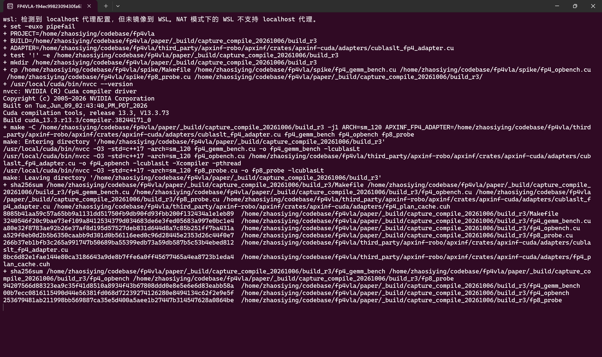
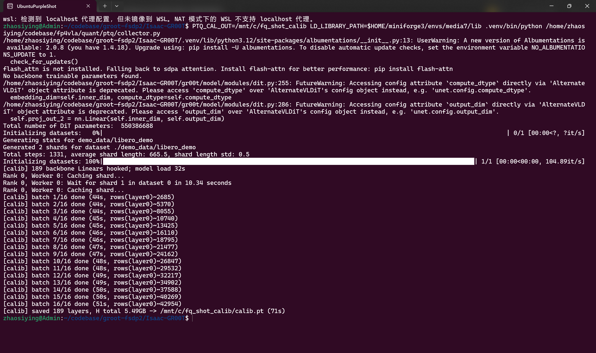
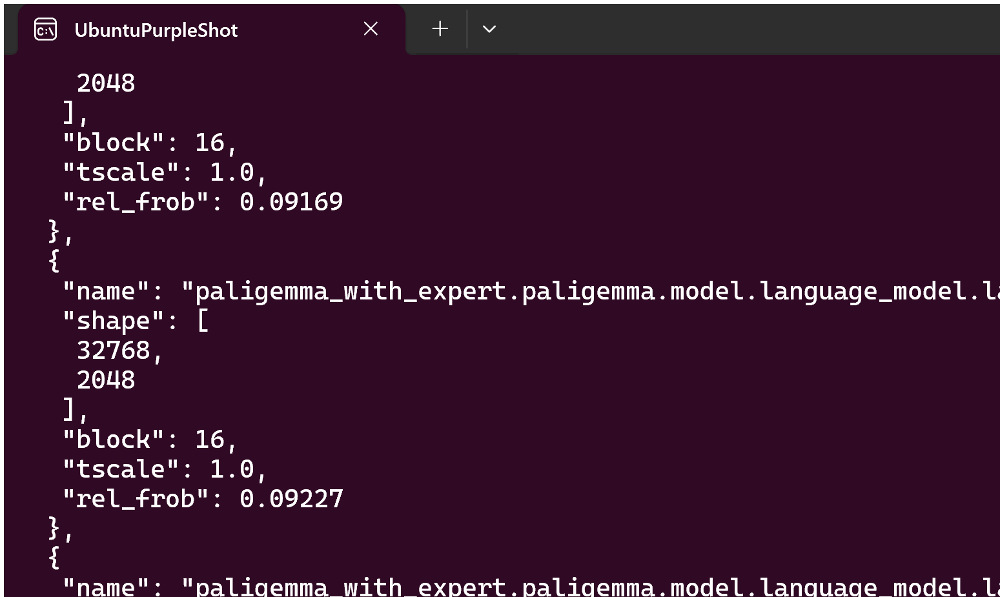
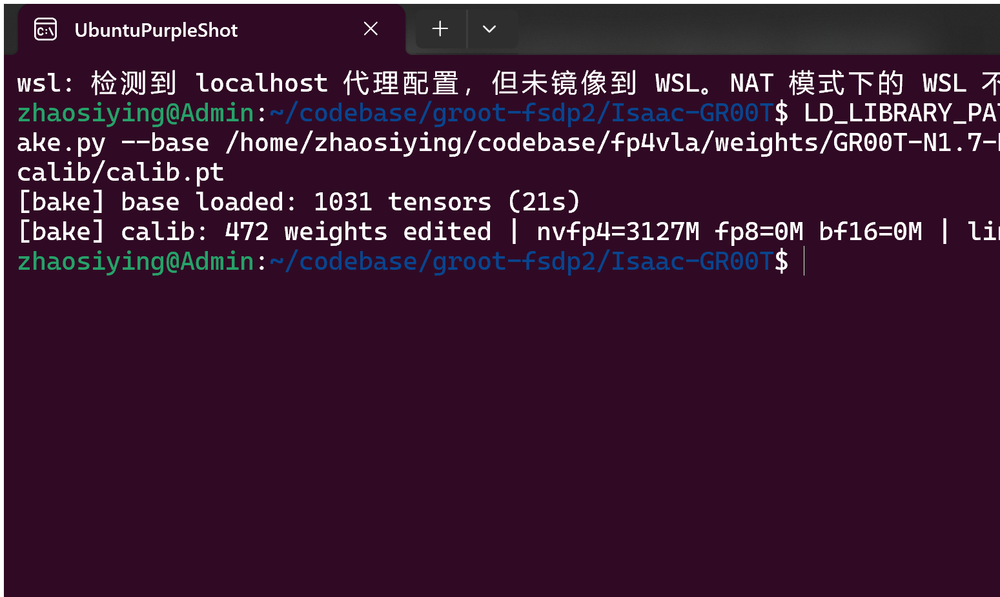
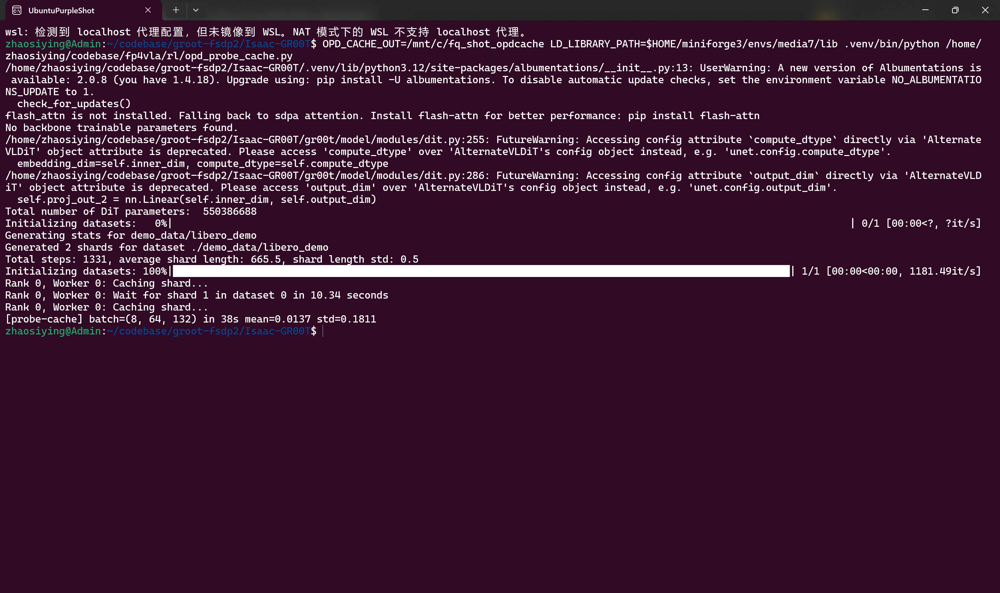
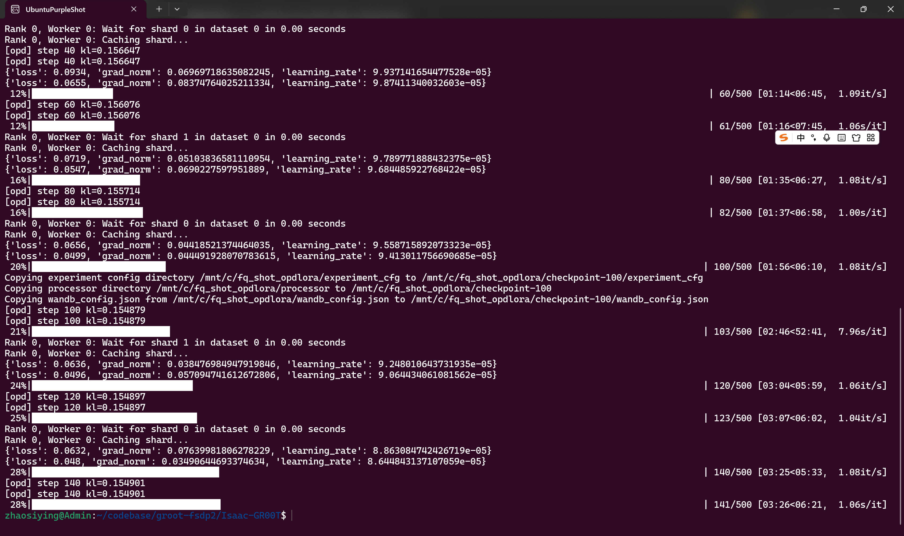
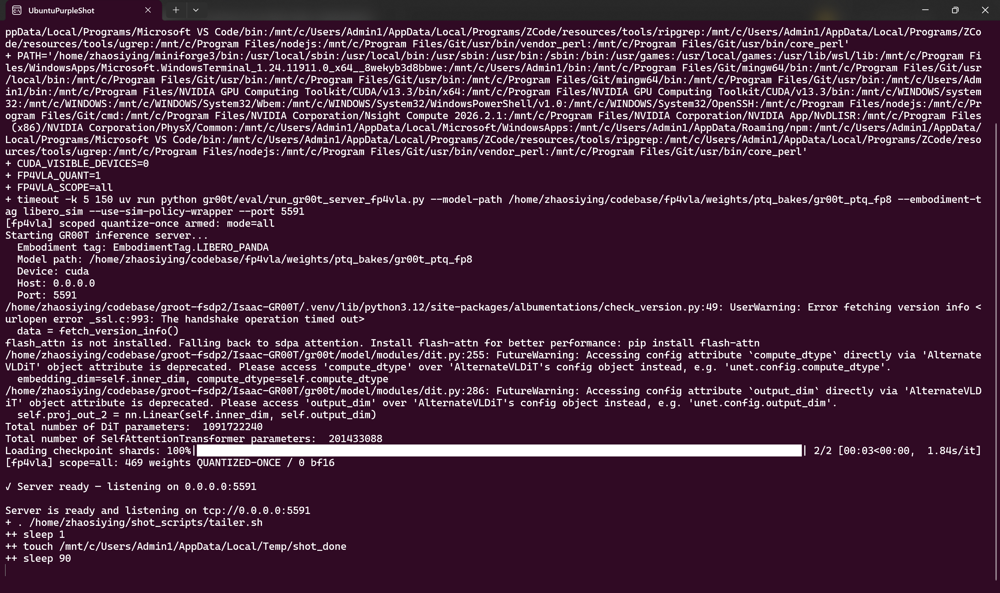
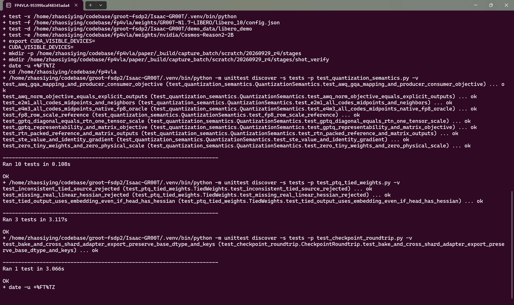

# apxinf-gr00t-fp4fp8-ptqad

APXInf × GR00T：NVFP4 W4A4 与 QAD/OPD 量化域恢复

视觉—语言—动作模型（VLA）把图像、语言和机器人状态映射为动作。本项目研究 **GR00T N1.7 的全 NVFP4 W4A4 训练后量化（PTQ）→ QAD 演示适配 → OPD 教师监督**：全部可量化线性算子的权重和输入量化为四位，再用成功演示训练低秩修正，最后在学生访问的状态上加入教师速度监督，以恢复 LIBERO 闭环任务能力。3 个 embedding/position 张量仅做 W4 权重量化。

**验证范围。** GR00T 使用 Torch QDQ（量化后反量化）模拟 W4A4 主分支，QAD/OPD 保留读取原始 BF16 输入的独立 LoRA（低秩适配）残差。APXInf 的原生 NVFP4/FP8 算子与 π0.5 图执行另作独立基准；GR00T 的 packed W4A4 原生执行尚未接入，因此闭环成功率、目标编码压缩比和 APXInf 延迟分别报告，不能把独立引擎延迟直接解释为 GR00T 闭环加速。

论文和可视化发布包是本仓库的主要入口：

- [中文论文 HTML](paper/paper.html)：离线单文件，含公式、图表、Ubuntu 执行图集和已核验的 v11 结果。
- [知乎 Markdown 发布稿](paper/zhihu/article.md)：与 HTML 共用正文和图片资源。
- [论文发布包说明](paper/README.md)：构建、验证、打包和证据索引。
- [复现说明](docs/reproduce-ptqad.md)：从环境安装到独立闭环评测的完整步骤。

## 研究贡献

1. **W4A4 PTQ。** 将 GPTQ 误差补偿适配到 NVFP4 块缩放。激活先转 F16，再按 16 元素块使用 E4M3 缩放和 E2M1 格点，二级缩放固定为 1.0。初始 QAD 训练使用严格转换，由绑定的训练源码核验；continued-QAD/OPD 训练显式启用有限 FP16 饱和，正式量化评测统一启用该开关。训练设置、实际评测环境与服务是否曾触发饱和分别核验；服务日志只记录首次触发，不计量触发总次数。
2. **量化域恢复。** 冻结 PTQ 基座，在参与动作前向的 468 个普通 Linear 上训练 QAD/OPD 的 A/B 低秩参数；部署保留基座与 adapter 两条分支。词表输出层 `lm_head` 不参与动作前向，7 个类别线性层保持 W4A4 且无低秩旁路。
3. **闭环评测。** BF16、PTQ、QAD、continued-QAD 和 QAD+OPD 使用相同任务、官方初态和回合预算。continued-QAD 匹配追加演示更新数，用来检验 OPD 教师监督的额外作用；OPD−QAD 还包含追加阶段的有限值饱和与梯度裁剪变化，OPD−continued-QAD 才是教师监督的独立对照。
4. **APXInf 验证。** 提供 NVFP4 算子、缩放布局和图重放的数值验收与计时记录。
5. **可复现发布。** 协议、配置、权重来源、日志、图表及 17 个 Ubuntu 截图环节共同组成复现记录。

## 结果状态

编码预算、闭环成功率和配对统计均由冻结 v11 协议对应的 `final_manifest.json` 与 `paired_comparison.json` 回填，并在发布校验中复核。

### 2026-10-06 W4A4 PTQ 完整重评

此前 PTQ 目录在 KITCHEN_SCENE8 的单任务 1,800 秒限制下只留下了部分日志。本发布稿只采用重新完成的 10 任务 × 16 回合结果；旧的部分运行不进入 `paper/evidence/`。重评前先确认媒体工具可用，再用独立前台进程、端口 `6891` 和 3,600 秒单任务上限运行：

```bash
cd /home/zhaosiying/codebase/fp4vla
ffmpeg -version | head -1
PTQ_RERUN=results/reruns/ptq_w4a4_heldout_20261006_01/heldout_ptq
FP4VLA_QUANT=0 FP4VLA_W4A4=1 FP4VLA_W4A4_ADAPTER=0 \
  /home/zhaosiying/codebase/groot-fsdp2/Isaac-GR00T/.venv/bin/python \
  eval/run_recovery_eval.py \
  --checkpoint /home/zhaosiying/codebase/fp4vla/results/ptqad_20261003/w4a4_full_category \
  --out "$PTQ_RERUN" --purpose heldout --seed 970000 --episodes 16 \
  --gr00t /home/zhaosiying/codebase/groot-fsdp2/Isaac-GR00T \
  --server-python /home/zhaosiying/codebase/groot-fsdp2/Isaac-GR00T/.venv/bin/python \
  --rollout-python /home/zhaosiying/codebase/groot-fsdp2/Isaac-GR00T/gr00t/eval/sim/LIBERO/libero_uv/.venv/bin/python \
  --port 6891 --timeout 3600 \
  --protocol-file exp/recovery_protocol_v11_w4a4_category.json \
  --collection-manifest results/ptqad_20261003/v11_recovery_r4/artifacts/collection_qad/eval_manifest.json
```

重评生成 `summary.json`、`task_results.json`、10 个 rollout 日志和 10 个 server 日志；随后将它与 BF16、QAD、continued-QAD、QAD+OPD 的完整日志组成新的配对轮次，并执行：

```bash
python3 eval/compare_recovery.py \
  --round results/reruns/v11_release_ptq_rerun_20261006_01/artifacts/heldout_round
python3 paper/extract_final_evidence.py \
  --run-dir results/reruns/v11_release_ptq_rerun_20261006_01 \
  --out paper/_build/rerun_extract_20261006/final_results.json
```

门禁结果为 PTQ `145/160 = 90.625%`，10 个任务分子依次为 `14, 16, 14, 15, 15, 15, 15, 16, 12, 13`；每个任务的 16 个 episode 结果、seed、官方初态索引、`initial_state_sha256`、`restored_state_sha256` 和 bank SHA 均与完整配对协议一致。最终发布证据的唯一来源是 `paper/evidence/final_manifest.json`、`final_results.json`、`paired_comparison.json` 和 `frontier_comparison.json`；它们绑定上述重评目录及协议 SHA `158acbd49fbabbd49e5af18079ab1d0c5e9b067e4e2f72f2c2b44060b6fb26cb`。完整五臂指标、配对区间、逐任务表、墙钟、压缩比和训练成本见下方表格。

| 配置 | 目标编码压缩比（去别名） | FP4／去别名可量化元素 | LIBERO-10 闭环成功率 | 备注 |
|---|---:|---:|---:|---|
| BF16 基线 | 1.0000× | 0% | 145/160（90.62%） | 同一 v11 bank、同一 episode 协议 |
| 全 NVFP4 PTQ + W4A4 | 3.5460× | 100% | 145/160（90.62%） | 469 个普通 Linear 与 7 个 CategorySpecificLinear 进入 W4A4 QDQ；3 个 embedding/位置参数仅有 NVFP4 权重 |
| PTQ + QAD（W4A4 基座） | 3.2762×（含 BF16 adapter） | 同 PTQ 基座 | 144/160（90.00%） | `base(QA(x)) + BF16 LoRA(x)` |
| continued-QAD 对照 | 3.2762×（含 BF16 adapter） | 同 PTQ 基座 | 104/160（65.00%） | 与 OPD 使用相同追加更新预算 |
| PTQ + QAD + OPD（W4A4 基座） | 3.2762×（含 BF16 adapter） | 同 PTQ 基座 | 134/160（83.75%） | 学生访问状态上的教师速度蒸馏 |

下面的闭环结果来自冻结 v11 的 final_manifest.json 与 paired_comparison.json；每臂 160 回合，逐任务分子、配对方向和评测墙钟均展开列出：

| 指标 | BF16 | W4A4 PTQ | QAD | continued-QAD | QAD+OPD |
|---|---:|---:|---:|---:|---:|
| micro success（/160） | 145/160 | 145/160 | 144/160 | 104/160 | 134/160 |
| micro success（%） | 90.62% | 90.62% | 90.00% | 65.00% | 83.75% |
| 十任务 macro success（%） | 90.62% | 90.62% | 90.00% | 65.00% | 83.75% |

| 配对对比 | 点差（百分点） | 95% bootstrap CI | McNemar p | Holm 校正 p |
|---|---:|---:|---:|---:|
| PTQ − BF16 | +0.00 | [-5.62, +5.62] | 1 | 1 |
| QAD − PTQ | -0.62 | [-6.88, +5.62] | 1 | 1 |
| OPD − QAD | -6.25 | [-11.88, -0.62] | 0.06391 | 0.1917 |
| OPD − continued-QAD | +18.75 | [+11.25, +26.25] | 0.0001763 | 0.0007053 |

| 任务 | BF16 | W4A4 PTQ | PTQ + QAD | PTQ + continued-QAD | PTQ + QAD + OPD |
|---|---:|---:|---:|---:|---:|
| `LIVING_ROOM_SCENE2_put_both_the_alphabet_soup_and_the_tomato_sauce_in_the_basket` | 15/16 | 14/16 | 16/16 | 2/16 | 14/16 |
| `LIVING_ROOM_SCENE2_put_both_the_cream_cheese_box_and_the_butter_in_the_basket` | 16/16 | 16/16 | 16/16 | 2/16 | 16/16 |
| `KITCHEN_SCENE3_turn_on_the_stove_and_put_the_moka_pot_on_it` | 15/16 | 14/16 | 14/16 | 13/16 | 14/16 |
| `KITCHEN_SCENE4_put_the_black_bowl_in_the_bottom_drawer_of_the_cabinet_and_close_it` | 13/16 | 15/16 | 15/16 | 16/16 | 13/16 |
| `LIVING_ROOM_SCENE5_put_the_white_mug_on_the_left_plate_and_put_the_yellow_and_white_mug_on_the_right_plate` | 15/16 | 15/16 | 12/16 | 12/16 | 13/16 |
| `STUDY_SCENE1_pick_up_the_book_and_place_it_in_the_back_compartment_of_the_caddy` | 14/16 | 15/16 | 16/16 | 14/16 | 15/16 |
| `LIVING_ROOM_SCENE6_put_the_white_mug_on_the_plate_and_put_the_chocolate_pudding_to_the_right_of_the_plate` | 16/16 | 15/16 | 13/16 | 10/16 | 13/16 |
| `LIVING_ROOM_SCENE1_put_both_the_alphabet_soup_and_the_cream_cheese_box_in_the_basket` | 15/16 | 16/16 | 15/16 | 12/16 | 14/16 |
| `KITCHEN_SCENE8_put_both_moka_pots_on_the_stove` | 12/16 | 12/16 | 13/16 | 12/16 | 10/16 |
| `KITCHEN_SCENE6_put_the_yellow_and_white_mug_in_the_microwave_and_close_it` | 14/16 | 13/16 | 14/16 | 11/16 | 12/16 |

### 配对不一致方向与评测耗时

| 比较 | 仅前者成功 | 仅后者成功 | 不一致回合 | 精确 McNemar p | Holm p |
|---|---:|---:|---:|---:|---:|
| PTQ − BF16 | 11 | 11 | 22 | 1 | 1 |
| QAD − PTQ | 14 | 13 | 27 | 1 | 1 |
| OPD − QAD | 17 | 7 | 24 | 0.0639146566390991 | 0.191743969917297 |
| OPD − continued-QAD | 16 | 46 | 62 | 0.000176327112551443 | 0.000705308450205772 |

| 评测臂 | 成功回合 | 墙钟（含服务加载）/s | 墙钟/h |
|---|---:|---:|---:|
| BF16 | 145 / 160 | 5660.476313591 | 1.57235453155306 |
| W4A4 PTQ | 145 / 160 | 13522.5752608776 | 3.75627090579934 |
| PTQ + QAD | 144 / 160 | 15155.1980762482 | 4.20977724340227 |
| PTQ + continued-QAD | 104 / 160 | 20353.2612874508 | 5.65368369095855 |
| PTQ + QAD + OPD | 134 / 160 | 15371.8148286343 | 4.26994856350952 |

已完成恢复阶段的数据量、更新数、耗时与显存见下节。独立策略计时覆盖 BF16 和 π0.5 的 NVFP4＋BF16 路径；FP8 数据来自 GEMM 与描述符探针，没有 FP8 策略调用的正式计时记录。APXInf 延迟不能换算成 GR00T W4A4 闭环速度。

压缩比以去别名后的 BF16 权重 **6,288,032,000 字节**为基准。PTQ 编码占 **1,773,292,508 字节**，含 NVFP4 数据、E4M3 块缩放、FP32 二级缩放和未量化张量；恢复臂再计入 **145,997,824 字节**的完整 BF16 adapter，共 **1,919,290,332 字节**。训练 A/B 以 FP32 保存，表中按评测时的 BF16 部署计账。NVFP4 覆盖全部可量化元素，占去别名后源模型全部元素的 **99.9065%**。这些是目标编码预算，不能代替当前稠密 checkpoint 文件大小或实测显存。正式闭环结果另附十任务逐任务分子/分母、每臂 160 回合记录和训练预算。

<details>
<summary>量化覆盖与编码分母的完整口径</summary>

| 账目 | 按 checkpoint 物理键计数 | 去除已知共享别名 |
|---|---:|---:|
| 源权重元素 | 3,455,180,928 | 3,144,016,000 |
| NVFP4 元素 | 3,452,239,872 | 3,141,074,944 |
| 未量化元素 | 2,941,056 | 2,941,056 |
| BF16 权重字节 | 6,910,361,856 | 6,288,032,000 |
| PTQ 目标编码字节 | 1,948,322,784 | 1,773,292,508 |

去重只针对账本明确记录的 `embed_tokens` / `lm_head` 共享关系。479 个可量化张量全部为 NVFP4，另有 552 个排除张量；476 个线性算子接入激活 QDQ，3 个嵌入/位置张量只量化权重。`lm_head` 虽安装量化路径，但不参与 LIBERO 动作前向。

七个 CategorySpecificLinear 各含 32 个类别权重库，LIBERO 使用类别 2：全类别合计 325,517,312 个权重元素，实际使用的类别合计 10,172,416 个。编码预算保留全部类别，并计入 983,040 个内部 padding 元素、224 个独立张量尺度；不是只保留活跃类别后的最小模型。完整逐层账目见 [recipe_inventory.json](paper/evidence/recipe_inventory.json) 和 [category_ptq_recipe.json](paper/evidence/selected_recipe/category_ptq_recipe.json)。

</details>

## 训练与数据成本

以下为本轮已完成阶段的实测成本，已核对完成收据、运行指标、checkpoint 的训练状态及源日志。开发集选定 **QAD 学习率 1e-4、OPD 权重 0.25**；continued-QAD 与 OPD 均从同一 QAD checkpoint 开始，各追加 2,000 次优化器更新。成本与最终 held-out 成功率分开报告。

| 选定阶段 | 更新数 | 演示窗口读取数 | 额外探针学生前向/反传数 | 阶段耗时 / s | 阶段耗时 / h | Allocated / Reserved 峰值 / GiB |
|---|---:|---:|---:|---:|---:|---:|
| QAD（lr=1e-4） | 2,000 | 29,600 | 0 | 34,317.012 | 9.533 | 14.812 / 15.051 |
| continued-QAD（追加对照） | 2,000 | 29,600 | 0 | 36,020.975 | 10.006 | 14.812 / 15.051 |
| OPD（追加，权重0.25） | 2,000 | 29,600 | 6,800 | 44,281.190 | 12.300 | 14.812 / 15.055 |

最终 QAD→OPD 训练路径共 **4,000 次更新、59,200 次演示窗口读取、6,800 次额外探针学生前向/反传**，两段训练耗时之和为 **78,598.202 s（21.833 h）**。continued-QAD 是单独的控制臂，其成本不计入这条部署路径。OPD 追加阶段耗时是 continued-QAD 的 **1.229×**；两者演示与更新预算相同，总计算量不同。

训练计时从脚本导入开始，覆盖模型准备、训练及 checkpoint 序列化；各阶段配置每 100 步保存。显存为本训练进程 PyTorch allocator 峰值，不含其他进程及驱动独占分配。三阶段均启用激活重算，micro batch=1，累积上限=16，BF16 计算；468 个普通 Linear 的 LoRA 使用 rank=32、alpha=64，共 **72,998,912 个可训练参数**。运行时参数清单共 1,966 个 FP32 张量、3,217,014,912 个参数元素，占 **12,868,059,648 字节**，仅统计参数，不含梯度、优化器和激活。

<details>
<summary>训练数据、教师标注、导出与搜索成本的完整账目</summary>

演示监督来自训练专用的 10 个任务×4 回合。BF16 教师完成 37 条成功轨迹，每条保留 4 个窗口，共 **148 个不同演示窗口**；原始采集先保存 160 个窗口，训练时剔除失败回合的 12 个。每轮数据形成 9 个16样本更新和 1 个4样本尾更新；2,000 更新对应 200 轮、29,600 次窗口读取，不能用名义 batch 16 乘成32,000。读取数由绑定的样本数、尾批规则与完成更新数推导，并与 `trainer_state.json` 的 epoch=200 交叉核对。

OPD 的采集器运行选定 QAD 学生，在训练专用的 40 回合中保存 **160 个不同观测窗口（每任务16个）**；教师在固定输入、噪声与时间上为这些窗口各计算一次速度目标。训练每四个更新使用缓存，因此追加阶段安排 500 个带探针的更新：400×16＋100×4＝6,800 次学生探针前向/反传。日志仅抽样记录其中1,600次，6,800为源码调度推导值；它不包含激活重算的内部重执行。教师在标注阶段 `no_grad` 前向160次、反传0次，训练时不重复运行教师。

| 数据准备 / 导出阶段 | 数据或产物预算 | 记录耗时 / s | Allocated / Reserved 峰值 / GiB |
|---|---|---:|---:|
| BF16 成功演示采集 | 10任务×4回合；37条成功轨迹供148窗口训练 | 1,616.320 | 未记录 |
| QAD 学生状态采集 | 10任务×4回合；160个观测窗口 | 3,673.783 | 未记录 |
| 教师速度标注 | 160个窗口、160次教师前向、0次教师反传 | 54.950 | 12.412 / 12.639 |
| QAD 诊断稠密导出 | 选定 checkpoint、468组 A/B | 46.556 | 未记录 |
| continued-QAD 诊断稠密导出 | 选定 checkpoint、468组 A/B | 57.058 | 未记录 |
| OPD 诊断稠密导出 | 权重0.25 checkpoint、468组 A/B | 57.485 | 未记录 |

两个采集阶段均包含串行十任务的服务加载、rollout和服务退出。教师标注计时包含输入/权重哈希、数据读取、加载和标注，止于缓存序列化之前；教师参数加载为 FP32、前向使用 BF16 autocast。导出耗时是导出器记录的内部阶段值，不是独立测得的完整进程耗时。每份稠密导出包含1,031个张量，张量数据为6,910,361,856字节，仅供诊断；正式 W4A4 推理读取基座与独立 A/B 分支。各阶段没有统一端到端计时，不把不同范围的耗时相加冒充一次完整实验的墙钟时间。

下面列出**本轮全部已完成候选的恢复超参数搜索成本**，包含两个 QAD 学习率、一个 continued-QAD 对照和两个 OPD 权重。每行均完成2,000更新、29,600次演示窗口读取，以及10任务×5回合的development评测。未选中候选仍计入搜索总成本。

| 搜索阶段 | 用途 | 训练 / s | Development 评测 / s | 诊断稠密导出 / s |
|---|---|---:|---:|---:|
| QAD lr=5e-5 | 未选中候选 | 34,476.101 | 4,552.373 | 42.191 |
| QAD lr=1e-4 | 选定 QAD | 34,317.012 | 4,670.385 | 46.556 |
| continued-QAD | 追加训练对照 | 36,020.975 | 6,520.183 | 57.058 |
| OPD 权重0.25 | 选定 OPD | 44,281.190 | 4,783.811 | 57.485 |
| OPD 权重1.0 | 未选中候选 | 44,935.496 | 5,557.347 | 65.340 |
| **同类阶段合计** | **五个已完成阶段** | **194,030.774（53.897 h）** | **26,084.099（7.246 h）** | **268.630** |

搜索合计 **10,000 次更新、148,000 次演示窗口读取、13,600 次额外探针学生前向/反传**；两个 OPD 候选共用同一160窗口教师缓存，没有重复标注。另有先行 PTQ 压力筛选的两次50回合development评测：BF16 **1,947.577 s**、PTQ **4,656.224 s**，独立计账。以上合计不包含校准、PTQ写盘、环境安装、smoke、失败重试、故障停机、截图和最终held-out；因此它是已完成阶段的搜索账目，不是整个项目耗时。

原始运行根目录为 `results/ptqad_20261003/v11_recovery_r4/`：选择由 `artifacts/select_qad_lr/selection.json` 与 `artifacts/select_opd_weight/selection.json` 绑定；训练使用 `artifacts/train_*/runtime_metrics.json`、`recovery_manifest.json`、`checkpoint-2000/trainer_state.json` 与 `logs/train_*.log`；开发/采集使用对应 `summary.json`、逐任务日志与 `stages/*.json`；标注使用 `artifacts/teacher_cache/teacher_probes.json` 和 `logs/teacher-cache.log`；导出使用 `artifacts/merge_*/merge_manifest.json`。成功演示源位于 `results/ptqad_20261003/w4a4_teacher_supervision/`，先行压力筛选位于 `results/ptqad_20261003/v11_selection/`。正式证据包的选定阶段账目写入 `paper/evidence/training/costs.json`；完整搜索的轻量副本写入 `paper/evidence/search_costs/`，保留原始日志、阶段收据、绑定源码和 SHA-256 清单，可用 `python3 paper/collect_search_costs.py --verify paper/evidence/search_costs` 离线复算。权重、观测张量及教师缓存不随该轻量包分发。

缺测项保留为“未记录”：采集/导出阶段的进程显存峰值、独立 A/B 部署准备的单独耗时、上述恢复链的功耗/能量，以及统一范围的完整实验墙钟时间。没有用独立 APXInf 整卡遥测补填这些指标。

</details>

<details>
<summary>训练诊断：损失、梯度、教师探针与结束时显存</summary>

以下指标用于检查训练执行与优化过程；闭环效果仍由五臂成功率判断。每阶段有 200 条 Trainer 记录，间隔为 10 次更新。`train_loss` 是训练日志末尾汇总的全阶段平均目标；`loss` 是前 10 次更新的平均值，记录时保留四位小数。OPD 的目标包含按计划加入的加权教师项，与纯演示损失不宜直接比较大小。

| 阶段（链接为训练状态） | 全阶段 `train_loss` | 最后10次更新 `loss` | 第2000步裁剪前 `grad_norm` | 200条记录中的最大 `grad_norm` |
|---|---:|---:|---:|---:|
| [QAD](paper/evidence/training/stages/qad/checkpoint/trainer_state.json) | 0.0462265707 | 0.0445 | 0.0258412 | 1.1203213 |
| [continued-QAD](paper/evidence/training/stages/continued_qad/checkpoint/trainer_state.json) | 0.0424692717 | 0.0439 | 0.0935555 | 2.1608043 |
| [OPD，λ=0.25](paper/evidence/training/stages/qad_opd/checkpoint/trainer_state.json) | 0.0433850929 | 0.0460 | 0.4548220 | 4.1932502 |

`grad_norm` 是记录步的裁剪前梯度范数，不是十步平均；表中最大值仅覆盖这 200 个记录点。三阶段各有 200/200 条有限的 `loss` 和 `grad_norm`，不据此推断未记录步骤的全部梯度。全阶段损失和首次梯度检查见原始日志：[QAD](paper/evidence/training/stages/qad/train.log)、[continued-QAD](paper/evidence/training/stages/continued_qad/train.log)、[OPD](paper/evidence/training/stages/qad_opd/train.log)。

首次反传分别检查动作头、语言和视觉三组 LoRA B；每阶段记录的张量数均为 252、112、104。下表为各组聚合梯度范数，均为有限正值，说明三组均获得梯度；该检查不要求每个张量各自非零。

| 阶段 | 动作头（252个 B 张量） | 语言（112个） | 视觉（104个） |
|---|---:|---:|---:|
| QAD | 0.00684340 | 0.0579004 | 0.0579124 |
| continued-QAD | 0.00134310 | 0.000918998 | 0.00512201 |
| OPD | 0.00134312 | 0.000921106 | 0.00509121 |

OPD 日志还抽样记录未加权的教师速度 MSE。该统计覆盖 1,600 次已打印探针，未覆盖全部 6,800 次探针调用；最后一个记录步是 1,984，不能称为最终检查点的教师损失。

| OPD 探针记录指标 | 数值 |
|---|---:|
| 记录条数 / 覆盖更新步数 / 不同探针数 | 1,600 / 100 / 160 |
| 记录步范围 | 4—1,984 |
| MSE 均值 | 0.03607708 |
| MSE 最小值 / 最大值 | 0.00719263 / 1.26013 |
| 记录中的非有限 MSE | 0 |

[教师标注元数据](paper/evidence/training/teacher/teacher_probes.json)记录完成 160/160 份标签。每份完整输出形状为 `(1, 40, 132)`，均通过[标注器的有限性检查](paper/evidence/training/teacher/source/rl/opd_probe_cache.py)；训练损失仅使用前 16×7 个有效动作位置。教师标注不执行反传。

下表将 Trainer 内部计时与训练结束时的 allocator 状态补齐。Trainer 内部计时从训练循环入口开始，与上方从脚本导入起计的阶段耗时范围不同。结束时显存是该采样时刻的已分配/保留量，不是峰值或全卡占用。

| 阶段（链接为运行指标） | Trainer 内部 `train_runtime` / s | 结束时 Allocated / GiB | 结束时 Reserved / GiB |
|---|---:|---:|---:|
| [QAD](paper/evidence/training/stages/qad/runtime_metrics.json) | 34,255.0107 | 12.547976 | 15.050781 |
| [continued-QAD](paper/evidence/training/stages/continued_qad/runtime_metrics.json) | 35,953.4821 | 12.547976 | 15.050781 |
| [OPD](paper/evidence/training/stages/qad_opd/runtime_metrics.json) | 44,180.4606 | 12.547976 | 15.054688 |
| [教师标注](paper/evidence/training/teacher/teacher_probes.json) | 不适用 | 11.723238 | 12.638672 |

`train_runtime` 来自上面的原始训练日志，结束显存来自链接 JSON 的 `cuda_peak_memory[].memory_*_bytes_at_end`；教师采样发生在缓存序列化前。Trainer 的样本吞吐按名义批量估算，未用于报告实际演示吞吐；FLOPs 和输入 token 计数未启用，日志中的零值不作为测量结果。

</details>

## 独立执行基准

以下数据来自 **2026-09-29、RTX 5090 Laptop（sm_120）** 的独立执行记录。它们回答 APXInf 原生路径和低精度算子的速度、数值与资源问题；GR00T W4A4 QAD/OPD 的闭环成功率仍以上面的五臂实验为准。全部形状、不可用项和遥测指标在下方展开，原始逐次延迟保留在链接的 JSON/CSV 中。

在输入与配置匹配的 APXInf π0.5 对照中，NVFP4＋BF16 路径的 Policy P50 从 **48.651 ms 降至 36.985 ms，降低 23.98%，比值 1.315×**。包含在线激活量化的 18 个单层形状中，17 个更快、1 个更慢；小矩阵收益须逐形状判断。

<details>
<summary>策略调用：完整延迟、加载、频率、功耗与显存</summary>

各路径使用合成观测、batch 1、输入 seed 7；先做 1 次不计时推理，再预热 10 次。P50/P99 由逐次延迟线性插值计算，P99 是有限样本的经验分位数。下表全部输出通过有限性检查。APXInf 的模式在预热后及每次计时后均核验。

| 模型 / 路径 | 实际模式 | 样本数 | Mean / ms | P50 / ms | P99 / ms | 调用频率 / Hz |
|---|---|---:|---:|---:|---:|---:|
| π0.5 / PyTorch BF16 主体 | eager | 30 | 244.277 | 243.162 | 260.586 | 4.094（1/Mean） |
| GR00T / PyTorch BF16 | eager | 50 | 90.481 | 89.297 | 116.506 | 11.052（1/Mean） |
| π0.5 / APXInf BF16 | graph | 30 | 48.923 | 48.651 | 51.636 | 20.554（1/P50） |
| π0.5 / APXInf NVFP4＋BF16 | graph | 30 | 37.203 | 36.985 | 39.638 | 27.038（1/P50） |
| GR00T / APXInf BF16 | cuda-graph | 30 | 30.497 | 30.426 | 31.383 | 32.867（1/P50） |

PyTorch π0.5 的入口为 `predict_action_chunk`，视觉、归一化、投影与动作时间头等保留 FP32；计时排除 token 准备、初始输入搬运、环境状态归一化与动作反归一化。PyTorch GR00T 全模型参数为 BF16，入口 `policy.get_action` 包含 processor、模型、动作传回主机及解码。APXInf 表中数值为 `AutoPolicy.infer` 内部 Policy 时间，包含预处理、分词、模型与动作后处理。加载、合成输入生成、仿真和网络均不计入调用延迟。跨运行时的输入与处理范围不同，因此不计算 PyTorch/APXInf 的等价输入加速比；Hz 也不是机器人任务完成频率。

APXInf 另保留两层计时：Model 覆盖阻塞原生调用至主机动作返回，含输入传输、GPU 工作、同步与 D2H；Wrapper 是外层 Python `policy.infer` 完整调用。两者均为墙钟时间。

| APXInf 路径 | 计时层 | Mean / ms | P50 / ms | P99 / ms |
|---|---|---:|---:|---:|
| π0.5 BF16 | Model | 47.733 | 47.494 | 50.389 |
| π0.5 BF16 | Wrapper | 48.931 | 48.660 | 51.643 |
| π0.5 NVFP4＋BF16 | Model | 36.026 | 35.822 | 38.360 |
| π0.5 NVFP4＋BF16 | Wrapper | 37.212 | 36.996 | 39.648 |
| GR00T BF16 | Model | 27.293 | 27.232 | 27.775 |
| GR00T BF16 | Wrapper | 30.540 | 30.509 | 31.434 |

PyTorch 显存为预热后本进程 allocator 的峰值，单位 **GiB**（字节数除以 2³⁰）。未记录 PyTorch 功耗，不能补推。

| PyTorch 路径 | 加载 / s | Allocated 峰值 / GiB | Reserved 峰值 / GiB | 动作输出形状 |
|---|---:|---:|---:|---|
| π0.5 | 68.233 | 8.838 | 9.137 | 1×50×7 |
| GR00T | 13.753 | 5.946 | 6.041 | x/y/z/roll/pitch/yaw/gripper 各 1×16×1 |

APXInf 资源指标由计时阶段的 `nvidia-smi` **整卡采样**取得，包含该阶段的输入准备以及可能存在的桌面/其他进程。采样间隔目标为 0.2 s，本组实际只有 4–5 个样本，表中的最大值仅为采样峰值。JSON 字段 `vram_mb_peak` 的实际单位为 **MiB**；它与 PyTorch allocator 统计范围不同。

| APXInf 路径 | 加载 / s | 功耗均值 / W | 功耗采样峰值 / W | 整卡显存采样峰值 / MiB | GPU 利用率均值 / 峰值 | 遥测样本数 / 错误数 |
|---|---:|---:|---:|---:|---:|---:|
| π0.5 BF16 | 82.936 | 156.266 | 172.890 | 15,716 | 96.00% / 96% | 5 / 0 |
| π0.5 NVFP4＋BF16 | 81.929 | 172.853 | 176.940 | 18,458 | 94.75% / 95% | 4 / 0 |
| GR00T BF16 | 23.542 | 125.020 | 159.590 | 10,358 | 83.50% / 86% | 4 / 0 |

π0.5 两个 APXInf 变体使用相同源权重、配置、处理器、输入 seed 7、模型 seed 0、10 个文本 token 和 50×7 动作输出；首个观测 SHA-256 为 `e2741420e9bc5850af7001d65e14d9ac39bb2183f9d8e5316d66a7138fe5e928`，导入扩展 SHA-256 同为 `6bcdfca6841fe5db885effb4ccca1a7850d03a1fe7e0a359723dfe606fc206b1`。GR00T APXInf 输出为 16×7。NVFP4 混合实现同时驻留 BF16 与 packed 权重，以上数据不支持实测显存节省的主张。

原始记录：[PyTorch π0.5](results/baselines/pi05_pt_bf16_ptqad_20260929.json)、[PyTorch GR00T](results/baselines/gr00t_pt_bf16_ptqad_20260929.json)、[APXInf π0.5 BF16](results/engine/pi05_bf16_ptqad_20260929.json)、[APXInf π0.5 NVFP4](results/engine/pi05_nvfp4_ptqad_20260929.json)、[APXInf GR00T BF16](results/engine/gr00t_bf16_ptqad_20260929.json)。

</details>

<details>
<summary>GEMM：全部 9 个形状、吞吐/有效带宽、不可用格式与数值验收</summary>

硬件块缩放布局、列主序 FP32 输出；NVFP4 二级缩放为 1。表中计时为 50 次 CUDA event 迭代的均值，排除输入编码、尺度准备、上传与算法查找。每个可执行格式均返回 4 个算法，使用第一个。两列比值以 NVFP4 耗时为分母，低于 1 表示 NVFP4 较慢。

| 形状标签 | M×N×K | BF16 / ms | FP8 / ms | NVFP4 / ms | BF16/NVFP4 | FP8/NVFP4 | MXFP4 |
|---|---|---:|---:|---:|---:|---:|---|
| prefill-s | 2048×2048×2048 | 0.1891 | 0.0635 | 0.0412 | 4.590× | 1.541× | 不可用 |
| prefill-m | 4096×2048×2048 | 0.3734 | 0.1309 | 0.0774 | 4.824× | 1.691× | 不可用 |
| prefill-l | 4096×8192×2048 | 1.3648 | 0.5125 | 0.2941 | 4.641× | 1.743× | 不可用 |
| prefall-xl | 8192×2048×4096 | 1.5143 | 0.4988 | 0.2724 | 5.559× | 1.831× | 不可用 |
| square-l | 4096×4096×4096 | 1.4583 | 0.4863 | 0.2707 | 5.387× | 1.796× | 不可用 |
| b1-s | 1×4096×4096 | 0.0438 | 0.0134 | 0.0206 | 2.126× | 0.650× | 不可用 |
| b1-l | 1×8192×2048 | 0.0431 | 0.0105 | 0.0154 | 2.799× | 0.682× | 不可用 |
| b4-l | 4×8192×2048 | 0.0314 | 0.0103 | 0.0149 | 2.107× | 0.691× | 不可用 |
| b16-l | 16×8192×2048 | 0.0159 | 0.0282 | 0.0131 | 1.214× | 2.153× | 不可用 |

BF16、FP8、NVFP4 均为 9/9 可执行；MXFP4 为 0/9，状态均为 `heuristic: 7 algos=0`，原始 CSV 中的零是失败占位，不是耗时。NVFP4 在这九项中均快于 BF16，但 `b1-s`、`b1-l`、`b4-l` 慢于 FP8。

以下每格依次为 **TFLOP/s / 有效 GB/s**，保留 CSV 精度。吞吐按 `2MNK / 时间` 计算；有效带宽按输入、权重、尺度和 FP32 输出的名义字节数除以时间计算，包含缓存复用影响，不能解释为实测 DRAM 带宽。

| 形状标签 | BF16 | FP8 | NVFP4 |
|---|---:|---:|---:|
| prefill-s | 90.85 / 177.44 | 270.37 / 396.05 | 416.63 / 521.30 |
| prefill-m | 92.03 / 157.28 | 262.46 / 352.43 | 444.13 / 525.21 |
| prefill-l | 100.70 / 135.22 | 268.18 / 311.00 | 467.27 / 504.44 |
| prefall-xl | 90.76 / 99.71 | 275.52 / 218.61 | 504.51 / 332.95 |
| square-l | 94.25 / 92.04 | 282.62 / 207.00 | 507.66 / 317.60 |
| b1-s | 0.77 / 766.37 | 2.51 / 1255.63 | 1.63 / 460.29 |
| b1-l | 0.78 / 779.10 | 3.18 / 1595.72 | 2.17 / 614.34 |
| b4-l | 4.28 / 1073.45 | 13.03 / 1642.05 | 9.04 / 645.57 |
| b16-l | 33.66 / 2140.87 | 19.02 / 614.14 | 40.89 / 761.27 |

独立 `--verify` 用例采用 M×N×K=128×256×256，以解码输入的 CPU FP64 矩阵乘积为参考，容差 `atol=rtol=1e-4`。它不等于对上表九个性能形状逐元素验收。

| 格式 | 已检查输出数 | 失败数 | 日志 max_abs | 日志 max_rel | 状态 |
|---|---:|---:|---:|---:|---|
| BF16 | 32,768 | 0 | 0.000000 | 0.000016 | 通过 |
| FP8 | 32,768 | 0 | 0.000000 | 0.000011 | 通过 |
| NVFP4 | 32,768 | 0 | 0.000000 | 0.000000 | 通过 |
| MXFP4 | — | — | — | — | 无可用算法，未获数值验证 |

误差按日志显示精度报告，打印为零不代表逐位相等。另一个 FP8 描述符探针使用 512×2048×2048、完整确定性 A/B 输入，仅检查实际提交与同步返回状态：

| 输入 → 输出 | heuristic 状态 / 算法数 | matmul / CUDA 提交与同步 |
|---|---|---|
| E4M3×E4M3 → FP32 | 0 / 4 | 0 / 无错误 |
| E4M3×E4M3 → BF16 | 0 / 4 | 0 / 无错误 |
| E4M3×E4M3 → F16 | 0 / 4 | 0 / 无错误 |
| E4M3×E4M3 → E4M3 | 15 / 0 | 不可用 |
| E4M3×E4M3 → E4M3＋Dscale | 15 / 0 | 不可用 |

驱动/runtime 原始版本号均为 13030，cuBLASLt 为 130600。原始记录：[完整 CSV](results/spike/gemm_ptqad_20260929.csv)、[数值验收](results/spike/verify_ptqad_20260929.log)、[FP8 描述符](results/spike/fp8_probe_ptqad_20260929.log)、[环境](results/spike/env_ptqad_20260929.log)。

</details>

<details>
<summary>单层管线：全部 18 个形状，含在线激活量化</summary>

NVFP4 路径包含 F16 激活的在线编码与行主序 GEMM 适配，权重二级缩放为 0.25；这里的适配指矩阵布局接口，不是 LoRA。权重准备、上传和数值参考检查在计时外。BF16 对照使用预先准备的 GEMM。每项预热 10 次、测量 30 次，表中为 CUDA event 样本的真实中位数。NVFP4 输出 F16，BF16 对照输出 BF16。

| 形状标签 | M×N×K | BF16 P50 / μs | NVFP4 P50 / μs | BF16/NVFP4 | 抽样 max_abs：BF16/FP4 |
|---|---|---:|---:|---:|---:|
| gemma-1152 | 522×1152×1152 | 23.344 | 38.096 | 0.613× | 0/0 |
| gemma-1152 | 778×1152×1152 | 30.752 | 28.096 | 1.095× | 0/0 |
| gemma-1152 | 2048×1152×1152 | 62.512 | 40.656 | 1.538× | 0/0 |
| mlp-3072x1024 | 522×3072×1024 | 40.736 | 29.904 | 1.362× | 0/0 |
| mlp-3072x1024 | 778×3072×1024 | 58.640 | 34.800 | 1.685× | 0/0 |
| mlp-3072x1024 | 2048×3072×1024 | 140.864 | 54.912 | 2.565× | 0/0 |
| mlp-4096x1024 | 522×4096×1024 | 59.152 | 31.904 | 1.854× | 0/0 |
| mlp-4096x1024 | 778×4096×1024 | 87.296 | 35.424 | 2.464× | 0/0 |
| mlp-4096x1024 | 2048×4096×1024 | 198.448 | 64.528 | 3.075× | 0/0 |
| big-16384x2048 | 522×16384×2048 | 407.088 | 100.672 | 4.044× | 0/0 |
| big-16384x2048 | 778×16384×2048 | 580.000 | 125.024 | 4.639× | 0/0 |
| big-16384x2048 | 2048×16384×2048 | 1467.664 | 303.824 | 4.831× | 0/0 |
| attn-2048x2048 | 522×2048×2048 | 56.240 | 42.288 | 1.330× | 0/0 |
| attn-2048x2048 | 778×2048×2048 | 69.776 | 56.336 | 1.239× | 0/0 |
| attn-2048x2048 | 2048×2048×2048 | 195.520 | 73.328 | 2.666× | 0/0 |
| geglu-4304x1152 | 522×4304×1152 | 64.656 | 36.576 | 1.768× | 0/0 |
| geglu-4304x1152 | 778×4304×1152 | 85.952 | 47.328 | 1.816× | 0/0 |
| geglu-4304x1152 | 2048×4304×1152 | 223.632 | 70.464 | 3.174× | 0/0 |

18/18 完成、0 项不可用；17/18 快于 BF16。唯一更慢的是 `gemma-1152, M=522`（0.613×），最大比值为 4.831×。每个形状核对全部激活编码/尺度字节，并抽查 21 个输出位置，共 378 个；FP4 容差 `atol=rtol=1e-3`，BF16 容差 `atol=rtol=1e-2`，参考各自舍入到输出精度。独立 `--verify-only` 也通过全部 18 个形状。抽样打印零误差不代表整个输出矩阵逐位相等，也不度量相对未量化模型的精度损失。

原始记录：[完整 CSV](results/engine/fp4_opbench_ptqad_20260929.csv)、[计时日志](results/engine/fp4_opbench_ptqad_20260929.log)、[独立数值验收](results/engine/fp4_opbench_verify_ptqad_20260929.log)。

</details>

<details>
<summary>原生执行：缩放、padding、图重放与完整模型验收</summary>

| 验收 | 记录的覆盖范围 | 结果与原始日志 |
|---|---|---|
| 行主序与张量缩放 | 16×64×64、64×128×128；每种形状使用 0.03125 / 2.5 两种 scale，逐元素参考检查 | [1 项测试通过，4 个组合 max_abs=0](results/native_graph_20260929/fp4_contract_rowmajor_and_tensor_scale.log) |
| Graph 捕获与重放 | 不同 scale 值及缓冲地址；改变 BF16 输入，4 次重放逐元素检查 | [1 项测试通过，2 种尺度](results/native_graph_20260929/fp4_graph_replay_bf16_and_distinct_scales.log) |
| 激活尺度 padding | M=3、K=48，行/K 两向补齐；污染缓冲后重放 | [1 项测试通过，全部 512 字节、2 次污染重放](results/native_graph_20260929/fp4_activation_padding_zero_after_capture.log) |
| π0.5 RequireGraph | 同一 NVFP4 完整模型的 2 组 eager 参考、噪声索引 0/1/0 的 3 次 graph 重放；每次 1,600 个输出 | [通过，3 次 max_abs=0，无隐式 plan 分配](results/native_graph_20260929/pi05_require_graph.log) |

这些测试验证指定原生实现的数值和执行契约。完整模型验收比较同一 NVFP4 路径的 eager/graph 一致性；相对 BF16 的任务能力仍需闭环评测。实际安装扩展身份见 [installed_extension.json](results/native_graph_20260929/installed_extension.json)。

</details>

## 运行环境

推荐在 WSL2 Ubuntu、单张支持 NVFP4 的 Blackwell GPU 上运行。当前锁定并验证的参考平台为 RTX 5090 Laptop 24 GB（`sm_120`）。

| 用途 | 依赖 |
|---|---|
| 量化、训练与服务 | Python 3.12.14、PyTorch 2.9.0+cu128、torchvision 0.24.0+cu128、transformers 4.57.3、torchcodec 0.8.0 |
| LIBERO 仿真 | 独立 Python 3.12.14、robosuite 1.4.0、MuJoCo 3.3.1、gym 0.25.2，以及 EGL/OpenGL 系统库 |
| 媒体 | FFmpeg 7.1.1（独立环境，供 torchcodec 和视频记录使用） |
| APXInf 原生引擎（可选） | CUDA toolkit、`nvcc`、cuBLASLt、Rust/Cargo、Linux C++ 编译器、Make，以及支持 `sm_120` 的 NVIDIA WSL 驱动 |
| 论文构建 | Python 3、uv、Node.js、Playwright、CairoSVG/Pillow 和中文字体 |

逐包版本、源码 revision、权重哈希和 FFmpeg 显式清单见 [setup/locks/manifest.json](setup/locks/manifest.json)。训练 Python、LIBERO Python 和 APXInf Python 必须分开；混用环境通常会导致 `numpy`、`torchcodec` 或 EGL 导入错误。

磁盘需求随保留的候选 checkpoint、校准缓存和编译产物变化。下面列出本机已按文件长度复核的模型文件体积，范围与[模型来源清单](setup/locks/model-sources.json)一致；GiB 按字节数除以 2³⁰ 计算。

| 模型文件 | 清单内文件数 | 实际文件长度合计 / 字节 | GiB | 用途 |
|---|---:|---:|---:|---|
| GR00T N1.7 LIBERO-10 | 7 | 6,914,934,160 | 6.440 | 核心量化与闭环 |
| Cosmos-Reason2-2B | 10 | 4,888,970,298 | 4.553 | GR00T backbone |
| π0.5 | 4 | 14,467,169,069 | 13.474 | 可选独立执行基准 |

这是已存在模型文件的长度，不是最低可用磁盘空间，也不是前文去别名的目标编码预算。虚拟环境、Hessian、教师数据、多个训练 checkpoint、稠密诊断导出和 Cargo 编译缓存还需额外空间；Hugging Face 缓存或模型副本也可能重复占用。安装前和每个大阶段开始前，从仓库根目录检查项目及临时目录所在文件系统，并按实际保留策略查看目录占用：

```bash
df -h . /tmp
for path in weights third_party results paper/_build; do
  if [ -e "$path" ]; then du -sh "$path"; fi
done
```

## 安装

以下安装步骤以 x86_64 WSL2 Ubuntu 为目标。先在 Windows 安装支持该 Blackwell GPU 的 NVIDIA 驱动，并确认 WSL 中 `nvidia-smi` 可见 GPU；WSL 驱动按 [NVIDIA 官方指南](https://docs.nvidia.com/cuda/wsl-user-guide/index.html)配置。恢复链需要系统 Python、Git LFS、curl、C/C++ 构建工具、EGL/OpenGL 和已安装的 conda。这里只提供锁定环境的重建步骤；本次证据没有覆盖一台空白系统的完整安装。

先安装 Ubuntu 通用依赖，再获取仓库：

```bash
sudo apt-get update
sudo apt-get install -y \
  ca-certificates curl git git-lfs bzip2 unzip \
  python3 python3-venv python3-dev \
  build-essential pkg-config cmake ninja-build libssl-dev \
  libegl1 libgl1 libglx0 libglvnd0 libosmesa6 libglfw3 \
  libx11-6 libxext6 libxrender1
git lfs install
nvidia-smi

git clone https://github.com/zhaosiying12138/apxinf-gr00t-fp4fp8-ptqad.git
cd apxinf-gr00t-fp4fp8-ptqad
```

若已有 conda，直接把 `CONDA_EXE` 指向其可执行文件。否则可选用 [Miniforge 官方 release](https://github.com/conda-forge/miniforge/releases)安装：下面先解析一次 release 标签，再从同一 release 下载 x86_64 安装器和 SHA-256 文件，校验通过才执行。保留打印的版本与校验文件；它只用于创建媒体环境，FFmpeg 等实际包仍由仓库的 explicit lock 固定。

```bash
(
set -euo pipefail
test ! -e "$HOME/miniforge3" || { echo 'Miniforge prefix already exists'; exit 1; }
MINIFORGE_STAGE="$(mktemp -d -t fp4vla-miniforge-XXXXXX)"
MINIFORGE_RELEASE="$(curl -fLsS --retry 3 \
  https://api.github.com/repos/conda-forge/miniforge/releases/latest | \
  python3 -c 'import json,sys; print(json.load(sys.stdin)["tag_name"])')"
MINIFORGE_URL="https://github.com/conda-forge/miniforge/releases/download/$MINIFORGE_RELEASE"
cd "$MINIFORGE_STAGE"
curl -fL --retry 3 "$MINIFORGE_URL/Miniforge3-Linux-x86_64.sh" \
  -o Miniforge3-Linux-x86_64.sh
curl -fL --retry 3 "$MINIFORGE_URL/Miniforge3-Linux-x86_64.sh.sha256" \
  -o Miniforge3-Linux-x86_64.sh.sha256
sha256sum --check Miniforge3-Linux-x86_64.sh.sha256
printf 'Miniforge release: %s; installer evidence: %s\n' "$MINIFORGE_RELEASE" "$MINIFORGE_STAGE"
bash Miniforge3-Linux-x86_64.sh -b -p "$HOME/miniforge3"
)
export CONDA_EXE="$HOME/miniforge3/bin/conda"
"$CONDA_EXE" --version
```

接下来从仓库根目录执行。大模型权重、Hessian、训练 checkpoint 和虚拟环境均不进入 Git：

```bash
export CONDA_EXE="${CONDA_EXE:-$HOME/miniforge3/bin/conda}"
test -x "$CONDA_EXE" || { echo 'Set CONDA_EXE to an installed conda'; exit 1; }
bash setup/01_install_dev_tools.sh
export PATH="$HOME/.local/bin:$PATH"
bash setup/03_download_weights.sh --core-only
CONDA_EXE="$CONDA_EXE" bash setup/06_install_recovery.sh
source setup/recovery-env.sh
```

`setup/06_install_recovery.sh` 会准备固定 revision 的 GR00T、训练环境 `.venv`、仿真环境 `.venv-libero`、媒体库和恢复补丁，并生成 `setup/recovery-env.sh`。脚本需要已安装的 conda；若其路径不同，修改 `CONDA_EXE`。安装后先检查环境和权重：

```bash
python3 setup/verify_weights.py --models gr00t cosmos
```

仅复现 Torch QDQ 恢复与闭环不需要编译 APXInf。需要原生引擎、CUDA 算子或编译截图时，另外安装包含 `nvcc` 和 cuBLASLt、支持 `sm_120` 的 CUDA toolkit，以及 Rust/Cargo。CUDA 按 [官方 WSL toolkit 安装说明](https://docs.nvidia.com/cuda/wsl-user-guide/index.html#cuda-support-for-wsl-2)选择 toolkit-only 安装；WSL 不安装 Linux 显示驱动。Rust 按 [官方 rustup 安装说明](https://www.rust-lang.org/tools/install)安装。参考编译截图使用 `nvcc 13.3.73`；PyTorch wheel 的 cu128 runtime 与系统 toolkit 分别核验，不要求字符串相同。

下面只检查已经安装的原生工具链，检查成功后才启动构建：

```bash
export PATH="$HOME/.cargo/bin:$HOME/.local/bin:/usr/local/cuda/bin:$PATH"
(
set -euo pipefail
nvcc --version
nvcc --list-gpu-code | grep -Fx sm_120
rustc --version
cargo --version
c++ --version
make --version
bash setup/05_restore_all.sh --with-engine
)
source setup/recovery-env.sh
```

`setup/05_restore_all.sh --with-engine` 会克隆固定 revision 的 APXInf-robo 并调用引擎构建脚本；已有完整权重时可追加 `--skip-download`。不要把本机 Hugging Face snapshot 直接改名成不含 `nvidia/Cosmos-Reason2` 的路径，GR00T 工厂会用该字符串选择 backbone。

该封装入口会依次调用 `setup/01_install_dev_tools.sh`、`setup/03_download_weights.sh`、`setup/06_install_recovery.sh`，并在 `--with-engine` 时调用 `setup/02_build_engine.sh` 和 `setup/00_env_report.sh`。`setup/06_install_recovery.sh` 会按锁文件创建训练环境与独立的 `.venv-libero`；因此本项目不再单独运行旧的 `setup/04_install_libero.sh`，避免把 LIBERO 依赖装入 APXInf/训练环境。

## 复现流程

每次打开 shell 先在仓库根目录加载生成的环境文件。`GR00T_REPO`、两个 Python 解释器、媒体库和 backbone 路径均沿用安装结果。以下变量与完整教程采用同一结果布局；首次运行选择尚不存在的 `V11_ROOT`，继续已有运行时使用原来的路径。

```bash
export PROJECT="$(pwd)"
source setup/recovery-env.sh
export PTQAD_BASE="$PROJECT/weights/GR00T-N1.7-LIBERO/libero_10"
export QAD_DATASET="$GR00T_REPO/demo_data/libero_demo"
export V11_ROOT="$PROJECT/results/ptqad_v11"
export DEV_DIR="$V11_ROOT/development"
export TRAIN_DIR="$V11_ROOT/training"
export RECOVERY_DIR="$V11_ROOT/recovery"
export SELECTION_DIR="$V11_ROOT/selection"
export PTQAD_RUN_DIR="$RECOVERY_DIR"
export PTQAD_PROTOCOL_FILE="$V11_ROOT/recovery_protocol_v11_w4a4_category.local.json"
export PTQAD_SELECTION="$SELECTION_DIR/selection.json"
export PTQAD_CAPTURE="$TRAIN_DIR/teacher_supervision"
export PROTOCOL_FILE="$PTQAD_PROTOCOL_FILE"
```

这段命令只定义路径。首次运行须先完成[完整教程第2–6节](docs/reproduce-ptqad.md)：创建协议副本，采集128窗口校准，生成普通层与category的NVFP4基座，完成配对development评测并生成selection，最后采集并核验BF16教师成功轨迹。这些大文件和本轮评测产物不随Git发布。教程会将协议的 `selection.pressure_candidate_checkpoints` 改为本机基座目录；此后保持协议及其SHA-256不变。

### 1. CPU/加载冒烟

```bash
"$PTQAD_PYTHON" paper/run_cpu_checks.py \
  --out "$PROJECT/paper/_build/cpu-checks-$(date -u +%Y%m%dT%H%M%SZ)"
"$PTQAD_PYTHON" -m py_compile \
  quant/fake_quant.py quant/ptq/bake.py \
  exp/run_w4a4_recovery.py exp/make_w4a4_selection.py
```

CPU 入口运行 `tests/` 和 `paper/validation/test_*.py`，强制隐藏 GPU，并在新目录保存完整日志、计数、源码与测试文件哈希。检查结果用于核验数值和复现工具；完整模型行为仍由后续闭环评测确定。

本轮完整 CPU 验证为 **367 项通过，0 失败、0 错误、0 跳过**，见[结构化检查报告](paper/validation/cpu-tests.json)和[完整输出](paper/validation/cpu-tests.log)。报告同时绑定执行前后的源码与测试文件哈希。

### 2. 全覆盖 W4A4 PTQ、QAD、OPD 与闭环

下面按顺序给出校准、development 筛选、教师采集、QAD 学习率选择、学生状态采集、OPD 对照和五臂 held-out 的完整命令。恢复入口 `exp/run_w4a4_recovery.py` 核对配方、配对评测、教师样本与 W4A4 契约，最终以 `final_manifest.json` 为准。OPD 必须同时报告相对 QAD 与 continued-QAD 的配对差值，分析规则见 [统计分析说明](paper/analysis_plan_w4a4.json)。

冻结[评测协议](exp/recovery_protocol_v11_w4a4_category.json)使用以下分区。初态索引指 LIBERO-10 官方初态库中的索引，各正式分区均覆盖同一组 10 个任务：

| 分区 | 基础 seed | 官方初态索引 | 每任务回合 | 用途 |
|---|---:|---|---:|---|
| development | 940000 | 4–8 | 5 | 选择 PTQ 压力臂、QAD 学习率和 OPD 权重 |
| teacher_supervision | 950000 | 20–23 | 4 | 采集 BF16 教师成功演示，仅供训练 |
| collection | 960000 | 20–23 | 4 | 采集 QAD 学生访问状态，仅供 OPD 训练 |
| heldout | 970000 | 9–19、24–28 | 16 | 五臂最终配对评测，每臂160回合 |
| smoke | 980000 | 0 | 1 | 服务与张量契约短测，不计入正式结果 |

任务按协议固定顺序执行，任务编号从0开始：任务 seed 为基础 seed＋1000×任务编号，回合 seed 再加从0开始的回合编号，服务 seed 为任务 seed＋10,000,000。每个回合恢复指定官方初态后执行 **10 个零动作稳定步**；策略预测16步动作块，实际执行前 **8步** 后重新观测，每回合最多 **720个环境步**，单环境串行运行。teacher_supervision 与 collection 共用训练专用初态，均与 development、heldout 分离；最终五臂使用相同 heldout 初态、任务顺序和种子，逐回合记录 reset 哈希核对配对。完整五臂预算为800回合。

当前 148 个演示窗口顺序读取，micro batch 为 1，每个完整更新累积 16 个样本，每轮尾批为 4。每 2,000 次更新实际读取 29,600 次演示样本；OPD 每四次更新加入探针，共增加 6,800 次探针前向/反传。continued-QAD 与 OPD 对齐演示和更新预算，额外教师计算单列。训练器保存的 `checkpoint-*` 必须经部署打包后评测；直接加载原始训练 checkpoint 会被入口拒绝，以防丢失低秩分支。

### 2.1 从编译到执行的命令矩阵

下面的命令是本仓库的逐阶段入口。每个正式阶段都写入自己的日志、协议 SHA-256 和完成收据；不要把 development、smoke 或旧运行目录中的数字复制到最终表格。需要重新评测时，先建立一个全新的 `V11_ROOT`，或者只在原运行目录上执行驱动允许的续跑命令。

| 阶段 | 命令 | 必须留下的证据 |
|---|---|---|
| 环境快照 | `bash setup/00_env_report.sh` | `results/env/snapshot_*.txt` |
| 权重校验 | `python3 setup/verify_weights.py --models gr00t cosmos` | 模型清单与 SHA-256 |
| APXInf 编译（可选） | `bash setup/05_restore_all.sh --with-engine` | 引擎 revision、wheel 和 `results/env/` |
| CPU 契约测试 | `"$PTQAD_PYTHON" paper/run_cpu_checks.py --out "$PROJECT/paper/_build/cpu-checks-$(date -u +%Y%m%dT%H%M%SZ)"` | 完整测试日志、计数与源码哈希；不产生正式成功率 |
| 128 窗口 Hessian | `PTQAD_CAL_SCOPE=calib PTQ_CAL_WINDOWS=128 PTQ_CAL_BATCH=1 PTQAD_RUN_DIR="$V11_ROOT/ptq_parent" bash exp/reproduce_ptqad.sh calibrate` | `calibration/calib.pt`、校准日志 |
| 普通层 NVFP4 PTQ | `PTQAD_RUN_DIR="$V11_ROOT/ptq_parent" bash exp/reproduce_ptqad.sh calib` | `ptq_recipe.json`、bake manifest |
| CategorySpecificLinear 校准与写盘 | `PTQ_PARENT=... CATEGORY_CALIB_OUT=... CATEGORY_OUT=... bash exp/rebuild_w4a4_category.sh` | `category_ptq_recipe.json`、`category_bake_manifest.json` |
| development 配对筛选 | `"$PTQAD_PYTHON" eval/run_recovery_eval.py ... --purpose development ...`；随后 `exp/make_w4a4_selection.py` | BF16/PTQ 逐回合日志与 `selection.json` |
| BF16 教师轨迹 | `"$PTQAD_PYTHON" eval/run_recovery_eval.py ... --purpose teacher_supervision ...` | `capture_manifest.json`、成功样本 |
| 教师回放审计 | `"$PTQAD_PYTHON" exp/verify_teacher_replay.py --root "$PTQAD_CAPTURE" --protocol-file "$PTQAD_PROTOCOL_FILE" --teacher "$PTQAD_BASE"` | replay 审计报告 |
| QAD/OPD 选择与训练 | `"$PTQAD_PYTHON" exp/run_w4a4_recovery.py ... --until all` | QAD、continued-QAD、OPD checkpoint 与阶段收据 |
| 五臂 held-out 闭环 | 由上一步驱动按协议启动；每臂 10 任务 × 16 回合 | `final_manifest.json`、`paired_comparison.json` |
| APXInf 原生验收 | `NATIVE_PI05_MODEL=... PTQAD_GPU_EXCLUSIVE=1 bash exp/run_native_graph_gates.sh "$PROJECT/results/native_graph_new_run"` | 缩放、padding、图重放日志与已安装扩展身份 |
| 独立执行基准 | 下方第 3–4 节的 `bench_engine.py`、PyTorch 与 `spike/` 完整命令 | 逐次延迟 JSON、GEMM/单层 CSV、遥测 |
| 论文图表 | `python paper/make_figs.py && bash paper/figs/render_pngs.sh` | SVG/PNG 及 `figure-inputs.json` |
| HTML/知乎稿 | `uv run --with-requirements paper/requirements-build.txt python paper/build_html.py`；`... python paper/export_zhihu.py` | `paper.html`、`zhihu/article.md` |
| 发布校验与打包 | `PLAYWRIGHT_HOST_PLATFORM_OVERRIDE=ubuntu24.04-x64 node paper/qa_browser.cjs`；`... python paper/validate_publication.py`；`... python paper/package_publication.py --check` | 浏览器、发布校验报告和 ZIP 清单 |

`setup/00_env_report.sh` 会读取 APXInf checkout 的 commit，因此应在 `setup/05_restore_all.sh --with-engine` 成功后执行；只复现 GR00T 闭环而未安装 APXInf 时，直接记录 `nvidia-smi`、`nvcc --version` 和两个 Python 环境即可。

矩阵中的 `...` 是下方完整命令的缩写。恢复入口复用身份核验通过的完成阶段，拒绝半成品；`--adopt-complete` 仅接纳实际完成但尚未登记的产物。网络或进程超时后，先用下面的命令查看状态，按[完整教程第9节](docs/reproduce-ptqad.md)保留故障记录并换用新的恢复目录。当前 checkpoint 不含优化器和调度器状态，不能无损恢复中断训练；不要手工改写结果 JSON。

```bash
"$PTQAD_PYTHON" -m json.tool "$RECOVERY_DIR/run_manifest.json"
"$PTQAD_PYTHON" exp/audit_recovery_release.py \
  --run-dir "$PTQAD_RUN_DIR" --out "$V11_ROOT/recovery-audit.json"
```

以下代码块给出从空的 `V11_ROOT` 到五臂结果的完整参数模板。它们与 [docs/reproduce-ptqad.md](docs/reproduce-ptqad.md) 的章节顺序一致；正式运行时每一个输出目录都必须是新的：

```bash
# 1. 冻结本轮协议（只在新运行根目录执行一次）
mkdir -p "$(dirname "$V11_ROOT")"
mkdir "$V11_ROOT" || exit 1
cp "$PROJECT/exp/recovery_protocol_v11_w4a4_category.json" \
   "$PTQAD_PROTOCOL_FILE"

# 2. 128 窗口普通层校准、GPTQ 写盘
export PTQAD_CAL_SCOPE=calib PTQ_CAL_WINDOWS=128 PTQ_CAL_BATCH=1
PTQAD_RUN_DIR="$V11_ROOT/ptq_parent" \
PTQAD_PROTOCOL_FILE="$PTQAD_PROTOCOL_FILE" \
  bash exp/reproduce_ptqad.sh calibrate
PTQAD_RUN_DIR="$V11_ROOT/ptq_parent" \
  bash exp/reproduce_ptqad.sh calib

# 3. 七个 CategorySpecificLinear 的校准与 W4A4 写盘
export PTQ_PARENT="$V11_ROOT/ptq_parent/calib"
export CATEGORY_CALIB_OUT="$V11_ROOT/category_calibration"
export CATEGORY_OUT="$V11_ROOT/w4a4_full_category"
PTQ_PARENT="$PTQ_PARENT" CATEGORY_CALIB_OUT="$CATEGORY_CALIB_OUT" \
  CATEGORY_OUT="$CATEGORY_OUT" bash exp/rebuild_w4a4_category.sh

# 4. 把本机基座绑定进协议副本（写入后立即计算并保存 SHA）
"$PTQAD_PYTHON" - "$PTQAD_PROTOCOL_FILE" "$CATEGORY_OUT" <<'PY'
import json, pathlib, sys, hashlib
protocol = pathlib.Path(sys.argv[1]); candidate = str(pathlib.Path(sys.argv[2]).resolve())
data = json.loads(protocol.read_text())
data["selection"]["pressure_candidate_checkpoints"]["all_nvfp4_gptq_category"] = candidate
protocol.write_text(json.dumps(data, ensure_ascii=False, indent=2) + "\n")
print(hashlib.sha256(protocol.read_bytes()).hexdigest())
PY

# 5. development 配对评测与配方选择（只用 development，不看 held-out）
mkdir -p "$DEV_DIR"
FP4VLA_QUANT=0 FP4VLA_W4A4=0 FP4VLA_W4A4_ADAPTER=0 \
"$PTQAD_PYTHON" eval/run_recovery_eval.py \
  --checkpoint "$PTQAD_BASE" --out "$DEV_DIR/bf16" \
  --purpose development --seed 940000 --episodes 5 \
  --gr00t "$GR00T_REPO" --server-python "$PTQAD_PYTHON" \
  --rollout-python "$LIBERO_PYTHON" --port 5890 \
  --protocol-file "$PTQAD_PROTOCOL_FILE"
FP4VLA_QUANT=0 FP4VLA_W4A4=1 FP4VLA_W4A4_ADAPTER=0 \
"$PTQAD_PYTHON" eval/run_recovery_eval.py \
  --checkpoint "$CATEGORY_OUT" \
  --out "$DEV_DIR/all_nvfp4_gptq_category" \
  --purpose development --seed 940000 --episodes 5 \
  --gr00t "$GR00T_REPO" --server-python "$PTQAD_PYTHON" \
  --rollout-python "$LIBERO_PYTHON" --port 5891 \
  --protocol-file "$PTQAD_PROTOCOL_FILE"
"$PTQAD_PYTHON" exp/make_w4a4_selection.py \
  --protocol-file "$PTQAD_PROTOCOL_FILE" --bf16 "$DEV_DIR/bf16" \
  --candidate all_nvfp4_gptq_category \
  --candidate-output "$DEV_DIR/all_nvfp4_gptq_category" \
  --out "$SELECTION_DIR"

# 6. BF16 教师成功轨迹与回放审计
mkdir -p "$TRAIN_DIR"
FP4VLA_QUANT=0 FP4VLA_W4A4=0 FP4VLA_W4A4_ADAPTER=0 \
"$PTQAD_PYTHON" eval/run_recovery_eval.py \
  --checkpoint "$PTQAD_BASE" --out "$TRAIN_DIR/teacher_supervision" \
  --purpose teacher_supervision --seed 950000 --episodes 4 \
  --gr00t "$GR00T_REPO" --server-python "$PTQAD_PYTHON" \
  --rollout-python "$LIBERO_PYTHON" --port 5892 \
  --protocol-file "$PTQAD_PROTOCOL_FILE"
"$PTQAD_PYTHON" exp/verify_teacher_replay.py \
  --root "$TRAIN_DIR/teacher_supervision" \
  --protocol-file "$PTQAD_PROTOCOL_FILE" --teacher "$PTQAD_BASE"

# 7. 恢复链：先做配置审计，再依次跑 QAD 选择、OPD 选择和五臂 held-out
"$PTQAD_PYTHON" exp/run_w4a4_recovery.py \
  --run-dir "$RECOVERY_DIR" --protocol-file "$PTQAD_PROTOCOL_FILE" \
  --ptq-selection "$PTQAD_SELECTION" --base "$PTQAD_BASE" \
  --gr00t-repo "$GR00T_REPO" --python "$PTQAD_PYTHON" \
  --rollout-python "$LIBERO_PYTHON" --dataset "$QAD_DATASET" \
  --capture-dataset "$PTQAD_CAPTURE" --port-base 5890 --validate-only
"$PTQAD_PYTHON" exp/run_w4a4_recovery.py \
  --run-dir "$RECOVERY_DIR" --protocol-file "$PTQAD_PROTOCOL_FILE" \
  --ptq-selection "$PTQAD_SELECTION" --base "$PTQAD_BASE" \
  --gr00t-repo "$GR00T_REPO" --python "$PTQAD_PYTHON" \
  --rollout-python "$LIBERO_PYTHON" --dataset "$QAD_DATASET" \
  --capture-dataset "$PTQAD_CAPTURE" --port-base 5890 --until qad_selection
"$PTQAD_PYTHON" exp/run_w4a4_recovery.py \
  --run-dir "$RECOVERY_DIR" --protocol-file "$PTQAD_PROTOCOL_FILE" \
  --ptq-selection "$PTQAD_SELECTION" --base "$PTQAD_BASE" \
  --gr00t-repo "$GR00T_REPO" --python "$PTQAD_PYTHON" \
  --rollout-python "$LIBERO_PYTHON" --dataset "$QAD_DATASET" \
  --capture-dataset "$PTQAD_CAPTURE" --port-base 5890 --until opd_selection \
  --allow-opd-nonimprovement
"$PTQAD_PYTHON" exp/run_w4a4_recovery.py \
  --run-dir "$RECOVERY_DIR" --protocol-file "$PTQAD_PROTOCOL_FILE" \
  --ptq-selection "$PTQAD_SELECTION" --base "$PTQAD_BASE" \
  --gr00t-repo "$GR00T_REPO" --python "$PTQAD_PYTHON" \
  --rollout-python "$LIBERO_PYTHON" --dataset "$QAD_DATASET" \
  --capture-dataset "$PTQAD_CAPTURE" --port-base 5890 --until all \
  --adopt-complete --allow-opd-nonimprovement
```

这里的 `calib` 是全 NVFP4 普通张量配方：`quant/ptq/bake.py` 将全部符合条件的二维权重分配为 `nvfp4_gptq`；未执行线性前向的 embedding/位置张量按账本登记的 RTN 回退处理。七个三维 CategorySpecificLinear 权重由后续 `rebuild_w4a4_category.sh` 单独补齐。仓库没有 `pure_nvfp4` 配方名，不能用它替换 `calib`；W4A4 的激活 QDQ 则由评测/训练阶段的契约启用。

命令中的 `FP4VLA_QUANT=0` 表示不安装通用量化钩子，已量化权重直接从 PTQ checkpoint 加载。`FP4VLA_W4A4=1` 启用主分支激活 QDQ；恢复模型再以 `FP4VLA_W4A4_ADAPTER=1` 加载独立 A/B 旁路。五臂驱动按各臂设置开关并写入评测清单，因此不能单看第一个开关判断是否量化。

步骤 7 也可在 `--validate-only` 成功后直接执行同参数的 `--until all`，由驱动顺序完成各阶段。`--allow-opd-nonimprovement` 只在 development 选择没有超过对照、但仍需完成固定 held-out 对比时使用；它不会修改分数或把 OPD 写成有增益。重新开始时保留故障日志和仍被 manifest 引用的模型，换用新恢复目录。

五个恢复候选及对应 development、导出阶段完成后，可先归档搜索成本，无需等待 held-out。这个只读采集器仅核对元数据、原日志与观测/缓存哈希，不导入 Torch、不启动 GPU；拒绝覆盖既有输出。归档包含选定及未选定候选、成功演示、学生采集、教师标注和 PTQ 压力筛选，摘要可仅用公开副本重新计算：

```bash
export SEARCH_COST_STAGE="$V11_ROOT/search-cost-evidence"
python3 paper/collect_search_costs.py \
  --run-dir "$RECOVERY_DIR" --out "$SEARCH_COST_STAGE"
python3 paper/collect_search_costs.py --verify "$SEARCH_COST_STAGE"
```

随后归档最终结果、构建图表和发布包。下面的结果材料器只接受 `final_manifest.json`，因此不会把中途或网络超时的部分结果写进正文：

```bash
export PUBLICATION_STAGE="$V11_ROOT/publication-stage"
mkdir "$PUBLICATION_STAGE"
"$PTQAD_PYTHON" paper/extract_final_evidence.py \
  --run-dir "$RECOVERY_DIR" \
  --out "$PUBLICATION_STAGE/final_evidence.json"
"$PTQAD_PYTHON" - "$RECOVERY_DIR" "$PUBLICATION_STAGE" <<'PY'
import json, pathlib, subprocess, sys
run, stage = map(pathlib.Path, sys.argv[1:])
final = json.loads((run / "final_manifest.json").read_text())
qad = pathlib.Path(final["selected_qad_checkpoint_identity"]["path"])
subprocess.run([sys.executable, "paper/build_recipe_inventory_v11.py",
                "--checkpoint", final["selected_ptq_checkpoint"],
                "--recovery-manifest", str(qad / "recovery_manifest.json"),
                "--out", str(stage / "recipe_inventory.json")], check=True)
PY
"$PTQAD_PYTHON" paper/materialize_final_evidence.py \
  --final-manifest "$RECOVERY_DIR/final_manifest.json" \
  --orchestrator-run "$RECOVERY_DIR" \
  --recipe-inventory "$PUBLICATION_STAGE/recipe_inventory.json" \
  --out "$PUBLICATION_STAGE/bundle"
"$PTQAD_PYTHON" paper/render_recovery_results.py \
  --final-results "$PUBLICATION_STAGE/bundle/final_results.json" \
  --out "$PUBLICATION_STAGE/result-inserts"
```

审阅 `result-inserts/` 后，从本轮 bundle 建立全新的论文证据目录，加入最终清单、归档清单和协议副本；旧目录只保留截图清单、其引用的证明文件及证据说明。旧目录完整移到不参与发布的 `paper/_build/` 下归档，旧 result/reference 文件不叠加进新目录。安装器先校验暂存文件与哈希，再替换目录；它原样保留实验 JSON 和日志，将清单路径统一为相对 `paper/evidence/`，并保存原始 bundle 清单。截图 PNG 不由安装器改写；独立复现时另行登记自己的实拍：

```bash
ARCHIVE="$PROJECT/paper/_build/evidence-archive-$(date -u +%Y%m%dT%H%M%SZ)"
python3 paper/install_final_evidence.py \
  --bundle "$PUBLICATION_STAGE/bundle" --archive "$ARCHIVE"
python3 paper/install_final_evidence.py --verify paper/evidence

test ! -e paper/evidence/search_costs || exit 1
cp -a "$SEARCH_COST_STAGE" paper/evidence/search_costs
python3 paper/collect_search_costs.py --verify paper/evidence/search_costs

"$PTQAD_PYTHON" paper/build_final_frontier.py \
  --final-results paper/evidence/final_results.json \
  --paired-comparison paper/evidence/paired_comparison.json \
  --inventory paper/evidence/recipe_inventory.json \
  --out paper/evidence/frontier_comparison.json
```

运行来源也要从五个最终评测 manifest 重新采集。以下命令只读 `final_manifest.json`，不会选择旧 checkpoint：

```bash
"$PTQAD_PYTHON" - "$RECOVERY_DIR" "$PUBLICATION_STAGE" <<'PY'
import json, os, pathlib, subprocess, sys
run, stage = map(pathlib.Path, sys.argv[1:])
final = json.loads((run / "final_manifest.json").read_text())
round_dir = pathlib.Path(final["heldout_round"])
command = [sys.executable, "paper/capture_runtime.py",
           "--run-dir", str(run), "--out", str(stage / "runtime"),
           "--gr00t", os.environ["GR00T_REPO"],
           "--server-python", os.environ["PTQAD_PYTHON"],
           "--rollout-python", os.environ["LIBERO_PYTHON"]]
for arm in ("bf16", "ptq", "qad", "continued_qad", "qad_opd"):
    record = json.loads((round_dir / f"heldout_{arm}" / "eval_manifest.json").read_text())
    command += ["--checkpoint", f"{arm}={record['checkpoint']}"]
subprocess.run(command, check=True)
PY
test ! -e paper/evidence/runtime || exit 1
cp -a "$PUBLICATION_STAGE/runtime" paper/evidence/runtime
```

如果本机 shell 不便内嵌 JSON 路径，可先从 `final_manifest.json` 读取五个 checkpoint 保存到环境变量，再执行同一条 `capture_runtime.py`；严禁把 checkpoint 名称硬编码成早期学习率候选。

### 2.2 终端截图的可复现命令

截图只接受真实命令的原始输出。正式五臂清单完成后，先从 `final_manifest.json` 生成受控 smoke 脚本；脚本只写入新 scratch 目录并在启动前检查 GPU 空闲。该工具生成受本轮 W4A4 影响的五个截图脚本，另外十二个算子/环境图位按 `paper/figures.json` 使用已审验的真实脚本和日志，最终仍须登记满 17 个图位：

```bash
export CAPTURE_ROOT="$V11_ROOT/captures/w4a4_final"
mkdir -p "$(dirname "$CAPTURE_ROOT")"
"$PTQAD_PYTHON" paper/prepare_w4a4_captures.py \
  --final-manifest "$PTQAD_RUN_DIR/final_manifest.json" \
  --out "$CAPTURE_ROOT"
printf 'Windows PowerShell 中的 WslCaptureRoot 应设为: %s\n' "$CAPTURE_ROOT"
```

生成的 `shot_rollout.sh` 会在启动恢复服务器前设置
`FP4VLA_CAPTURE_TASK_NAME` 和 `FP4VLA_CAPTURE_EVENT_FILE`，并把 reset 事件写入本次
scratch 目录；这是 `OPD_CAPTURE_PER_EPISODE=2` 的必需输入。不要手工删除这两个变量，
也不要复用其他回合的 reset 文件。

仓库已提供 [Windows/WSL 终端采集工具](setup/windows_capture/README.md)，不依赖个人技能目录。先在 WSL 安装独立裁剪环境：

```bash
python3 -m venv "$HOME/.venvs/fp4vla-capture"
"$HOME/.venvs/fp4vla-capture/bin/python" -m pip install Pillow numpy
```

然后在 Windows PowerShell 中把 `$WslProject` 设为本机仓库路径，`$WslCaptureRoot` 设为前面打印的路径。脚本将完整工具目录复制到 Windows 本地盘，临时设置紫色主题并在结束后恢复。五张图按 `shot_qad` → `shot_rollout` → `shot_opdcache` → `shot_opd` → `shot_evalserver` 顺序逐张执行和检查；每次只改 `$Shot`，GPU 必须空闲：

```powershell
$ErrorActionPreference = 'Stop'
$WslProject = '/home/zhaosiying/codebase/fp4vla'
$WslCaptureRoot = "$WslProject/results/ptqad_v11/captures/w4a4_final"
$Repo = '\\wsl.localhost\Ubuntu' + $WslProject.Replace('/', '\')
$CaptureTools = Join-Path $env:LOCALAPPDATA ('fp4vla-capture-' + (Get-Date -Format 'yyyyMMdd-HHmmss'))
Copy-Item -LiteralPath (Join-Path $Repo 'setup\windows_capture') -Destination $CaptureTools -Recurse
$LinuxHome = (& wsl.exe -d Ubuntu -- printenv HOME).Trim()
if ($LASTEXITCODE -ne 0) { throw 'Cannot locate the WSL user home.' }
$CapturePython = "$LinuxHome/.venvs/fp4vla-capture/bin/python"
$Shot = 'shot_qad'
$ShotOutput = Join-Path $env:USERPROFILE ('shot\w4a4-' + (Get-Date -Format 'yyyyMMdd-HHmmss'))
$ShotPng = Join-Path $ShotOutput "$Shot.png"
$CaptureScript = Join-Path $CaptureTools 'capture_session.ps1'
$CropScript = Join-Path $CaptureTools 'crop_taskbar.py'
if (-not (Test-Path -LiteralPath $CaptureScript)) { throw "Missing capture tools: $CaptureTools" }

powershell.exe -ExecutionPolicy Bypass -File $CaptureScript `
  -BashScript "$WslCaptureRoot/$Shot.sh" -OutPng $ShotPng -TimeoutSec 900
if ($LASTEXITCODE -ne 0) { throw 'Capture failed; inspect the raw log before retrying.' }
$ShotOutputWsl = (& wsl.exe -d Ubuntu -- wslpath -a $ShotOutput.Replace('\', '/')).Trim()
if ($LASTEXITCODE -ne 0) { throw 'Cannot convert the Windows output path.' }
$CropScriptWsl = (& wsl.exe -d Ubuntu -- wslpath -a $CropScript.Replace('\', '/')).Trim()
if ($LASTEXITCODE -ne 0) { throw 'Cannot convert the crop script path.' }
wsl.exe -d Ubuntu -- $CapturePython $CropScriptWsl "$ShotOutputWsl/$Shot.png"
if ($LASTEXITCODE -ne 0) { throw 'Taskbar crop failed.' }

# 显式复制五类文件；主 sidecar 为 .json，裁剪记录为 .crop.json。
wsl.exe -d Ubuntu -- mkdir -p "$WslCaptureRoot/$Shot"
if ($LASTEXITCODE -ne 0) { throw 'Cannot create the WSL capture destination.' }
foreach ($Name in @("$Shot.png", "$Shot.log", "$Shot.json", "$Shot.png.window-binding.json", "$Shot.crop.json")) {
  wsl.exe -d Ubuntu -- cp -- "$ShotOutputWsl/$Name" "$WslCaptureRoot/$Shot/$Name"
  if ($LASTEXITCODE -ne 0) { throw "Copy failed: $Name" }
}
```

每张图保留原始日志、主 sidecar、窗口绑定证明和裁剪记录。人工检查命令、最后输出与画面遮挡后，回到 WSL 登记；下面的 `SHOT` 与 PowerShell 的 `$Shot` 使用同一个图名。首次登记时输入已批准样张的实际 WSL 路径：

```bash
SHOT=shot_qad
read -r -p '已批准样张的 WSL 绝对路径: ' APPROVED_SAMPLE_PNG
test -f "$APPROVED_SAMPLE_PNG" || exit 1
"$PTQAD_PYTHON" paper/record_capture.py \
  --figure "$SHOT" \
  --image "$CAPTURE_ROOT/$SHOT/$SHOT.png" \
  --log "$CAPTURE_ROOT/$SHOT/$SHOT.log" \
  --script "$CAPTURE_ROOT/$SHOT.sh" \
  --sidecar "$CAPTURE_ROOT/$SHOT/$SHOT.json" \
  --crop-manifest "$CAPTURE_ROOT/$SHOT/$SHOT.crop.json" \
  --support-file "$CAPTURE_ROOT/common_v11.sh" \
  --support-file "$CAPTURE_ROOT/plan.json" \
  --support-file "$CAPTURE_ROOT/$SHOT/$SHOT.png.window-binding.json" \
  --approved-sample "$APPROVED_SAMPLE_PNG" \
  --visually-verified
```

17 个图位必须全部登记，图像尺寸为 **3840×2280**（去掉 taskbar 后），且截图中的数字必须能在对应 JSON/日志中复核。截图本身只证明命令确实执行，最终成功率和延迟仍以 manifest 为准。

`APPROVED_SAMPLE_PNG` 必须指向已确认的 3840×2280 紫色终端样张；`record_capture.py` 会将其 SHA-256 与当前副本的 `paper/evidence/captures.json` 比较。作者重建发布证据时沿用原批准样张；读者重新采集时，先按[独立复现的样张与清单](setup/windows_capture/README.md#独立复现的样张与清单)创建独立 checkout，拍摄并确认自己的样张，在该副本初始化清单并登记。不要覆盖原发布清单。主屏须实际为 3840×2400，裁掉任务栏后的 3840×2280 必须实查，工具不缩放图片。

### 3. 原生 APXInf 验收（可选）

仅验证独立 CUDA 程序的编译时，先复制源码到新的 scratch 目录，避免覆盖已记录性能的二进制。以下命令对应[编译补充截图](docs/images/ubuntu-compile.png)；实拍环境为 `nvcc 13.3.73`、`sm_120`，三个目标均编译成功，没有执行 GPU 基准。它是论文17图之外的编译补充图，不代表空白系统安装验收或新增性能结果。

```bash
(
set -euo pipefail
SPIKE_BUILD="$PROJECT/paper/_build/spike-compile-$(date -u +%Y%m%dT%H%M%SZ)"
mkdir -p "$(dirname "$SPIKE_BUILD")"
mkdir "$SPIKE_BUILD"
cp "$PROJECT/spike/Makefile" "$PROJECT/spike/fp4_gemm_bench.cu" \
  "$PROJECT/spike/fp4_opbench.cu" "$PROJECT/spike/fp8_probe.cu" "$SPIKE_BUILD/"
make -C "$SPIKE_BUILD" -j1 ARCH=sm_120 \
  APXINF_FP4_ADAPTER="$PROJECT/third_party/apxinf-robo/apxinf/crates/apxinf-cuda/adapters/cublaslt_fp4_adapter.cu" \
  fp4_gemm_bench fp4_opbench fp8_probe
)
```

完成前面的 APXInf 安装后，按下面命令编译候选 wheel、准备 π0.5 packed 模型，再串行验收和计时。需要完整权重下载（不带 `--core-only`）；GPU 此时必须空闲。每个输出目录/文件必须是新的，失败时保留现场并改用新的运行名称。实现与计时边界见 [原生 π0.5 说明](docs/native-pi05.md)。

<details>
<summary>展开：原生编译、四道验收、GEMM/单层与三条策略基准的完整命令</summary>

```bash
(
set -euo pipefail
cd "$PROJECT"
export BENCH_RUN="$PROJECT/results/independent_bench_new_run"
export RUN="$PROJECT/weights/native_pi05_new_run"
mkdir "$BENCH_RUN"
bash setup/03_download_weights.sh
export APX="$PROJECT/third_party/apxinf-robo/apxinf"
export ENGINE_PY="$PROJECT/third_party/apxinf-robo/.venv/bin/python"
source "$PROJECT/third_party/apxinf-robo/.venv/bin/activate"
export PATH="$HOME/.cargo/bin:$HOME/.local/bin:/usr/local/cuda/bin:$PATH"
export LIBRARY_PATH="$HOME/.cuda-stubs${LIBRARY_PATH:+:$LIBRARY_PATH}"
export APXINF_CUDA_ARCH=sm_120 CARGO_BUILD_JOBS=1 CARGO_TARGET_DIR=target/wheel

# 1. 编译；尚未执行模型。
(
  cd "$APX"
  maturin build --release --features cuda --auditwheel skip \
    -m crates/apxinf-py/Cargo.toml
  cargo build --release -p apxinf-model --features cuda \
    --example pi05_fp4_graph_smoke
) > "$BENCH_RUN/build_engine.log" 2>&1
make -C "$PROJECT/spike" fp4_gemm_bench fp8_probe fp4_opbench \
  > "$BENCH_RUN/build_spike.log" 2>&1

# 2. CPU 打包及模型 overlay；两个阶段各自拒绝已有输出。
bash exp/prepare_native_pi05.sh pack \
  --base "$PROJECT/weights/pi05_libero_base" --out "$RUN" --chunk-rows 512
bash exp/prepare_native_pi05.sh model-overlay \
  --base "$PROJECT/weights/pi05_libero_base" --out "$RUN"

# 3. 四道 GPU 验收；全部通过才由入口安装候选 wheel。
NATIVE_PI05_MODEL="$RUN/model" NATIVE_PY="$ENGINE_PY" PTQAD_GPU_EXCLUSIVE=1 \
  bash exp/run_native_graph_gates.sh "$BENCH_RUN/native_graph"

# 4. 独立算子验收与计时。
./spike/fp8_probe > "$BENCH_RUN/fp8_probe.log" 2>&1
./spike/fp4_gemm_bench --verify --slayout=hw \
  > "$BENCH_RUN/gemm_verify.stdout" 2> "$BENCH_RUN/gemm_verify.log"
./spike/fp4_gemm_bench --slayout=hw --iters=50 \
  > "$BENCH_RUN/gemm.csv" 2> "$BENCH_RUN/gemm.log"
./spike/fp4_opbench --verify-only \
  > "$BENCH_RUN/opbench_verify.csv" 2> "$BENCH_RUN/opbench_verify.log"
./spike/fp4_opbench --warmup=10 --samples=30 \
  > "$BENCH_RUN/opbench.csv" 2> "$BENCH_RUN/opbench.log"

# 5. 三个独立模型进程依次退出，避免同时驻留。
cd /tmp
"$ENGINE_PY" "$PROJECT/exp/bench_engine.py" \
  --model-dir "$RUN/model" --variant bf16 --device cuda:0 --telemetry-device 0 \
  --warmup 10 --samples 30 --seed 7 --model-seed 0 \
  --out "$BENCH_RUN/pi05_bf16.json"
"$ENGINE_PY" "$PROJECT/exp/bench_engine.py" \
  --model-dir "$RUN/model" --variant nvfp4_static --device cuda:0 --telemetry-device 0 \
  --warmup 10 --samples 30 --seed 7 --model-seed 0 \
  --out "$BENCH_RUN/pi05_nvfp4.json"
"$ENGINE_PY" "$PROJECT/exp/bench_engine.py" \
  --model-dir "$PTQAD_BASE" --variant bf16 --device cuda:0 --telemetry-device 0 \
  --extra-kwarg "backbone=$GR00T_BACKBONE_MODEL" \
  --warmup 10 --samples 30 --seed 7 --model-seed 0 \
  --out "$BENCH_RUN/gr00t_bf16.json"
)
```

`.cuda-stubs` 只用于链接阶段的 `LIBRARY_PATH`，不要放入运行时 `LD_LIBRARY_PATH`。`PTQAD_GPU_EXCLUSIVE=1` 是串行使用 GPU 的声明，不会抢占其他作业。候选 wheel、完整模型验收程序与单层基准须来自同一份已应用项目补丁的 APXInf 源码。

</details>

### 4. PyTorch 参考基准（可选）

GR00T 复用恢复环境；π0.5 另用锁定的 LeRobot 环境。以下安装模板尚未在空白环境重新执行验证，锁文件记录的是实际测量环境；依赖来源与加载契约见 [PyTorch 基准说明](docs/baseline-timing.md)。同样逐条串行运行：

<details>
<summary>展开：两个 PyTorch 参考入口与 π0.5 独立依赖安装</summary>

```bash
(
set -euo pipefail
cd "$PROJECT"
source setup/recovery-env.sh
BASELINE_RUN="$PROJECT/results/pytorch_baseline_new_run"
mkdir "$BASELINE_RUN"
bash setup/03_download_weights.sh
(
  cd "$GR00T_REPO"
  "$PTQAD_PYTHON" "$PROJECT/baselines/bench_gr00t_pt.py" \
    --checkpoint "$PTQAD_BASE" --backbone "$GR00T_BACKBONE_MODEL" \
    --device cuda:0 --seed 7 --warmup 10 --samples 50 \
    --out "$BASELINE_RUN/gr00t_bf16.json"
)

PI05_ENV="$PROJECT/.venv-pi05-baseline"
test ! -e "$PI05_ENV"
uv python install 3.12.14
uv venv --python 3.12.14 "$PI05_ENV"
uv pip install --python "$PI05_ENV/bin/python" --no-deps --index-strategy unsafe-best-match \
  --extra-index-url https://download.pytorch.org/whl/cu128 \
  -r setup/locks/pi05-baseline-py312.txt
CUDA_VISIBLE_DEVICES= "$PI05_ENV/bin/python" -c \
  'from lerobot.policies.pi05 import PI05Policy; print(PI05Policy.__module__)'
"$PI05_ENV/bin/python" "$PROJECT/baselines/bench_pi05_lerobot.py" \
  --checkpoint "$PROJECT/weights/pi05_libero_base" \
  --device cuda:0 --seed 7 --warmup 10 --samples 30 \
  --out "$BASELINE_RUN/pi05_bf16.json"
)
```

</details>

## Ubuntu 运行截图

下图是**论文17图之外的编译补充图**：在独立目录从源码编译 `fp4_gemm_bench`、`fp4_opbench`、`fp8_probe`。原始命令、日志、窗口绑定与3840×2280图像的哈希见[编译来源清单](docs/evidence/ubuntu-compile/manifest.json)。



论文保留全部 17 个紫色 Ubuntu 终端截图环节。正式稿展示 17 个图位；受 W4A4 影响的五个环节使用本轮真实命令重拍，其余图位沿用已核验来源。每张实拍对应真实命令，原始日志和 SHA-256 保存在 [截图清单](paper/evidence/captures.json)；未更新的内部资产不作为本轮实验依据。

| 阶段 | 运行证据 |
|---|---|
| 校准与 H 统计 |  |
| 教师探针与尾批梯度检查（CPU） |  |
| 激活重算与 LoRA 梯度（CPU） |  |
| π0.5 单层 NVFP4 打包（CPU） |  |

<details>
<summary>17 个截图环节及更新状态</summary>

| 编号 | 阶段 | 文件 |
|---:|---|---|
| 01 | 完整模型 2 窗口校准 |  |
| 02 | 冻结 NVFP4 配方与低秩旁路编码预算核验（CPU） |  |
| 03 | π0.5 单层 NVFP4 打包 |  |
| 04 | 有效动作掩码、探针与尾批梯度 |  |
| 05 | W4A4 QAD 训练 |  |
| 06 | 学生访问观测的教师标注 |  |
| 07 | QAD→OPD 续训 |  |
| 08 | 激活重算与 LoRA 梯度 |  |
| 09 | 独立基座与适配器服务、健康 RPC |  |
| 10 | LIBERO 学生闭环与观测采集 |  |
| 11 | 量化格点与 checkpoint 校验 |  |
| 12 | FP8 描述符探针 |  |
| 13 | 9 种形状 GEMM 短测 |  |
| 14 | 18 个实际层形状算子短测 |  |
| 15 | GR00T BF16 执行流程 |  |
| 16 | π0.5 BF16 执行流程 |  |
| 17 | π0.5 NVFP4 完整路径 |  |

</details>

截图只证明对应步骤确实运行；闭环成功率、压缩比和延迟仍以证据 JSON、逐回合日志和独立基准为准。

## 目录

```text
quant/       NVFP4/FP8 格式、校准统计、PTQ 分配与权重写盘
rl/          QAD、学生状态采集、教师标注、OPD 与 LoRA 导出
eval/        GR00T 服务、固定初态 LIBERO 评测与逐回合日志
exp/         冻结协议、开发/恢复调度器、配方账本和原生基准
spike/       cuBLASLt/NVFP4 布局与算子探针
setup/       环境安装、权重下载、版本锁和引擎构建
tests/       CPU 数值、梯度、缓存及 checkpoint 契约测试
paper/       中文 HTML、知乎 Markdown、图表、17 个截图环节和证据索引
docs/        复现、权重溯源、原生引擎和恢复训练说明
results/     可解析实验日志；大模型和训练工件不入库
weights/     本地权重/训练工件目录，不入库
```

## 验证与发布

论文构建与浏览器校验使用独立工具目录。先在 Ubuntu 安装 Node.js/npm、Cairo 和中文字体，再安装固定版本的 Playwright 及其 Chromium；以下命令不会改动 GPU Python 环境。Playwright 1.58.2 要求 Node.js 18 或更高版本，本次校验使用 Node.js 22.22.1。KaTeX 0.16.22 已随仓库保存，无需另行安装。

```bash
sudo apt-get update
sudo apt-get install -y nodejs npm libcairo2 fontconfig fonts-noto-cjk
node -e 'if (Number(process.versions.node.split(".")[0]) < 18) throw new Error("Node.js >=18 is required"); console.log(process.version)'
export PATH="$HOME/.local/bin:$PATH"
npm install --prefix paper/_build/renderer --save-exact playwright@1.58.2
PLAYWRIGHT_HOST_PLATFORM_OVERRIDE=ubuntu24.04-x64 \
  node paper/_build/renderer/node_modules/playwright/cli.js install --with-deps chromium
fc-match 'Noto Sans CJK SC'
```

`--with-deps` 同时安装 Chromium 所需系统库，可能要求 sudo。这里沿用参考 WSL 环境的 Ubuntu 24.04 浏览器构建；正式校验与安装使用同一平台设置。然后从仓库根目录构建并检查发布包：

```bash
uv run --with-requirements paper/requirements-build.txt python paper/make_figs.py
bash paper/figs/render_pngs.sh
uv run --with-requirements paper/requirements-build.txt python paper/build_html.py
uv run --with-requirements paper/requirements-build.txt python paper/export_zhihu.py
PLAYWRIGHT_HOST_PLATFORM_OVERRIDE=ubuntu24.04-x64 node paper/qa_browser.cjs
uv run --with-requirements paper/requirements-build.txt python paper/validate_publication.py
uv run --with-requirements paper/requirements-build.txt python paper/package_publication.py --check
uv run --with-requirements paper/requirements-build.txt python paper/package_publication.py
```

含有红色占位符、缺少 heldout 原始日志或截图哈希不匹配时，`validate_publication.py` 会拒绝发布。发布前应完成 HTML、知乎稿、截图和证据校验。

## 总结

本仓库提供从 NVFP4 校准、QAD/OPD 恢复到 LIBERO 闭环评测的完整复现入口。论文解释方法，脚本执行实验，逐回合日志、编码账本和 Ubuntu 截图提供核查依据；最终效果以冻结协议下的五臂评测为准。

## 许可证

当前仓库尚未提供项目自身的 `LICENSE`。第三方代码、模型权重和数据遵循各自上游许可证。
