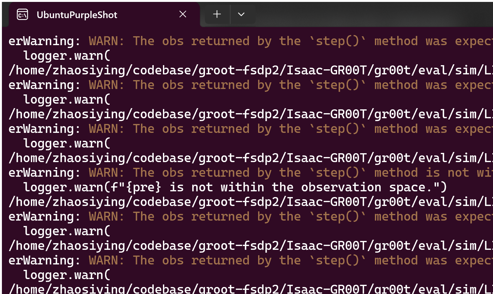
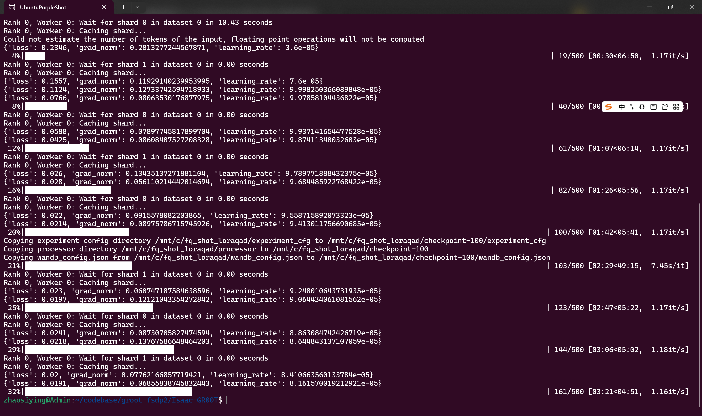
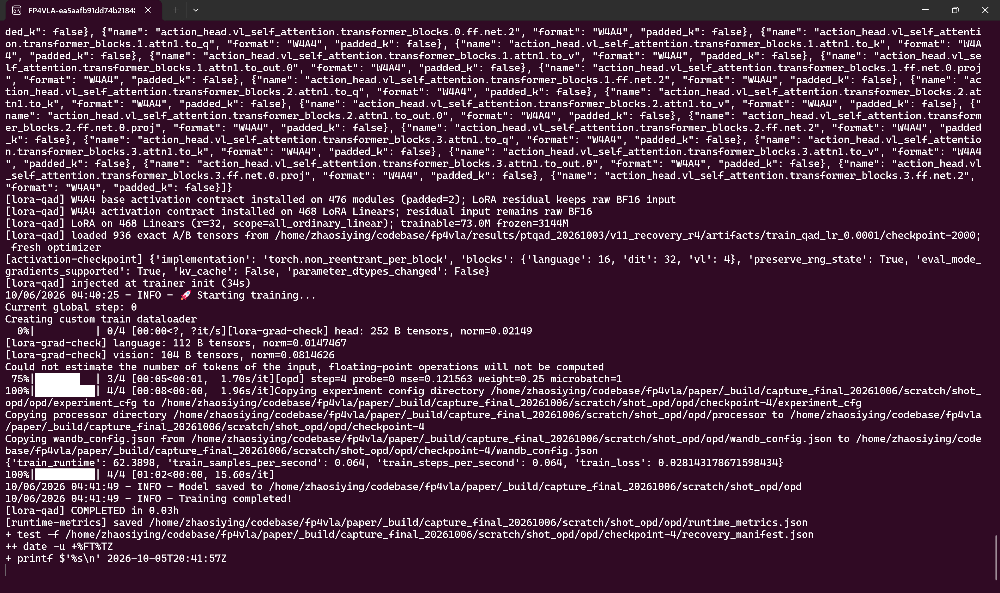

# PTQAD：APXInf 生态下 GR00T 的 FP4/FP8 混合精度量化与闭环恢复

结构审阅稿 · 红色 xxx 为待测结果 · 块适配 PTQ、QAD/OPD 与 LIBERO 闭环恢复

# 摘要

视觉—语言—动作模型（Vision–Language–Action model，VLA）把相机观测、语言指令和机器人状态映射为动作。对这类模型，低位宽量化的目标不仅是减少权重占用，还要保持动作反馈到环境之后的任务成功率。本文围绕 **APXInf 推理生态、GR00T N1.7、NVFP4/FP8 混合精度、面向块缩放格式的定制训练后量化（PTQ），以及量化基座上的低秩恢复（项目中称 QAD/OPD）**，建立从数值表示、校准与分配，到行为恢复和 LIBERO 闭环评测的完整流程。

方法分为三步：先用校准数据估计各层输入分布，将 GPTQ 的误差补偿适配到 NVFP4 的两级缩放，并按模块逐步扩大 FP4 范围；再冻结量化权重，用演示数据训练低秩修正，调整动作生成；最后让学生策略实际执行任务，在它访问的状态上向未量化教师学习，补充演示轨迹之外的监督。本文分别检验压缩预算、闭环成功率和原生执行速度。

**核心结果。** 所选配方的 FP4 比例（分母为扣除已知共享别名后的可量化矩阵元素）为 $\textcolor{#b42318}{\mathrm{xxx}\%}$，计入低秩修正后的同口径完整权重编码压缩比为 $\textcolor{#b42318}{\mathrm{xxx}\times}$。同协议下，BF16、纯 PTQ、QAD 与 QAD+OPD 的成功率依次为 $\textcolor{#b42318}{\mathrm{xxx}\%}$、$\textcolor{#b42318}{\mathrm{xxx}\%}$、$\textcolor{#b42318}{\mathrm{xxx}\%}$、$\textcolor{#b42318}{\mathrm{xxx}\%}$。独立的 APXInf π0.5 执行实验中，NVFP4 混合路径将策略调用 P50（中位数）从 48.651 ms 降至 36.985 ms，降低 23.98%；该测量与 GR00T 的恢复成功率分开报告。

> 审阅说明：红色 xxx 为待完成实验的回填位置，不是测量值。本稿先供审阅论述、结构和方法；正式结论由完整独立评测确定。

**关键词：** VLA；GR00T；APXInf；NVFP4/FP8；PTQ；GPTQ；低秩恢复；on-policy distillation。

# 1. 引言

## 1.1 为什么量化误差会变成任务失败

机器人抓杯子时，先看图像、输出动作，再根据执行后的新图像继续调整。量化若让夹爪移动稍短，下一次观测便发生变化；一旦错过杯柄，后续动作面对的就不再是原来的状态。因此，VLA 的量化误差会沿“动作—环境—观测”循环传播。单次前向的误差很小，仍可能使整个任务失败。

训练后量化（Post-Training Quantization，PTQ）用少量校准数据压缩已有权重，无需重新训练完整模型。将敏感模块保留为 FP8，可以减少行为损失，但也限制压缩。本文研究一个更具体的问题：**把更多 FP8 权重转为 FP4 后，能否通过少量可训练参数恢复闭环行为，并在计入这些参数后仍获得更好的压缩与成功率组合？**

我们的思路是让三个阶段各司其职。PTQ 尽量保留原模型的局部计算；QAD 用任务演示修正量化后的动作生成；OPD 在学生自己访问的状态上补充教师监督。前两步解决表示压缩与任务适配，第三步针对动作反馈引起的状态偏移。

## 1.2 本文的贡献

1. **面向 GR00T 的块缩放 PTQ。** 将 GPTQ 适配到 NVFP4：固定张量尺度，在每个 16 元素块进入时重新定标，并逐列补偿误差。结合完整模型的校准统计和五级 FP4/FP8 配方，使压缩范围可逐层追溯。
2. **量化基座上的两阶段恢复。** 冻结基座，以演示监督训练低秩残差，再加入学生访问状态上的教师速度场监督。设置同起点、同额外更新预算的 QAD 续训对照，单独检验 OPD 的增量作用。
3. **APXInf 的执行扩展与复现链。** 实现 NVFP4 编码、块尺度布局、CUDA/Rust 算子接入与模型执行路径；提供从配置、检查点到逐回合日志的证据，以及真实 Ubuntu 运行截图。

项目名 **`apxinf-gr00t-fp4fp8-ptqad`** 概括了这一组合，`ptqad` 为 PTQ 与 QAD 的融合写法。GPTQ、LoRA 和蒸馏均有既有研究基础；本文的贡献是针对 VLA、块缩放格式和闭环反馈完成具体适配，并用受控实验检验其作用。

## 1.3 如何阅读本文

第 2 章先解释模型、数值格式和动作训练的必要知识，第 3 章给出方法，第 4 章比较成功率与压缩预算，第 5 章归纳结论。源码、安装命令及完整性能表分别放在附录 A、B、C。正文只保留理解方法和判断结果所需的信息。

全文区分三个量：**成功率**来自完整机器人回合；**编码预算**由实际张量及缩放元数据计算，包含低秩残差；**延迟**来自指定执行入口的计时。目前 GR00T 恢复评测采用稠密反量化和 BF16 合并权重；原生低比特执行由 APXInf 算子与 π0.5 路径另行验证。这一区分贯穿所有表格。

# 2. 背景与相关工作

VLA 把相机观测、语言指令和机器人状态映射为动作。低位宽量化要减少权重占用，也要保留动作执行后的任务成功率。两者之间隔着一条完整的计算链：权重决定视觉与语言特征，特征决定动作，动作改变下一次观测。本章先说明这条链，再介绍本文用来控制量化误差的已有方法。

## 2.1 GR00T 如何生成动作

记观测为 $o$，其中包含图像、指令和机器人状态；策略 $\pi$ 根据 $o$ 生成一段连续动作，称为**动作块**。机器人执行其中一部分，再获取新观测并规划。一次从环境重置到成功或超时的尝试称为 **episode**，期间实际产生的交互轨迹称为 **rollout**。动作影响下一次输入，构成**闭环**。

本文使用 GR00T N1.7 的 LIBERO 微调 checkpoint。它先理解图像和指令，再生成动作；前两个阶段合称特征骨干网络（backbone）。下表中的宽度指特征维度，merger 指合并与投影模块，deepstack 指来自不同视觉深度的特征连接，DiT 指用 Transformer 表示动作向量场的网络。模型完整数据流如下，维度来自本地 checkpoint 配置。

| 阶段 | 输入与作用 | 本文模型结构 |
|---|---|---|
| 视觉编码 | 将图像块转为视觉特征，并投影到语言特征空间 | Qwen3-VL 视觉塔含 24 个块、宽度 1024；一个主 merger 和三个 deepstack merger 输出 2048 维特征 |
| 多模态理解 | 联合处理视觉特征与指令，形成动作条件 | 16 层语言网络，宽度 2048；16 个查询头共享 8 个键值头，每头 128 维 |
| 动作生成 | 结合上述条件与机器人状态，从噪声逐步生成动作块 | 4 层上下文自注意力；32 个交替自注意力/交叉注意力 DiT 块，宽度 1536 |

注意力用查询 Q 与键 K 的匹配程度，对值 V 加权汇集；多头注意力并行执行若干这样的操作。语言网络采用分组查询注意力（GQA），多个查询头共享键值头，因此 K/V 投影比 Q 投影窄。前馈网络（FFN，通常由多层感知机 MLP 构成）则逐位置变换特征。三个 deepstack merger 把不同视觉深度的信息送入语言网络。

GR00T 通过**流匹配**（flow matching）学习动作生成。设演示动作块为 $a$，同形状的标准高斯噪声为 $z$，插值时间为 $t\in[0,1]$，则

$$
a_t=(1-t)z+ta,\qquad \frac{\partial a_t}{\partial t}=a-z.
$$

$t=0$ 是噪声，$t=1$ 是动作。模型以观测 $o$、中间状态 $a_t$ 和时间 $t$ 为输入，预测速度 $v_\theta(o,a_t,t)$；参数 $\theta$ 决定这个速度场。训练让预测接近 $a-z$。推理从噪声出发，反复“预测速度、沿速度前进一步”，最后得到动作。本 checkpoint 使用四次 Euler 更新，每次步长为 $1/4$。速度预测如何构造训练目标，见 §3.4.2。

模型保留统一的 $40\times132$ 动作张量，以容纳不同机器人的接口。LIBERO 的有效部分是前 16 步、每步 7 维控制量，其余位置是填充；训练用有效动作掩码排除填充。评测每次执行前 8 步，再重新观测。由此需要区分两种步数：四次**积分更新**完成一次动作块生成，若干次**策略决策**完成一个 episode。

## 2.2 FP4/FP8 如何减少权重载荷

线性层是模型的主要计算。把输入按行排成 $X\in\mathbb R^{M\times K}$，权重记为 $W\in\mathbb R^{N\times K}$，则忽略偏置时

$$
Y=XW^\top,\qquad Y\in\mathbb R^{M\times N}.
$$

$M$ 是批次与序列位置展平后的行数，$K$ 是输入维度，$N$ 是输出维度。量化把权重映射到有限格点，并保存恢复数值所需的缩放。记编码为 $C(W)$，反量化后的矩阵为 $\widehat W=Q(W)=\operatorname{dequant}(C(W))$；下文的 $Q$ 均包含反量化，因此 $W$ 与 $Q(W)$ 可以直接计算差值。

BF16 与 FP16 都使用 16 位，前者保留更大的指数范围，后者在常用范围内有更细的尾数精度；FP32 使用 32 位。NVFP4 则把权重数据压到 4 位，同时用分层缩放适应不同幅度。

| 表示 | 数据与缩放 | 本文的数值约定 |
|---|---|---|
| NVFP4 | E2M1 数据；每 16 个连续元素共享一个 E4M3 块缩放；每张量另有一个 FP32 二级缩放 | E2M1 绝对值格点为 $\{0,0.5,1,1.5,2,3,4,6\}$；正负零具有不同编码 |
| FP8-E4M3 | 8 位数据；本项目 weight-only 路径按权重行保存 FP32 缩放 | 四位指数、三位尾数，最大有限值为 448 |
| BF16 | 每元素 2 字节 | 用于源模型、未量化权重及当前闭环模型的稠密存储 |

E2M1 的名称表示两位指数、一位尾数，另有一位符号。对权重第 $n$ 行、第 $b$ 个块内的元素 $j$，NVFP4 反量化为

$$
\widehat W_{n,b,j}=q_{n,b,j}\,s_{n,b}\,\tau,
$$

其中 $q$ 是 E2M1 格点，$s$ 是 E4M3 块缩放，$\tau$ 是 FP32 二级缩放。块缩放适应局部幅度，二级缩放再调整整个张量的范围。只计数据和块缩放时，平均每元素占 $4+8/16=4.5$ bit，相对 BF16 约压缩 $16/4.5=3.56$ 倍；混合配方还须计入高精度权重、二级缩放与恢复参数，具体计账见 §3.1。

本文采用最近舍入、中点取偶（RNE）。例如 0.75 位于 E2M1 的 0.5 与 1 之间，选择编码最低位为偶数的 1；5 位于 4 与 6 之间，选择 4。E4M3 同样处理零、次正规数和有限端点；溢出值饱和到端点。零块使用零缩放，除法时单独使用安全除数。这些规则决定同一个权重能否在 NumPy、PyTorch 与原生引擎中得到一致的数值。

本文涉及的三种产物承担不同任务，先统一名称，后文按此使用。

| 名称 | 实际保存或执行的内容 | 用途 |
|---|---|---|
| 反量化基座 | 保存 $Q(W)$ 的稠密 BF16 张量，用普通浮点算子执行 | 隔离权重扰动，开展恢复训练与 GR00T 闭环评测 |
| 恢复模型 | 冻结量化基座加低秩残差；当前导出将二者合并为稠密 BF16 | 测量恢复后的策略行为 |
| 原生打包模型 | 保存四位编码及尺度，调用低精度硬件算子 | 检查实际载荷、算子与模型执行速度 |

**Weight-only** 只改变权重；**W4A4** 同时将权重和激活量化为四位。参数的存储精度也可不同于计算精度：本文恢复训练以 FP32 保存参数，使用 BF16 autocast 选择矩阵等算子的计算精度。这样既保持优化器的更新精度，又控制计算成本。

## 2.3 权重误差怎样影响闭环

量化先改变层输出，再经过动作生成和环境反馈影响任务。设权重扰动为 $\Delta W=\widehat W-W$，固定观测下的动作扰动为 $\Delta a$。在小扰动的一阶近似中，

$$
\Delta a\approx J_W\operatorname{vec}(\Delta W),\qquad
\|\Delta a\|\lesssim \|J_W\|\,\|\Delta W\|_F.
$$

$J_W$ 是动作对权重的雅可比矩阵，$\operatorname{vec}$ 把矩阵展平为向量，$\|\cdot\|_F$ 是元素平方和的平方根。相对权重误差记为 $\|\Delta W\|_F/\|W\|_F$。同样大小的误差沿不同方向进入模型，可能产生不同的动作偏差。因此，校准需要考虑输入激活，而不能只比较权重自身的均方误差。

流策略还会多次调用速度场。若速度场满足 Lipschitz 条件，即输出变化不超过输入变化的 $L$ 倍，量化造成的速度差不超过 $\eta$，在积分时间 $T_f$ 内、相同初始噪声下，连续轨迹差可由 $\eta(e^{LT_f}-1)/L$ 控制（$L=0$ 时取极限 $\eta T_f$）。离散 Euler 更新另有步长误差。这个关系说明误差取决于向量场的敏感度与积分区间；固定区间增加积分步数时，每一步也随之缩短。backbone 上下文及其交叉注意力 K/V 可在同一次动作块生成内复用，动作头则反复处理当前轨迹，两类模块因此有不同的计算与误差传播位置。

动作离开模型后，还会改变环境。设第 $\ell$ 次决策的状态差为 $e_\ell$、动作差为 $\delta_\ell$，环境转移在局部对状态与动作的敏感度分别为 $L_s,L_a$，则

$$
e_{\ell+1}\le L_s e_\ell+L_a\delta_\ell.
$$

$L_s<1$ 时状态差可能收缩，$L_s>1$ 时可能放大。接触、遮挡和成功判定又可能使局部关系突然改变。例如两次夹取的末端位置只差很小，夹爪却可能分别落在杯沿两侧。本文用这些关系说明测量层次：权重误差描述表示损失，固定输入下的输出误差描述函数变化，闭环成功率检验动作反馈后的任务结果；上述敏感度常数并未被当作实测结果拟合。

这一反馈还会改变数据分布。记专家演示的观测分布为 $d_{\mathrm{demo}}$。若一次 episode 有 $T$ 次决策，策略第 $\ell$ 次访问的分布为 $d_\pi^\ell$，平均访问分布为 $d_\pi=T^{-1}\sum_{\ell=1}^{T}d_\pi^\ell$。在演示上拟合得好，仍可能在偏离演示轨迹后遇到陌生观测。这种训练与执行分布的差异称为**协变量漂移**。它给恢复训练带来两个问题：在已有演示上能修正多少量化误差；在学生自己访问的状态上加入教师监督，能否进一步改善行为。

## 2.4 已有方法分别解决什么问题

训练后量化（PTQ）利用已有权重及少量校准输入，选择尺度、舍入和精度分配。恢复训练允许模型在量化后更新部分参数；LoRA（低秩适配）用两个小矩阵的乘积表达权重更新。RTN 是按给定尺度取最近格点，MSE 是均方误差，KL 散度比较概率分布。下表按误差处理的位置归类。

| 比较维度 | 代表方法 | 核心做法及本文关系 |
|---|---|---|
| 格点、范围与舍入 | Jacob et al.（2018）、Migacz（2017）、PACT（Choi et al., 2018）、AdaRound（Nagel et al., 2020） | 选择范围、裁剪或舍入方向。本文先用输入加权的层输出误差搜索 RTN 裁剪系数 |
| 层与块的局部重建 | GPTQ（Frantar et al., 2023）、ZeroQuant（Yao et al., 2022）、BRECQ（Li et al., 2021） | 利用校准输入重建输出。本文把 GPTQ 的逐列补偿适配到 NVFP4 的共享张量尺度与 16 元素块尺度 |
| 等价缩放与坐标变换 | AWQ（Lin et al., 2023）、SmoothQuant（Xiao et al., 2023）、OmniQuant（Shao et al., 2024）、QuaRot、QuIP#、SpinQuant、FlatQuant（2024） | 将数值重新分配到更适合低位宽的坐标；变换须在线执行或等价折叠。本文保留 AWQ 校准入口，主线用显式模块分配控制误差 |
| 低秩补偿 | LoRA（Hu et al., 2021）、SVDQuant（Li et al., 2024）、EoRA（Liu et al., 2024） | 用少量低秩参数表达修正。本文冻结已量化基座，以演示与教师速度目标训练加性旁路 |
| 蒸馏的数据来源 | DAgger（Ross et al., 2011）、GKD（Agarwal et al., 2023） | 关注学生访问或生成的分布。本文从学生实际 rollout 采集观测，离线标注后执行一轮固定缓存训练 |
| NVFP4 教师蒸馏 | Xin et al.（2026） | 通过教师分布的 KL 目标恢复 NVFP4 模型。本文的 QAD 阶段使用演示流匹配；教师项只在后续 OPD 中出现，目标为连续速度 MSE |

量化基本概念与实践可参见 Vanhoucke et al.（2011）、Wu et al.（2020）和 Nagel et al.（2021）。

VLA 量化还需要同时说明模型保护范围与执行后端。NVIDIA 的 GR00T N1.7 Thor 教程把视觉塔设为 FP8、语言主体设为 NVFP4，并保护语言 o_proj/down_proj 等投影；它还使用交叉注意力 K/V 复用、时间条件预计算和算子融合。教程报告的约 39.9 ms 来自这套联合部署优化。[NVIDIA 官方教程](https://www.jetson-ai-lab.com/tutorials/groot_n17_on_thor/)

FoldQuantVLA（Ho et al., 2026）组合通道缩放 $S$、分块正交旋转 $R$、GPTQ 与动态激活量化。把单个输入暂写为列向量 $x$，可逆对角矩阵 $S$ 与正交矩阵 $R$ 保证

$$
Wx=(WSR^\top)(RS^{-1}x).
$$

量化与运行时沿用这个坐标，才能保持变换的一致性。其 GR00T 表 I 使用 W4A4，并以 W8A8 保护语言 o_proj/down_proj；四套件平均成功率由 95.75% 变为 95.625%。其硬件、套件和激活格式与本文不同，本文据此借鉴模块保护思路，不作跨协议排名。[FoldQuantVLA 原文](https://arxiv.org/html/2609.24433v1)

本文围绕 APXInf 建立数值表示、校准分配、低秩恢复与闭环评测的工程链。APXInf 以 Rust/CUDA 提供算子、权重加载和模型执行，APXInf-robo 提供机器人策略接口。本文在完整 PyTorch GR00T 上比较恢复后的任务行为，在 APXInf 原生 π0.5 上检查低比特执行。具体量化覆盖、净编码预算与本地收益由同协议实验报告。

## 2.5 恢复训练的监督来源

**行为克隆**从专家观测—动作对学习策略；**知识蒸馏**从教师模型输出学习策略。本文把恢复过程分为两阶段。

- **QAD-LoRA：量化后演示适配。** 沿用工程中的 QAD 名称，在固定量化基座上训练 LoRA，以专家演示的流匹配损失修正策略。这个阶段没有独立教师。
- **OPD-LoRA：学生访问状态上的教师约束。** 先执行 QAD 学生，收集其访问的观测和预测动作端点；未量化教师在同一插值问题上提供速度标签。学生随后同时拟合演示和教师速度。

“BF16 教师”指原 BF16 checkpoint 的未量化权重取值；实际标注以 FP32 存储参数、BF16 autocast 前向，与学生训练匹配。本文的 OPD 使用一轮采集形成的固定缓存，代表采集时的学生分布。训练中先完成演示反传，再完成单样本探针反传，最后统一更新参数，称为**串行 OPD**；串行描述计算图的内存组织，采集描述数据来源。

DAgger 解释了学生分布为何值得关注。在单步代价有界、专家分布上的动作错误概率不超过 $\varepsilon$ 的离散模仿设定中，到第 $\ell$ 步至少出错一次的概率至多为 $\ell\varepsilon$；最坏影响累积为 $\sum_{\ell=1}^{T}\ell\varepsilon=O(T^2\varepsilon)$。DAgger 反复执行学生、查询专家并聚合数据。在后续代价差上界 $u$ 等条件下，其保证可写成 $J(\pi)\le J(\pi^*)+uT\varepsilon$，其中 $J$ 为期望累计代价、$\pi^*$ 为专家。本文的一轮缓存并不具备这一完整迭代过程，相关理论只提供采集学生状态的动机。[DAgger 原文](https://proceedings.mlr.press/v15/ross11a.html)

直接利用环境回报是另一条路线。REINFORCE（Williams, 1992）使用 $\mathbb E[R\nabla_\theta\log\pi_\theta(a\mid s)]$ 估计期望回报的梯度；PPO（Schulman et al., 2017）再以优势和概率比裁剪约束更新。这里 $R$ 为轨迹回报，$s$ 为状态。流策略的多步生成概率需要专门处理，DPPO（Ren et al., 2024）研究了扩散策略的对应问题。奖励加权回归 RWR、自模仿学习 SIL、AWR、AWAC 和 Decision Transformer 则分别通过样本权重或回报条件利用经验。本文保留的任务级 RWR 入口及其窗口处理见 §3.7，恢复比较的主线是上述演示适配与教师 MSE。

# 3. 方法

本文先把权重量化为可核对的数值，再用校准输入决定舍入与模块精度，最后在固定基座上训练低秩修正。QAD 使用演示动作，OPD 再加入学生访问状态上的教师速度。闭环评测比较这些策略的任务行为；APXInf 原生路径单独检查打包表示的执行。以下给出统一实现，配方选择、训练预算和最终结果集中列于第 4 章。

## 3.1 确定量化对象与编码预算

### 3.1.1 从完整 checkpoint 建立清单

量化前先读取完整 checkpoint 的键、形状和 dtype。当前量化条件是：键以 .weight 结尾，张量为二维，输入维度 $K$ 为 16 的倍数。它选中 472 个键、3,126,722,560 个物理存储元素，包含 Linear 权重以及词嵌入、视觉位置嵌入、动作位置嵌入三个矩阵。其余 559 个张量保持原值：126 个一维权重、418 个一维偏置、一个视觉 patch 卷积、7 个三维专用张量和 7 个二维专用张量，共 328,458,368 个元素。

源文件分别保存词嵌入与 lm_head，但模型通过 tie_word_embeddings 共享这组权重。两个键的形状均为 $[151936,2048]$，重复项含 311,164,928 个元素。量化器先核对两者原值一致，再以词嵌入作为规范来源，向两个键写入同一量化值。这样，加载次序不会改变模型中的共享权重。

本文同时保留两种统计口径，分子与分母始终采用同一种规则。

| 口径 | 全 checkpoint 元素数 | 候选权重元素数 | 用途 |
|---|---:|---:|---|
| 物理张量键 | 3,455,180,928 | 3,126,722,560 | 对应源文件实际保存的张量项 |
| 已知别名去重 | 3,144,016,000 | 2,815,557,632 | 扣除已确认的 lm_head 重复项 |

元素数描述权重载荷；运行时还包括激活、缓存和工作区，另行测量。校准对象也有独立计数：472 个候选键中有三个 Embedding，剩余 469 个 Linear 键再去掉共享别名，得到 468 个独立线性层。

### 3.1.2 统一格点与尺度

沿用 §2.2 的 NVFP4 关系 $\widehat W_{n,b,j}=q_{n,b,j}s_{n,b}\tau$。设裁剪系数为 $c\in(0,1]$，E4M3 舍入函数为 $R_8$。对非零矩阵，二级缩放和块缩放取为

$$
\tau=\operatorname{FP32}\!\left(\max\!\left\{\frac{c\max|W|}{448},\,2^{-149}\right\}\right),
\qquad
s_{n,b}=R_8\!\left(\frac{c\max_j|W_{n,b,j}|}{6\tau}\right).
$$

448 与 6 分别是 E4M3、E2M1 的最大有限正值；$2^{-149}$ 保证极小非零张量仍有可表示的 FP32 尺度。全零矩阵取 $\tau=1$、全部块缩放为零。RTN 直接按这些尺度选择 E2M1 格点；GPTQ 保持同一 $\tau$，再依据补偿后的权重更新各块尺度，见 §3.2.3。

数值参考对临界中点使用固定的运算顺序。选码时，以已存尺度的 FP64 乘积作除数；反量化时，用 FP32 的尺度乘积还原格点。CPU 检查覆盖 E2M1 全部编码、中点与相邻值，E4M3 的零、次正规数和 448，并与 NumPy 字节编解码及 PyTorch 原生 float8_e4m3fn 交叉比较。矩阵级检查再验证输出误差与可重新编码性。

### 3.1.3 把尺度和低秩残差纳入压缩率

一个含 $P$ 个元素、$N$ 行的矩阵，其目标载荷为

$$
B_{\mathrm{NVFP4}}=\frac P2+\frac P{16}+4,\qquad
B_{\mathrm{FP8}}=P+4N,\qquad
B_{\mathrm{BF16}}=2P.
$$

三式的单位均为字节。NVFP4 的三项分别是四位数据、块缩放和二级缩放；FP8 的第二项是逐行 FP32 缩放。混合基座的预算等于所有矩阵的对应载荷，加上保持原样的张量。若部署保留 BF16 低秩旁路，还须加入 $2r(K+N)$ 字节，其中 $r$ 是该层的低秩维度；所有安装旁路的层分别求和。

压缩比定义为“相同统计口径的 BF16 源载荷 / 目标编码载荷”。例如 fp8 阶梯起点的候选权重从 6.253445120 GB 变为目标 2.564084724 GB，全 checkpoint 从 6.910361856 GB 变为目标 3.221001460 GB；GB 均为 $10^9$ 字节。这是编码预算，尚未计入布局补齐、文件头和运行工作区。当前 GR00T 闭环产物按 §2.2 的定义保存稠密 BF16 值，其实际文件大小与显存单独记录。

## 3.2 用校准输入控制层输出误差

### 3.2.1 为什么收集输入二阶统计

量化误差在常用输入通道上出现，比在很少激活的通道上出现更可能改变层输出。把校准输入按行组成 $X$，记 $\Delta W=\widehat W-W$，局部输出平方误差为

$$
E(\Delta W)=\|X\Delta W^\top\|_F^2
=\operatorname{tr}(\Delta W H\Delta W^\top),
\qquad H=X^\top X.
$$

迹 $\operatorname{tr}$ 是矩阵对角元素之和。这个恒等式把全部校准输入压缩为 $K\times K$ 的二阶统计 $H$，随后每个候选权重都能用它计算误差，无须重放全部激活。对单个输出行 $\Delta w$，目标是 $\Delta wH\Delta w^\top$，二阶导数为 $2H$；代码沿用 Hessian 一词称呼收集的 $H$。

collector.py 从源 checkpoint 和统计文件构建完整 16 层语言、32 块 DiT、4 层上下文网络。在目标 Linear 的输入 pre-hook 中，它把输入展平为 $[\text{tokens},K]$，累积 $X^\top X$、逐通道绝对值和与行数。模型前向使用 BF16，统计乘法使用 FP32，并关闭 autocast 和 TF32；TF32 是 GPU 执行 FP32 矩阵乘时可选的较低尾数精度模式。每层统计移到 CPU 累加，控制同时驻留的显存。

采集窗口数、batch、调用次数和层覆盖写入 calib_meta.json，同时记录源权重、配置、归一化与缓存哈希。迭代数据流可以重复采样，所以窗口数表示实际消费次数。目标层未执行会触发错误。下图展示完整模型入口的两窗口短测；正式校准的窗口数与覆盖以第 4 章配置和对应清单为准。


*运行截图 02　完整 GR00T 的 2 个窗口校准 smoke。完整 GR00T（语言 16 层、DiT 32 层、VL 4 层）以 batch=1 采集 2 个演示窗口，得到 468 层二阶统计；H 在 GPU 上按 FP32 逐层计算并累加至 CPU。该目录与正式 128 窗口校准独立，抽样不保证两个窗口互不重复。*

本实现保存求和形式的 $H$。除以输入行数后可得到平均输出误差；对同一层的全部候选乘同一正数不改变搜索结果，但跨层比较时必须统一单位。

### 3.2.2 先搜索裁剪范围

最大值定标保留完整范围；裁剪系数 $c<1$ 缩小范围，以少量大值的失真换取其余权重更细的表示。实现先在

$$
\mathcal C=\{1.0,0.95,0.90,0.85,0.80,0.70,0.60,0.50\}
$$

中选择

$$
c^*=\arg\min_{c\in\mathcal C}E(Q_{\mathrm{RTN},c}(W)-W).
$$

这里每个候选只执行 RTN，目标却由真实输入统计加权。确定 $c^*$ 后，再执行一次 GPTQ 补偿。这个顺序把范围搜索与逐列优化分开，控制校准成本。

### 3.2.3 把 GPTQ 补偿适配到 NVFP4 块尺度

GPTQ 逐列固定量化值，并调整剩余列以补偿当前误差。若 $H_{ii}=0$，该输入通道在校准中没有贡献，实现将对应权重列置零、对角置为 1，得到 $H_0$；再加阻尼 $\mu=0.01\operatorname{mean}(\operatorname{diag}H_0)$，构造 $H_d=H_0+\mu I$。单位矩阵 $I$ 与正阻尼改善求逆的数值条件。计算上三角因子 $U$，使

$$
H_d^{-1}=U^\top U.
$$

设当前已接受误差补偿的权重为 $\widetilde W$。处理第 $i$ 列时，选择并反量化得到列向量 $q_i$，残差为 $\delta_i=\widetilde W_{:,i}-q_i$。这里 $q_i$ 已经乘回尺度，与前文无尺度的 E2M1 格点 $q$ 区分。

补偿系数可从一个约束最小化问题得到。只看输出行 $n$，将尚未固定的输入列记为 $F=\{i,\ldots,K-1\}$。当前列必须改变 $-\delta_{n,i}$，其余列仍可连续调整：

$$
\min_{\Delta w_F}\ \Delta w_F(H_d)_{FF}\Delta w_F^\top,
\qquad \Delta w_i=-\delta_{n,i}.
$$

记剩余子问题的逆矩阵为 $C=[(H_d)_{FF}]^{-1}$。约束二次式给出 $\Delta w_j=-\delta_{n,i}C_{ij}/C_{ii}$。$C$ 是前列消元后的逆矩阵，而非原始逆矩阵的尾部切片；上三角因子满足 $C=U_{FF}^\top U_{FF}$。由于 $i$ 是这个尾部的首列，$C_{ii}=U_{ii}^2$、$C_{ij}=U_{ii}U_{ij}$，从而

$$
\Delta w_j=-\delta_{n,i}\frac{C_{ij}}{C_{ii}}
=-\frac{\delta_{n,i}}{U_{ii}}U_{ij}.
$$

对全部输出行同时应用，便得到代码中的外积更新：

$$
\widetilde W_{:,i+1:}\leftarrow
\widetilde W_{:,i+1:}
-\frac{\delta_i}{U_{ii}}U_{i,i+1:},
\qquad
\widetilde W_{:,i}\leftarrow q_i.
$$

一次 $O(K^3)$ 的分解编码了后续条件补偿系数，避免朴素逐列重算逆矩阵所需的约 $O(K^4)$ 分解成本；逐列更新另行执行。格点仍按顺序贪心固定，所以结果是局部重建解。

NVFP4 的约束是同一矩阵共用一个 $\tau$，每行每 16 列共用一个 $s_{n,b}$。实现从原矩阵计算 $\tau$，在全部补偿过程中固定它；每进入一个新列块，按已经更新的权重计算

$$
s_{n,b}=R_8\!\left(\frac{c^*\max_j|\widetilde W_{n,b,j}|}{6\tau}\right).
$$

块内尺度保持不变。令 $\sigma_{64}=\operatorname{FP64}(s_{n,b})\operatorname{FP64}(\tau)$、$\sigma_{32}=\operatorname{FP32}(s_{n,b}\tau)$，以 $R_4$ 表示 E2M1 的 RNE 舍入，则非零尺度下提交的元素为

$$
q_{n,i}=\operatorname{FP32}\!\left[
R_4\!\left(\frac{\operatorname{FP64}(\widetilde W_{n,i})}{\sigma_{64}}\right)\sigma_{32}
\right].
$$

零尺度直接提交零，溢出饱和到有限端点。这个做法既允许后续块适应误差反馈，又保证整张矩阵能用一套 NVFP4 张量尺度编码。gptq_nvfp4 的 return_metadata 选项返回实际块尺度和二级尺度，原生导出沿用这些元数据。


*图 1　NVFP4 的块定标与 GPTQ 误差补偿。以实际实现说明 FP32 二阶统计、裁剪候选、16 元素块定标和逐列误差补偿。回退层与校准覆盖由配方账目逐层标识，示意图不绘制未经测量的收益曲线。*

## 3.3 在模块之间分配精度

### 3.3.1 用嵌套配方区分量化覆盖与恢复收益

局部校准决定某层怎样舍入，混合精度决定哪些层承担低位宽误差。本文从“backbone FP8、动作头候选权重 NVFP4”出发，逐级增加语言和视觉的 NVFP4 集合。下表中的新增项均相对上一行，编码预算按物理张量键计算；它描述可用配方，不代表每级均已完成闭环实验。

| 阶梯配方 | 本级新增 NVFP4 权重 | NVFP4 存储元素数 | 占候选权重比例 | 候选权重目标压缩比 | 全 checkpoint 目标压缩比 |
|---|---|---:|---:|---:|---:|
| `fp8` | 动作头全部候选二维权重 | 1.294074B | 41.39% | 2.4389× | 2.1454× |
| `head_ffn` | 语言 `mlp.gate_proj/up_proj` | 1.696727B | 54.27% | 2.6196× | 2.2701× |
| `head_lang` | 语言 `self_attn.q_proj/k_proj/v_proj` | 1.830945B | 58.56% | 2.6860× | 2.3150× |
| `head_lang_vision` | 视觉塔全部候选二维权重，包括位置嵌入 | 2.235957B | 71.51% | 2.9086× | 2.4619× |
| `calib` / `rtn` 终点 | 剩余候选权重全部进入 NVFP4 | 3.126723B | 100% | 3.5556× | 2.8606× |

head_ffn 的新增 FFN 指语言 gate/up，动作头已在起点量化。视觉级之前，语言 o_proj/down_proj、词嵌入与 lm_head 保留 FP8；终点再量化剩余候选。按已知别名去重后，各级预算为：

| 配方 | 去重候选中的 NVFP4 占比 | 去重全体中的 NVFP4 占比 | 去重候选目标压缩比 | 去重全体目标压缩比 |
|---|---:|---:|---:|---:|
| `fp8` | 45.96% | 41.16% | 2.5002× | 2.1614× |
| `head_ffn` | 60.26% | 53.97% | 2.7133× | 2.3014× |
| `head_lang` | 65.03% | 58.24% | 2.7927× | 2.3522× |
| `head_lang_vision` | 79.41% | 71.12% | 3.0634× | 2.5201× |
| `calib` / `rtn` | 100% | 89.55% | 3.5556× | 2.8063× |

开发集用于选择配方与训练配置，独立最终初态用于报告结果。第 4 章给出预先确定的候选集合、选择规则和全部已完成开发结果；最终测试不参与选择。为判断恢复是否扩大压缩范围，比较还须包含较高精度的纯 PTQ 参考，并把低秩残差计入净载荷。

### 3.3.2 保留逐层清单，解释模块差异

下表展示矩阵形状与三种基础分配。mixed 是按模块保护的可选配方：视觉 FP8，语言 q/k/v、gate/up 和 DiT FFN 使用 NVFP4，部分辅助通路保留 BF16。它与嵌套阶梯同时改变了不同模块的精度，适合单独消融。rtn 对候选全部作 NVFP4 RTN；calib 请求校准与 GPTQ。表中 M 表示百万个物理存储元素，数值圆整。

| 模块组（计算角色） | 张量键数 | 存储元素数 | 代表原始 shape | rtn / calib | fp8 阶梯起点 | 本地 mixed |
|---|---|---|---|---|---|---|
| 视觉注意力 qkv（24 块，融合投影） | 24 | 75.5M | [3072×1024] | NVFP4 | FP8 | FP8 |
| 视觉注意力 proj | 24 | 25.2M | [1024×1024] | NVFP4 | FP8 | FP8 |
| 视觉 MLP fc1 / fc2 | 48 | 201.3M | [4096×1024]·[1024×4096] | NVFP4 | FP8 | FP8 |
| 视觉 merger（1 主 + 3 deepstack） | 8 | 100.7M | [4096×4096]·[2048×4096] | NVFP4 | FP8 | FP8 |
| 视觉位置嵌入 pos_embed | 1 | 2.4M | [2304×1024] | NVFP4 | FP8 | FP8 |
| 词嵌入 embed_tokens | 1 | 311.2M | [151936×2048] | NVFP4 | FP8 | FP8 |
| 语言 q_proj（16 层，GQA 16 查询头） | 16 | 67.1M | [2048×2048] | NVFP4 | FP8 | NVFP4* |
| 语言 k/v_proj（8 KV 头，head_dim 128） | 32 | 67.1M | [1024×2048] | NVFP4 | FP8 | NVFP4* |
| 语言 o_proj | 16 | 67.1M | [2048×2048] | NVFP4 | FP8 | FP8 |
| 语言 MLP gate / up | 32 | 402.7M | [6144×2048] | NVFP4 | FP8 | NVFP4* |
| 语言 MLP down | 16 | 201.3M | [2048×6144] | NVFP4 | FP8 | FP8 |
| lm_head（词输出投影） | 1 | 311.2M | [151936×2048] | NVFP4 | FP8 | FP8 |
| DiT to_q（32 块） | 32 | 75.5M | [1536×1536] | NVFP4 | **NVFP4** | FP8 |
| DiT to_k/to_v（16 自注意力 + 16 跨注意力块） | 64 | 176.2M | [1536×1536]·[1536×2048] | NVFP4 | **NVFP4** | FP8 |
| DiT to_out | 32 | 75.5M | [1536×1536] | NVFP4 | **NVFP4** | FP8 |
| DiT adaLN 调制（norm1.linear） | 32 | 151.0M | [3072×1536] | NVFP4 | **NVFP4** | FP8 |
| DiT FFN（ff.net.0 / ff.net.2） | 64 | 604.0M | [6144×1536]·[1536×6144] | NVFP4 | **NVFP4** | NVFP4* |
| DiT proj_out_1（末端调制） | 1 | 4.7M | [3072×1536] | NVFP4 | **NVFP4** | FP8 |
| vl_self_attention（4 层跨模态自注意力） | 24 | 201.3M | [2048×2048]·[8192×2048] | NVFP4 | **NVFP4** | **BF16（不量化）** |
| DiT t_embedder（timestep 编码） | 2 | 2.8M | [1536×256]·[1536×1536] | NVFP4 | **NVFP4** | **BF16（不量化）** |
| DiT proj_out_2（末端 token 特征投影） | 1 | 1.6M | [1024×1536] | NVFP4 | **NVFP4** | **BF16（不量化）** |
| 动作头位置嵌入 | 1 | 1.6M | [1024×1536] | NVFP4 | **NVFP4** | **BF16（不量化）** |
| **合计（量化作用面）** | **472** | **3127M** | — | 全 NVFP4 | FP8 1832.6M + NVFP4 1294.1M | NVFP4 1140.9M + FP8 1778.6M + BF16 207.2M |

NVFP4* 表示请求裁剪加 GPTQ，实际执行方法写入逐层清单。mixed 的目标为 80 个语言投影与 64 个 DiT FFN 投影；aggr 另提供减少视觉等模块保护的探索入口，语言 o_proj/down_proj 仍保留 FP8，动作辅助通路保留 BF16。正式比较以第 4 章选用的配方为准。

这些形状决定了量化边界。视觉融合 qkv 一次输出 Q/K/V，MLP 扩展到四倍宽度；未量化的 patch 卷积形状为 $[1024,3,2,16,16]$。语言 GQA 使 k/v 为 $[1024,2048]$，q/o 为 $[2048,2048]$；gated SiLU MLP 用 gate/up 两个投影逐元素组合，再经 down 返回原宽度。DiT 的自注意力 k/v 接收 1536 维动作特征，交叉注意力 k/v 接收 2048 维上下文。adaLN 输出两组 1536 维调制量，分别控制偏移与缩放；时间编码由 256 升到 1536 维。

动作头的 proj_out_2 输出 1024 维 token 特征，最终 action_decoder 再输出 132 维动作。部分 state/action encoder 与 decoder 权重含前导 embodiment 维 32，以批矩阵实现，因而不满足二维量化条件。这里的特征宽度、机器人编号维、动作时长与控制维度分别承担不同作用。

### 3.3.3 校验校准来源并生成基座

bake.py 在执行前检查校准模式。required 模式核对完整模型、源配置、统计和权重身份；请求 GPTQ 的目标若缺少 $H$，只有 calib_meta.json 中明确列入 nonlinear_targets 的非 Linear 矩阵才允许退回 RTN，其余直接报错。auto 模式使用已有统计并记录缺失回退，none 模式显式以 RTN 处理这些目标。每层都保存请求方法、实际方法、裁剪系数和误差。

写盘时，量化器将 $Q(W)$ 转回源 dtype，保留原键、shape、共享别名与全部清单外张量，逐 shard 输出 safetensors。完成后核对索引、张量载荷与归一化文件，记录脚本和产物哈希。校准、教师、训练与评测共用完整结构和原 statistics.json，使同一个数值在各阶段保持相同物理意义。

下图分别展示量化入口和处理器/最小恢复检查；完整校准、正式产物身份和闭环结果由相应实验记录提供。


*运行截图 01　2 窗口 H 驱动的 head_lang 写盘 smoke。读取新采集的 2 窗口 H，以 required 模式写出 head_lang：80 个 NVFP4-GPTQ、253 个 NVFP4-RTN、139 个 FP8 张量。这是 BF16 容器中的量化格点值短测，独立于正式 128 窗口工件。图中 2.6860× 为可量化物理张量子集的目标预算；完整模型采用另一分母，数值见正文预算表。两者均非稠密文件实测压缩比。*


*运行截图 13　有效动作掩码、共享随机性与梯度检查（CPU smoke）。CPU 微型模型验证有效掩码、随机状态恢复与串行探针反向；合成 processor/statistics 配置夹具验证 40×132 容器中的 16×7 有效区域（112 个元素）。本图没有加载完整 GR00T checkpoint，不能作为恢复效果证据。*

## 3.4 在固定量化基座上恢复策略

### 3.4.1 用低秩旁路表达修正

PTQ 完成后，基座权重固定为 $W_{\mathrm{baked}}$。对输入行向量 $x\in\mathbb R^K$，LoRA 用 $A\in\mathbb R^{r\times K}$ 与 $B\in\mathbb R^{N\times r}$ 表示低秩修正，线性层变为

$$
y=xW_{\mathrm{baked}}^\top+b+
\frac{\alpha}{r}(xA^\top)B^\top.
$$

$b$ 是原偏置，$r$ 为秩，$\alpha/r$ 控制修正幅度。$A$ 以 Kaiming 均匀分布初始化，$B$ 置零，所以训练起点与 PTQ 基座一致。训练只更新 A/B；冻结权重仍把输入梯度传向前面的适配器。基座取值在训练中保持不变，无须穿过取整求导。常见 QAT 则在前向重新量化权重，并用直通估计（STE）近似取整梯度，两者的参数化不同。

训练参数按 FP32 保存，矩阵运算使用 BF16 autocast。已量化数值从 BF16 升为 FP32，只为优化和计算提供存储精度；被量化丢弃的信息由学习到的残差补偿。支持的范围及秩为 32 时的规模如下，实际秩与缩放由第 4 章配置给出。

| LoRA 范围 | 包含的 Linear | 层数 | 秩 32 时的 A/B 元素数 | BF16 旁路载荷 |
|---|---|---:|---:|---:|
| head | 动作头全部符合条件的 Linear | 252 | 38,658,048 | 77,316,096 B |
| head+lang | 上项加语言 q/k/v/o | 316 | 45,998,080 | 91,996,160 B |
| head+lang_all | 上项再加语言 gate/up/down | 364 | 58,580,992 | 117,161,984 B |

动作头量化清单的 253 个矩阵比 252 个 LoRA 层多一个位置嵌入，它仍保持冻结。表中旁路载荷采用 BF16 部署预算；训练 A/B 为 FP32，优化器状态和中间激活另计。

当前闭环服务器使用合并导出。lora_merge_bake.py 从冻结基座取得全部张量与元数据，只从训练 checkpoint 读取成对 A/B，先验证冻结权重未变，再以 FP32 计算

$$
W_{\mathrm{export}}=
\operatorname{BF16}\!\left(W_{\mathrm{baked}}+\frac{\alpha}{r}BA\right).
$$

导出保留所有原始键、共享关系和统计值，不再次量化。实数代数中，旁路与合并矩阵表示相同函数；有限精度下的乘法、求和和舍入顺序分别验证。后文的 GR00T 成功率属于该稠密导出策略，净编码预算则按打包基座加独立 BF16 旁路计算。

### 3.4.2 QAD 用演示动作训练速度场

QAD-LoRA 在本项目中表示“量化后演示适配”。设演示集合为 $\mathcal D_{\mathrm{demo}}$，样本为 $(o,a)$。采样同形状高斯噪声 $z$，再按 checkpoint 的时间分布采样

$$
u\sim\operatorname{Beta}(1.5,1.0),\qquad
t=0.999(1-u),\qquad
a_t=(1-t)z+ta.
$$

网络接收时间桶 $\lfloor1000t\rfloor$，公式中以 $t$ 简记该条件。用与输出同形状的二元掩码 $\mathcal M$ 标记有效动作，QAD 目标为

$$
\mathcal L_{\mathrm{QAD}}=
\mathbb E_{(o,a)\sim\mathcal D_{\mathrm{demo}},z,t}
\frac{\sum\mathcal M\odot
\left[v_\theta(o,a_t,t)-(a-z)\right]^2}
{\sum\mathcal M+10^{-6}}.
$$

$\odot$ 表示逐元素乘法，求和覆盖微批中的样本、时间和动作维度。每个 LIBERO 窗口含 $16\times7=112$ 个有效元素；微批大小为 $B_\mu$ 时，分母为 $112B_\mu+10^{-6}$。完整 $40\times132$ 张量仍进入模型，只在损失中排除填充。这里的 pred_actions 是速度预测，推理才以 $a\leftarrow a+\frac14v_\theta$ 完成四次更新并得到动作块。

这个目标直接使用演示，没有独立教师。动作归一化沿用冻结基座的统计，训练预算按实际窗口抽样次数计量。恢复清单记录基座、配方、LoRA 范围、结构、参数 dtype、计算 dtype 和种子；学习率、batch、累积次数与更新数列于第 4 章。

### 3.4.3 OPD 在学生访问的状态上加入教师速度

QAD 之后，学生可能访问演示中较少出现的状态。OPD 先执行该学生，收集观测，再让完整未量化教师给出速度标签。从同一 QAD 适配器 $\theta_Q=(A_Q,B_Q)$ 分出“继续 QAD”和“QAD+OPD”，两支使用相同的演示优化预算和初始化，均重建优化器。这个对照把教师约束的影响与单纯增加演示训练区分开；额外教师计算和采集成本单列。


*图 2　QAD→OPD 的训练与独立评测协议。开发、学生采集与最终评测使用互不重叠的官方初态。两个续训分支从同一 QAD 检查点出发；教师额外数据和计算单列。*

**采集学生访问状态。** capture_onpolicy.py 包装策略的真实 get_action 调用，记录观测但不增加策略调用、不修改返回动作。采样按服务器调用间隔触发，在环境槽位间轮换，并限制每任务与总样本数；任务身份由实际指令文本哈希确定。每个观测从对应环境的原始 feature 独立重新 collate，避免错误切片已经展平的视觉 patch；浮点输入保留策略前向的 BF16 舍入。样本同时保存学生的完整归一化动作块 $a_i$，作为插值路径的干净端点。

**离线计算教师标签。** opd_probe_cache.py 从原 checkpoint 加载完整 16/32/4 网络，验证加载键、配置、统计和源权重身份。教师以 FP32 保存原 BF16 权重取值，在 BF16 autocast 下前向。每个观测以 batch 1、独立种子产生一个形状为 $[1,40,132]$ 的速度标签；教师只在标注阶段驻留。


*运行截图 10　2 条真实学生访问观测的教师标注 smoke。为本次单任务闭环的 2 条真实学生观测生成 version-3 教师缓存。完整教师冻结，使用 FP32 参数与 BF16 autocast；缓存保留完整 40×132 插值端点和共享 noise/time 的重放种子，仅有效 16×7 输出用于后续 masked MSE。该规模不同于正式多任务缓存。*

**让师生比较同一个插值问题。** 对第 $i$ 个样本，师生使用同一观测 $o_i$、动作端点 $a_i$、噪声 $z_i$ 与时间 $t_i$。replay_context 保存主训练的 torch CPU 和模型 CUDA 随机数状态，以缓存种子重现采样，并将模型切到 eval 关闭 dropout。两者参数 dtype、完整结构和流配置一致；模型准备输入时将浮点张量转为 FP32，因此这里的噪声与时间也是 FP32。上下文覆盖前向和反向，结束后恢复各模块原状态与随机数流。

令 $P_i=(o_i,a_i,z_i,t_i)$ 表示上述固定插值输入，教师速度为 $v_T(P_i)$，有效掩码为 $\mathcal M_i$，则

$$
\mathcal L_{\mathrm{probe}}(\theta;P_i)=
\frac{\sum\mathcal M_i\odot
\left[v_\theta(P_i)-v_T(P_i)\right]^2}
{\sum\mathcal M_i}.
$$

掩码由源处理器与统计文件派生，当前每个探针分母为 112。实现检查其 shape、二元取值和非空性，将师生输出转为 FP32 计算 MSE；完整端点和噪声始终保留。教师提供连续速度而非概率分布，所以目标不含 KL。缓存固定了采集时学生的数据分布与随机插值问题；再次跟随新学生分布需要重新采集和标注。

### 3.4.4 串行累积两项梯度

设一次优化器更新包含 $G$ 个累积微批，更新编号 $k$ 从 1 开始；每 $p$ 次更新加入教师项，其权重为 $\lambda$。等大小微批下，目标写为

$$
\mathcal L_k=
\frac1G\sum_{j=1}^{G}\mathcal L_{\mathrm{QAD},j}
+\mathbf 1_{k\bmod p=0}\frac{\lambda}{G}
\sum_{j=1}^{G}\mathcal L_{\mathrm{probe}}(\theta;P_{i(j)}).
$$

$\mathbf1$ 是条件成立时为 1 的指示函数，$i(j)$ 是缓存轮换索引。probe_distill.py 先让原训练器完成当前微批的演示反传，再对一个缓存样本计算 $\lambda\mathcal L_{\mathrm{probe}}/G$ 并反传。两次反传之间参数尚未更新，因此梯度直接相加；前一张计算图已释放，显存不必同时容纳两次完整前向。

实现限定单设备 HF Trainer 的梯度累积，核对实际累积除数，检查教师损失具有梯度，并拒绝重复安装 hook。语言、DiT 和上下文块启用非重入激活重算，以额外计算换取更少激活驻留；重算保留随机状态，在学生 eval 且梯度开启时仍工作，教师无梯度标注则绕过。CPU 验收用真实安装的 Trainer/Accelerator 与独立梯度参考检查了累积缩放，原始收据见附录。

调度间隔与权重由配置显式指定。每隔 $p$ 步施加 $\lambda$ 的更新与每步施加 $\lambda/p$ 具有不同优化轨迹；实验据实际调度报告。教师调用预算由完成更新数、触发间隔和累积次数推导，稀疏诊断日志行数另列。正式训练前的 OPD 短测覆盖至少一个完整调度周期，并检查触发更新上的有限 MSE；短测适配器不参与正式对照。

## 3.5 在 APXInf 中执行打包表示

### 3.5.1 将逻辑块缩放映射到物理地址

前文给出了权重数值，原生执行还需满足 GPU 库的存储布局。对 $[N,K]$ 权重，每行有 $\mathrm{KB}=K/16$ 个尺度，逻辑位置为行 $n$、块 $b$。cuBLASLt 的 VEC16_UE4M3 接口使用重排后的字节位置：

$$
\begin{aligned}
\mathrm{PS}&=512\left\lceil\frac{\mathrm{KB}}4\right\rceil,\\
\mathrm{off}(n,b)&=\mathrm{PS}\left\lfloor\frac n{128}\right\rfloor
+512\left\lfloor\frac b4\right\rfloor
+16(n\bmod32)
+4\left(\left\lfloor\frac n{32}\right\rfloor\bmod4\right)
+(b\bmod4).
\end{aligned}
$$

每 128 行为一个 panel，每 4 个逻辑块组成 512 字节组。例如 $(n,b)=(0,0),(0,3),(32,0),(1,0)$ 的偏移分别为 $0,3,4,16$。完整尺度缓冲需 $\mathrm{PS}\lceil N/128\rceil$ 字节，尾部补齐字节为零。这种地址重排称为 swizzle；它是库接口的存储约定。


*图 3　NVFP4 块缩放的物理布局。展示块缩放张量的逻辑坐标与物理 offset 映射；按生成脚本核对 128×8 逻辑单元到 1024 字节地址的双射。布局示意与量化数值校验是两个独立检查项。*

原生产物保存每字节两个 E2M1 编码、swizzled E4M3 缩放和 FP32 tscale。加载器检查块长 16、二维 shape、缓冲长度和尺度有效性。恒定尺度、单字节非零探针、脏缓冲复用及随机矩阵参考共同检查逻辑位置与字节位置的对应。

### 3.5.2 贯通尺度、矩阵布局和模型路由

APXInf 的 CUDA 适配器暴露在线激活量化与矩阵乘接口；Rust 的 fp4_linear 管理 shape 和缓冲；Fp4DeviceWeights 加载打包权重；模型 Blocks 中的 gemm_maybe_fp4 根据该层产物选择 NVFP4 或 BF16。模型层决定精度，设备后端执行计算。

若激活与权重的反量化值分别为 $q_xs_x\tau_x$ 和 $q_ws_w\tau_w$，矩阵乘须计算

$$
Y=(\tau_x\tau_w)(q_xs_x)(q_ws_w)^\top.
$$

本接口在线激活量化使用 $\tau_x=1$，权重 $\tau_w$ 从 manifest 经 Fp4WeightView 传到 GEMM 的 alpha。激活从 F16 编为 E2M1，输出为 F16，外围再按需转换 BF16。激活定标与离线权重量化分别定义。

对外输出采用连续行主序 $[M,N]$。适配器计算 $Y^\top=WX^\top$，将列主序 $[N,M]$ 的同一字节排列作为行主序 $[M,N]$ 交付。非方形回归用 $(M,N,K)=(16,64,64)$、$(64,128,128)$，分别配 $\tau_w=0.03125$ 和 $2.5$；本组 GPU 结果相对规定舍入后的 CPU 参考最大绝对误差均为 0。测试涵盖正负值和零块，检验尺度传播与布局。


*运行截图 17　量化格点与最小 checkpoint 导出测试（CPU smoke）。CPU 短测覆盖量化格点、共享权重和最小跨分片 LoRA 导出。测试范围为声明的数值与导出契约，不据此推断完整模型性能或闭环成功率。*

FP8 的输入/输出格式组合也通过实际调用探测。返回 NO ALGO 表示当前 GPU、库版本、shape 与描述符组合未取得算法；可用组合仍按各自精度记录。


*运行截图 04　FP8 描述符可用性与同步返回状态（GPU 探针）。GPU 探针初始化完整输入，记录所测 FP8 描述符组合的 heuristic、matmul 与 CUDA 同步返回状态。NO ALGO 代表该组合不可用，不对应零耗时；结论仅限实际测试的组合。*

### 3.5.3 为重复推理准备持久资源

CUDA Graph 把固定形状的设备操作捕获为可重复执行的图。图内地址必须在 replay 期间有效，输入内容则可更新。实现将 BF16→F16、激活打包、块缩放、F16 输出和 BF16 输出放入持久 GraphWorkspace；准备与捕获按同样次序取得地址。在线量化先在同一 stream 清零完整尺度缓冲，再写有效区域，保证尾部 padding。

每个 CUDA context 持有 64 MiB scratch，供同一 stream 的串行 FP4 GEMM 复用。适配器按 host thread、device、stream、矩阵形状及 scratch 容量缓存描述符与算法，捕获前完成准备；捕获期间资源缺失直接报错。每次调用更新尺度指针与 alpha，因此同形状层可使用不同权重尺度。图对象持有模型、context 与 arena，维持资源生命周期。

验收覆盖脏 padding、同形状不同尺度和改变输入后的重放。完整 π0.5 在 RequireGraph 下，用两种初始 latent 完成三次 replay，每次 1600 个内部动作元素相对同一 NVFP4 模型的 eager 参考最大绝对误差均为 0。它验证图执行与即时执行的一致性；延迟另按准备、捕获和稳定 replay 的实际范围记录。当前原生 FP4 模型路由为 π0.5，GR00T 恢复模型的闭环测量采用 §3.4 的稠密导出路径。

## 3.6 用独立闭环连接各阶段

复现链从 checkpoint 身份开始，依次保存校准统计、逐层精度计划、量化基座、适配器、合并模型和评测记录。开发初态用于选择，学生采集初态用于教师缓存，最终初态用于冻结方案后的比较；具体索引、种子和预算统一列在第 4 章与附录 B。所有阶段保留模型配置、embodiment 映射和归一化来源。

闭环由常驻策略服务器与 ZMQ 客户端完成。客户端运行 LIBERO/MuJoCo，向服务器发送观测并执行返回动作。每任务串行使用一个环境，从官方初态表恢复指定状态，执行 10 个全零模拟器动作后记录状态摘要；各臂逐 episode 对比初态身份。长任务上限为 720 个环境步，每次执行 8 步后重规划，最多约 90 次策略决策。实际完成的 episode 布尔记录决定成功数与分母。

已量化或已恢复的 checkpoint 直接加载，关闭再次量化。quantize-once 仅用于原模型的一次性权重扰动入口。权重误差、固定探针 MSE 和成功率分别保留；速度按 GEMM、含转换的算子、单次模型调用和环境交互范围记录。


*运行截图 03　新 QAD 导出的策略服务端及健康 RPC。将本次 QAD checkpoint-2 的 LoRA 导出至独立 BF16 checkpoint，加载真实 LIBERO 策略服务端，执行 ping RPC 后正常关闭。本图验证导出、加载与服务就绪，没有执行环境闭环，也不证明原生 FP4 kernel 覆盖。*



*运行截图 16　真实学生闭环与观测采集（1 任务 × 1 回合 smoke）。本次两步 QAD 学生在 LIBERO-10 第一个任务上执行单环境、单回合闭环：官方 bank index=4、环境 seed=910000，先进行 10 个 raw-zero 稳定步。唯一计分回合成功，日志记录长度 285 步，并保存视频与 2 条真实访问观测；后续自动 reset 的初始化记录不计分。此独立短测不属于开发、正式采集或 heldout，不形成十任务平均分。*

以上截图展示真实执行入口。短测只承担接口与计算路径检查，正式数值来自相应训练或评测目录的完整记录。附录 B 给出命令与产物清单。

## 3.7 补充实现：等价缩放与奖励加权回归

**AWQ 缩放。** 设输入通道正缩放为 $s$，$S=\operatorname{diag}(s)$。将输入改为 $XS$、权重改为 $WS^{-1}$ 后，量化引入的有效权重误差为 $Q(WS^{-1})S-W$。实现搜索 $s_j\propto\operatorname{mean}(|x_j|)^\gamma$，以均值归一化并保护零激活通道。GQA 共享 KV 通道的统计取对应查询头副本的最大值。可折叠位置包括归一化增益/偏置、V 投影与 gated-MLP 的 up 投影；搜索目标为 producer 与 consumer 局部输出误差之和。该入口作为等价缩放消融保留，主线阶梯采用前述 RTN/GPTQ 分配。

**任务级 RWR。** 奖励加权回归的一种形式为 $\pi_{k+1}\propto\pi_k\exp(R/\beta)$，温度 $\beta>0$ 控制对高回报样本的偏好（Peters & Schaal, 2007；Kober & Peters, 2008）。SIL 用正优势权重 $\max(A_{\mathrm{adv}},0)(-\log\pi)$ 模仿较好的经验（Oh et al., 2018）；优势 $A_{\mathrm{adv}}$ 是相对基准的收益。AWR（Peng et al., 2019）、AWAC（Nair et al., 2020）与 Decision Transformer（Chen et al., 2021）分别沿优势加权或回报条件建模发展这一思路。

工程的辅助 RWR 入口按任务成功率加权流匹配窗口，目标为 $\sum_iw_i\mathcal L_{\mathrm{FM},i}/\sum_iw_i$，其中 $w_i$ 为窗口所属任务的成功率、$\mathcal L_{\mathrm{FM},i}$ 为其流匹配损失。它排除零成功率任务，不按 episode 成功标记逐条筛选。数据构造器把同一环境槽位连续 8 次调用中各自执行的前 8 步拼成 64 步，再通过 apply_action 转换物理动作与归一化坐标、填入统一空间并设置掩码。若用于本 checkpoint，须先将这段辅助窗口与 40 步模型时长对齐，并检查拼接是否跨越环境重置。

该入口没有价值网络、广义优势估计（GAE）或 PPO 概率比裁剪，未纳入本文的 QAD/OPD 受控恢复比较。它保留的是后续实验入口，所需采集、窗口对齐和预算应独立定义。

# 4. 实验

本章回答三个问题：扩大 FP4 范围后任务成功率怎样变化；QAD 与 OPD 分别带来怎样的变化；计入恢复参数后还保留多少压缩收益。延迟作为独立系统实验报告。

## 4.1 模型、数据与评测

实验在 WSL2 Ubuntu、单张 RTX 5090 Laptop GPU（约 24 GB 显存）上进行。基座是 GR00T N1.7 的官方 LIBERO-10 检查点，实际加载 16 层语言网络、32 层动作 DiT 和 4 层跨模态模块。所有实验沿用相同 processor、embodiment ID 和归一化统计。

校准与 QAD 使用 5 条演示轨迹，共 1,406 帧，覆盖双杯摆放、杯子与布丁摆放、微波炉放杯三个任务，可形成 1,331 个有效动作窗口。校准采样 128 个窗口；各配方共用这份完整模型统计。该训练数据覆盖三个任务，评测覆盖十个任务。

开发、学生状态采集、最终测试使用不相交的官方初态。先在开发集选择量化配方和恢复超参数，再冻结配置，最后执行独立测试。每臂测试 10 个任务、每任务 10 回合；回合成功由 LIBERO 环境判定。主指标为十任务等权平均成功率，并同时报告总成功数／100。划分索引、种子、最终配方和训练参数统一记录在下表及对应配置文件中。

| 配置项 | 统一设置 |
|---|---|
| 开发／采集／最终测试初态索引 | $\textcolor{#b42318}{\mathrm{xxx}}$（配置冻结后回填） |
| 最终测试预算 | 10 任务 × 10 回合；每回合最多 720 个策略环境步 |
| 观测与执行频率 | 每次预测完整动作块，执行前 8 步后重新观测 |
| 有效动作区域 | 完整 40×132 张量中的 16×7 区域 |
| 环境初始化 | 指定官方初态，再执行 10 步原始七维零动作以稳定物体 |
| 恢复范围 | `head+lang_all`；rank=32，alpha=64 |
| 所选 PTQ 配方 | $\textcolor{#b42318}{\mathrm{xxx}}$ |
| QAD 步数、学习率、有效批量 | $\textcolor{#b42318}{\mathrm{xxx}}$ |
| 两个续训分支的步数与学习率 | $\textcolor{#b42318}{\mathrm{xxx}}$ |
| OPD 权重、探针频率、缓存规模 | $\textcolor{#b42318}{\mathrm{xxx}}$ |

每回合保存初态库、恢复后状态、稳定后状态的 SHA-256，逐一核对各臂起点。策略随机数按任务设置种子；环境起点相同不意味着不同长度的轨迹消费完全相同的模型噪声。服务异常或记录缺失需要补跑并验收，不计为成功或失败。

## 4.2 数值与训练正确性

在讨论成功率前，先检查实现是否符合所声明的方法：E2M1 格点与最近偶数舍入、E4M3 块尺度、固定张量尺度下的 GPTQ、打包解码与原生矩阵乘分别对照独立参考。GPU 测试还覆盖非方形输出、非单位缩放、零块与 CUDA Graph 重放。

训练检查关注梯度是否真正到达适配器。LoRA 的 B 初始化为零，第一步要求动作头和语言网络的 B 均获得有限、非零梯度；A 的首步梯度可以为零。OPD 要求学生可微、教师冻结、填充区域不进入损失，并核对梯度累积后的有效权重。下图展示真实模型模块的小尺寸激活重算与梯度检查。


*运行截图 15　恢复训练的激活重算与 LoRA 梯度检查（CPU 小模型）。CPU 小尺寸集成测试使用真实 Qwen、DiT 和 VL 模块，比较激活重算前后的输出与 LoRA 梯度；微型 dropout 模型另检验 RNG 恢复。此图展示重算机制检查，不是完整 GR00T 训练，也不是额外一组 QAT 实验。*

## 4.3 FP4 覆盖率与完整权重预算

五级配方逐步增加 FP4 张量，其余候选矩阵保留 FP8。`fp8` 是动作头已经采用 FP4 的保守混合配方；随后依次扩展语言前馈层、语言注意力、视觉模块和剩余候选矩阵，具体分配见 §3.3。开发评测用于找到压缩增加而行为开始明显退化的区间。

下表由实际张量形状计算，扣除已确认共享的 embedding/lm_head 副本。分母分别是可量化矩阵元素和完整模型元素。预算包含 NVFP4 块尺度、FP32 张量尺度、FP8 行尺度及未量化张量；GB=10⁹ 字节。

| 配方 | FP4／可量化元素 | FP4／全部元素 | 纯 PTQ 编码／GB | 加 BF16 残差／GB | 加残差后压缩比 |
|---|---:|---:|---:|---:|---:|
| `fp8` | 45.96% | 41.16% | 2.909229 | 3.026391 | 2.0777× |
| `head_ffn` | 60.26% | 53.97% | 2.732282 | 2.849444 | 2.2068× |
| `head_lang` | 65.03% | 58.24% | 2.673300 | 2.790461 | 2.2534× |
| `head_lang_vision` | 79.41% | 71.12% | 2.495115 | 2.612277 | 2.4071× |
| `calib` | 100.00% | 89.55% | 2.240670 | 2.357832 | 2.6669× |

同口径 BF16 参考为 6.288032 GB。364 个 Linear 的 rank-32 适配器共有 58,580,992 个参数，BF16 载荷为 117.162 MB；上表每级均计入这笔成本。训练时 A/B 为 FP32，其参数占 234.324 MB，梯度与优化器另计。目标编码不含内核对齐、激活与工作区，也不是当前稠密导出文件的实测大小。物理副本口径及逐张量账目保留在 `paper/evidence/recipe_inventory.json`。


*图 4　量化阶梯的完整编码预算与低秩旁路成本。依据真实张量形状分别计算物理张量与已知共享别名去重口径，包含未量化张量、格式缩放和统一 BF16 旁路。条形表示基座加旁路字节数，并列出纯 PTQ 与加旁路后的完整模型压缩比；目标编码预算不等于稠密 BF16 文件或实测显存。*

<!-- BEGIN DEVELOPMENT RESULTS -->
开发集选中配方 $\textcolor{#b42318}{\mathrm{xxx}}$；其 PTQ 成功率为 $\textcolor{#b42318}{\mathrm{xxx}\%}$，相对 BF16 变化为 $\textcolor{#b42318}{\mathrm{xxx}}$ 个百分点。完整开发阶梯与选择依据在完成后回填。
<!-- END DEVELOPMENT RESULTS -->

## 4.4 闭环恢复：PTQ、QAD 与 OPD

主比较使用同一个量化基座。QAD 首先用演示训练；随后从这一检查点分出两条支路：一条继续 QAD，一条在相同演示更新预算下加入 OPD。两者使用新优化器和相同学习率计划。这样，PTQ→QAD 衡量演示恢复，QAD→QAD+OPD 衡量最终变化，而继续 QAD→QAD+OPD 用来检查额外教师监督的作用。

<!-- BEGIN HELDOUT RESULTS -->
| 实验臂 | 权重处理与训练方式 | 成功回合／100 | 闭环成功率 |
|---|---|---:|---:|
| BF16 | 原始参考 | $\textcolor{#b42318}{\mathrm{xxx}}$ | $\textcolor{#b42318}{\mathrm{xxx}\%}$ |
| PTQ | 仅校准与量化 | $\textcolor{#b42318}{\mathrm{xxx}}$ | $\textcolor{#b42318}{\mathrm{xxx}\%}$ |
| QAD | 演示监督、低秩恢复 | $\textcolor{#b42318}{\mathrm{xxx}}$ | $\textcolor{#b42318}{\mathrm{xxx}\%}$ |
| 继续 QAD | 额外演示更新 | $\textcolor{#b42318}{\mathrm{xxx}}$ | $\textcolor{#b42318}{\mathrm{xxx}\%}$ |
| QAD+OPD | 相同额外更新预算，加入教师监督 | $\textcolor{#b42318}{\mathrm{xxx}}$ | $\textcolor{#b42318}{\mathrm{xxx}\%}$ |

QAD 相对 PTQ 的变化为 $\textcolor{#b42318}{\mathrm{xxx}}$ 个百分点；QAD+OPD 相对 QAD 和继续 QAD 的变化分别为 $\textcolor{#b42318}{\mathrm{xxx}}$、$\textcolor{#b42318}{\mathrm{xxx}}$ 个百分点。最终表格补齐十任务明细及配对回合的成败变化，据此解释收益集中在哪些任务。
<!-- END HELDOUT RESULTS -->


*图 5　同协议五臂闭环结果。五臂结果位置已固定；红色 xxx% 为待测值，回填完整独立评测后再比较 QAD 与 OPD。*

训练损失只用于检查优化过程，恢复效果以上述闭环为准。下面两张截图展示完整模型 QAD 和教师辅助训练的短程执行，具体步数由图注给出。



*运行截图 14　完整模型 QAD 2 步 smoke。完整 GR00T 的 2 步 QAD 短测：head+lang_all、r=32、alpha=64，开启激活重算；microbatch=1、累积 2 次、有效 batch=2，共 4 次演示窗口抽样。梯度审计与 checkpoint 对应这两次更新，不代表正式恢复结果。*



*运行截图 09　QAD 初始适配器上的 4 步教师辅助 smoke。精确载入本次 QAD checkpoint-2 的 728 个 A/B 张量，以新优化器继续 4 次更新：microbatch=1、累积 2 次、有效 batch=2，共 8 次演示窗口抽样。每 4 次更新加入权重 1 的 masked velocity MSE，第 4 步执行 2 次学生对缓存教师目标的串行探针反向；教师本体冻结且 no_grad。完整 checkpoint-4 已保存。本图不测量恢复后的成功率，额外探针计算另计。*

## 4.5 恢复是否值得额外成本

只比较 FP4 比例会漏掉低秩残差。最终将恢复方案与相邻纯 PTQ 配方放在同一张“完整编码预算—成功率”图中：若在该候选集合中计入残差后仍能以更少字节达到相当的观测成功率，才说明恢复扩大了这组候选中的有用压缩范围。

<!-- BEGIN PTQ FRONTIER RESULTS -->
同协议纯 PTQ 参考成功率为 $\textcolor{#b42318}{\mathrm{xxx}\%}$；恢复方案的净预算为 $\textcolor{#b42318}{\mathrm{xxx}}$ GB，成功率为 $\textcolor{#b42318}{\mathrm{xxx}\%}$。比较覆盖冻结的候选集合，不据此宣称跨论文 SOTA。
<!-- END PTQ FRONTIER RESULTS -->


*图 6　净编码预算与成功率的有限候选比较。比较完整编码预算与同协议成功率，恢复臂包含 BF16 低秩残差。审阅稿保留图位，不预设结果曲线。*

<!-- BEGIN RECOVERY COSTS -->
| 阶段 | 墙钟时间／s | 训练峰值已分配显存／GiB | 补充成本 |
|---|---:|---:|---|
| QAD | $\textcolor{#b42318}{\mathrm{xxx}}$ | $\textcolor{#b42318}{\mathrm{xxx}}$ | 演示更新 |
| 继续 QAD | $\textcolor{#b42318}{\mathrm{xxx}}$ | $\textcolor{#b42318}{\mathrm{xxx}}$ | 相同额外演示预算 |
| QAD+OPD | $\textcolor{#b42318}{\mathrm{xxx}}$ | $\textcolor{#b42318}{\mathrm{xxx}}$ | 额外学生探针前后向 |
| 学生采集与教师标注 | $\textcolor{#b42318}{\mathrm{xxx}}$ | — | 分项记录轨迹、缓存与标注次数 |
<!-- END RECOVERY COSTS -->

相同更新步数不等于相同总算力：OPD 增加采集、教师标注和学生探针。耗时边界、实际 microbatch、累积次数、优化步数及显存统计源随日志记录，分别核算。

## 4.6 APXInf 原生执行结果

这一组实验检验低比特执行路径，使用独立的算子与 π0.5 模型基准。完整形状表、原始计时入口和运行截图见附录 C。

| 测量对象 | 主要结果 | 测量范围 |
|---|---|---|
| NVFP4 GEMM，大矩阵 5 组 | 相对 BF16 为 4.590–5.559×，相对 FP8 为 1.541–1.831× | 仅矩阵乘，不含编码与算法查找 |
| 在线激活量化＋单层 GEMM，18 组 | 17/18 组快于 BF16，倍率 0.613–4.831× | 包含激活量化和输出布局适配 |
| APXInf π0.5，BF16→NVFP4 混合 | Policy P50 48.651→36.985 ms，降低 23.98% | 同输入、同入口；预热 10 次、测量 30 次 |

小矩阵并非总能受益：纯 GEMM 的四个小批量形状中，三项慢于 FP8；包含激活量化的 18 项中，一项慢于 BF16。上述结果说明应按实际形状和完整调用测量收益。GR00T 恢复模型的原生 NVFP4/FP8＋低秩旁路部署尚未完成，本表不作为它的端到端加速数字。

# 5. 讨论与结论

## 5.1 三个阶段分别解决什么问题

PTQ、QAD 和 OPD 处理的是同一条误差链上的不同环节。PTQ 根据校准激活减小单层输出扰动；QAD 用演示监督调整任务相关变换；OPD 将监督扩展到学生执行后实际到达的状态。机器人会改变自己的下一次输入，因此最后一步关注的是前两步无法仅靠离线重建误差描述的问题。

低秩修正提供了一种成本受限的调整方式，但量化误差不一定都能由低秩矩阵表达。教师在偏离演示的状态上也不保证总是正确，过强的教师约束可能损害任务适配。本文通过独立闭环和继续 QAD 对照判断这些设计在具体配置中的作用。

## 5.2 从恢复效果走向实际部署

当前 GR00T 评测将量化格点值放在稠密权重中，并把低秩修正合并为 BF16 checkpoint，便于验证行为。部署时若要兑现编码预算，需要保留打包基座与高精度旁路。合并权重后重新量化会引入新的误差，必须另行验证。

原生算子还量化激活，而当前恢复训练主要模拟权重量化。将恢复模型迁入 APXInf 时，需要固定激活精度和旁路计算精度，依次对齐单层输出、完整动作块和闭环结果。原生路径的实际文件大小、常驻显存与策略延迟也应在同一模型上重新测量。

## 5.3 适用范围

本文实验限于单张笔记本 Blackwell GPU、LIBERO-10 仿真任务及三个任务的少量演示。每臂 100 回合的成功率是有限样本估计，几个百分点的差异需要结合逐任务和配对回合记录理解。OPD 使用一次学生采集得到的固定缓存，训练后状态分布可能继续变化；它代表一轮学生分布蒸馏，并非持续在线重采样。

## 5.4 结论

本文将 APXInf、GR00T、NVFP4/FP8 混合精度、块适配 PTQ 和量化后低秩恢复连接为一条可复现的工程路线。核心思想是：先明确可压缩的表示和模块，再用任务监督恢复动作，最后在学生访问的状态上补充教师约束。

最终独立评测中，纯 PTQ、QAD 与 QAD+OPD 的成功率分别为 $\textcolor{#b42318}{\mathrm{xxx}\%}$、$\textcolor{#b42318}{\mathrm{xxx}\%}$、$\textcolor{#b42318}{\mathrm{xxx}\%}$；计入残差后的编码压缩比为 $\textcolor{#b42318}{\mathrm{xxx}\times}$。这些结果将决定恢复能否扩大纯 PTQ 的可用范围，以及 OPD 是否带来额外收益。已完成的 APXInf 原生执行验证则表明，NVFP4 在合适的矩阵形状与模型路径上可以降低计算时间；行为保持、编码压缩和执行加速仍须分别给出证据。

# 附录 A. 一份量化权重如何成为可评测的策略

源码走读围绕一份模型的生命周期展开。首先定义量化数值，再用真实输入校准，随后在量化基座上训练低秩残差，最后导出并进行闭环评测。原生 APXInf 章节单独解释 packed 权重如何进入 CUDA 算子。

建议阅读时同时打开 `quant/ptq/collector.py`、`quant/ptq/bake.py`、`rl/lora_qad.py` 和 `eval/run_recovery_eval.py`。它们分别对应统计采集、权重生成、恢复训练和环境评测四个阶段。函数名与张量形状用于定位实现，源码摘要见 `paper/validation/source_refs.json`。

## A.1 先确定输入、产物与执行路径

理解实现首先要区分数值、存储和计算。设原线性层为 $y=xW^\top+b$，$W$ 的形状为 $[N,K]$，$x$ 展平后的形状为 $[M,K]$。

| 表示 | 磁盘中保存什么 | 执行方式 | 主要用途 |
|---|---|---|---|
| 低位宽打包权重 | E2M1 数据、E4M3 块缩放、FP32 张量缩放 | 原生量化激活和低精度 GEMM | APXInf 算子与引擎实验 |
| PTQ 反量化权重 | $Q(W)$ 转回源 dtype 后的普通张量 | PyTorch 浮点线性层 | 单独研究权重扰动与闭环行为 |
| 恢复后的稠密权重 | $W_{\mathrm{baked}}+(\alpha/r)BA$ 再转回源 dtype | PyTorch 浮点线性层 | 与既有 GR00T 策略服务器兼容的恢复评测 |

接下来先走完 GR00T 的 PyTorch 路径：源 checkpoint → 校准统计 → PTQ 基座 → LoRA 恢复 → 稠密导出 → LIBERO 评测。A.8 再展开 APXInf 的 packed 权重路径，其中原生算子还会在线量化激活。这样，同一个低精度数值格式在两种执行方式中的作用就有了明确位置。两条路径的测量范围统一列在 A.10。

## A.2 把浮点权重映射到低精度格点

这一阶段输入原始矩阵与裁剪系数，输出低精度编码能够表示的数值。先统一舍入和缩放约定，后面的校准、写盘与 CUDA 实现才能比较同一对象。

### A.2.1 E2M1、E4M3 与最近偶数舍入

`quant/torch_fp4.py::_round_grid` 是 PyTorch 数值路径的共同舍入入口。E2M1 的非负格点完整包含

$$
\{0,0.5,1,1.5,2,3,4,6\}.
$$

符号位独立处理。E4M3FN 格点包含零、次正规数和最大有限幅值 448；正幅值编码范围为 `0x00..0x7e`，`0x7f` 留给 NaN。这里的 FN 指有限数格式约定，不存在可用的无穷大编码；量化有限权重时，超范围幅值饱和到端点。

两个量化器都采用最近值、恰好中点时取偶数编码，即 round-to-nearest, ties-to-even。设相邻幅值码为 $j,j+1$，中点为 $m_j$。`searchsorted` 在中点先选择低侧；如果低侧码 $j$ 为奇数，再移动到高侧。如此得到 `0.25→0`、`0.75→1`、`1.75→2`、`3.5→4`、`5→4`。偶数指**编码的最低有效位**，不是结果数值是否为偶整数。

格点决策以 FP64 进行，随后转回调用者要求的 dtype。这用于明确边界上的比较，不表示模型采用 FP64 推理。NumPy 参考实现 `quant/fp4_quant.py` 独立完成编码与解码；E4M3 还用 PyTorch 原生 `float8_e4m3fn` 转换交叉检查。CPU 测试覆盖格点、中点、中点两侧的相邻浮点数以及正负号，使验证不仅限于随机样本。

### A.2.2 一个张量缩放与每 16 个数的块缩放

`_nvfp4_tensor_scale` 从整个原始矩阵确定一个 FP32 二级缩放 $\tau$；裁剪系数 $c\in(0,1]$ 同时参与其定标。本文实现采用

$$
\tau=\operatorname{FP32}\!\left(\max(c\max|W|/448,2^{-149})\right),
$$

全零矩阵则约定 $\tau=1$。对每行连续 16 个元素形成的块，先计算 $a_{r,b}=c\max_j|W_{r,16b+j}|$，再计算可编码的块缩放

$$
s_{r,b}=R_{\mathrm{E4M3}}\!\left(\frac{a_{r,b}}{6\tau}\right),\qquad
q_{r,16b+j}=R_{\mathrm{E2M1}}\!\left(\frac{W_{r,16b+j}}{s_{r,b}\tau}\right).
$$

最终反量化值为 $q_{r,16b+j}s_{r,b}\tau$。除法中的零分母以安全值代替，仅用于选择编码；真实块缩放仍保留零，因而全零块严格解码为零。极小矩阵的 $\tau$ 至少为一个可表示的 FP32 次正规数，不因下溢而变成零。按块或按行分批转换时，调用者必须传入同一个全张量 $\tau$，不能给每个分片重新定标。

`quant/ptq/quantizers.py::nvfp4_dequant` 返回上述数值的 FP32 矩阵。`fake_quant_nvfp4_torch` 则转回输入 dtype，并通过

```python
return dequant + (W - W.detach())
```

提供恒等直通梯度。括号内前向数值为零，反向对 $W$ 的导数为一；这是一种梯度估计约定；加性 LoRA 恢复冻结基座，直接沿残差分支求导。

混合配方中的 FP8 使用 `fp8_e4m3_dequant`：每个输出行独立取 FP32 缩放 $s_r=\max_k|W_{r,k}|/448$，将 $W_{r,k}/s_r$ 舍入为 E4M3，再乘回 $s_r$。零行和极小尺度同样显式处理。它是逐行缩放的 weight-only FP8 量化器，与每 16 个元素共享一个缩放的 NVFP4 格式不同。

## A.3 用真实输入选择量化参数并生成 PTQ 基座

单看权重误差会忽略输入通道的使用频率。校准器先收集模型实际前向的输入统计，量化器据此选择裁剪和误差补偿，写盘程序最后将各层结果组成一份可加载的完整 checkpoint。

### A.3.1 完整模型的输入统计

`quant/ptq/collector.py` 从源 checkpoint 读取模型配置，通过 `training.start_from_checkpoint` 加载权重，并检查 16 层语言栈、32 个 DiT 块和 4 层 VL 模块。`gr00t_runtime.py::restore_checkpoint_model_config` 保留 checkpoint 的结构参数，仅合并显式训练开关；`configure_libero_data` 使用源 LIBERO 模态定义构造数据覆盖，不引入其他机器人更长的动作窗口。归一化检查读取实际 `state_action_processor.statistics`，并保留完整源处理器元数据。校准针对完整模型中真正被执行的线性层，不凭文件键推断某层必然存在或执行。

对一层输入 $x$，pre-hook 将除最后一维外的轴展平，得到 $X\in\mathbb R^{R\times K}$。`accumulate` 计算

$$
H\mathrel{+}=X^\top X,\qquad
u_k\mathrel{+}=\sum_r|X_{r,k}|,\qquad
n\mathrel{+}=R.
$$

模型前向采用 BF16；每个外积显式升至 FP32、关闭 autocast 和 TF32，随后转移到 CPU 累加。这样，显存中不必同时保留所有层的 $K\times K$ 统计矩阵。`H` 是未归一化的经验二阶矩，$u/n$ 是输入通道绝对均值，`calls` 与 `n` 分别记录层执行次数和实际输入行数。

对固定的已采集输入，若权重误差为 $\Delta W$，则

$$
\|X\Delta W^\top\|_F^2
=\operatorname{tr}(\Delta W H\Delta W^\top).
$$

`layer_mse_tr` 直接实现右式。该恒等式使搜索不必保存全部激活，这里的 H 描述有限校准样本上的局部线性目标。将 $H$ 除以行数会改变误差的尺度而不改变同层裁剪候选的排序；阻尼也同比缩放时，GPTQ 的补偿比例保持一致。

`calib_meta.json` 记录完整结构、源 shard 摘要、配置和统计文件摘要、实际窗口数、各层行数、缓存摘要及非 Linear 目标。完成前检查所有已挂钩层均被执行；迭代数据集中的窗口可能重复，因此“消费了多少窗口”与“唯一训练样本数”分别表述。共享的输出词投影不独立采集 Hessian，其量化值由规范词嵌入决定。

### A.3.2 固定张量缩放下的 GPTQ

`rtnc_best_clip` 先在 `{1.0,0.95,0.9,0.85,0.8,0.7,0.6,0.5}` 中，以 RTN 候选和迹公式选择裁剪系数。随后 `gptq_nvfp4` 仅对选中的系数运行一次补偿；这与“为每个系数完整运行 GPTQ 再择优”的计算预算不同。

GPTQ 先根据原始权重确定全张量 $\tau$，再处理校准输入恒零的通道，并为 $H$ 加入 $0.01\operatorname{mean}(\operatorname{diag}H)I$ 阻尼。对逆矩阵做上三角 Cholesky 分解，得到 $H^{-1}=U^\top U$。进入一个新的 16 列块时，依据已经接受前面误差反馈的权重，重新选择该块每行的 E4M3 缩放；$\tau$ 始终不变。

核心更新可写成如下伪代码，变量名对应实现中的 `ts`、`scales`、`Hi`：

```python
tau = tensor_scale(original_W, clip)  # 整个矩阵唯一
for i in range(K):
    if i % 16 == 0:
        scale = block_scale(compensated_W[:, i:i+16], tau, clip)
    q = round_E2M1(compensated_W[:, i] / (scale * tau)) * scale * tau
    error = (compensated_W[:, i] - q) / U[i, i]
    compensated_W[:, i+1:] -= error[:, None] * U[i, i+1:][None, :]
    compensated_W[:, i] = q
```

`U[i,j]/U[i,i]` 的依据是逐步消元：固定一列后，用 Schur 补得到剩余子问题的逆矩阵；其结果可由对应的尾部 Cholesky 因子表达。下一步使用消元后的子问题，而非原逆矩阵未经处理的尾部主子阵。

固定 $\tau$ 的作用是确保所有输出块仍属于同一个可表示的 NVFP4 张量。`return_metadata=True` 可同时返回 $\tau$ 和每块解码后的 E4M3 缩放，用于重新编码和检查可表示性。GPTQ 默认返回反量化矩阵，供 BF16 checkpoint 写盘；packed 导出是后续独立转换步骤。全局逐列补偿也有计算开销，量化墙钟时间须按实际执行记录。

### A.3.3 AWQ 搜索的有效误差与可折叠条件

`quant/ptq/awq.py::search_site` 依据输入绝对均值 $a_k$ 搜索 $s_k\propto\max(a_k,10^{-12})^\alpha$，再将 $s$ 归一化为均值一。候选指数为 `0,0.05,0.1,0.15,0.2,0.25,0.3,0.4,0.5,0.75,1.0`。正的尺度保证补偿变换可逆；$\alpha=0$ 对应恒等变换。

若把输入改成 $xs$、权重改成 $W/s$，未量化网络保持不变。量化后的有效误差必须在原输入坐标中计算：

$$
\Delta W_{\mathrm{eff}}=Q(W/s)s-W.
$$

对于 producer–consumer 对，消费者使用同样的有效误差；生产者另计算 $Q(W_ps)-W_ps$ 的局部输出误差。两者之和是局部搜索代理，不是这两个量化算子串联后的精确端到端误差。CPU 测试将这些表达式与显式矩阵输出比较。

`folds.py` 决定缩放能放在哪些位置。RMSNorm 的增益、LayerNorm 的增益和偏置可吸收输入通道缩放；门控 MLP 的 up 分支是线性支路，故 down 输入缩放可折入 up 的输出通道。语言使用 gated SiLU，π0.5 则有 GeGLU，二者的非线性形式分别处理。普通视觉 MLP 的非线性不允许任意缩放直接穿过激活；共享给多个消费者的归一化参数也不能只为单个消费者修改。

注意力输出投影可沿 V 分支补偿，但 GQA 中一份 KV 通道被多个查询头共享。实现用 `head_dim=128` 和 `gqa_groups=2` 建立消费者通道到生产者通道的映射，在共享组内取绝对均值的最大值，再把同一尺度广播回各消费者。视觉 fused-QKV 则只修改 V 对应的输出行切片。是否采用搜索得到的折叠由该次产物明确记录，不由局部代理误差直接推断闭环收益。

### A.3.4 精度配方、共享别名与完整索引

`quant/ptq/bake.py::inventory` 根据 safetensors 文件头建立物理键清单，并核对索引与实际 shard。量化谓词为 `.weight`、二维、$K\bmod16=0$；因此 472 个候选键既包含线性层，也包含词嵌入和位置嵌入。清单外张量按源 dtype 保持原值。

`alloc` 把模块名映射到请求方法。`fp8` 起点将动作头候选权重置为 NVFP4 RTN、backbone 置为 FP8；`head_ffn` 增加语言 gate/up，`head_lang` 再增加 q/k/v，`head_lang_vision` 再增加视觉候选矩阵；`calib` 请求所有候选矩阵使用 NVFP4。各级 NVFP4 集合嵌套。`mixed` 与 `aggr` 作为额外模块分配保留，其中动作头 FFN 按完整的 `transformer_blocks.<i>.ff.net.0.proj/2` 名称识别。

实际量化方法由校准模式与模块类型共同决定。`calibration-mode=none` 显式使用 RTN；`required` 校验完整结构、源配置、统计与缓存身份，并拒绝真正线性层缺失 Hessian 的情形；不属于 Linear 的嵌入矩阵则记录 RTN 回退。`auto` 使用可用统计。每层的请求方法、实际方法、裁剪值和回退原因都写入 `ptq_recipe.json`。

共享权重必须先于逐键写盘处理。该 checkpoint 的 `embed_tokens.weight` 与 `lm_head.weight` 在文件中各保存一份，运行时却共享同一参数。`tied_aliases` 将词嵌入定义为规范来源：先确认源文件两个张量相同，只量化规范张量，再把结果复制给别名；即使输出投影存在独立 Hessian，也不允许给同一个运行时参数产生另一份量化值。这样，加载顺序不会决定最终模型取到哪一份权重。

物理文件包含 3,455,180,928 个元素；扣除已识别共享别名的重复 311,164,928 个元素后为 3,144,016,000。前者用于完整源文件的载荷比较，后者用于已知别名去重的补充预算，两种口径都让分子与分母采用同一去重规则。这两个权重账本的共同范围是参数载荷。

写盘保留原键、shape 和 dtype，将 $Q(W)$ 存为源 BF16 张量。完成后重新读取文件头，验证键集合、索引和元素字节数，并保存源文件、实现与产物摘要。这个环节把“选择了哪一种配方”转成能够实际加载、追溯身份的模型。

## A.4 用演示数据恢复量化后的动作预测

输入是上一步的 PTQ 基座和演示窗口，输出是训练后的低秩适配器。保留基座数值不变，只更新较小的残差分支，既限制训练规模，也让恢复前后的起点可以逐张量核对。

### A.4.1 注入位置、梯度和初始化

`rl/lora_qad.py::install_lora` 在完整模型加载后，对指定范围的 Linear 安装 $A\in\mathbb R^{r\times K}$ 与 $B\in\mathbb R^{N\times r}$。该阶段沿用工程名 QAD，实际目标是演示流匹配，不调用独立教师。

```python
y = F.linear(x, m.weight, m.bias)
z = F.linear(F.linear(x, m.lora_A), m.lora_B)
return y + (z * (alpha / rank)).to(y.dtype)
```

$m.weight$ 是冻结的 PTQ 反量化权重，不在每次前向重新量化。设 $r=32,\alpha=64$，$A$ 采用 Kaiming 均匀初始化，$B=0$，所以初始残差为零，函数起点严格对应 PTQ 基座。第一步通常是 $B$ 获得非零梯度、$A$ 的梯度为零；当 $B$ 离开零点后，二者均可更新。

默认 `head` 覆盖 252 个动作头 Linear，含 38,658,048 个训练参数；`head+lang` 加入语言 q/k/v/o，覆盖 316 个 Linear；`head+lang_all` 再加入 gate/up/down，覆盖 364 个 Linear、58,580,992 个参数。以下实现说明以最后一种范围为例；实际选择由该轮恢复 manifest 记录。动作头位置嵌入属于量化候选但不属于 Linear，故不安装 LoRA。

只有 A/B 的 `requires_grad` 为真，冻结基座仍向输入传递梯度。`eval` 控制 dropout 等模块行为，`no_grad` 控制自动求导；因此语言栈保持 eval 时，低秩分支仍可接收动作损失的梯度。首个反向传播后，`install_gradient_audit` 检查动作头与所选语言范围的 B 梯度是否存在、有限且非零。B 零初始化使 A 的首步梯度为零，这是预期行为。

### A.4.2 流匹配张量与训练预算

源模型的 `action_horizon=40`、`max_action_dim=132`。动作张量 $a$、同形噪声 $z$ 和速度预测均为 $[B,40,132]$；LIBERO 的有效时间位置和控制维度由处理器提供 mask。模型采样 Beta 时间，构造 $a_t=(1-t)z+ta$，学习目标速度 $a-z$，以有效动作掩码归一化流匹配损失。

参数存储使用 FP32，前向在 BF16 autocast 下计算。`recovery_batch.py::resolve_batch` 显式区分微批量 $B_\mu$ 与累积数 $G$，单设备有效演示批量为 $B_{\mathrm{eff}}=B_\mu G$。上游 CLI 的 `global-batch-size` 实际传递累积前的批量，因此入口将其设为 $B_\mu$，并在 Trainer 初始化后验证实际值。例如 $B_\mu=1,G=16$ 与 $B_\mu=2,G=8$ 都对应 16 个演示样本。

`recovery_manifest.json` 记录基座、配方、rank、alpha、范围、批量、累积数、随机种子、训练参数量和归一化来源。`QAD_INIT_ADAPTER` 从同一冻结基座加载已有 A/B，检查形状与元数据；续训对照两支都重建优化器，使用同样的演示预算和优化器更新数。梯度检查与 manifest 共同确认实际训练的是哪一组参数。

## A.5 在学生访问的状态上加入教师监督

演示恢复之后，学生在环境中会遇到自己的动作所产生的新观测。本阶段先保存这些观测，再由冻结教师离线标注，最后让学生在同一个流插值点学习教师速度场。整个过程依次产生观察缓存、教师缓存和续训适配器。

### A.5.1 从真实策略请求保存单样本

`rl/capture_onpolicy.py::install_capture` 挂接数据 collator 和模型 `get_action`。每次策略调用先处理观测，再生成归一化动作块；采集器保存同一环境槽位的处理后观测和该次 `action_pred`，后者作为流插值的干净端点。采集不增加模型前向，不修改返回给环境的动作。

Qwen 的 `pixel_values` 第一维按图像 patch 展开，各样本的 patch 数可以不同。采集器因此保留原单环境 feature，再对选中样本独立 collate，以准确恢复该样本的图像和文本输入。浮点输入保留策略实际使用的 BF16 舍入，整数 token 与网格索引保持整数；退出 `inference_mode` 后复制缓存张量，使其可用于后续带梯度的前向。采集清单记录模型来源、统计摘要、任务文本、环境槽位、调用序号和采样上限。

训练目标只约束真实动作维度。模型仍接受 $[1,40,132]$ 的完整端点和共享插值输入；有效掩码从 checkpoint 的 LIBERO 处理器定义与统计派生，而不是对全部位置置一。本配置的有效动作窗口为 16 步、控制量为 7 维，填充时间位置和其余通用动作槽不参与蒸馏损失。

### A.5.2 教师标注与随机输入重放

`rl/opd_probe_cache.py` 加载完整的未量化教师，检查权重加载结果、16/32/4 结构和归一化身份。教师参数采用与学生训练一致的 FP32 存储、BF16 autocast，输入一次一个独立 collate 的样本。输出 `pred_actions` 是训练前向的**速度场**，不是经过四次积分后的动作块。

`probe_distill.py::replay_context` 为每个样本固定种子，保存 CPU 与模型所在 CUDA 设备的 RNG 状态，将模型置为 eval，并在结束时恢复 RNG 和每个子模块原有的 train/eval 标志。教师和学生具有相同结构、输入 shape、噪声 dtype、Beta 调度和 eval 路径；LoRA 分支本身不额外消耗随机数，因此动作头的噪声与时间采样对应到相同输入点。缓存记录这些条件，`ProbeAnchor.validate_model` 在训练开始时核对。

教师生成标签时不求梯度；学生重放时仍开启求导。缓存标签是固定常量，不需要把教师留在显存中。缓存来源字段区分 `student_rollout` 与 `demo`：前者对应采集时的学生分布，后者用于离线演示蒸馏。

### A.5.3 掩码速度 MSE 如何真正更新参数

令 $m_i$ 为有效动作掩码，教师、学生速度分别为 $v_T(P_i)$、$v_\theta(P_i)$，则

$$
\mathcal L_{\mathrm{probe},i}
=\frac{\sum_{h,d}m_{i,h,d}\big(v_\theta(P_i)_{h,d}-v_T(P_i)_{h,d}\big)^2}
{\sum_{h,d}m_{i,h,d}}.
$$

它是连续速度场的 MSE，没有离散概率分布或 KL 散度。计算后须保留到 LoRA 参数的图；`requires_grad` 检查防止只记录一个数值却没有辅助梯度。

`install_sequential_probe` 包装 `training_step`，先调用原训练步骤完成演示损失的反向传播，释放主计算图；随后在指定优化器更新的每个微批上，执行单个缓存样本的学生前向，将 $\lambda\mathcal L_{\mathrm{probe}}/G$ 反向累加到同一批参数梯度。两次反向之间没有优化器更新，因此该次更新对应

$$
\frac1G\sum_{j=1}^G\mathcal L_{\mathrm{demo},j}
+\lambda\frac1G\sum_{j=1}^G\mathcal L_{\mathrm{probe},j}.
$$

以每 4 次优化器更新添加一次为例，其余 3 次只有演示损失。更新数上的平均权重为 $\lambda/4$，但具有状态的优化器对两种调度会产生不同更新，因此运行记录同时保存权重与频率。缓存索引仅在实际执行探针时递增。实现保留原 `compute_loss` 与 `return_outputs` 协议，采用单设备 HF Trainer 的梯度累积规则。

`QAD_ACTIVATION_CHECKPOINTING=1` 可进一步启用逐语言、DiT 和 VL 块的非重入激活重算。实现只包装含可训练参数的块，保留随机状态，在学生 `eval` 模式但梯度开启时仍然有效；冻结教师的 `no_grad` 前向直接绕过重算。训练不使用生成缓存，故该模式关闭 KV cache，并在恢复 manifest 中记录设置；参数 dtype、损失和演示批量均不改变。

顺序反向降低两张计算图同时存活的需求，并没有消除额外计算。QAD 续训与 QAD+OPD 使用相同初始 A/B、演示批量、优化器更新数和新优化器；教师标注与学生探针的额外前向/反向成本另外报告。固定缓存只实现一轮学生分布蒸馏，训练中不会自动重新采集。

## A.6 将基座与适配器合并为评测 checkpoint

策略服务端读取完整模型，而训练器保存的是包含 A/B 的训练状态。导出器以冻结基座恢复完整键集合，再合并低秩残差，使输出能够直接进入已有的 GR00T 推理接口。

`rl/lora_merge_bake.py` 把原量化基座作为最终模型键集合的权威来源，仅从训练 checkpoint 提取 A/B。原因有二：训练框架可能省略运行时共享的物理别名；A、B 和基座权重也可能分散在不同 shard。导出不能以恰好出现在某个训练 shard 的键集合替代完整模型。

导出先核对恢复 manifest 的基座身份、rank、alpha、配置和归一化摘要；再根据索引查找成对 A/B，验证 $A=[r,K]$、$B=[N,r]$。对于训练 checkpoint 中保留的每个非 LoRA 张量，逐项确认其等于冻结基座。未出现的基座键仅允许显式列出的共享或未使用项，并原值保留；意外缺键、额外键、未配对残差或非有限残差都会使导出失败。

每个残差以 FP32 计算，然后写回原始基座 dtype：

```python
delta = (B.float() @ A.float()) * (alpha / rank)
W_export = (W_base.float() + delta).to(W_base.dtype)
```

合并过程保持残差原值，不再次量化。实数代数中，合并线性层与双分支等价；BF16 会改变乘加顺序和舍入位置，评测因而直接加载实际导出文件。若采用打包基座与独立 BF16 旁路部署，则将旁路载荷计入编码预算。

输出先写入独立临时目录，按基座 shard 保留全部键和 dtype，再重建 `model.safetensors.index.json`，删除所有 LoRA 专用键。处理器和统计默认来自冻结基座；另存 `merge_manifest.json`，记录源与产物摘要、残差统计和逐张量验证数量。只有重新读取并通过键集合与字节数检查后，才将目录转为正式输出。

## A.7 执行动作并记录闭环结果

输入是一份经过导出核验的 checkpoint 和固定的环境初态，输出是逐集成功布尔值、初态身份及日志。这里的主角从单次前向变成策略与环境的反复交互。

`eval/serve_recovery.py` 加载准备好的 PTQ 或合并 checkpoint，保持 `FP4VLA_QUANT=0`，防止对已准备的权重再次量化。`rl/scoped_quant.py::mark_scope` 提供另一个独立入口：从原始浮点模型出发，加载时将指定 Linear 的权重替换一次，随后恢复原线性层前向。对固定权重和固定 weight-only 量化器，量化一次与每次重复量化产生相同权重值；二者仅执行开销不同。bake 产物直接使用 checkpoint 路径。

完整模型驻留策略服务器，LIBERO 客户端经 ZMQ 发送观测并执行动作；每次执行动作块前 8 步，每 episode 最多 720 步。`run_recovery_eval.py` 串行启动任务和服务器，以一环境对应一个 episode 计数流，保存逐集布尔结果、实际分母、进程退出码、重置记录和日志摘要。缺失或超时使该任务验收失败，结果按实际完成状态保存。

环境配对由相同任务、初态索引和初始化后的模拟器状态摘要定义，开发、采集与最终评测使用不相交的初态集合。`rollout_seeded.py::install_bank_resets` 加载官方初态表，先恢复指定状态，再直接向模拟器执行 10 个全零动作稳定步骤，避免通过归一化夹爪转换改变这些零动作；同时记录 bank 文件、恢复状态和稳定后状态的摘要。仓内示例协议将开发、采集、最终评测索引分别设为 0、1，2、3 和 10 至 19；服务器另按任务固定推理随机种子。新实验的分区以冻结协议为准。

`run_recovery_eval.py::validate_resets` 严格检查实际前 $N$ 个 episode 的索引、种子、三个状态或文件摘要和稳定步数。五分支汇总前，`compare_recovery.py::compare_round` 逐集比对这些摘要，并保存每任务结果、配对成功/失败的 $2\times2$ 表与探索性精确 McNemar 检验。该检验作为有限配对样本的探索性统计一并保存。

## A.8 独立的 APXInf 原生执行路径

这一条路径输入 packed 权重、激活和模型配置，输出原生推理结果。它复用前文定义的 NVFP4 数值格式，并进一步处理硬件缩放布局、矩阵输出布局和 CUDA Graph 的内存生命周期。

### A.8.1 框架职责与精度变体

APXInf 以 Rust crate 组织职责：`apxinf-core` 定义 `Tensor`、`DType`、`Shape` 与错误；`apxinf-cuda` 管理设备、stream、缓冲区和算子；`apxinf-model` 负责模型拓扑、权重加载和推理循环。FFI，即跨语言函数接口，把 Rust 包装连接到 CUDA C ABI：

```text
模型 Blocks 的 gemm_maybe_fp4
  → kernels/fp4.rs::fp4_linear
  → ffi/cublaslt.rs
  → cublaslt_fp4_adapter.cu
  → cuBLASLt 与 CUDA kernel
```

模型层决定哪些矩阵走低精度；后端验证张量合同并执行运算。适配器登记在 `apxinf-cuda/build.rs` 中；私有 FFI 的类型转换能力通过公开的薄包装提供给模型 crate。

π0.5 的 `Pi05Model<B>` 用泛型参数指定 Blocks，编译期生成各精度实现，运行时通过 `ModelVariant` 枚举选择。NVFP4 使用组合结构 `Fp4Blocks { inner: Bf16Blocks, fp4: Fp4TensorMap }`，复用 BF16 的前处理、嵌入和缓存能力。变体同时接入配置解析、权重加载和所有执行匹配点；Rust 的匹配检查约束接线完整性，数值正确性仍由独立测试保证。

### A.8.2 packed 权重、块缩放与设备加载

`quant/nvfp4_convert.py` 与 `nvfp4_convert_packed.py` 输出以下三部分：

```text
<stem>.packed.u8  # [N,K] 的 E2M1 编码，偶数列位于低四位
<stem>.scale.u8   # [N,K/16] 的 E4M3 块缩放，含物理布局补齐
manifest.json    # name、shape、block=16、tscale 等
```

每个值的解码需要数据码、块缩放与 `tscale` 三者。加载器 `Fp4DeviceWeights::from_artifact_dir` 验证二维形状、块长、字节数和有限正的 `tscale`，再上传到设备；加载时不重新量化。模型按实际加载的压缩权重建立路由，并记录 BF16 层来自主动保留还是缺少压缩产物。

缩放采用 `VEC16_UE4M3` 要求的 swizzle。令 $K_B=K/16$，行号为 $r$、块号为 $b$，则

```text
PS = 512 × ceil(KB / 4)
offset(r,b) = PS × floor(r/128) + 512 × floor(b/4)
            + 16 × (r mod 32) + 4 × (floor(r/32) mod 4) + (b mod 4)
```

完整缩放缓冲需要 `512 × ceil(KB/4) × ceil(N/128)` 字节；不满一个 tile 的尾部也要分配，超出逻辑尺寸的缩放字节必须为零。逻辑相邻与物理相邻不能混用；例如 $(r,b)=(0,0),(0,3),(32,0),(1,0)$ 的字节偏移分别为 0、3、4、16。`fp4_quant.py::swizzle_scales` 与设备端采用相同映射。

下面的 Ubuntu 记录展示打包产物的实际生成与检查。目录文件数只用于检查文件生成过程，量化覆盖量以 manifest 为准。


*运行截图 11　π0.5 第 0 个语言层的真实 NVFP4 打包（CPU smoke）。从真实 π0.5 checkpoint 重新打包第 0 个语言层的 qkv 与 gate_up 两个张量，包含归一化折叠、payload 与硬件 scale 布局。该单层子集用于打包短测，不能单独运行完整 NVFP4 模型。图中 orig_bytes=289,406,976 按 FP32 统计，packed_bytes=40,697,856 仅含 payload 与物理 scale；约 7.11× 是相对 FP32，同元素 BF16 参照约 3.56×，均非整模型文件压缩比。*

### A.8.3 在线激活量化、二级缩放和输出布局

`apxinf_nvfp4_quantize_activation` 先用同一 stream 的 `cudaMemsetAsync` 将完整 scale tile 清零，再启动激活量化 kernel。每个线程读取一个 16 元素 F16 块，计算 `amax/6`、编码 E4M3 缩放、选择 E2M1 码，并写入 packed 数据与有效 swizzled scale。清零操作也被记录进 CUDA Graph，因此 arena 中原有的字节不会成为 padding 缩放。在线激活路径固定 $\tau_x=1$，与离线权重的可变 $\tau_w$ 分别定义。零缩放用于编码时采用安全除数，物理缩放仍是零；归一化采用除法，避免改为倒数乘法后在中点附近产生不同舍入。

Rust 包装将二级缩放作为权重视图的一部分传递：

```rust
pub struct Fp4WeightView<'a> {
    pub packed: &'a CudaBuffer,
    pub scale: &'a CudaBuffer,
    pub tscale: f32,
    pub rows: usize,  // N
    pub k: usize,
}
```

`fp4_linear` 要求连续二维 F16 输入，核对 $K$、packed/scale 缓冲大小和 `tscale`。激活打包、激活块缩放和输出通过 `workspace::output_buffer` 获取缓冲；存在 GraphWorkspace 时，返回的是 arena 中的持久视图。GEMM 的 64 MiB scratch 则由 `CudaContext::fp4_workspace` 单独持有，同一 context 的串行调用复用它。准备阶段调用 `apxinf_fp4_prepare_rowmajor_f16`，执行阶段调用 `apxinf_fp4_gemm_rowmajor_prepared_f16`。其计算合同是

$$
Y_{M\times N}=(\tau_x\tau_w)(q_xs_x)(q_ws_w)^\top.
$$

`fp4_plan_cache.cuh` 为每个 host thread 维护计划表，键包含当前 CUDA 设备、stream、$M,N,K$ 和 scratch 字节数。该接口的 E2M1 输入、E4M3 VEC16 缩放、FP32 compute、F16 输出及矩阵布局固定，因此这些常量不另作为缓存键。首次准备创建 cuBLASLt 句柄、描述符并查询算法；捕获阶段只允许复用已准备的计划，禁止临时创建执行资源。每次执行重新绑定本层的两个缩放指针，并将 $\tau_x\tau_w$ 作为 GEMM 的 `alpha`，不会因两层形状相同而复用上一层的尺度。准备与捕获由同一 host thread 顺序完成；没有可用算法或准备不完整时直接返回错误。

模型要求连续行主序 $[M,N]$ 输出。适配器交换两输入及其缩放，并交换 $M,N$，计算列主序 $Y^\top=W X^\top$。列主序 $[N,M]$ 的第 $(n,m)$ 个元素偏移为 $n+mN$，恰好等于行主序 $[M,N]$ 的第 $(m,n)$ 个元素偏移。由此不需要额外转置，也不能仅修改 shape 标签而忽略布局。独立探针保留的原始列主序接口与此模型接口分别命名，调用者按各自合同读取输出。

参考计算必须是 $Q(X)Q(W)^\top$，而非 $XQ(W)^\top$，因为硬件同样量化了激活。维护的 `fp4_contract_rowmajor_and_tensor_scale` 用 $(M,N,K)=(16,64,64)$ 和 $(64,128,128)$，分别测试 $\tau_w=0.03125,2.5$，覆盖正负值和零块；检查全部输出元素与按接口规定舍入的 CPU 参考。本轮 GPU 日志中四个用例的最大绝对误差均为 0。该检查同时覆盖缩放传递和非方形输出布局；它不将量化后的矩阵乘积等同于原始高精度乘积。

### A.8.4 模型路由和性能测量包含什么

`gemm_maybe_fp4` 在有压缩权重时调用 `fp4_linear_bf16`，依次执行 BF16→F16、`fp4_linear`、F16→BF16；没有对应产物则保留 BF16。π0.5 的视觉执行委托 BF16 Blocks；实际 FP4 覆盖由执行路由清点。

图路径中的五个缓冲分别是 F16 输入、E2M1 packed 输入、E4M3 scale tile、F16 输出和 BF16 输出。`fp4_graph_buffer_bytes` 按各自大小向上对齐到 256 字节，使用检查过的整数加法与乘法计算容量。`Fp4Blocks::workspace_requirements` 在 BF16 图预算之外，按实际产物的语言前缀长度、动作块长度与流积分步数增加保守容量。64 MiB scratch 由 context 独立持有，不按每个投影重复分配。这一容量预算用于保证图捕获内存充足，实际显存由运行记录给出。

`CaptureBuilder` 先在 arena 中完成准备执行并同步，再以相同的分配顺序捕获。返回的 `CapturedGraph` 持有输出、输入、模型与调制权重、backend/context 和 arena；因此即使局部 Tensor 视图离开函数，图引用的底层设备内存仍然有效。runner 按顺序更新固定输入缓冲并 replay，返回结果引用的是可复用输出，调用者若要跨后续调用保留结果，必须复制它。

准备阶段包含分配、算法选择和图捕获，稳定 replay 只提交已经记录的设备操作。类型转换、scale 清零、在线激活量化与 GEMM 仍实际执行，必须共同计时。普通 eager 调用继续分配或复用输出缓冲。`ModelRunner.execution_mode` 只读取已有准备状态，不触发推理：π0.5 未准备时返回 `unprepared`，准备就绪后返回 `graph` 或 `eager`，另有 `invalidated`、`runtime-managed` 状态；GR00T 已捕获图时返回 `cuda-graph`，否则返回 `eager`。计时记录在 warmup 后及每个样本后保存模型实际返回的字符串。

<!-- BEGIN NATIVE GRAPH VALIDATION -->
本轮设备验收包含以下四项，原始记录位于 `results/native_graph_20260929/`。每项日志的退出状态与总任务 `exit_code.txt` 均为 0。

| 检查 | 实际覆盖 | 结果 |
|---|---|---|
| 非方形矩阵乘组合 | 两个形状 × 两个非单位 `tscale`；正负值、零块、全部输出元素 | 四个用例 `max_abs=0` |
| 缩放 padding | 3 行、$K=48$；对 512 字节 scale tile 两次填入非零污染值后 replay | 全部 512 字节符合参考，包括两个方向的 padding |
| 单层图复用 | 两个同形状投影使用不同块缩放缓冲及不同 `alpha`；arena 预先污染；改变同一输入地址的内容进行四次 replay，含全零输入 | 每次全部输出的精确相等断言通过 |
| 完整 π0.5 图执行 | `nvfp4_static`，显式 `RequireGraph`；两种初始 latent 的 eager 参考，按 0、1、0 次序进行三次 graph replay | 输出均有限；每次 1600 元素，`max_abs=0` |

完整模型用例中的 1600 元素对应后处理之前的内部 $50\times32$ 动作张量。参考与待测路径使用同一 NVFP4 模型，仅改变 eager 或 graph 执行方式，用来检验图捕获、输入更新和资源复用。

`input_sha256.txt` 固定此次 wheel、补丁、算子程序与完整模型测试程序的身份；`installed_extension.json` 记录实际安装扩展的 SHA-256，并确认只读 `execution_mode` getter 存在。独立文件核验确认已安装 `.so` 与该 wheel 内扩展字节相同。CPU 编译和容量测试属于准备阶段记录，上表四项 GPU 日志才是本轮数值与图执行的设备验收依据。
<!-- END NATIVE GRAPH VALIDATION -->

引擎会把部分权重拼接成 QKV 或 gate/up。转换器先按 `[q;k;v]`、`[gate;up]` 行拼接，再进行量化，确保产物与消费者的预期形状一致。语言侧 RMSNorm 的 `(1+gamma)` 可折入相邻消费者输入通道；动作专家的运行时自适应归一化不能套用同一折叠。普通行拼接也不同于 dual-GeGLU 交错布局；遇到交错布局时，当前路由使用已有 BF16 融合算子。

Python 的 `AutoPolicy.from_pretrained` 对 π0.5 使用 `model_variant=`，对 GR00T 家族使用 `precision=` 及相应 embodiment 配置。`exp/bench_engine.py` 从这一入口分别记录加载、模型调用和完整策略调用，功耗与显存另行采样。性能记录因此同时绑定模型身份、精度路由和执行模式。

原生改动由 `patches/apxinf-fp4vla-engine.patch` 固定，构建脚本先应用或确认补丁，再生成 release wheel。安装后核对扩展路径、wheel 与 `.so` 摘要，并确认新缩放/行主序接口进入二进制。这样，源码中的实现与实际 Python 进程加载的引擎能够对应。

## A.9 从产物回查实现与测试

每个阶段都保存能定位输入与输出的 manifest。验证工具沿这些记录回查来源，再分别检查数值、梯度、序列化和设备执行。

`quant/ptq/verify_calibration.py` 提供独立的校准产物验收：通过内存映射和逐矩阵行块读取真实缓存，检查源 shard、配置、统计文件与缓存摘要，核对完整结构、窗口数、目标层覆盖和逐层行数，再验证二阶矩阵的形状、有限性、非负对角与对称性。验收只读，不重新运行采集，也不加载模型或初始化 CUDA。

数值测试、序列化测试和闭环评测分别回答不同问题。CPU 测试包括：完整 E2M1/E4M3 边界及独立编码参考；零与极小尺度；STE 前向值和梯度；GPTQ 固定尺度、可表示性及矩阵目标；AWQ 有效误差与 GQA 映射；LoRA 梯度和累积缩放；单环境输入采集；跨 shard 残差合并；共享别名和完整 checkpoint 索引。发布时的完整测试清单、实际数量与结果记录在 `paper/validation/cpu-tests.json` 和相邻日志中，其中包括填充位置不贡献损失或梯度、官方初态恢复流程及重置账本的严格检查。完整模型的行为由闭环评测记录。

独立的小模型集成检查还直接使用已安装的 HF Trainer 与 Accelerator，在累积数 $G=1,2,16$ 下比较实际钩子梯度与手工有效维度参考：A/B 梯度最大绝对差均为 0，冻结基座没有梯度。另以真实 Qwen、DiT、VL 模块构成小模型，验证可选激活重算保持输出、参数梯度和随机状态一致。这些检查均在 CPU 上进行，没有初始化 CUDA。

原生 GPU 测试另验证真实设备上的 FP4 乘法、二级缩放与布局。release wheel 的文件摘要确认 Python 使用包含这些实现的二进制。模型层成功率则来自独立的 LIBERO 评测账本。数值、执行与行为证据以各自产物身份连接。

| 阶段 | 主要函数或入口 | 应保存的产物 |
|---|---|---|
| 数值格式 | `_round_grid`、`_nvfp4_dequant`、`fp4_quant.py` 编解码 | CPU 边界测试、独立参考比较 |
| 校准 | `collector.py::accumulate`、完整模型入口 | `calib.pt`、`calib_meta.json` |
| 分配与写盘 | `inventory`、`alloc`、`tied_aliases`、`bake.py` | `ptq_recipe.json`、索引、shard 摘要 |
| 原生执行 | `Fp4DeviceWeights`、`fp4_linear`、行主序 scaled adapter | packed/scale 文件、manifest、GPU 测试与引擎日志 |
| 演示适配 | `install_lora`、`resolve_batch` | A/B checkpoint、`recovery_manifest.json` |
| 教师蒸馏 | `install_capture`、`replay_context`、`ProbeAnchor`、`install_sequential_probe` | 采集清单、教师缓存、有效 mask、训练日志 |
| 稠密导出 | `lora_merge_bake.py` | 完整 checkpoint、`merge_manifest.json` |
| 闭环评测 | `serve_recovery.py`、`rollout_seeded.py`、`run_recovery_eval.py` | 初态摘要、逐集结果、实际分母与计时 |

附录 B 给出环境、构建和分阶段命令；`paper/validation/source_refs.json` 记录本附录引用函数在当前源码中的定位及文件摘要，`paper/validation/cpu-tests.log` 保存可重跑的 CPU 检查结果。

## A.10 实现范围与辅助研究入口

前面的主线描述当前代码如何工作；新实验的配方和恢复超参数由冻结协议决定。阅读产物时，以下几种量使用各自的定义。

| 对象 | 本实现采用的口径 |
|---|---|
| GR00T 恢复评测 | 对权重施加 NVFP4/FP8 数值扰动，LoRA 合并后以 PyTorch 稠密权重执行。 |
| 编码预算 | packed payload、scale、未量化参数及适用的低秩旁路；另列物理副本与已知共享别名去重口径。 |
| 磁盘与显存 | 分别读取真实 shard 字节数、进程峰值与整卡占用；激活、图 arena、scratch 和优化器按实际用途计入。 |
| 原生部署 | APXInf π0.5 实现在线激活量化与 FP4 路由；GR00T packed 基座加低秩旁路属于后续模型集成工作。 |
| 图执行验收 | 比较同一 NVFP4 模型的 eager/graph 输出；完整模型测试输出为内部 50×32 张量。 |
| 配对统计 | 对齐同任务、同官方初态与状态摘要；策略噪声按任务播种。精确 McNemar 值用于探索性分析。 |
| 数据与计算 | 校准和演示训练可能重复采样窗口；教师分支另计模拟器交互、标注和探针反向成本。 |
| 支持的训练器 | 单设备 HF Trainer 梯度累积；分布式 Apex、DeepSpeed、FSDP 的缩放规则需单独实现。 |

另有两个独立研究工具保留在仓库中。`rl/scoped_quant.py` 用于从浮点模型临时构造 weight-only 量化策略；`rl/lora_rwr.py` 用于任务加权自模仿。它们与主流程的 bake checkpoint、学生状态教师蒸馏分别选择入口。

`lora_rwr.py` 的构造器取同一环境槽位连续 8 次调用各自执行的前 8 步，形成 64 步窗口，再经 `apply_action` 变换到相对坐标和归一化动作空间，仅为 LIBERO 控制槽设置 mask。接入主模型前，需把这个 64 步窗口与 40 步容器、16 步有效监督做显式长度对齐。

RWR 按任务成功率 $w_i$ 加权，目标为 $\sum_iw_i\mathcal L_i/\sum_iw_i$；它筛选的是任务，不是具有逐 episode 成功标记的轨迹。若纳入正式对照，还需要可靠的 episode 边界与同协议采样，避免窗口跨重置。其算法是加权自模仿，未实现 PPO 的价值网络、GAE 或概率比裁剪。

# 附录 B. 从安装到结果归档的复现步骤

复现从一份完整的 GR00T checkpoint 开始。安装依赖后，依次采集校准统计、生成量化配方、在开发集选择恢复设置、训练并导出策略，最后用独立初态完成闭环评测。每个阶段的输出都是下一阶段的输入，来源由 manifest 和 SHA-256 相连。

**本附录命令是一组基于仓内现有入口的可执行流程示例。** 其中 128 窗口、500/100 次更新、教师权重和初态索引用于说明参数如何传递；新研究会提高 FP4 覆盖并在开发集调整恢复设置，运行时以新一轮冻结协议为准。示例参数不代表新实验的最终配置，也不与已有轮次的结果拼接。

为每轮实验分配一个新的 `PTQAD_RUN_DIR`，将开发选择、训练、最终评测和归档都留在该根目录下。GPU 阶段逐个执行；某阶段失败时保留原目录，在定位问题后以新目录重试。每步验收关注具体产物，而不是只看进程是否结束。

## B.1 安装环境，准备源码、权重与演示数据

本阶段从公开仓库、固定上游版本和依赖锁创建可执行环境，输出 `setup/recovery-env.sh`、本地模型目录和展开后的演示数据。

以下命令在本项目根目录执行，示例输出名可改为新的实验标识。`PROJECT` 表示项目绝对路径，`GR00T_REPO` 表示安装后的完整 GR00T 源码；`PTQAD_PYTHON` 与 `LIBERO_PYTHON` 分别指向模型和仿真环境，分别承载模型依赖与模拟器依赖。

```bash
# Ubuntu 首次准备 Git LFS；已安装时可省略安装命令。
sudo apt-get update
sudo apt-get install -y git-lfs
bash setup/01_install_dev_tools.sh
bash setup/03_download_weights.sh --core-only
CONDA_EXE="$HOME/miniforge3/bin/conda" bash setup/06_install_recovery.sh
source setup/recovery-env.sh

export PROJECT=$(pwd)
export PTQAD_BASE="$PROJECT/weights/GR00T-N1.7-LIBERO/libero_10"
export QAD_DATASET="$GR00T_REPO/demo_data/libero_demo"
export PTQAD_RUN_DIR="$PROJECT/weights/reproductions/ptqad_run_01"
```

恢复环境固定 Python 3.12.14、PyTorch 2.9.0+cu128、torchvision 0.24.0+cu128、transformers 4.57.3、torchcodec 0.8.0；仿真环境独立固定 robosuite 1.4.0、MuJoCo 3.3.1、gym 0.25.2。FFmpeg 7.1.1 通过独立 conda 环境提供。完整逐包版本、构建号与依赖锁文件散列见 `setup/locks/manifest.json`。

`setup/06_install_recovery.sh` 克隆公开上游 GR00T commit `51d4c89f72fda44cbf77285c6a8114b52676b8a1`，应用 `patches/gr00t-recovery-runtime.patch`，并初始化固定到 `8f1084e3132a39270c3a13ebe37270a43ece2a01` 的 LIBERO 子模块。它核对补丁与依赖文件 SHA-256，拒绝改变其他 revision 的现有 checkout。恢复脚本已经过语法检查，补丁已经过固定上游源码上的正反向应用检查；尚未在另一台空白机器执行全套依赖安装。安装后的验收按 B.2 及闭环短测进行。

本地 backbone 路径采用 `weights/nvidia/Cosmos-Reason2-2B`。上游模型工厂按路径中的 `nvidia/Cosmos-Reason2` 字符串选择实现，因此不要将 `GR00T_BACKBONE_MODEL` 解析为只含 HF snapshot hash 的路径。LIBERO 路径配置写入项目自己的 `third_party/libero-config`，通过 `LIBERO_CONFIG_PATH` 生效。权重来源与 23 项资源校验记录见 `docs/weight-provenance.md`：Cosmos 和可选 π0.5 使用有本地来源凭据的固定 revision；GR00T 使用已核验七个文件内容相同的固定 revision `2ea293aa20ba7cf5bbf3ba17a5fbcb1a01cbfe21`，下载后继续核对 SHA-256；原始下载记录未恢复。`--core-only` 只准备核心 GR00T/Cosmos，π0.5 参考实验另下载可选资源。

本机平台为 WSL Ubuntu、RTX 5090 Laptop 24 GB、Blackwell `sm_120`，WSL 可见 24 个 CPU 线程和约 47 GiB 主机内存。原生 APXInf 编译另需预装 Rust/Cargo、Linux C++ 编译器、Make，以及支持 `sm_120` 与 NVFP4 接口的 CUDA toolkit，包含 `nvcc`、开发头文件和 cuBLASLt；EGL/OpenGL 库用于模拟器。`setup/01_install_dev_tools.sh` **只检查或安装 uv**，不安装 Rust、CUDA toolkit 或 NVIDIA 驱动。`setup/02_build_engine.sh` 在这些工具可用后应用引擎补丁、创建独立 Python 环境并构建/安装 wheel；`setup/05_restore_all.sh --with-engine` 串联已有准备步骤，不补装系统工具链。各脚本失败时立即退出。

### B.1.1 数据清单与监督来源

演示 Parquet 与视频由 Git LFS 保存。06 在缺少 `git-lfs` 时明确失败；克隆时关闭自动 smudge，再仅拉取 `demo_data/libero_demo/**`，不下载上游其他大工件。随后按固定源码中的 LFS OID 和 size 核验全部 5 份 Parquet、10 段视频，拒绝未展开的 pointer、缺文件及内容不符。

固定源码中的 `demo_data/libero_demo` 包含 5 个演示 episode、1,406 帧和 3 个任务；当前数据管线形成 1,331 个有效窗口。三个任务为双杯分盘、白杯与巧克力布丁摆放、杯子放入微波炉。校准与 QAD 使用这个三任务演示子集。迭代数据集允许重复采样，所以 manifest 同时记录原始数据规模与实际抽样量。

OPD 的学生状态采集覆盖十任务，额外使用模拟器交互和 BF16 教师标注。两个续训分支匹配演示窗口和优化器更新预算；教师分支的额外状态覆盖、交互次数、缓存数量、标注及探针成本单独记录。

## B.2 检查实现并采集完整模型的校准统计

输入完整 GR00T 基座和演示窗口，输出 `calib.pt` 与记录来源、结构及实际消费量的 `calib_meta.json`。先用两窗口短测确认数据与模型能够前向，再创建完整校准缓存。

CPU 检查不占用 GPU，可先验证数值格点、探针梯度与随机数重放、缓存结构、共享权重和导出一致性：

```bash
CUDA_VISIBLE_DEVICES= "$PTQAD_PYTHON" -m unittest discover -s tests -v
```

CPU 检查通过后，在 GPU 空闲时执行两窗口校准短测，使用新输出目录：

```bash
(cd "$GR00T_REPO"; "$PTQAD_PYTHON" "$PROJECT/quant/ptq/collector.py" \
  --base "$PTQAD_BASE" --dataset "$QAD_DATASET" \
  --out "$PTQAD_RUN_DIR/calibration_smoke" \
  --recipe calib --windows 2 --batch 1)
```

校准入口使用 `training.start_from_checkpoint` 加载完整基座，检查 16 层语言模型、32 层 DiT 和 4 层 VL 模块。`rl/gr00t_runtime.py` 从 checkpoint 保存的 LIBERO 模态定义构造数据覆盖项，不向处理器注入无关机器人的默认动作长度；实际 LIBERO 归一化统计必须与 base 相同，保存的 embodiment 映射也保持基座身份。

对于每个实际执行的目标 Linear，收集器在禁止 autocast、关闭 TF32 的 FP32 计算中获得输入的 `XᵀX`，随后累加到 CPU。GPU 不常驻所有层的 H。按矩阵形状计算，full-scope H 的存储上界约为 13.82 GiB；实际值随执行模块覆盖记录。

验收 `calib_meta.json` 时检查：实际窗口数、batch 与 forward 次数、每层输入行数和调用次数、模型结构、非 Linear 目标清单、共享权重别名、源权重/配置/统计散列及缓存散列。所有挂钩 Linear 都执行后，收集器才标记缓存完整。两窗口缓存用于短测，完整示例另采集 128 窗口。

### B.2.1 完整校准与独立验收

`exp/reproduce_ptqad.sh` 记录初始参数、源码散列与 Git 状态，逐阶段执行且拒绝覆盖阶段日志。先完成一次 full-scope 校准；开发集入口随后按需构建配方，不预先评测整个阶梯：

```bash
PTQAD_CAL_SCOPE=calib PTQ_CAL_WINDOWS=128 PTQ_CAL_BATCH=1 \
  bash exp/reproduce_ptqad.sh calibrate
```

使用 `calib` 的完整目标范围，使同一份 H 能支持后续阶梯配方。`--calibration-mode required` 检查完整模型元数据及输入配置、统计和权重身份。实际 Linear 缺 H 时失败；只有由收集器根据真实模块类型记录的非 Linear 目标允许显式 RTN 回退。

校准结束后可独立执行只读 CPU 验收。以下命令从真实缓存逐层检查维度、输入行数、调用次数、有限性、对称性及来源散列；使用 mmap 和分块扫描，不实例化模型或占用 GPU。

```bash
CUDA_VISIBLE_DEVICES= OMP_NUM_THREADS=2 MKL_NUM_THREADS=2 \
  "$PTQAD_PYTHON" quant/ptq/verify_calibration.py \
  --calib "$PTQAD_RUN_DIR/calibration" --expected-windows 128 \
  --report "$PTQAD_RUN_DIR/calibration_acceptance.json"
```

## B.3 生成配方，在开发集选择量化强度

输入完整 H 缓存和候选精度范围，输出逐层量化配方、可加载 checkpoint，以及开发集选择记录。选择先于恢复和最终评测完成。

共享的 embedding/lm_head 使用相同量化值。bake 检查源两份物理张量相等，以 embedding 为 canonical，输出 lm_head 复制相同值并记录别名。`ptq_recipe.json` 同时给出物理 checkpoint 与去除已记录别名后的编码预算。

用于选择恢复难度的配方阶梯为 `fp8 → head_ffn → head_lang → head_lang_vision → calib`。每一级保留前一级的全部 FP4 张量，依次增加语言 gate/up、语言 q/k/v、视觉 backbone，最后覆盖剩余 eligible 张量。数值格式和任务难度保持一致，变化的是量化范围。

```bash
export DEV_ROOT="${PTQAD_EVAL_RUNS_ROOT:-$PTQAD_RUN_DIR/evaluations}/development"
bash exp/run_development.sh --development-root "$DEV_ROOT" --dry-run
bash exp/run_development.sh --development-root "$DEV_ROOT"

# 本机生成可迁移预算；随后在恢复训练与 heldout 之前冻结参考组。
CUDA_VISIBLE_DEVICES= "$PTQAD_PYTHON" exp/recipe_inventory.py \
  --base "$PTQAD_BASE" --calibration-meta "$PTQAD_RUN_DIR/calibration/calib_meta.json" \
  --out "$DEV_ROOT/recipe_inventory.json"

python3 eval/compare_ptq_frontier.py freeze \
  --selection "$DEV_ROOT/selection.json" --development-root "$DEV_ROOT" \
  --budget "$DEV_ROOT/recipe_inventory.json" --out "$DEV_ROOT/frontier_plan.json"
```

`run_development.sh` 采用固定子目录 `bf16/`、`fp8/` 等。每臂完成后验证日志哈希、实际分母和初态配对，再调用开发集比较器；首次选出配方便保存 `selection.json` 并停止，不构建或评测更高一级。失败或已完成开发目录均拒绝覆盖。已有 bake 仅在源/输出权重、配置及统计身份正确，且正式升级配方使用完整 required/full-scope/128 窗口校准时才能复用。

预算生成器只读取头部形状、校准元数据和流式文件散列，不加载模型、权重张量或 H。它用实际 Linear 覆盖与共享的 LoRA 范围谓词计算旁路参数及 BF16 字节，缺少覆盖时失败。输出 base 路径属于本机；论文附带的 `paper/evidence/recipe_inventory.json` 保留原实验身份，不能直接充当新目录实验的冻结输入。

仓内阶梯示例在十任务的官方初态 0、1 上评测，选择首个相对 BF16 下降至少 0.10 的升级配方；若始终未触发，选择最大覆盖的 `calib`。新研究将在开发阶段同时确定更高 FP4 覆盖与恢复设置，并把选择记录、超参数和独立评测分区一并冻结。

`bake_manifest.json` 记录实际输出 dtype、shard 大小与散列；编码预算的解释见 B.9。

## B.4 训练 QAD，导出可直接加载的策略

输入开发阶段选定的 PTQ 基座和演示数据，输出 A/B checkpoint、恢复 manifest、实际运行计量，以及合并后的完整模型。

示例从已完成的开发选择读取配方：

```bash
export PTQAD_RECOVERY_RECIPE="$(python3 -c 'import json,sys; r=json.load(open(sys.argv[1])); assert r["selection_uses_heldout"] is False and r["selected_recipe"]; print(r["selected_recipe"])' "$DEV_ROOT/selection.json")"
export QAD_LORA_SCOPE=head+lang_all
QAD_STEPS=500 QAD_MICRO_BATCH=1 QAD_GLOBAL_BATCH=16 QAD_LR=0.0001 QAD_ACTIVATION_CHECKPOINTING=1 \
  bash exp/reproduce_ptqad.sh train-qad merge-qad
```

初始 QAD 训练前，应按 `rl/RECOVERY.md` 在独立目录做两步演示训练 smoke。OPD 则在教师缓存完成后另做一个完整调度周期的 smoke，示例为四步，并验证第 4 次更新的 16 次教师微批反传。单卡 microbatch=1、有效 batch=16 对应 16 次梯度累积。入口读取真实 Trainer 参数，将三者写入 manifest。示例 500 次更新对应 8,000 次演示窗口抽样。

训练冻结 PTQ 基座，仅更新 LoRA。`head+lang_all` 包含动作头及语言注意力和 MLP，视觉参数保持冻结。rank=32、alpha=64；训练启动后的实际 LoRA 数量、head/language 梯度检查与参数 dtype 都应留在日志中。B 零初始化时，首步 A 梯度为零、B 梯度非零是预期行为。

`lora_merge_bake.py` 以训练实际使用的 PTQ base 为唯一权重来源，只导入 A/B。它强制核对训练 manifest 中的 base、rank、alpha 和配置/统计/配方散列，并逐张量验证训练保存的冻结 W 与 base 一致。导出公式为：

```text
W_export = cast_to_base_dtype(W_PTQ + (alpha / rank) × B @ A)
```

输出保留完整 base 键集合及 dtype，未实例化但属于基座的键仍保留；LoRA 张量既不留在 index，也不留在物理 safetensors 中。`merge_manifest.json` 记录残差统计、实际张量字节数、输入和输出 shard 散列。最后一次 dtype 舍入不保证与独立低秩旁路逐位相同，所以闭环评测必须加载实际导出文件。导出模型按稠密权重进入策略服务器。

## B.5 采集学生状态，建立两条续训分支

输入同一份 QAD 适配器与合并策略，先得到学生访问的观测和教师速度标签，再生成 continued-QAD 与 QAD→OPD 两个模型。

QAD→OPD 和 continued-QAD 从同一份 QAD A/B 与同一个冻结 PTQ base 开始，都重新初始化 Adam 与学习率计划。续训通过加载 A/B 保持共同起点，冻结基座沿用原 PTQ 文件。

```bash
PTQ_BASE="$PTQAD_RUN_DIR/$PTQAD_RECOVERY_RECIPE" \
BF16_TEACHER="$PTQAD_BASE" \
QAD_ADAPTER="$PTQAD_RUN_DIR/train_qad/checkpoint-500" \
QAD_MERGED="$PTQAD_RUN_DIR/qad" \
ROUND_OUT="$PTQAD_RUN_DIR/round_01" \
EXTRA_STEPS=100 OPD_WEIGHT=1.0 OPD_EVERY=4 \
  bash rl/run_onpolicy_round.sh
```

该脚本依次完成观察采集、教师标注、两组续训及导出、五臂最终评测。正式续训前执行四步 OPD 冒烟，覆盖默认每四步启用教师项的完整调度周期，并要求 16 次有限教师项反向传播；该检查产生的适配器不进入正式分支。collection 在每个任务上使用官方初态索引 2、3，采集实际送入 QAD 学生的观测；捕获的数据应标识 `source_kind=student_rollout`。每个样本重新独立 collate，不能按第 0 维简单切片 Qwen 扁平图像块。默认最多保留 160 个观察探针，实际数量由缓存 metadata 给出。

BF16 教师对相同观测与插值条件预测速度场。学生生成的归一化动作作为插值端点，不作为专家动作标签。教师和学生共享完整 40×132 端点上的噪声和扩散时间，采用 eval 模式禁用 dropout；学生探针仍保留 autograd。缓存 v3 的 `action_mask` 从 base 的处理器和统计推导，只有真实的 16 个时间步、7 个动作维度参与 MSE，按每样本 112 个有效元素归一化。

教师项每 4 个优化器更新启用一次；在被选中的更新内，每个累积微批执行一个独立探针前向与反向。主演示损失先反向传播释放计算图，随后处理探针，避免同时保留多份大图。其余更新仅使用演示损失。逐样本随机数重放会恢复进入探针前的随机状态，使探针采样不改变下一批主演示训练的随机序列。

一次采集对应一轮学生分布蒸馏；参数更新后不会自动刷新该缓存。仅从演示数据生成的缓存会标记为 `demo`，不进入本轮 on-policy 结论。教师项的行为效果在独立初态评测中比较。

## B.6 在独立初态上完成最终评测

输入冻结的模型清单和评测分区，输出每个任务的布尔结果、实际分母及初态摘要。完整五臂和冻结的纯 PTQ 前驱共同构成比较范围。

正式入口为仓内 `eval/run_recovery_eval.py`，按任务串行启动一个模型服务和一个仿真环境。模型服务直接加载 bake 或 merge 的 checkpoint。服务进程、端口和输出目录属于本次运行；阶段退出后再启动下一个 GPU 作业。

| 用途 | 每任务集数 | 官方初态索引 | 起始 seed |
|---|---:|---|---:|
| development（高 FP4 v3） | 5 | 4–8 | 440000 |
| collection（高 FP4 v3） | 4 | 20–23 | 550000 |
| heldout（高 FP4 v3） | 10 | 30–39 | 660000 |

正式用途必须覆盖全部十任务。入口按 `--purpose` 固定 episode 数和初态分区；显式传入的值必须与协议一致。`heldout` 还要求 `--collection-manifest`，同时检查官方初态索引和种子不重叠。`smoke` 可以缩减任务与集数，但不给完整十任务结论。

每个任务使用起始 seed 加 `1000 × task_index`，环境每集再加 episode 索引。官方初态通过 LIBERO 的 `get_task_init_states` 和 `set_init_state` 应用，随后用 7 维原始模拟器零动作稳定 10 步；稳定动作在策略 episode 时域之外。策略每次执行 8 个动作步，episode 上限 720。完整契约以 `exp/recovery_protocol.json` 为准。

每集记录 `episode_index`、seed、`init_state_index`、`settle_steps`，以及官方 bank、恢复状态和初态的 SHA-256。wrapper 检查这些记录后才接受结果。这些字段定义跨策略的环境初态配对；模型随机噪声按任务播种。

高 FP4 v3 的最终比较至少包含 BF16、相邻纯 PTQ、压力纯 PTQ、QAD、continued-QAD、QAD→OPD，统一使用 heldout 初态索引 30–39。旧一轮的 10–19 仅为探索分区，不能作为新结论的测试集。完成每任务后写入 `task_results.json`；全部任务有效完成后才生成最终 `summary.json`。最终汇总以全部任务完成为条件。

主五臂完成后，执行训练前已经冻结的纯 PTQ 前驱比较：

```bash
bash exp/run_ptq_frontier.sh --plan "$DEV_ROOT/frontier_plan.json" \
  --round "$PTQAD_RUN_DIR/round_01" --out "$PTQAD_RUN_DIR/frontier_01" --port 5595
```

参考组包括选中配方之前所有已完成的纯 PTQ 前驱，采用同一 100 集 heldout、collection 身份及逐集初态配对；不根据最终结果删去不利前驱。比较同时保留成功率和计入 BF16 低秩旁路后的净编码预算，不重新选择配方。

生成一轮新结果的发布包时，应在独立发布目录将该轮冻结计划所引用的预算原字节作为 `paper/evidence/recipe_inventory.json`，让图表与冻结比较使用同一份输入；同时重新归档证据并执行发布检查。归档保留冻结计划与预算原字节，使用独立发布目录。

## B.7 归档结果，生成统一的证据包

归档输入是已经完成的运行目录，输出是保留原字节、来源映射和验证结果的轻量证据包。大权重、观察张量与教师缓存留在本地，公开包保留采集时核对的摘要。

正式发布以完整五臂配对比较、冻结 PTQ 前驱比较和训练成本为同一套证据链。`run_onpolicy_round.sh` 完成时已经调用 `eval/compare_recovery.py` 生成 `round_01/paired_comparison.json`；该文件直接进入后续归档。`collect_frontier_evidence.py` 会重算五臂与前驱比较，再按字节归档原始 JSON、逐任务日志和来源映射。 `collect_pairing_evidence.py` 另外归档发布校验所需的 16 份顶层 JSON：一份总表及五臂各自的 manifest、逐任务结果、summary。它在原目录、临时副本与目标目录重算比较，保留原字节，只接受缺失文件或内容相同的已有副本。

以下命令在为本轮新结果准备的发布 checkout 中执行：其中 `paper/evidence/recipe_inventory.json` 必须是冻结计划引用的预算原字节，`frontier/`、`training/`、`runtime/` 和顶层比较输出均须尚不存在。归档工具检查每臂完整性和初态配对。

```bash
set -e
cmp "$DEV_ROOT/recipe_inventory.json" paper/evidence/recipe_inventory.json
python3 paper/collect_frontier_evidence.py --frontier "$PTQAD_RUN_DIR/frontier_01"
python3 paper/collect_pairing_evidence.py \
  --round "$PTQAD_RUN_DIR/round_01" --out paper/evidence
CUDA_VISIBLE_DEVICES= "$PTQAD_PYTHON" paper/collect_training_costs.py \
  --qad-dir "$PTQAD_RUN_DIR/train_qad" --qad-merged "$PTQAD_RUN_DIR/qad" \
  --round "$PTQAD_RUN_DIR/round_01" --out paper/evidence/training
python3 paper/collect_training_costs.py --verify-published paper/evidence/training
```

配对比较保留每集布尔结果、实际分母、初态身份与逐任务结果。成本收据分别报告 QAD、两种续训、教师标注和状态采集的真实计时范围；等演示与更新预算不表示等总计算。公开验证可重算轻量元数据和日志；未随包分发的权重、观察张量和教师缓存只保留收集时核对的散列。

随后采集实际运行环境与全部五个最终模型身份；`--out` 使用尚不存在的目录：

```bash
"$PTQAD_PYTHON" paper/capture_runtime.py \
  --out paper/evidence/runtime --gr00t "$GR00T_REPO" \
  --server-python "$PTQAD_PYTHON" --rollout-python "$LIBERO_PYTHON" \
  --checkpoint "bf16=$PTQAD_BASE" \
  --checkpoint "ptq=$PTQAD_RUN_DIR/$PTQAD_RECOVERY_RECIPE" \
  --checkpoint "qad=$PTQAD_RUN_DIR/qad" \
  --checkpoint "continued_qad=$PTQAD_RUN_DIR/round_01/continued_qad_merged" \
  --checkpoint "qad_opd=$PTQAD_RUN_DIR/round_01/qad_opd_merged"
```

该清单记录两个解释器的实际安装包、GR00T/project Git HEAD、公开源码和五臂 checkpoint 的散列。构建与发布验证会将它们与配对结果、导出记录和成本证据相连。

## B.8 编译并测量 APXInf 原生路径

原生实验输入独立的 packed 模型和候选 wheel，依次完成数值、图重放和模型入口检查，再输出算子与引擎计时。它使用与恢复训练分开的工具链。

原生系统工具链与恢复 Python wheel 的 CUDA 版本必须分开记录。当前只读版本收据 `paper/validation/native-toolchain-observation.json` 保存实际命令输出和已有证据文件 SHA；它没有编译、安装、加载模型或调用 CUDA：

| 项目 | 记录值 | 证据范围 |
|---|---|---|
| 系统 CUDA toolkit | 13.3，nvcc V13.3.73 | 本次 `nvcc --version` 的当前观察 |
| Rust / Cargo | 1.98.1 / 1.98.1 | 本次版本命令的当前观察 |
| NVIDIA 驱动接口 | NVIDIA-SMI 610.53、KMD 610.74、CUDA UMD 13.3 | 本轮已保存的设备日志；本次未重新查询设备 |
| 恢复环境 PyTorch | 2.9.0+cu128，CUDA 构建版本 12.8 | 恢复 venv 的包元数据及 `torch/version.py`，未导入 torch |

训练 wheel、系统 toolkit 和驱动 UMD 分别记录版本。已有 `native-graph-preparation/build_manifest.json` 绑定源码、wheel/算子产物哈希、`sm_120` 和 cp312；算子构建日志还记录 `/usr/local/cuda/bin/nvcc` 及编译参数。精确 nvcc/Rust 版本只在上表的当前观察中保存，早先构建的这两个字段未记录。换机复现时先保存实际版本输出，再完成下面的数值与执行验收。

GPU 释放后，原生路径按 CPU 打包、编译、设备验收、安装候选 wheel 的顺序串行执行。π0.5 的新 overlay、候选 wheel 和验收程序准备命令见 `docs/native-pi05.md`；编译凭据保存在 `paper/validation/native-graph-preparation/`，设备验收另存实际 GPU 日志。

完整验收有四道门槛：

| 顺序 | 入口 | 验收含义 |
|---|---|---|
| 1 | `fp4_contract_rowmajor_and_tensor_scale` | 非方阵 row-major 输出、正负值、零块与非单位张量 scale，逐元素对照 CPU 反量化乘积。 |
| 2 | `fp4_graph_replay_bf16_and_distinct_scales` | 相同形状但不同 scale 值及缓冲指针，在污染 arena、捕获后改变 BF16 输入并重放，核对所有输出。 |
| 3 | `fp4_activation_padding_zero_after_capture` | 重放前污染 scale tile，检查 M=3、K=48 的全部物理字节，包含两个 padding 方向。 |
| 4 | `pi05_fp4_graph_smoke <overlay> 10` | 完整 NVFP4 π0.5 必须通过 `RequireGraph`；两份 eager 参考与三次变更噪声的 graph 重放逐动作比较，有限且最大绝对误差不超过 0.01。 |

仓内入口按此顺序执行，前三道要求日志中实际运行了 1 个测试，第四道强制 `RequireGraph`。将模型目录设为当前 CPU 打包产生的 `model/`：

```bash
# 前置：候选 wheel、pi05_fp4_graph_smoke 与 fp4_opbench 已按文档编译。
# RUN 指向本轮 prepare_native_pi05.sh 的输出根；输出证据目录必须全新。
NATIVE_PI05_MODEL="$RUN/model" \
NATIVE_PY="$PROJECT/third_party/apxinf-robo/.venv/bin/python" \
PTQAD_GPU_EXCLUSIVE=1 bash exp/run_native_graph_gates.sh \
  "$PROJECT/results/native_graph_new_run"
```

前三道底层命令为 `cargo test --release -p apxinf-cuda <测试名> -- --ignored --nocapture`，第四道执行 `target/wheel/release/examples/pi05_fp4_graph_smoke`；工作目录为 APXInf checkout，环境固定 `APXINF_CUDA_ARCH=sm_120`、`CARGO_BUILD_JOBS=1`、`CARGO_TARGET_DIR=target/wheel`。完整模型 example 的编译需显式 `--features cuda`。wrapper 拒绝覆盖结果目录，保留输入哈希、四道日志、退出状态、时间和设备记录，全部通过后才安装候选 wheel 并核验导入扩展 SHA。

`.cuda-stubs` 只放在链接时的 `LIBRARY_PATH`；运行时 `LD_LIBRARY_PATH` 使用实际 CUDA 库。设置 `PTQAD_GPU_EXCLUSIVE=1` 前，调用者应安排好串行 GPU 使用。图捕获同时持有 BF16/packed 权重、arena 与 context scratch，峰值显存按完整运行记录。

验收后用新扩展和新的输出身份测量算子及模型。GR00T BF16 入口显式绑定 backbone：

```bash
bash spike/run.sh
(cd /tmp; "$PROJECT/third_party/apxinf-robo/.venv/bin/python" \
  "$PROJECT/exp/bench_engine.py" --model-dir "$PTQAD_BASE" \
  --variant bf16 --extra-kwarg "backbone=$GR00T_BACKBONE_MODEL" \
  --warmup 10 --samples 30 --out "$PROJECT/results/engine/gr00t_bf16_run01.json")
```

原生属性 `policy.model_runner.execution_mode` 只读已有 plan 状态：π0.5 返回 `unprepared`、`graph` 或 `eager`；GR00T 的 graph 计划返回 `cuda-graph`。基准保留模型给出的原字符串，查询不会创建 CUDA 资源或执行推理。基准在 warmup 后及每个计时样本后查询，保存为 `execution_mode.after_warmup` 和 `after_each_timed_sample`；缺少 getter 时为 `null`。graph 路径计时要求所有记录均为对应标识：π0.5 为 `graph`，GR00T 为 `cuda-graph`。

完整模型 gate 检查同一 NVFP4 实现的 eager/graph 一致性。`spike/run.sh` 的算子记录、引擎模型调用时间、包含预处理/后处理的总时间和 LIBERO 成功率分别报告。扩展变更后，所有依赖该扩展的原生 variant 都重新测量，测量记录绑定实际加载的 SO。

正文只从完成验收的实验工件提取结论。更新 `paper/sections/` 后，按 `paper/README.md` 统一生成 HTML 与知乎 Markdown，检查公式、图表、全部 17 个截图 key、图片路径和离线资源。`paper/figures.json` 描述图的用途与核对项；是否完成截图以实际捕获记录及文件散列为准，不以图注文字充当执行证据。

PyTorch 参考入口分别由 `baselines/bench_gr00t_pt.py` 和 `baselines/bench_pi05_lerobot.py` 提供；环境、dtype 配置、计时范围与验收字段见 `docs/baseline-timing.md`。GR00T 复用恢复环境，π0.5 LeRobot 使用可选环境并保留原生 FP32 子路径。π0.5 的输入为合成提示词；分词与初始 H2D 在计时之外，完整环境的 state-to-text 过程另属输入预处理。

## B.9 证据索引与测量范围

下表将结论映射到实际工件。路径中的 `<RUN>` 代表所选实验根，`<arm>` 代表具体配置。每个阶段完成后按对应入口核验。

| 要核对的事项 | 首要证据 | 核对内容 |
|---|---|---|
| 环境与源码可定位 | `setup/locks/manifest.json`、`<RUN>/run_parameters.json`、实际命令日志 | 固定上游/补丁、解释器与库版本、源码散列及工作树身份 |
| 基座和校准是否一致 | `<RUN>/calibration/calib_meta.json` | 16/32/4 结构、权重/配置/统计散列、实际窗口和每层行数 |
| 某层究竟如何量化 | `<RUN>/<recipe>/ptq_recipe.json` | requested/actual 方法、裁剪、H 覆盖、RTN 回退、tied alias 和未量化张量 |
| 编码比例与分母 | `<DEV_ROOT>/recipe_inventory.json` 及实际配方账目；本轮发布快照为 `paper/evidence/recipe_inventory.json` | 物理 checkpoint 与去已知 alias 两个口径；是否计入 scale 和 LoRA |
| 恢复训练是否使用预定基座 | `recovery_manifest.json`、Trainer 状态和训练日志 | base/rank/alpha/scope、micro/global/accum、实际更新数、初始适配器与梯度 |
| 归一化和 embodiment 身份 | base 及训练保存的 `statistics.json`、`embodiment_id.json` | 实际 LIBERO 统计和已有编号没有漂移 |
| 合并导出是否正确 | `merge_manifest.json`、safetensors index | 冻结 W 核验、输入/输出散列、原 dtype、物理键无 LoRA、实际字节数 |
| 教师信号是否来自学生分布 | collection manifest、观察记录、teacher cache metadata | `student_rollout` 来源、真实任务覆盖、教师与学生统计一致、有效动作掩码和实际缓存数 |
| 最终初态是否独立且可配对 | `heldout_<arm>/eval_manifest.json`、逐任务 reset 记录 | bank/索引/seed/状态散列、10 步稳定处理、与 collection 不交叉 |
| 闭环成功率的分子分母 | 逐任务 `.log`、`task_results.json`、`summary.json` | 完整十任务的布尔数组、实际完成集数、macro/micro 与任务覆盖率 |
| 训练和教师开销 | 各阶段带时间戳日志、Trainer 状态、缓存 metadata | 演示更新预算、教师标注、探针计算、wall time 与已实际测量的峰值内存 |
| 原生算子与引擎速度 | `results/spike/`、`results/engine/` 的对应运行文件 | 输入形状、variant、warmup、样本量、模型/总耗时；与恢复闭环分开报告 |
| 终端运行外观 | `paper/figs/shot_*.png` 与最终截图清单 | 每张图绑定真实阶段，核对文件散列；截图不替代完整日志 |

其中 `shot_gr00t` 与 `shot_pi05` 各为 10 次采样的 BF16 执行流程展示，用于核对加载与动作输出。定量性能仅从本轮统一计时原始记录提取：原生引擎各 30 次，PyTorch π0.5 为 30 次、GR00T 为 50 次；这两张展示图不提供第二组性能结论。


为便于统一阅读，各处共用以下口径。截图按各自命令范围展示，完整结论从对应运行的原始结果生成。

| 内容 | 范围与记录方法 |
|---|---|
| 示例与新实验 | 示例说明入口和参数传递；新实验将开发选择及恢复设置冻结后使用独立 heldout。各轮结果分别归档。 |
| 配方账本 | 按模型形状计算目标 payload 与 scale，分别报告物理张量和共享别名去重分母。实际稠密文件体积读取 shard。 |
| 恢复部署 | 当前闭环使用反量化基座与合并残差；独立 packed 基座加旁路部署需另行完成模型接入。 |
| 监督预算 | 原始演示为 5 episode / 1,406 帧 / 3 任务，窗口抽样可重复；OPD 另使用十任务交互及教师标签。 |
| 公平对照 | continued-QAD 与 OPD 共享起点、演示预算和更新次数；教师标注、探针反向及交互成本分别计量。 |
| 环境配对 | 校验官方 bank、恢复状态和稳定后状态摘要；推理噪声按任务固定，探索性配对检验保留任务结构。 |
| 运行计量 | wall time、Trainer 计时、PyTorch allocated/reserved 峰值和整卡占用采用各自采样范围。 |
| 数值与速度 | CPU 格点、GPU 算子、原生模型调用、完整策略调用、LIBERO 成功率各自报告；MXFP4 不可用项记为无可用算法。 |
| 截图 | 15 张新短测与 2 张 BF16 执行展示共 17 张，真实任务、样本量、日志与裁剪链保存在 capture 清单中。 |
| 安装验证 | 固定源码补丁与锁文件已验证；跨空白机器全套安装仍需按本附录逐阶段验收。 |

# 附录 C. 执行基准与完整测量


执行实验分别测量策略入口耗时与低精度算子耗时。PyTorch 与 APXInf 使用各自明确标注的接口；NVFP4 GEMM 与包含在线激活量化的单层管线检验特定矩阵形状下的低比特计算收益。GR00T 恢复闭环采用反量化权重与 BF16 合并路径，本附录按各自入口报告时间。

**策略调用。** 下表逐项标注计时入口。π0.5 的 PyTorch 脚本测量 `predict_action_chunk`，语言 token 准备、观测张量构造和输入搬运在计时外；APXInf 则记录 `policy.infer` 的完整调用时间，包含其包装层预处理与解码。GR00T 的 PyTorch 入口为 `policy.get_action`，含 processor、模型与动作解码。所有输入均为固定生成方式的合成观测，计时不包含机器人环境运行。π0.5 两条路径各采样 30 次；GR00T PyTorch 采样 50 次、引擎采样 30 次。

<!-- BEGIN BF16 TIMING RESULTS -->
所有入口先预热 10 次，再按下表的样本数测量。P50 和 P99 由保留的逐次延迟按线性插值计算，并经独立 CPU 复算；P99 仅为本组有限样本的经验分位数。

| 模型与运行时 | 计时入口 | 精度约定 | 实际执行模式 | 样本数 | P50 / ms | P99 / ms |
|---|---|---|---|---:|---:|---:|
| π0.5 / PyTorch | `predict_action_chunk` | BF16 主体，视觉、归一化、投影与动作时间头等保留 FP32 层 | eager | 30 | 243.162 | 260.586 |
| π0.5 / APXInf | `AutoPolicy.infer` 完整调用 | BF16 变体 | `graph` | 30 | 48.651 | 51.636 |
| GR00T / PyTorch | `policy.get_action` | 全模型参数 BF16 | eager | 50 | 89.297 | 116.506 |
| GR00T / APXInf | `AutoPolicy.infer` 完整调用 | 显式 BF16 配置 | `cuda-graph` | 30 | 30.426 | 31.383 |

PyTorch 的参数 dtype 清单与真实 Linear 输入、权重、输出 dtype 签名均已记录。GR00T 原生运行时的 BF16 来自显式构造参数和策略元数据，未暴露逐参数 dtype 清单，因此这一级证据与 PyTorch 的逐参数检查分别说明。`graph` 与 `cuda-graph` 是两个模型运行时实际返回的标识，表中保留原值；它们分别在预热后及全部 30 个计时样本后保持一致。四条执行记录均通过逐次输出有限性检查，有限性不等于动作与另一实现完全相同。

PyTorch π0.5 的计时还排除环境状态归一化与动作反归一化；GR00T 的 `get_action` 则包含 processor、动作传回主机及解码。加载、合成输入构造、模拟器和网络均未计时。原始记录分别为 `results/baselines/pi05_pt_bf16_ptqad_20260929.json`、`results/baselines/gr00t_pt_bf16_ptqad_20260929.json`、`results/engine/pi05_bf16_ptqad_20260929.json` 与 `results/engine/gr00t_bf16_ptqad_20260929.json`。
<!-- END BF16 TIMING RESULTS -->

π0.5 的 PyTorch 参考输入使用提示词 token，不包含真实 processor 的状态转文本；APXInf 包装层的输入处理不同。因此两条路径分别报告耗时，不计算等价输入的跨运行时加速比。频率为各自 P50 延迟的倒数，没有计入机器人任务所需的多次决策和环境执行。不同运行时的显存统计来源也不同，本文分别列出原字段，不直接相减推断权重压缩收益。


*图 7　各策略计时入口的独立 P50 测量。仅使用本轮四条浮点基准与 π0.5 NVFP4 运行。PyTorch π0.5 为 predict_action_chunk，GR00T 为 get_action；APXInf 为 policy.infer。BF16 配置的实际参数与计算 dtype 另存清单，π0.5 包含 FP32 子模块。不同输入准备与计算内容的入口只分报耗时；仅同一 APXInf π0.5 接口比较 BF16/NVFP4 耗时比。*

下列两张 BF16 终端图各采样 10 次，用于展示加载、动作输出和记录生成流程。正文定量结论以本轮统一协议的原始计时记录为准：原生引擎各 30 次，PyTorch π0.5 为 30 次、GR00T 为 50 次；不将展示图中的统计值作为另一组性能结果。


*运行截图 12　π0.5 BF16 执行流程展示。本次展示采样 10 次，呈现模型加载与动作输出。图中缺失变换统计的提示限定了归一化一致性，不作为行为等价证据；正文定量结论以本轮统一协议的原始计时记录为准。*


*运行截图 06　GR00T BF16 执行流程展示。本次展示采样 10 次，呈现模型加载、首次动作输出及计时记录的生成流程。正文定量结论以本轮统一协议的原始计时记录为准，不从本图另取性能结果。*

<!-- BEGIN NATIVE RESULTS -->
**π0.5 的原生低精度执行。** 这一对照在同一 APXInf 扩展中比较 BF16 变体与 NVFP4＋BF16 混合路径。两者的源 checkpoint 权重、配置与处理器元数据、观测生成种子、模型种子、文本 token 数、动作形状、预热次数及样本数均一致；首个合成观测的 SHA-256 相同，前 12 位为 `e2741420e9bc`。除精度变体外，构造参数也相同。

| 原生变体 | 实际模式 | Model P50 / ms | Model P99 / ms | Policy P50 / ms | Policy P99 / ms |
|---|---|---:|---:|---:|---:|
| BF16 | `graph` | 47.494 | 50.389 | 48.651 | 51.636 |
| NVFP4＋BF16 | `graph` | 35.822 | 38.360 | 36.985 | 39.638 |

两条路径均预热 10 次、测量 30 次，所有输出有限，预热后与全部计时样本后的模式均为 `graph`。Model 时间覆盖阻塞的原生模型调用至主机动作返回，包含输入传输、GPU 工作、同步和 D2H；Policy 时间进一步包括包装层预处理、分词与动作后处理。模式查询和有限值检查位于计时之外。

在这组输入与调用协议下，BF16 与 NVFP4 混合路径的 Policy P50 比值为 **1.315×**，后者耗时从 48.651 ms 降至 36.985 ms，降低 **23.98%**。这是完整混合实现的入口测量，不能把它归因于单个 GEMM。该路径仍同时驻留 BF16 权重与 packed 权重，包含在线激活量化、类型转换、注意力和多步去噪；它既不等于打包文件的压缩比例，也不是本文 GR00T 恢复模型已经完成原生 NVFP4＋FP8 部署的证据。

该实现已通过附录 A 的四项设备验收，包括缩放与非方形布局、不同权重尺度下的 Graph 重放、补齐尺度清零，以及完整 π0.5 模型的显式 RequireGraph 对照。两份延迟记录使用同一扩展 SHA-256 `6bcdfca6841fe5db885effb4ccca1a7850d03a1fe7e0a359723dfe606fc206b1`，原始结果为 `results/engine/pi05_bf16_ptqad_20260929.json` 和 `results/engine/pi05_nvfp4_ptqad_20260929.json`。本次性能结果不替代 GR00T 的 LIBERO 闭环成功率与恢复效果评测。
<!-- END NATIVE RESULTS -->


*运行截图 07　π0.5 NVFP4 模型路径短测（预热 1、采样 2）。使用独立的完整 π0.5 packed checkpoint，重新执行原生 NVFP4 模型路径（预热 1 次、采样 2 次），记录实际 execution_mode 与输出有限性。此短测不替代正式 P50/P99，也不是 GR00T 恢复模型部署加速的证据。*

**矩阵乘形状。** 本轮基准统一使用通过参考数值检查的硬件块缩放布局，并明确区分 NVFP4、FP8、BF16 与无法获得可用算法的格式。矩阵乘时延采用所记录 CUDA event 区间的平均迭代耗时；相应吞吐仅描述该矩阵形状和调用范围。

<!-- BEGIN GEMM RESULTS -->
该基准只测矩阵乘：输入与权重编码、尺度准备、上传和算法查找均在计时外，执行时使用返回的第一个候选算法。表中耗时为连续 50 次 CUDA event 执行的均值；输出采用列主序 FP32，NVFP4 二级缩放为 1。两列比值分别用 BF16 和 FP8 耗时除以 NVFP4 耗时，低于 1 表示 NVFP4 较慢。

| 原始形状标签 | M×N×K | BF16 / ms | FP8 / ms | NVFP4 / ms | BF16/NVFP4 | FP8/NVFP4 | MXFP4 / ms |
|---|---|---:|---:|---:|---:|---:|---:|
| `prefill-s` | 2048×2048×2048 | 0.1891 | 0.0635 | 0.0412 | 4.590× | 1.541× | 不可用 |
| `prefill-m` | 4096×2048×2048 | 0.3734 | 0.1309 | 0.0774 | 4.824× | 1.691× | 不可用 |
| `prefill-l` | 4096×8192×2048 | 1.3648 | 0.5125 | 0.2941 | 4.641× | 1.743× | 不可用 |
| `prefall-xl` | 8192×2048×4096 | 1.5143 | 0.4988 | 0.2724 | 5.559× | 1.831× | 不可用 |
| `square-l` | 4096×4096×4096 | 1.4583 | 0.4863 | 0.2707 | 5.387× | 1.796× | 不可用 |
| `b1-s` | 1×4096×4096 | 0.0438 | 0.0134 | 0.0206 | 2.126× | 0.650× | 不可用 |
| `b1-l` | 1×8192×2048 | 0.0431 | 0.0105 | 0.0154 | 2.799× | 0.682× | 不可用 |
| `b4-l` | 4×8192×2048 | 0.0314 | 0.0103 | 0.0149 | 2.107× | 0.691× | 不可用 |
| `b16-l` | 16×8192×2048 | 0.0159 | 0.0282 | 0.0131 | 1.214× | 2.153× | 不可用 |

在 M≥128 的五个形状上，NVFP4 相对 BF16 为 4.590–5.559×，相对 FP8 为 1.541–1.831×，两种比较均有 5/5 项比值高于 1。M<128 的四项相对 BF16 为 1.214–2.799×，4/4 项更快；但相对 FP8 的范围为 0.650–2.153×，仅 1/4 项更快。具体而言，`b1-s`、`b1-l` 和 `b4-l` 均慢于 FP8。这说明优势取决于矩阵形状，不能由大矩阵结果推断小批量策略调用必然受益；本轮九项中没有 NVFP4 慢于 BF16 的形状。

BF16、FP8 和 NVFP4 均有 9/9 项可执行，MXFP4 为 0/9 项，其日志状态是 `heuristic: 7 algos=0`。失败分支的零占位统一显示为“不可用”，不参与比值或排名；这一可用性结论限于本次硬件、库版本与布局。

数值验收另用 128×256×256 的独立 `--verify` 用例，以解码后输入的 CPU FP64 矩阵乘法为参考。BF16、FP8、NVFP4 各检查全部 32,768 个输出元素，判定容差均为 `atol=1e-4`、`rtol=1e-4`。三者打印的 `max_abs` 均为 0，`max_rel` 依次为 1.6e-05、1.1e-05、0。绝对误差的日志显示有有限小数精度，打印为零不能解释为逐位相等；`max_rel` 的实现分母另含稳定项。这个结果只覆盖独立的小形状，不表示九个性能矩阵均经过逐元素检查；未取得可用算法的 MXFP4 也未获数值验证。
<!-- END GEMM RESULTS -->


*运行截图 05　9 种矩阵形状的短 GEMM sweep（每项 5 次）。先校验 decoded-input 参考，再运行全部 9 种形状、每项 5 次的短 GEMM sweep。MXFP4 不可用项没有有效耗时；该短测展示执行入口，正文性能表使用独立正式测量。*

**包含在线激活量化的单层管线。** 比较使用相同确定性输入值与真实模型层形状。NVFP4 路径包含在线 F16 激活量化和带张量尺度的行主序 GEMM 适配器；BF16 路径为预先准备描述符与算法的 GEMM。权重准备和数值验收位于计时之外。两条路径分别取 30 次 CUDA event 测量的真实中位数，并单独记录非单位权重张量尺度、样本数与返回状态。

<!-- BEGIN OPBENCH RESULTS -->
该基准把 F16 激活的在线编码与行主序 FP4 适配器调用一并计时，权重二级缩放固定为 0.25；权重准备、上传和参考检查在计时外。BF16 对照执行预先准备的 GEMM。FP4 输出 F16，BF16 对照输出 BF16，因此数值检查分别采用各自输入与输出精度的参考。每项预热 10 次，记录 30 个 CUDA event 样本，P50 取这些样本的真实中位数。

| 原始形状标签 | M×N×K | BF16 P50 / μs | NVFP4 P50 / μs | BF16/NVFP4 | 抽样max_abs：BF16/FP4 |
|---|---|---:|---:|---:|---:|
| `gemma-1152` | 522×1152×1152 | 23.344 | 38.096 | 0.613× | 0/0 |
| `gemma-1152` | 778×1152×1152 | 30.752 | 28.096 | 1.095× | 0/0 |
| `gemma-1152` | 2048×1152×1152 | 62.512 | 40.656 | 1.538× | 0/0 |
| `mlp-3072x1024` | 522×3072×1024 | 40.736 | 29.904 | 1.362× | 0/0 |
| `mlp-3072x1024` | 778×3072×1024 | 58.640 | 34.800 | 1.685× | 0/0 |
| `mlp-3072x1024` | 2048×3072×1024 | 140.864 | 54.912 | 2.565× | 0/0 |
| `mlp-4096x1024` | 522×4096×1024 | 59.152 | 31.904 | 1.854× | 0/0 |
| `mlp-4096x1024` | 778×4096×1024 | 87.296 | 35.424 | 2.464× | 0/0 |
| `mlp-4096x1024` | 2048×4096×1024 | 198.448 | 64.528 | 3.075× | 0/0 |
| `big-16384x2048` | 522×16384×2048 | 407.088 | 100.672 | 4.044× | 0/0 |
| `big-16384x2048` | 778×16384×2048 | 580.000 | 125.024 | 4.639× | 0/0 |
| `big-16384x2048` | 2048×16384×2048 | 1467.664 | 303.824 | 4.831× | 0/0 |
| `attn-2048x2048` | 522×2048×2048 | 56.240 | 42.288 | 1.330× | 0/0 |
| `attn-2048x2048` | 778×2048×2048 | 69.776 | 56.336 | 1.239× | 0/0 |
| `attn-2048x2048` | 2048×2048×2048 | 195.520 | 73.328 | 2.666× | 0/0 |
| `geglu-4304x1152` | 522×4304×1152 | 64.656 | 36.576 | 1.768× | 0/0 |
| `geglu-4304x1152` | 778×4304×1152 | 85.952 | 47.328 | 1.816× | 0/0 |
| `geglu-4304x1152` | 2048×4304×1152 | 223.632 | 70.464 | 3.174× | 0/0 |

十八项全部完成，0 项不可用；其中 17/18 项比值高于 1，整体范围为 0.613–4.831×。唯一没有加速的是 `gemma-1152`、M=522：FP4 为 38.096 μs，BF16 为 23.344 μs，比值 0.613×。最高值来自 `big-16384x2048`、M=2048，为 4.831×。这些是本轮样本的中位数比较，未据此宣称统计显著性。

每个形状核对全部激活打包字节与尺度字节，并对输出抽取 21 个位置，共检查 378 个输出位置。两条路径各自的抽样 `max_abs` 打印范围均为 0–0。源码采用绝对与相对误差相加的判定方式：FP4 的 `atol=1e-3`、`rtol=1e-3`，BF16 的 `atol=1e-2`、`rtol=1e-2`；参考值先舍入到各自输出精度。独立 `--verify-only` 运行还通过了表中全部 18 个形状的同类抽样检查。完整输入编码验收与抽样输出验收是两个范围：打印的零误差只描述被检查的位置，不能解释为整个输出矩阵逐元素、逐位相等，也不是 FP4 与未量化模型之间的误差。

两张表采用不同的计时范围和统计量，应分别解释。策略还包含注意力、非线性、布局转换、调度及多步去噪，模型调用耗时需要独立测量。
<!-- END OPBENCH RESULTS -->


*运行截图 08　18 个实际层形状的短算子测量（预热 1、采样 3）。对全部 18 个实际层形状进行预热 1 次、采样 3 次的短测，保留较慢形状。NVFP4 口径包含在线激活量化与 adapter；本图样本数不替代正文正式性能表。*

数据对应 `spike/fp4_opbench` 的本轮运行记录。模块的行为敏感性仍由量化阶梯与闭环恢复实验判断，算子基准只检验声明的输入、精度和计时范围。

# 参考文献

下列条目按正文主题排列，链接均指向作者提交的论文、正式会议论文页、项目官方仓库或厂商文档。年份采用正文所用的预印本首发年或会议年；两者不同时明确标出，避免把不同版本当作不同方法。项目与产品文档的核查日期为 2026 年 9 月 29 日；本地复现所用的代码版本、模型来源与实验产物仍以附录 B 和 `paper/evidence/runtime/manifest.json` 为准。

## 模型结构、评测与执行框架

1. **NVIDIA. Isaac GR00T N1.7.** [官方代码](https://github.com/NVIDIA/Isaac-GR00T)；[GR00T-N1.7-LIBERO 模型页](https://huggingface.co/nvidia/GR00T-N1.7-LIBERO)。用于说明本文模型与 checkpoint 的来源；具体层数取自实验实际加载的配置。

2. **Bai, S., et al.（2025）. Qwen3-VL Technical Report.** [论文](https://arxiv.org/abs/2511.21631)。用于理解视觉、语言及多层视觉特征融合的上游模型结构。

3. **Ainslie, J., et al.（2023）. GQA: Training Generalized Multi-Query Transformer Models from Multi-Head Checkpoints.** [论文](https://arxiv.org/abs/2305.13245)。用于定义分组查询注意力及查询头与键值头数量不同的含义。

4. **Lipman, Y., et al.（2022；ICLR 2023）. Flow Matching for Generative Modeling.** [论文](https://arxiv.org/abs/2210.02747)。用于说明从条件概率路径学习速度场的流匹配原理。

5. **Peebles, W., & Xie, S.（2022）. Scalable Diffusion Models with Transformers.** [论文](https://arxiv.org/abs/2212.09748)。用于交代 DiT 名称与 Transformer 生成网络的结构背景。

6. **Physical Intelligence et al.（2025）. π0.5: a Vision-Language-Action Model with Open-World Generalization.** [论文](https://arxiv.org/abs/2504.16054)。用于区分 π0.5 对照路径与本文 GR00T 闭环实验的模型对象。

7. **Liu, B., et al.（2023）. LIBERO: Benchmarking Knowledge Transfer for Lifelong Robot Learning.** [论文](https://arxiv.org/abs/2306.03310)；[官方代码](https://github.com/Lifelong-Robot-Learning/LIBERO)。用于说明机器人任务套件与闭环成功判定所依赖的评测环境。

8. **Infinigence. ApxInf.** [官方仓库](https://github.com/infinigence/ApxInf)。用于说明 Rust/CUDA 推理框架及本文所扩展的执行接口来源。

9. **RLinf. APXinf-robo.** [官方仓库](https://github.com/RLinf/APXinf-robo)。用于说明机器人模型封装、服务与评测衔接的上游工程来源。

## 数值格式与量化基础

10. **Alvarez, E., et al.（2025）. Introducing NVFP4 for Efficient and Accurate Low-Precision Inference.** [NVIDIA 官方说明](https://developer.nvidia.com/blog/introducing-nvfp4-for-efficient-and-accurate-low-precision-inference/)。用于核对 E2M1、每 16 元素的 E4M3 缩放及 FP32 二级缩放的格式定义。

11. **NVIDIA. cuBLAS Library Documentation.** [官方文档](https://docs.nvidia.com/cuda/cublas/index.html)。用于核对 cuBLASLt 矩阵布局、缩放模式和低精度矩阵乘法接口；在线文档需与实际安装的工具链版本对应。

12. **Nagel, M., et al.（2021）. A White Paper on Neural Network Quantization.** [论文](https://arxiv.org/abs/2106.08295)。用于介绍量化误差、校准和训练感知量化的基本概念。

13. **Wu, H., et al.（2020）. Integer Quantization for Deep Learning Inference: Principles and Empirical Evaluation.** [论文](https://arxiv.org/abs/2004.09602)。用于说明范围选择与校准准则对整数推理精度的影响。

14. **Vanhoucke, V., Senior, A., & Mao, M. Z.（2011）. Improving the speed of neural networks on CPUs.** [Google Research 原始出版记录](https://research.google/pubs/improving-the-speed-of-neural-networks-on-cpus/)。发表于 NIPS 2011 相关研讨会，用于交代低精度神经网络计算的早期工程背景。

15. **Jacob, B., et al.（2018）. Quantization and Training of Neural Networks for Efficient Integer-Arithmetic-Only Inference.** [CVPR 2018 论文页](https://openaccess.thecvf.com/content_cvpr_2018/html/Jacob_Quantization_and_Training_CVPR_2018_paper.html)。用于说明训练、量化参数与纯整数推理之间的一致性要求。

16. **Migacz, S.（2017）. 8-bit Inference with TensorRT.** [NVIDIA GTC 原讲义](https://on-demand.gputechconf.com/gtc/2017/presentation/s7310-8-bit-inference-with-tensorrt.pdf)；[NVIDIA 官方引用入口](https://developer.nvidia.com/blog/large-scale-object-detection-tensorrt/)。用于追溯 TensorRT INT8 校准背景；原讲义本次访问受限，作者、题名和年份由 NVIDIA 官方引用记录核对。

17. **Choi, J., et al.（2018）. PACT: Parameterized Clipping Activation for Quantized Neural Networks.** [论文](https://arxiv.org/abs/1805.06085)。用于说明学习裁剪阈值这一相关思路，与本文离散裁剪网格搜索作区分。

## PTQ、坐标变换与低秩补偿

18. **Frantar, E., Ashkboos, S., Hoefler, T., & Alistarh, D.（2023；预印本 2022）. GPTQ: Accurate Post-Training Quantization for Generative Pre-trained Transformers.** [论文](https://arxiv.org/abs/2210.17323)。用于推导基于激活二阶统计的逐列量化及剩余列误差补偿。

19. **Yao, Z., et al.（2022）. ZeroQuant: Efficient and Affordable Post-Training Quantization for Large-Scale Transformers.** [论文](https://arxiv.org/abs/2206.01861)。用于介绍逐层知识蒸馏与高效 PTQ 的相关路径。

20. **Nagel, M., et al.（2020）. Up or Down? Adaptive Rounding for Post-Training Quantization.** [论文](https://arxiv.org/abs/2004.10568)。用于说明 AdaRound 学习舍入方向的重建思路。

21. **Li, Y., et al.（2021）. BRECQ: Pushing the Limit of Post-Training Quantization by Block Reconstruction.** [论文](https://arxiv.org/abs/2102.05426)。用于说明把重建对象从独立层扩展到网络块的 PTQ 方法。

22. **Lin, J., et al.（2023；MLSys 2024）. AWQ: Activation-aware Weight Quantization for LLM Compression and Acceleration.** [论文](https://arxiv.org/abs/2306.00978)。用于说明激活感知的通道缩放及其与本地 AWQ 探索的关系。

23. **Shao, W., et al.（2024；预印本 2023）. OmniQuant: Omnidirectionally Calibrated Quantization for Large Language Models.** [论文](https://arxiv.org/abs/2308.13137)。用于说明可学习裁剪与等价变换联合校准的路线。

24. **Xiao, G., et al.（2023；预印本 2022）. SmoothQuant: Accurate and Efficient Post-Training Quantization for Large Language Models.** [论文](https://arxiv.org/abs/2211.10438)。用于说明通过等价缩放在权重与激活之间分配量化难度。

25. **Ashkboos, S., et al.（2024）. QuaRot: Outlier-Free 4-Bit Inference in Rotated LLMs.** [论文](https://arxiv.org/abs/2404.00456)。用于说明通过旋转坐标缓解异常通道的方法。

26. **Tseng, A., et al.（2024）. QuIP#: Even Better LLM Quantization with Hadamard Incoherence and Lattice Codebooks.** [论文](https://arxiv.org/abs/2402.04396)。用于说明 Hadamard 变换与码本量化结合的相关工作。

27. **Liu, Z., et al.（2024；ICLR 2025）. SpinQuant: LLM quantization with learned rotations.** [论文](https://arxiv.org/abs/2405.16406)。用于区分固定旋转与可学习旋转的量化方法。

28. **Sun, Y., et al.（2024；ICML 2025）. FlatQuant: Flatness Matters for LLM Quantization.** [论文](https://arxiv.org/abs/2410.09426)。用于说明比正交旋转更一般的可逆变换及分布平坦化思路。

29. **Li, M., et al.（2024；ICLR 2025）. SVDQuant: Absorbing Outliers by Low-Rank Components for 4-Bit Diffusion Models.** [论文](https://arxiv.org/abs/2411.05007)。用于说明低秩高精度分支吸收量化困难成分的结构。

30. **Liu, S.-Y., et al.（2024）. EoRA: Fine-tuning-free Compensation for Compressed LLM with Eigenspace Low-Rank Approximation.** [论文](https://arxiv.org/abs/2410.21271)。用于说明利用激活特征空间构造低秩补偿的另一条路线；此处年份采用首发预印本年。

## VLA 的低精度部署

31. **Sahu, A., & Liu, A. Isaac GR00T 1.7 on Jetson Thor.** [NVIDIA Jetson AI Lab 官方教程](https://www.jetson-ai-lab.com/tutorials/groot_n17_on_thor/)。用于核对官方混合精度分配与图优化方案，并界定其硬件和延迟结果的比较范围。

32. **Ho, H. T., et al.（2026）. FoldQuantVLA: Native Low-Bit Quantization of Vision-Language-Action Models via Consistent Folding.** [论文](https://arxiv.org/abs/2609.24433)。用于比较一致坐标变换、GPTQ 与原生整数执行相结合的 VLA PTQ 路线。

## 模仿学习、蒸馏与奖励加权恢复

33. **Ross, S., Gordon, G., & Bagnell, D.（2011）. A Reduction of Imitation Learning and Structured Prediction to No-Regret Online Learning.** [AISTATS 2011 论文页](https://proceedings.mlr.press/v15/ross11a.html)。用于说明 DAgger、学生状态分布与模仿学习误差累积的条件性分析。

34. **Agarwal, R., et al.（2023；ICLR 2024）. On-Policy Distillation of Language Models: Learning from Self-Generated Mistakes.** [论文](https://arxiv.org/abs/2306.13649)。用于说明 GKD 所讨论的生成分布选择，并与本文固定离线探针对齐区分。

35. **Hu, E. J., et al.（2021）. LoRA: Low-Rank Adaptation of Large Language Models.** [论文](https://arxiv.org/abs/2106.09685)。用于定义两个低秩矩阵形成权重更新的参数化方式。

36. **Xin, M., et al.（2026）. Quantization-Aware Distillation for NVFP4 Inference Accuracy Recovery.** [论文](https://arxiv.org/abs/2601.20088)。用于对照带教师蒸馏目标的 QAD 定义，避免把本文仅含演示流匹配损失的实验标签误解为同一训练目标。

37. **Williams, R. J.（1992）. Simple statistical gradient-following algorithms for connectionist reinforcement learning.** [期刊原文页](https://link.springer.com/article/10.1007/BF00992696)。用于说明 REINFORCE 的回报加权对数策略梯度。

38. **Schulman, J., et al.（2017）. Proximal Policy Optimization Algorithms.** [论文](https://arxiv.org/abs/1707.06347)。用于定义 PPO 的概率比与裁剪更新，并与本文 RWR 实现区分。

39. **Ren, A. Z., et al.（2024）. Diffusion Policy Policy Optimization.** [论文](https://arxiv.org/abs/2409.00588)。用于说明扩散策略需要专门的策略优化处理，不能直接把流匹配 MSE 等同于策略梯度。

40. **Peters, J., & Schaal, S.（2007）. Reinforcement Learning by Reward-weighted Regression for Operational Space Control.** [ICML 2007 官方收录页](https://icml.cc/Conferences/2007/paperlist.html)。用于交代奖励加权回归的机器人学习背景。

41. **Kober, J., & Peters, J. R.（2008）. Policy Search for Motor Primitives in Robotics.** [NIPS 2008 官方论文页](https://papers.nips.cc/paper_files/paper/2008/hash/7647966b7343c29048673252e490f736-Abstract.html)。用于说明以加权拟合改进运动策略的相关路线；此处采用官方会议归档年 2008。

42. **Oh, J., Guo, Y., Singh, S., & Lee, H.（2018）. Self-Imitation Learning.** [论文](https://arxiv.org/abs/1806.05635)。用于说明对优于当前价值估计的经验进行自模仿的思想。

43. **Peng, X. B., Kumar, A., Zhang, G., & Levine, S.（2019）. Advantage-Weighted Regression: Simple and Scalable Off-Policy Reinforcement Learning.** [论文](https://arxiv.org/abs/1910.00177)。用于说明由回报加权进一步转向优势加权的离策略回归方法。

44. **Nair, A., Gupta, A., Dalal, M., & Levine, S.（2020）. AWAC: Accelerating Online Reinforcement Learning with Offline Datasets.** [论文](https://arxiv.org/abs/2006.09359)。用于说明利用离线经验初始化并继续在线改进的优势加权方法。

45. **Chen, L., et al.（2021）. Decision Transformer: Reinforcement Learning via Sequence Modeling.** [论文](https://arxiv.org/abs/2106.01345)。用于说明通过回报条件序列建模利用高回报经验的另一种方法。
