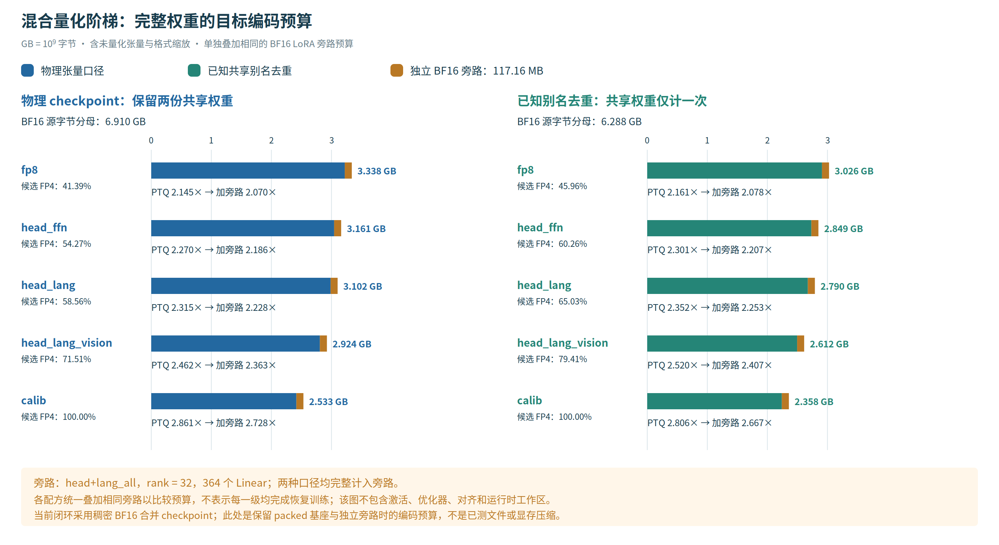
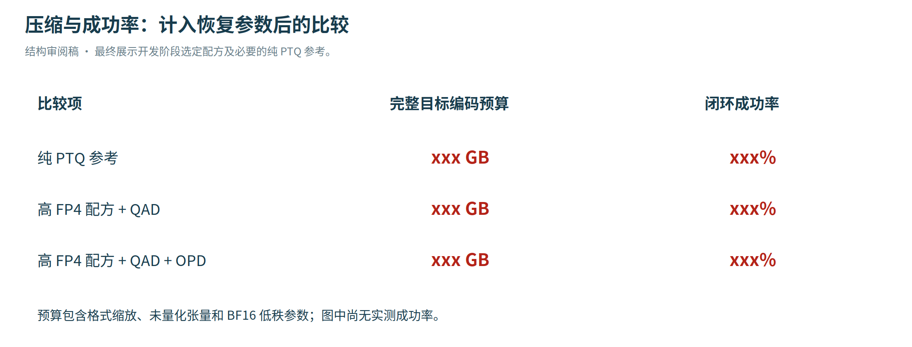
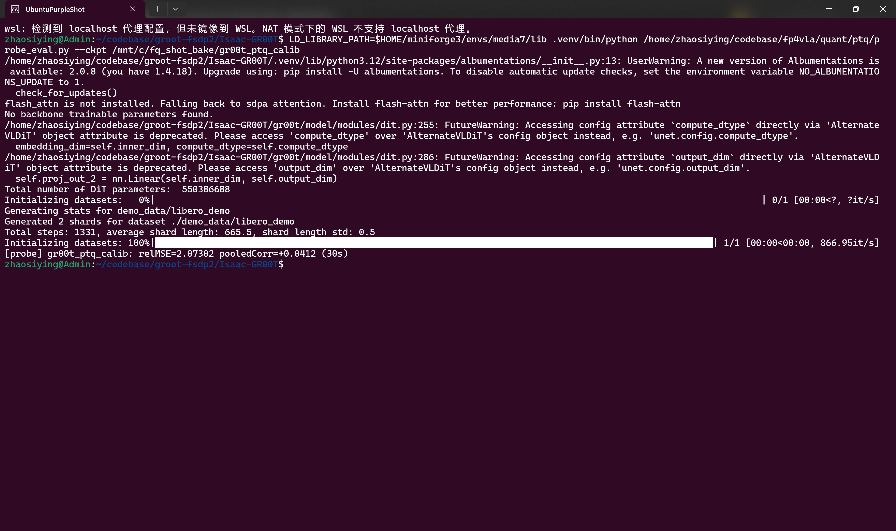
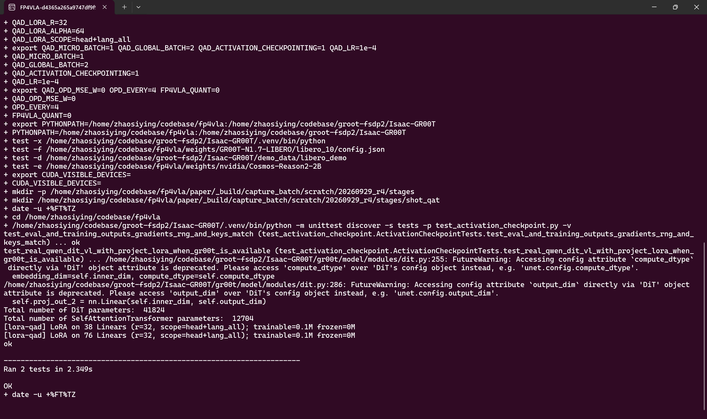
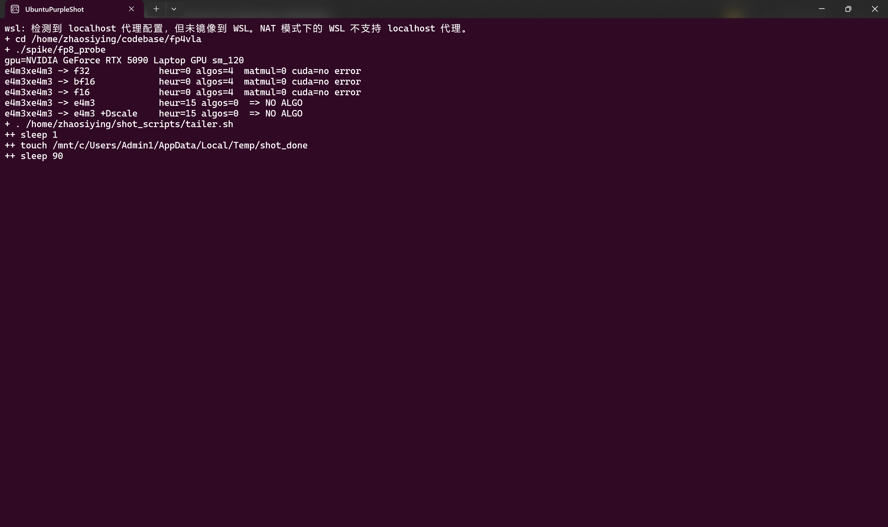
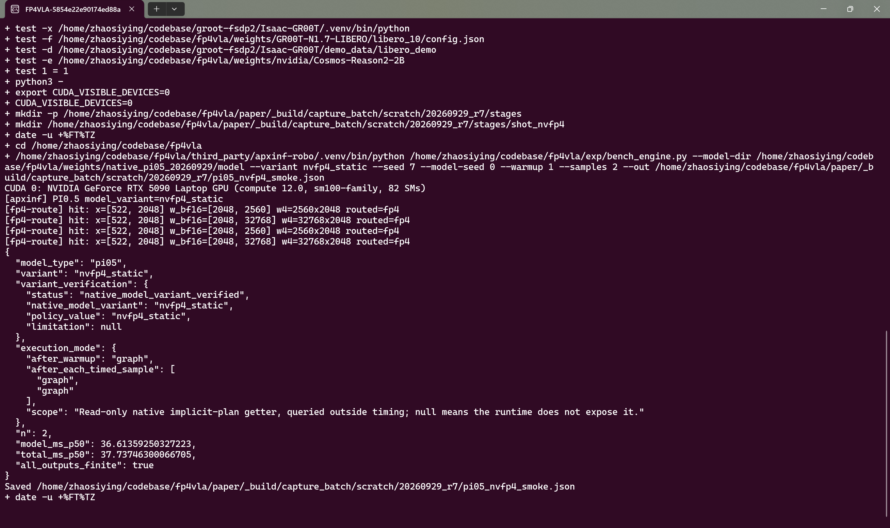

# PTQAD：APXInf 生态下 GR00T 的全 NVFP4 W4A4 量化与行为适配

# 摘要与引言

视觉—语言—动作模型（Vision–Language–Action model，VLA）把相机观测、语言指令和机器人状态映射为动作。对这类模型，低位宽量化的目标不仅是减少权重占用，还要保持动作反馈到环境之后的任务成功率。本文围绕 **APXInf 推理生态、GR00T N1.7、NVFP4 W4A4 训练后量化（PTQ），以及量化基座上的低秩恢复 QAD/OPD**，研究从数值压缩到机器人行为保持的完整过程。

方法分为三步。首先，把视觉、语言和动作路径中的可量化权重统一编码为 NVFP4，并在每次前向中量化线性层输入。然后，冻结量化权重，用成功演示训练少量低秩参数，使模型重新拟合动作。最后，让恢复后的学生执行任务，在它实际访问的状态上查询高精度教师，再以教师速度场监督追加训练。三步依次对应 **PTQ、QAD、OPD**。

**审阅说明。** 本文的方法、实验划分与复现步骤对应当前冻结协议；正式评测尚未完成。红色 `xxx` 是待测值，不代表预期结果。

| 主指标 | 数值 |
|---|---:|
| BF16 → W4A4 PTQ → QAD → QAD+OPD 闭环成功率 | <span style="color:#b42318">xxx%</span> → <span style="color:#b42318">xxx%</span> → <span style="color:#b42318">xxx%</span> → <span style="color:#b42318">xxx%</span> |
| OPD 相对同预算 continued-QAD 的变化 | <span style="color:#b42318">xxx</span> 个百分点 |
| 含 BF16 低秩参数的净编码压缩比 | <span style="color:#b42318">xxx</span> × |

## 1.1 为什么必须测闭环

策略每次生成一段动作，机器人执行其中一部分，再把新的图像和状态送回模型；这种反复决策称为**闭环**。从环境重置到任务成功或超时的一次完整尝试称为一个**回合（episode）**。量化带来的动作偏差会改变下一次观测，因此层输出误差、单次动作误差和最终任务成功率是三个不同指标。本文以闭环成功率作为主要行为指标，以完整动作误差解释可能的原因。

## 1.2 工作范围与贡献

本文研究的组合是：**GR00T 动作生成路径也承担 NVFP4 W4A4 约束，再用独立低秩旁路恢复，并用配对闭环检验教师监督的增益。** QVLA 采用动作敏感度指导通道位宽分配，并保护部分敏感模块；本文关注更广的四位主分支覆盖下，训练恢复能发挥多大作用。

1. **明确的数值路径。** 权重和激活均采用 NVFP4，主五臂使用固定 RTN 舍入。同覆盖校准 GPTQ 对照未执行，因此不主张恢复模型优于先进 PTQ。
2. **可分解的恢复过程。** QAD 用成功演示训练低秩旁路；OPD 再加入学生访问状态的教师监督。continued-QAD 从同一 QAD 起点追加相同演示更新数，用于区分追加训练与教师项的作用。
3. **从动作到任务的验证。** 五臂共享任务、初态和随机种子；固定观测诊断另行比较四步积分后的动作。参数编码、训练成本和独立 APXInf 执行延迟分别记账。

这里需要把本文与 QVLA 的关系说清楚。QVLA 是动作空间敏感度驱动的 PTQ：它对每个输出通道试验多种整数位宽，再按平均位宽预算做通道级分配，并保护 projector、action head 等模块。本文不复现这条分配路线；本文的对象是固定格式的 NVFP4 W4A4 主分支。479 个 eligible 权重张量统一编码，随后在同一量化基座上研究演示低秩恢复和学生状态教师监督。项目中把前一阶段称为 QAD-LoRA（demo-flow recovery），后一阶段称为 OPD。QAD-LoRA 是本文工程协议中的命名，与 Xin et al. 的 NVFP4 QAD 蒸馏目标不同，也不能将它误读为 QVLA 的组成模块或某一种统一的 KL 蒸馏标准。

QVLA 的实验矩阵同时包含 W8A8、W4A4 以及权重为主的 W8A16/W4A16；下表只引用与本文最接近的 W4A4 行。只有 W4A4 子实验使用统一 4-bit activation，其他行使用各自对应的 activation 设置；也不能把它的平均位宽理解成每个权重元素都固定四位。

为避免两个工作都使用 “W4A4” 而造成口径混淆，表 1 将关键差异列在同一处。QVLA 的数字是文献原报告，本文右列在正式五臂评测完成前保留占位。

| 对照项 | QVLA（文献口径） | 本文（v12 协议） |
|---|---|---|
| 模型与任务 | OpenVLA-OFT；LIBERO 四套件 | GR00T N1.7；LIBERO-10 十任务 |
| W4A4 的含义 | 指定量化层内的通道平均权重位宽为 4；各通道可取 0/2/4/8/16 位，W4A4 行使用统一 4-bit activation（论文未声明为 NVFP4）；projector/action head 保持 BF16 且不计入该平均位宽 | 权重为 NVFP4 E2M1；每 16 个元素共享 E4M3 块尺度，每个权重张量共享一个 FP32 二级尺度；激活走 NVFP4 QDQ |
| 覆盖范围 | 主要量化 vision backbone 与 language module；projector、action head 和公开脚本中的 `language_model.lm_head` 保持全精度 | 479 个 eligible 权重张量全部编码；469 个 ordinary Linear 与 7 个 category Linear 安装 A4 QDQ，QAD 只在 468 个 ordinary Linear 上挂 BF16 LoRA |
| 方法 | 动作空间敏感度、逐通道 greedy demotion | 固定 RTN 压力、QAD 演示恢复、continued-QAD 控制、OPD 学生状态教师监督 |
| 已报告结果 | OpenVLA-OFT：97.1% → 96.0%，15.4 → 4.5 GB，1.49× | 正式结果：<span style="color:#b42318">xxx</span> |

论文表 1 的 W4A4 外部参照如下，完整列出其强基线而不只摘录摘要数字。公开仓库的 inject_fake_w.py 入口只实现 weight-only fake quant 并将结果反写回原 dtype，没有建立 A4 packed kernel；因此下表的 W4A4 数字是论文报告，不能当作本文对公开代码的复现：

| 模型（LIBERO 四套件平均） | BF16 | SmoothQuant | OmniQuant | QVLA | 显存/速度（QVLA） |
|---|---:|---:|---:|---:|---:|
| OpenVLA | 76.5% | 63.2% | 73.3% | 76.0% | 4.3 GB / 1.47× |
| OpenVLA-OFT | 97.1% | 73.4% | 93.9% | 96.0% | 4.5 GB / 1.49× |

这里的平均值来自 LIBERO-Spatial、Object、Goal、Long 四个套件；QVLA 使用 RTX 4090，本文使用 GR00T N1.7 的 LIBERO-10 十任务。OpenVLA-OFT 的 W4A4 QVLA 逐套件成功率为 96.2%/97.6%/96.4%/93.8%，平均值 96.0%；这些分母和配对关系仍未公开到本文的审计粒度。模型、套件、硬件和成功率分母均不同，且文献表格没有提供与本文相同的配对区间或完整计时边界，因此这些点估计只能作为机制参照，不能与本文结果组成排行榜。QVLA 的消融也说明了参照方法的必要性：在 OpenVLA 的权重为主消融中，INT4 的 channel-wise 分配为 76.5%，layer-wise 为 74.8%；INT8 的 channel-wise 为 76.8%，layer-wise 为 74.9%；在整体 INT8 预算下，不带 pruning 的 channel-wise {2,4,8,16} 为 76.7%，uniform-bit 为 74.6%，channel-wise 加 pruning 为 76.8%。这些消融不是本文复现实验。
QVLA 的 98.9% 是 96.0/97.1 的相对保留率；相对 SmoothQuant 的差值 22.6 是百分点。上述文献结果与本文不使用相同模型、任务和后端，不能直接排名。

QVLA 的校准集来自 LIBERO 合并训练轨迹，主实验随机取 512 条轨迹，并加入少量仅含指令的样本；论文没有给出后者的数量。它用 teacher-forcing 下的单步 Action-MSE 做位宽分配，再用短 rollout 的累计动作偏差、末端偏差和最终成功率交叉验证排序；因此“单步指标用于筛选、短时闭环用于验证”是两个不同层次的证据。其 W8A16 校准规模消融在 128/256/512/1024 条轨迹下的平均成功率分别为 96.4%/96.8%/97.0%/96.7%，512 是该消融的最高点。512 条轨迹不等于 512 条完整输入记录，公开读取器的 max_samples 也不能直接复现该抽样。本文的 148 个窗口来自成功教师回合的恢复监督，既不是 512 条 PTQ 校准轨迹，也没有声称复现 QVLA 的校准规模消融。

为避免把两种方法的“四位”混为一谈，补充说明 QVLA 的计算链。对第 $l$ 层第 $c$ 个输出通道，QVLA 把该通道单独量化到 $b\in\{0,2,4,8,16\}$ 位，其动作敏感度定义为教师强制下的单步误差 $s_{l,c}^{(b)}=\mathbb{E}\|\tilde A_{l,c}^{(b)}-A^*\|_2^2$；再用短回合累计动作偏差 $S_{l,c}^{(b)}=\mathbb{E}\sum_t\|\tilde A_{l,c}^{(b)}(t)-A^*(t)\|_2$ 做时域验证。为降低逐通道全量前向的成本，论文用局部一阶近似将量化噪声与动作 Jacobian 增益相乘，先得到全局排序，再对候选通道做精确测量。最后从 16 位开始，按 $16\rightarrow8\rightarrow4\rightarrow2\rightarrow0$ 的相邻降位步骤，把单位节省位宽带来的敏感度增量最小的通道逐个降位，直到达到平均位宽预算；$0$ 位表示剪枝。

这一定义解释了本文与 QVLA 的边界：QVLA 的核心是**动作空间敏感度驱动的通道级混合整数位宽分配**，并保护 projector 与 action head；其一阶 proxy 依赖局部线性、零均值和各向同性噪声假设，是条件性的排序工具，不是闭环保证。本文则故意把 GR00T 的可量化主分支固定为 NVFP4 W4A4，用 QAD/OPD 学习恢复参数。因而本文不是 QVLA 的复现或直接超越，也没有声称已经完成 GR00T 上的动作敏感度分配。QVLA 还报告了通道/层级消融、校准规模消融、UniVLA/CALVIN 和真实机器人实验；其中 UniVLA 的低位结果含 W4A16/W8A8，CALVIN 与实机量化为 W8A16，不能当作 W4A4 跨平台证据。附录表格中的 AutoQVLA 与正文 QVLA 指同一方法。本文只复用其中与动作误差—闭环成功率相连的思想，其他证据不作为本文结果。

## 1.3 “全 W4A4”的准确含义

本项目将 479 个符合量化条件的权重张量全部编码为 NVFP4，其中 469 个普通线性层与 7 个类别专属线性层同时量化输入；其余 3 个是只量化权重的 embedding/position 张量。“100%”指这份可量化清单的覆盖率，不是全部模型参数都采用四位。偏置、归一化参数及 QAD/OPD 的低秩旁路另按实际精度计入预算。

W4A4 表示主分支权重与激活均为四位。本轮 GR00T 用**量化后反量化（QDQ）**模拟其数值，再以浮点矩阵乘执行；低秩旁路使用 BF16。APXInf 的 NVFP4/FP8 算子和原生策略基准见附录 C，不能把其延迟直接当作本轮 GR00T 的加速。

# 2. 背景与相关工作

权重决定视觉与语言特征，特征决定动作，动作改变下一次观测。本章沿这条计算链介绍 GR00T、四位表示和误差传播，再说明已有方法如何控制量化误差。

## 2.1 GR00T 如何生成动作

记包含图像、指令和机器人状态的观测为 $o$；策略 $\pi$ 根据 $o$ 生成一段连续动作，称为**动作块**。机器人执行其中一部分，再获取新观测并规划；一个回合中实际产生的交互轨迹称为 **rollout**。

本文使用 GR00T N1.7 的 LIBERO 微调 checkpoint。它先理解图像和指令，再生成动作；前两个阶段合称特征骨干网络（backbone）。下表中的宽度指特征维度，merger 指合并与投影模块，deepstack 指来自不同视觉深度的特征连接，DiT 指用 Transformer 表示动作向量场的网络。模型完整数据流如下，维度来自本地 checkpoint 配置。

| 阶段 | 输入与作用 | 本文模型结构 |
|---|---|---|
| 视觉编码 | 将图像块转为视觉特征，并投影到语言特征空间 | Qwen3-VL 视觉塔含 24 个块、宽度 1024；一个主 merger 和三个 deepstack merger 输出 2048 维特征 |
| 多模态理解 | 联合处理视觉特征与指令，形成动作条件 | 16 层语言网络，宽度 2048；16 个查询头共享 8 个键值头，每头 128 维 |
| 动作生成 | 结合上述条件与机器人状态，从噪声逐步生成动作块 | 4 层上下文自注意力；32 个交替自注意力/交叉注意力 DiT 块，宽度 1536 |

注意力用查询 Q 与键 K 的匹配程度，对值 V 加权汇集；多头注意力并行执行若干这样的操作。语言网络采用分组查询注意力（GQA），多个查询头共享键值头，因此 K/V 投影比 Q 投影窄。前馈网络（FFN，通常由多层感知机 MLP 构成）则逐位置变换特征。三个 deepstack merger 把不同视觉深度的信息送入语言网络。

GR00T 通过**流匹配**（flow matching）学习动作生成。设演示动作块为 $a$，同形状的标准高斯噪声为 $z$，插值时间为 $t\in[0,1]$，则

$$
a_t=(1-t)z+ta,\qquad \frac{\partial a_t}{\partial t}=a-z.
$$

$t=0$ 是噪声，$t=1$ 是动作。模型以观测 $o$、中间状态 $a_t$ 和时间 $t$ 为输入，预测速度 $v_\theta(o,a_t,t)$；参数 $\theta$ 决定这个速度场。训练让预测接近 $a-z$。推理从噪声出发，反复“预测速度、沿速度前进一步”，最后得到动作。本 checkpoint 使用四次 Euler 更新，每次步长为 $1/4$；恢复训练中的同一速度目标和有效动作区域见 §3.2。

模型保留统一的 $40\times132$ 动作张量，以容纳不同机器人的接口。LIBERO 的有效部分是前 16 步、每步 7 维控制量，其余位置是填充；训练用有效动作掩码排除填充。评测每次执行前 8 步，再重新观测。由此需要区分两种步数：四次**积分更新**完成一次动作块生成，若干次**策略决策**完成一个 episode。

## 2.2 FP4/FP8 表示与独立引擎基准

线性层是模型的主要计算。把输入按行排成 $X\in\mathbb R^{M\times K}$，权重记为 $W\in\mathbb R^{N\times K}$，则忽略偏置时

$$
Y=XW^\top,\qquad Y\in\mathbb R^{M\times N}.
$$

$M$ 是批次与序列位置展平后的行数，$K$ 是输入维度，$N$ 是输出维度。量化把权重映射到有限格点，并保存恢复数值所需的缩放。记编码为 $C(W)$，反量化后的矩阵为 $\widehat W=Q(W)=\operatorname{dequant}(C(W))$；下文的 $Q$ 均包含反量化，因此 $W$ 与 $Q(W)$ 可以直接计算差值。

BF16 与 FP16 都使用 16 位，前者保留更大的指数范围，后者在常用范围内有更细的尾数精度；FP32 使用 32 位。NVFP4 则把权重数据压到 4 位，同时用分层缩放适应不同幅度。

| 表示 | 数据与缩放 | 本文的数值约定 |
|---|---|---|
| NVFP4 | E2M1 数据；每 16 个连续元素共享一个 E4M3 块缩放；每张量另有一个 FP32 二级缩放 | E2M1 绝对值格点为 $\{0,0.5,1,1.5,2,3,4,6\}$；正负零具有不同编码 |
| FP8-E4M3 | 8 位数据；本项目 weight-only 路径按权重行保存 FP32 缩放 | 四位指数、三位尾数，最大有限值为 448 |
| BF16 | 每元素 2 字节 | 用于源模型、未量化权重及当前闭环模型的稠密存储 |

E2M1 的名称表示两位指数、一位尾数，另有一位符号。对权重第 $n$ 行、第 $b$ 个块内的元素 $j$，NVFP4 反量化为

$$
\widehat W_{n,b,j}=q_{n,b,j}\,s_{n,b}\,\tau,
$$

其中 $q$ 是 E2M1 格点，$s$ 是 E4M3 块缩放，$\tau$ 是 FP32 二级缩放。块缩放适应局部幅度，二级缩放再调整整个张量的范围。只计数据和块缩放时，平均每元素占 $4+8/16=4.5$ bit，相对 BF16 约压缩 $16/4.5=3.56$ 倍；完整模型还须计入未量化参数、二级缩放与恢复参数，具体计账见 §4.4。

本文采用最近舍入、中点取偶（RNE）。例如 0.75 位于 E2M1 的 0.5 与 1 之间，选择编码最低位为偶数的 1；5 位于 4 与 6 之间，选择 4。E4M3 同样处理零、次正规数和有限端点；溢出值饱和到端点。零块使用零缩放，除法时单独使用安全除数。这些规则决定同一个权重能否在 NumPy、PyTorch 与原生引擎中得到一致的数值。

本文涉及的三种产物承担不同任务，先统一名称，后文按此使用。

| 名称 | 实际保存或执行的内容 | 用途 |
|---|---|---|
| 反量化基座 | 保存 $Q(W)$ 的稠密 BF16 张量，用普通浮点算子执行 | 隔离权重扰动，开展恢复训练与 GR00T 闭环评测 |
| 恢复模型 | 冻结量化基座加 A/B 低秩残差；正式闭环保持两者分支，稠密合并只用于诊断 | 测量恢复后的策略行为 |
| 原生打包模型 | 保存四位编码及尺度，调用低精度硬件算子 | 检查实际载荷、算子与模型执行速度 |

**Weight-only** 只改变权重；**W4A4** 同时将权重和激活量化为四位。参数的存储精度也可不同于计算精度：本文恢复训练以 FP32 保存参数，使用 BF16 autocast 选择矩阵等算子的计算精度。这样既保持优化器的更新精度，又控制计算成本。

## 2.3 误差怎样走到闭环

W4A4 同时改变权重与激活，二者都可能引起动作偏差。对一个偏置保持不变的线性层，记 $\widehat X=Q_A(X)=X+\Delta X$、$\widehat W=Q(W)=W+\Delta W$。忽略浮点乘加舍入时，层输出误差满足精确分解

$$
\begin{aligned}
\Delta Y&=\widehat X\widehat W^\top-XW^\top\\
&=X\Delta W^\top+\Delta XW^\top+\Delta X\Delta W^\top.
\end{aligned}
$$

右侧依次是权重误差、激活误差及其交叉项。由矩阵范数的次乘性可得

$$
\begin{aligned}
\|\Delta Y\|_F&\le \|X\|_2\|\Delta W\|_F+\|\Delta X\|_F\|W\|_2\\
&\quad+\|\Delta X\|_F\|\Delta W\|_2,
\end{aligned}
$$

其中 $\|\cdot\|_F$ 是 Frobenius 范数，$\|\cdot\|_2$ 是谱范数。固定观测下，小幅层输出误差再经下游网络传播为动作误差 $\Delta a\approx J_Y\operatorname{vec}(\Delta Y)$；$J_Y$ 是动作对该层输出的雅可比矩阵。因此只看权重均方误差不足以判断 W4A4 的行为损失，还要检查激活扰动与动作生成的敏感度。

流策略在一个动作块内反复积分速度场。若速度扰动上界为 $\eta$、局部 Lipschitz 常数为 $L$、积分区间为 $T_f$，从同一噪声出发的连续轨迹差可由 $\eta(e^{LT_f}-1)/L$ 控制（$L=0$ 时取 $\eta T_f$），离散 Euler 还会产生步长误差。

动作执行后又改变下一次观测。若第 $\ell$ 次决策的状态差为 $e_\ell$、动作差为 $\delta_\ell$，环境局部敏感度为 $L_s,L_a$，则

$$
e_{\ell+1}\le L_s e_\ell+L_a\delta_\ell.
$$

接触、遮挡和成功判定可能让这个局部关系突然改变，所以本文把证据分成三层：权重误差、固定输入下的输出误差，以及环境判定的闭环成功率。闭环反馈还会造成协变量漂移：演示观测分布 $d_{\mathrm{demo}}$ 与学生在第 $\ell$ 次决策访问的分布 $d_\pi^\ell$ 不必相同。QAD 旨在修正演示分布上的量化误差，OPD 则直接在学生访问状态上加入教师约束；两者的实际作用由闭环对照检验。

## 2.4 已有方法分别解决什么问题

量化方法的差别在于它们把误差放在哪里处理。RTN 只决定格点、尺度和舍入；GPTQ、BRECQ 等用校准输入重构层输出；AWQ、SmoothQuant、OmniQuant 和旋转类方法通过缩放、坐标变换或保护显著通道改变误差分布；LoRA、SVDQuant 等则在量化后增加低秩补偿。本文的主压力基座使用固定、无校准的 NVFP4 RTN，同覆盖 GPTQ 对照未执行，QAD/OPD 属于量化后的行为恢复。

| 比较维度 | 代表方法 | 与本文的关系 |
|---|---|---|
| 格点与舍入 | RTN、AdaRound | 决定低位宽数值误差；本文固定 NVFP4 块缩放与最近偶数舍入 |
| 层/块重构 | GPTQ、BRECQ | 用校准输入降低层输出误差；本文未执行同覆盖 NVFP4 GPTQ 对照，也未复现 QVLA |
| 等价变换 | AWQ、SmoothQuant、OmniQuant、QuaRot、SpinQuant、FoldQuantVLA | 改变权重和激活的坐标或保护范围；本文主配方不折叠坐标，恢复项直接学习残差 |
| 动作敏感度分配 | QVLA | 在最终动作空间测量每个输出通道的扰动，再按平均整数位宽预算分配 |
| 量化后恢复 | LoRA、QAD、OPD | 用低秩参数修正量化基座；本文比较演示恢复、同预算续训和学生状态教师监督 |

### QVLA 的定位与本文边界

QVLA 的“四位”不是把模型中每个权重固定成四位。它把视觉骨干和语言骨干中的卷积、线性算子统一看作线性映射；这里的 channel 指卷积的输出通道，或 Linear 权重矩阵的一行。对第 $l$ 层第 $c$ 个输出通道，它分别试验 $b\in\{0,2,4,8,16\}$，并以教师强制下的单步动作误差
$s_{l,c}^{(b)}=\mathbb{E}\|\tilde A_{l,c}^{(b)}-A^*\|_2^2$
衡量扰动，再用短回合的累计动作偏差
$S_{l,c}^{(b)}=\mathbb{E}\sum_t\|\tilde A_{l,c}^{(b)}(t)-A^*(t)\|_2$
检查时间累积。它用局部一阶近似把量化噪声与动作 Jacobian 增益相乘，先获得全局排序，再从 16 位开始沿 $16\rightarrow8\rightarrow4\rightarrow2\rightarrow0$ 的相邻步骤，把“每节省一位带来的误差增量”最小的通道逐个降位；0 位表示剪枝。在 W4A4 子实验中，activation 统一为 4 bit；W8A8、W8A16 和 W4A16 行分别使用对应的 activation 设置。projector 与 action head 保持 BF16，平均位宽只在指定量化层内计算，论文没有把这一路径声明为 NVFP4。公开 fake-quant 入口还跳过 language_model.lm_head，因此“指定量化层”不等于整个模型参数。

实现细节也决定了它与本文的差异：QVLA 的激活采用统一位宽和分布感知校准，权重按输出行保存独立 scale/zero-point，访问时反量化，避免按通道分支破坏执行路径；最后的 $2\rightarrow0$ 剪枝阶段还加入双阈值与 $L_0$ 约束。因而“逐通道分配”不是简单地把每层改成同一个整数位宽。还要区分论文算法与公开代码：公开 `sensitivity_hessian_proxy.py` 计算的是输入协方差与权重舍入误差组成的 proxy，`assign_gates_from_sensitivity.py` 的堆代价使用 `proxy_blow/(b_hi-b_low)`，并非论文式动作敏感度边际增量；`inject_fake_w.py` 也只实现逐输出行的 weight-only fake quant。公开入口不能直接复现论文的 W4A4、activation quantization 或完整动作空间分配结果。

QVLA 的 OpenVLA/OFT 结果、channel-wise 与 layer-wise 消融、uniform-bit 与 pruning 对照、512 条轨迹及校准规模消融，均属于外部文献证据；引言只给出最接近的 W4A4 主表，下面补充其余机制和适用范围。这里的消融同时说明两个因素：OpenVLA 上 INT4 的 channel-wise 为 76.5%，layer-wise 为 74.8%；INT8 的 channel-wise 为 76.8%，layer-wise 为 74.9%；在 INT8 总预算下，不带 pruning 的 channel-wise {2,4,8,16} 为 76.7%，统一 8 bit 为 74.6%，加入 0-bit pruning 后为 76.8%。这些数字不能被压缩成“只要剪枝就有效”。其 UniVLA、CALVIN 和真实机器人结果也不能替代本文 GR00T 的闭环评测：UniVLA 报告了 W4A16/W8A8，CALVIN 与实机量化采用 W8A16，而不是 W4A4。固定观测动作误差也不能单独给出闭环成功率保证。公开代码中的层输入 Hessian proxy 和 weight-only fake quant 入口与论文的动作 Jacobian 理论并不等价，复现边界见附录 B；附录表格中的 AutoQVLA 与正文 QVLA 指同一方法。

QVLA 的理想目标写成动作分布之间的 KL 散度，但实际分配使用 teacher-forcing 的单步 Action-MSE，再用短 rollout 的累计动作和末端偏差验证。本文的 QAD/OPD 优化的是 flow-matching 速度 MSE，动作诊断比较完整 endpoint，闭环指标是环境成功率；三者不是同一个损失，不能互相替代。QVLA 图 3 的 Ours 曲线是 8-bit 示例，不能直接当作 W4A4 的固定输入对照。QVLA 的一阶 proxy 还依赖局部线性、零均值且各向同性的量化噪声假设，因此是条件性的排序工具，不是动作敏感度本身，更不是闭环成功率保证。还要区分两个公式：正文式 (5) 的累计量是逐时刻二范数之和，附录理论推导中的真实敏感度使用期望平方二范数；二者不能统称为同一个累计 MSE。

这套设计有明确的实证动机：在 OpenVLA 上，QVLA 观察到视觉编码器相对稳定，语言模块更敏感，projector 与 action head 最敏感；同一层内不同输出通道的敏感度也并不均匀。附录随机抽取约 1,000 个通道比较单步与累计敏感度排序，论文只以散点图描述约 80% 的点靠近对角线，没有给出相关系数或显著性检验，因此这不是定量一致率。本文故意把 GR00T 动作路径纳入全覆盖 NVFP4 W4A4，目的是制造可测的压力并研究恢复，而不是把 OpenVLA 的敏感度结论外推为 GR00T 的最优位宽分配。

QVLA 的 512 条样本是从 LIBERO 合并训练轨迹中随机抽取的轨迹数，另有少量仅含指令的样本；论文没有给出后者的数量。它的校准集不是“512 条完整输入记录”的同义词，公开读取器的 max_samples 也不能直接复现论文的轨迹抽样。QVLA 表 1、表 2 和附录表的成功率、显存和速度是文献点估计，未提供与本文相同的逐回合分母、配对区间或完整 warm-up/计时边界；本文把它们作为机制参照，不将它们与本项目的 160 回合配对结果组成统计排行榜。

QVLA 的真实机器人表格也不是 W4A4 证据：AutoQVLA 在 W8A16 的 IMETA-Y1 双臂系统上报告三个任务 8/10、6/10、5/10，平均 63.3%，速度 1.28×；训练使用 A100，部署使用单张 RTX 4070。该结果用于说明跨到真实硬件时的测量范围，不能替代本文 GR00T 的 W4A4 闭环。

NVIDIA 的 GR00T N1.7 Thor 教程把视觉塔设为 FP8、语言主体设为 NVFP4，并保护语言投影层；其约 39.9 ms 是另一套硬件与融合策略的部署测量。FoldQuantVLA 将通道缩放、分块旋转、GPTQ 与动态激活量化组合，在其自己的 W4A4/W8A8 保护口径下报告 LIBERO 结果。两者说明保护范围和后端会改变结果，不能与本文固定 NVFP4 W4A4、QDQ 执行和低秩恢复的五臂直接横排。本文的 APXInf π0.5 基准同样只用于独立算子与原生执行核验，不作为 GR00T 端到端加速证据。
## 2.5 恢复训练的监督来源

**行为克隆**从专家观测—动作对学习策略；**知识蒸馏**从教师模型输出学习策略。本文的两阶段恢复分别使用这两类监督。本文将第一阶段写作 QAD-LoRA（demo-flow recovery），不要与 Xin et al. 的 NVFP4 QAD 蒸馏目标混同。

- **QAD-LoRA** 以 BF16 教师成功 rollout 形成的演示窗口训练 LoRA，监督目标是流匹配速度。
- **OPD-LoRA** 使用 QAD 学生访问的观测和预测动作端点，由未量化教师在同一插值问题上提供速度标签，再与演示目标联合训练。

“BF16 教师”指原 BF16 checkpoint 的未量化权重取值；实际标注以 FP32 存储参数、BF16 autocast 前向，与学生训练匹配。训练中先完成演示反传，再完成单样本探针反传，最后统一更新参数，称为**串行 OPD**；“串行”描述计算图的内存组织，数据仍来自一轮学生采集形成的固定缓存。

DAgger 解释了学生分布为何值得关注。在单步代价有界、专家分布上的动作错误概率不超过 $\varepsilon$ 的离散模仿设定中，到第 $\ell$ 步至少出错一次的概率至多为 $\ell\varepsilon$；最坏影响累积为 $\sum_{\ell=1}^{T}\ell\varepsilon=O(T^2\varepsilon)$。DAgger 反复执行学生、查询专家并聚合数据。在后续代价差上界 $u$ 等条件下，其保证可写成 $J(\pi)\le J(\pi^*)+uT\varepsilon$，其中 $J$ 为期望累计代价、$\pi^*$ 为专家。本文的一轮缓存并不具备这一完整迭代过程，相关理论只提供采集学生状态的动机。[DAgger 原文](https://proceedings.mlr.press/v15/ross11a.html)

直接利用环境回报是另一条路线。REINFORCE（Williams, 1992）使用 $\mathbb E[R\nabla_\theta\log\pi_\theta(a\mid s)]$ 估计期望回报的梯度；PPO（Schulman et al., 2017）再以优势和概率比裁剪约束更新。这里 $R$ 为轨迹回报，$s$ 为状态。流策略的多步生成概率需要专门处理，DPPO（Ren et al., 2024）研究了扩散策略的对应问题。奖励加权回归 RWR、自模仿学习 SIL、AWR、AWAC 和 Decision Transformer 则分别通过样本权重或回报条件利用经验。本文的正式比较采用演示适配、continued-QAD 和教师速度 MSE，未使用环境回报优化。

# 3. 方法

本文把低位宽主分支与高精度恢复旁路分开定义。这样读者可以先复现 W4A4 PTQ，再复现 QAD，最后复现 OPD，而不会把 LoRA 残差误看成四位主分支的一部分。

## 3.1 NVFP4 W4A4 PTQ

NVFP4 的数据为 E2M1 四位格点；连续 16 个输入元素共享一个 E4M3 块尺度，张量再共享 FP32 二级尺度。权重量化先从完整矩阵 $W$ 确定唯一二级尺度 $\tau_W$，再处理每个块 $w_b$：

$$
\begin{aligned}
\tau_W&=\operatorname{FP32}\!\left(\max(\max|W|/448,2^{-149})\right),\\
s_b&=R_{\mathrm{E4M3}}\!\left(\frac{\max_j|w_{b,j}|}{6\tau_W}\right),
\end{aligned}
$$

$$\hat w_{b,j}=R_{\mathrm{E2M1}}\!\left(\frac{w_{b,j}}{s_b\tau_W}\right)s_b\tau_W.$$

这里 RTN 的裁剪系数为 1；全零权重约定 $\tau_W=1$。块尺度为零时只在除法中使用安全分母，实际反量化仍严格为零。权重分片编码时复用同一个 $\tau_W$，不能对每个分片重新定标。

激活使用另一项明确的尺度合同：先把输入转为 F16，再沿最后一维分成 16 元素块，以 FP32 的 `amax * float32(1/6)` 求块尺度并舍入为 E4M3；激活二级尺度固定为 $\tau_A=1$。若显式启用 `FP4VLA_SATURATE_F16_ACTIVATIONS=1`，有限输入在 F16 转换前截到 $[-65504,65504]$；关闭时拒绝转换溢出，NaN/Inf 在两种设置下都拒绝。训练与评测各自的开关值保存在 manifest，不能把权重的动态二级尺度与激活固定尺度混写。服务日志报告 469/469 ordinary 和 7/7 category 的 W4A4 安装结果。

v12 的主结果使用 `rtn_w4a4_category`：不使用校准数据，把 472 个 ordinary recipe 张量和 7 个 category 张量全部写成 NVFP4。3 个 embedding/position 张量只量化权重。每个张量的形状、padding、尺度和实际格式写入 `ptq_recipe.json`、`category_ptq_recipe.json` 与 bake manifest；这些文件是最终配方的唯一来源。


*图 1　NVFP4 RTN 的权重二级尺度与激活块尺度。展示 v12 无校准 RTN 的权重路径：每个矩阵共享动态 FP32 二级尺度，每 16 个权重元素共享 E4M3 块尺度；激活路径先转 F16，二级尺度固定为 1。配方无需校准输入，不绘制未经测量的收益曲线。*

## 3.2 QAD：冻结基座上的低秩恢复

沿用 §2.2 的行向量约定，对一个 $K\rightarrow N$ 线性层，冻结量化权重 $W_q$ 与原偏置 $b$，增加不带偏置的低秩矩阵 $A\in\mathbb R^{r\times K}$ 与 $B\in\mathbb R^{N\times r}$：

$$y=Q_A(x)W_q^\top+b+\frac{\alpha}{r}(xA^\top)B^\top.$$

主分支接收 NVFP4 激活，残差分支读取量化前的 BF16 输入。469 个 ordinary Linear 中，语言输出投影 `lm_head` 不参与动作前向，因此只在其余 468 个模块上训练 rank=32、alpha=64 的 A/B；类别层保持冻结。训练参数以 FP32 保存，前向使用 BF16 autocast；部署旁路以 BF16 执行，按 BF16 参数载荷计账。QDQ 使用直通估计器（STE）：前向执行量化，反向把量化映射对输入的导数近似为 1。

对来自 BF16 成功轨迹的演示窗口，沿用 §2.1 的观测 $o$、动作端点 $a$、噪声 $z$ 和插值 $a_t=(1-t)z+ta$。令二值掩码 $m_{h,d}$ 标记有效时间步 $h$ 与控制维度 $d$，演示损失为

$$\ell_{\mathrm{demo}}=\frac{\sum_{h,d}m_{h,d}\left[v_\theta(o,a_t,t)_{h,d}-(a-z)_{h,d}\right]^2}{\sum_{h,d}m_{h,d}+10^{-6}}.$$

这里可训练参数 $\theta$ 仅包含 A/B。QAD 对实际微批的演示损失求平均后更新；填充区域不贡献损失。

## 3.3 OPD：学生访问状态上的教师速度监督

先固定 QAD 学生并运行训练分区，保存其观测 $o_i$、预测动作端点 $a_i^S$ 与有效掩码 $m_i$。教师标注阶段为每个窗口固定随机种子，重建噪声 $z_i$ 与时间 $t_i$，形成探针输入 $P_i=(o_i,(1-t_i)z_i+t_i a_i^S,t_i)$。缓存保存原输入、种子和 BF16 教师速度 $v_T(P_i)$；学生重放同一随机上下文，因此比较发生在同一个插值点。

$$\ell_{\mathrm{probe},i}=\frac{\sum_{h,d}m_{i,h,d}\left[v_\theta(P_i)_{h,d}-v_T(P_i)_{h,d}\right]^2}{\sum_{h,d}m_{i,h,d}}.$$

探针实现先拒绝空掩码，因此分母无需稳定项；教师标签固定且不求梯度。每次更新实际累积 $n$ 个微批时，联合目标为

$$\mathcal L_{\mathrm{OPD}}=\frac1n\sum_{j=1}^{n}\ell_{\mathrm{demo},j}+\lambda\frac1n\sum_{j=1}^{n}\ell_{\mathrm{probe},j}.$$

本轮每次优化器更新都加入教师项（`opd_every=1`），$\lambda$ 由开发集在协议候选中选择。缓存只采集一轮，追加训练期间不刷新。continued-QAD 使用同一 QAD 起点、演示顺序、实际读取数和更新数，只保留上式的演示项；OPD−continued-QAD 因而衡量额外教师监督的作用。

## 3.4 部署与闭环评测

部署保留冻结 W4A4 基座和独立 A/B adapter。把 $BA$ 预先合入权重会让残差也接收量化输入，改变训练时的函数，因此正式服务不使用这种合并。每个评测臂使用相同的任务、初态、seed、稳定步和动作步预算；`eval_manifest.json` 记录数值开关、ZeroMQ 超时、checkpoint identity 与 reset 哈希，`compare_recovery.py` 再计算五臂配对统计。

# 4. 实验

实验回答三个问题：W4A4 对闭环能力造成多大影响；QAD 能否恢复；OPD 是否超过相同演示更新预算的续训。以下设置在正式评测前固定，结果列保留红色占位。

## 4.1 模型、任务与数据划分

实验使用 GR00T N1.7 的 LIBERO-10 检查点，在 WSL2 Ubuntu、RTX 5090 Laptop 24 GB 上运行。十个任务均使用官方初态库，分区如下：

| 分区 | 每任务初态索引 | 用途 |
|---|---|---|
| 开发集 | 4–8 | 选择 QAD 学习率与 OPD 权重 |
| 教师演示与学生采集 | 20–23 | 生成 QAD 演示和 OPD 教师监督数据 |
| 正式评测 | 9–19、24–28 | 五臂各 160 回合，结果不回流调参 |

教师演示与学生采集共享训练分区，均与正式评测隔离。每次重置后先执行 10 个零动作稳定步；模型生成 16 步动作，环境执行前 8 步后重新观测，单回合最多 720 步。配对回合使用相同初态、种子和步数预算，保存重置状态哈希与逐回合成败记录。

BF16 教师在训练分区尝试 40 回合，保留其中 37 条成功轨迹的 148 个观测—动作窗口。采集每 4 次策略调用保存一窗，每回合最多四窗，因此偏向回合前段。148 窗不是 148 条独立演示，也不代表完整成功轨迹的均匀覆盖。学生状态采集采用相同窗口上限，并保留失败回合中已采集的状态。


*图 2　QAD→OPD 的训练与独立评测协议。开发、学生采集与最终评测使用互不重叠的官方初态。两个续训分支从同一 QAD 检查点出发；教师额外数据和计算单列。*

## 4.2 五臂对照与训练预算

QAD 在十任务的 BF16 成功演示上训练 2,000 次更新。LoRA 的 rank=32、alpha=64；学习率从 {5e-5, 1e-4} 中由开发集选择。continued-QAD 和 OPD 从同一入选 QAD 检查点出发，各追加 2,000 次演示更新。OPD 每次更新另加入教师项，系数从 {0.25, 1.0} 中选择。两者匹配演示读取数与更新数，OPD 的额外探针计算和教师标注成本单列。

训练按文件路径排序顺序读取，不打乱、不丢尾批。每微批一窗、最多累积 16 微批，故每轮 148 窗形成九次 16 窗更新和一次四窗尾更新；书本任务的末四窗每轮都位于尾批。损失按本次实际窗口数平均。完成 2,000 次更新对应 200 轮、29,600 次窗口读取：这是加载规则与 `trainer_state.json` 完成步数/轮数共同推导的预算，不是逐样本计数日志。每次演示前向重新采样流噪声 $z$ 和时间 $t$，但不增加新的环境观测。

| 配置 | 检验内容 | 正式成功率 |
|---|---|---:|
| BF16 | 未量化参考 | <span style="color:#b42318">xxx%</span> |
| RTN W4A4 PTQ | 全覆盖量化的影响 | <span style="color:#b42318">xxx%</span> |
| PTQ + QAD | 成功演示恢复 | <span style="color:#b42318">xxx%</span> |
| PTQ + continued-QAD | 追加演示更新的作用 | <span style="color:#b42318">xxx%</span> |
| PTQ + QAD + OPD | 追加教师监督的作用 | <span style="color:#b42318">xxx%</span> |


*图 3　同一 W4A4 基座上的五臂闭环对照。BF16、RTN W4A4 PTQ、QAD、继续 QAD 与 QAD+OPD 使用同一 v12 最终评测协议；红色占位符为待测值。*

## 4.3 配对统计与结论范围

同一初态上的两种策略可能同时成功或同时失败，因此比较保留回合配对关系。报告各任务的成功分子与分母、总体成功率、任务内配对 bootstrap 的 95% 区间，以及精确 McNemar 检验；四项预定比较使用 Holm 校正。

| 比较 | 回答的问题 | 差值 / 个百分点 | 95% 配对区间 | 校正后 p |
|---|---|---:|---|---:|
| PTQ − BF16 | 量化是否影响闭环 | <span style="color:#b42318">xxx</span> | <span style="color:#b42318">xxx</span> | <span style="color:#b42318">xxx</span> |
| QAD − PTQ | 演示能否恢复行为 | <span style="color:#b42318">xxx</span> | <span style="color:#b42318">xxx</span> | <span style="color:#b42318">xxx</span> |
| OPD − QAD | 完整追加阶段是否有收益 | <span style="color:#b42318">xxx</span> | <span style="color:#b42318">xxx</span> | <span style="color:#b42318">xxx</span> |
| OPD − continued-QAD | 教师项是否超过同演示预算续训 | <span style="color:#b42318">xxx</span> | <span style="color:#b42318">xxx</span> | <span style="color:#b42318">xxx</span> |

OPD−QAD 包含追加训练，不能单独归因为教师监督。OPD−continued-QAD 控制演示预算，但未匹配所有额外计算，也没有隔离“学生状态”与“其他教师蒸馏数据”的差异。要单独证明学生状态分布的作用，还需增加预算匹配的演示状态教师蒸馏对照。

## 4.4 编码预算

压缩比按完整参数载荷计算：NVFP4 数据之外，还计入 E4M3 块尺度、FP32 二级尺度、padding、未量化参数和 BF16 LoRA；对已知共享权重别名去重。主分支和恢复旁路分开列出，避免把低秩参数当作免费恢复。

| 项目 | 完整目标编码 |
|---|---:|
| BF16 源参数 | <span style="color:#b42318">xxx</span> B |
| NVFP4 PTQ 主分支与未量化参数 | <span style="color:#b42318">xxx</span> B |
| BF16 低秩旁路 | <span style="color:#b42318">xxx</span> B |
| 恢复模型净压缩比 | <span style="color:#b42318">xxx</span> × |

这是编码预算，不是当前反量化 checkpoint 的文件体积，也不是实测显存。最终数值从选中配方和恢复清单重建。



*图 4　W4A4 基座的编码预算与低秩旁路成本。v12 RTN W4A4 的实际编码预算待冻结产物核算；最终计入未量化权重、格式缩放及完整 BF16 低秩旁路。红色 xxx 不代表测量值。*



*图 5　全 NVFP4 W4A4 基座的预算与闭环成功率。v12 RTN W4A4 五臂的预算与闭环成功率均待测量和核验；恢复臂须计入完整 BF16 低秩残差。图中不预设收益大小或排名。*

## 4.5 完整动作诊断

五臂在十任务各八个固定观测上使用相同初始噪声，各自完成四步积分，再比较有效的 16×7 动作。分别报告归一化动作 MSE、反归一化后的平移与旋转控制量 MSE，以及夹爪指令不一致率；结果为 <span style="color:#b42318">xxx</span>。

这些观测来自 QAD 使用的教师成功轨迹，因此该诊断解释训练分布上的动作拟合。反归一化误差表示控制器输入差异，不是实测末端位姿误差；它也不替代正式闭环结果。QVLA 还报告短回合 rollout 中的累计动作和末端偏差；本项目若未完成同口径的 rollout 累计测量，不能把这组固定观测结果表述为闭环稳定性保证。

## 4.6 未执行的 PTQ 对照

同覆盖校准 GPTQ 对照未执行，不报告其成功率、配对统计或校准成本。主实验只能回答固定 RTN W4A4 基座上的行为恢复，不能据此推断优于 GPTQ、QVLA 或其他先进 PTQ 配方。该范围决定与最终五臂清单共同归档。

## 4.7 成本与复现

完整报告 QAD、continued-QAD、OPD 的更新数、实际样本读取数、可训练参数、墙钟与峰值内存；教师采集、缓存标注与候选搜索另列。执行命令见附录 B，独立原生引擎与算子计时见附录 C。当前未完成的训练成本和正式行为指标均不从局部日志外推。

# 5. 讨论与结论

本文把 VLA 量化拆成三个可检验的问题：四位主分支带来多大闭环变化，成功演示能恢复多少，以及学生访问状态上的教师监督能否提供额外收益。设计的关键是保持同一量化基座，并让 continued-QAD 与 OPD 从同一个 QAD 起点分支，避免把追加训练本身误算成教师项的贡献。

点估计高于 BF16 不能单独判定为实现错误。QVLA 自身的 OpenVLA W8A16（76.8% 对 76.5%）和 UniVLA W8A16（95.3% 对 95.2%）也出现过这种差异；本文只依据同初态的成功/失败互换数、配对区间以及 McNemar/Holm 结果判断方向，不因点估计上升而删除结果。

恢复效果受参数容量、监督覆盖和优化过程共同影响。本轮只在 468 个普通线性层上训练 rank=32 的 LoRA，类别专属层保持冻结；148 个演示窗口集中在 37 条成功轨迹的前段，OPD 也仅使用一轮学生状态缓存。这些限制提供了分析收益不足的线索，但不能据此断言“训练步数不够”。2,000 次更新已反复读取同一批窗口，继续训练可能改善拟合，也可能放大偏置。由于没有训练步数、rank 和数据覆盖的独立消融，本文将训练不充分或分布偏移视为待验证解释，最终判断以闭环对照为准。

方法的适用范围也由实验界定：当前是 LIBERO-10 的十个任务、一个训练种子和新的测试初态；尚不支持跨任务、跨套件或实机泛化结论。OPD 只采集一轮学生状态，追加训练后的策略仍可能离开缓存分布。GR00T 的行为证据来自 QDQ 路径，原生 packed 部署的收益需要同模型测量。

正式五臂评测和动作诊断尚未全部完成，结果将在完整证据核验后回填。同覆盖校准 GPTQ 对照未执行，因此本文不主张优于先进 PTQ；训练损失也不代替闭环成功率。

# 附录 A. 一份量化权重如何成为可评测的策略

源码走读围绕一份模型的生命周期展开。首先定义量化数值，按固定 RTN 规则生成基座，随后训练低秩残差，最后导出并进行闭环评测。原生 APXInf 章节单独解释 packed 权重如何进入 CUDA 算子。

建议阅读时同时打开 `quant/ptq/collector.py`、`quant/ptq/bake.py`、`rl/lora_qad.py` 和 `eval/run_recovery_eval.py`。它们分别对应统计采集、权重生成、恢复训练和环境评测四个阶段。函数名与张量形状用于定位实现，源码摘要见 `paper/validation/source_refs.json`。

## A.1 先确定输入、产物与执行路径

理解实现首先要区分数值、存储和计算。设原线性层为 $y=xW^\top+b$，$W$ 的形状为 $[N,K]$，$x$ 展平后的形状为 $[M,K]$。

| 表示 | 磁盘中保存什么 | 执行方式 | 主要用途 |
|---|---|---|---|
| 低位宽打包权重 | E2M1 数据、E4M3 块缩放、FP32 张量缩放 | 原生量化激活和低精度 GEMM | APXInf 算子与引擎实验 |
| PTQ 反量化权重 | $Q(W)$ 转回源 dtype 后的普通张量 | PyTorch 浮点线性层 | 单独研究权重扰动与闭环行为 |
| W4A4 基座与独立适配器 | 冻结的 $W_{\mathrm{baked}}$ 与单独保存的 A/B | 基座接收 activation QDQ，低秩分支接收原始输入 | 正式 GR00T 恢复评测 |
| 恢复后的稠密权重 | $W_{\mathrm{baked}}+(\alpha/r)BA$ 再转回源 dtype | PyTorch 浮点线性层 | 残差合并诊断与完整 checkpoint 序列化验收 |

接下来先走完 GR00T 的 PyTorch 数值路径：源 checkpoint → 全 NVFP4 RTN PTQ 基座 → W4A4 activation QDQ → QAD/OPD adapter → LIBERO 评测。A.8 再展开 APXInf 的 packed 权重路径，其中原生算子也会在线量化激活。dense merge 仅用于诊断，不进入主结果。两条路径的测量范围统一列在 A.10。

## A.2 把浮点权重映射到低精度格点

这一阶段输入原始矩阵与裁剪系数，输出低精度编码能够表示的数值。先统一舍入和缩放约定，后面的校准、写盘与 CUDA 实现才能比较同一对象。

### A.2.1 E2M1、E4M3 与最近偶数舍入

`quant/torch_fp4.py::_round_grid` 是 PyTorch 数值路径的共同舍入入口。E2M1 的非负格点完整包含

$$
\{0,0.5,1,1.5,2,3,4,6\}.
$$

符号位独立处理。E4M3FN 格点包含零、次正规数和最大有限幅值 448；正幅值编码范围为 `0x00..0x7e`，`0x7f` 留给 NaN。这里的 FN 指有限数格式约定，不存在可用的无穷大编码；量化有限权重时，超范围幅值饱和到端点。

两个量化器都采用最近值、恰好中点时取偶数编码，即 round-to-nearest, ties-to-even。设相邻幅值码为 $j,j+1$，中点为 $m_j$。`searchsorted` 在中点先选择低侧；如果低侧码 $j$ 为奇数，再移动到高侧。如此得到 `0.25→0`、`0.75→1`、`1.75→2`、`3.5→4`、`5→4`。偶数指**编码的最低有效位**，不是结果数值是否为偶整数。

格点决策以 FP64 进行，随后转回调用者要求的 dtype。这用于明确边界上的比较，不表示模型采用 FP64 推理。NumPy 参考实现 `quant/fp4_quant.py` 独立完成编码与解码；E4M3 还用 PyTorch 原生 `float8_e4m3fn` 转换交叉检查。CPU 测试覆盖格点、中点、中点两侧的相邻浮点数以及正负号，使验证不仅限于随机样本。

### A.2.2 一个张量缩放与每 16 个数的块缩放

`_nvfp4_tensor_scale` 从整个原始矩阵确定一个 FP32 二级缩放 $\tau$；裁剪系数 $c\in(0,1]$ 同时参与其定标。本文实现采用

$$
\tau=\operatorname{FP32}\!\left(\max(c\max|W|/448,2^{-149})\right),
$$

全零矩阵则约定 $\tau=1$。对每行连续 16 个元素形成的块，先计算 $a_{r,b}=c\max_j|W_{r,16b+j}|$，再计算可编码的块缩放

$$
s_{r,b}=R_{\mathrm{E4M3}}\!\left(\frac{a_{r,b}}{6\tau}\right),\qquad
q_{r,16b+j}=R_{\mathrm{E2M1}}\!\left(\frac{W_{r,16b+j}}{s_{r,b}\tau}\right).
$$

最终反量化值为 $q_{r,16b+j}s_{r,b}\tau$。除法中的零分母以安全值代替，仅用于选择编码；真实块缩放仍保留零，因而全零块严格解码为零。极小矩阵的 $\tau$ 至少为一个可表示的 FP32 次正规数，不因下溢而变成零。按块或按行分批转换时，调用者必须传入同一个全张量 $\tau$，不能给每个分片重新定标。

`quant/ptq/quantizers.py::nvfp4_dequant` 返回上述数值的 FP32 矩阵。`fake_quant_nvfp4_torch` 则转回输入 dtype，并通过

```python
return dequant + (W - W.detach())
```

提供恒等直通梯度。括号内前向数值为零，反向对 $W$ 的导数为一；这是一种梯度估计约定；加性 LoRA 恢复冻结基座，直接沿残差分支求导。

混合配方中的 FP8 使用 `fp8_e4m3_dequant`：每个输出行独立取 FP32 缩放 $s_r=\max_k|W_{r,k}|/448$，将 $W_{r,k}/s_r$ 舍入为 E4M3，再乘回 $s_r$。零行和极小尺度同样显式处理。它是逐行缩放的 weight-only FP8 量化器，与每 16 个元素共享一个缩放的 NVFP4 格式不同。

## A.3 从固定格式生成 RTN PTQ 基座

这一阶段按协议指定的 RTN 舍入规则把源权重写成可加载的完整 checkpoint。配方在评测前冻结，不依赖校准数据；输入统计和尺度搜索接口是单独的研究工具。

### A.3.1 采集器接口与 v12 主路径

`quant/ptq/collector.py` 仍提供完整模型的输入统计接口，便于源码测试和后续实验定位真实执行的 Linear 层。它把输入展平为形状为 `[R,K]` 的矩阵，检查模块调用次数、输入行数和 checkpoint 身份，并把统计摘要写入 manifest。这个接口解释了工程如何确认模型结构，但 v12 的正式 `rtn_w4a4_category` 配方使用 `calibration-mode=none`，不会把 Hessian、裁剪搜索或校准样本用于 PTQ 决策。

因此 v12 的可复现依赖只有源 checkpoint、固定格式合同和 bake manifest：读者不需要重新采集统计，也不能用 held-out 成功率反向选择量化参数。若运行者调用 collector 进行诊断，产物必须与 RTN bake 分开登记，不能写入五臂主结果。共享词嵌入仍按 tied alias 规则只保留一个规范来源；非 Linear 目标和未执行 bank 也会在清单中显式标注。

### A.3.2 v12 的无校准 RTN 舍入

v12 的正式压力基座使用 `calibration-mode=none` 的 RTN（round-to-nearest）路径。它不读取 Hessian、激活统计或 held-out 成功率，因而量化结果可以从源 checkpoint、固定的 NVFP4 格式和协议直接重建。对每个二维权重张量，先按全张量最大幅值确定一次 FP32 二级尺度，再按连续 16 个输入元素计算 E4M3 块尺度，最后将块内值舍入到 E2M1 格点。激活沿同一输入轴执行 NVFP4 QDQ，形成真正的 W4A4 数值压力。

```python
tau = tensor_scale(original_weight)       # one frozen tensor scale
for block in blocks_of_16(original_weight):
    scale = round_e4m3(max_abs(block) / 6 / tau)
    divisor = where(scale > 0, scale * tau, 1)
    code = round_e2m1(block / divisor)
    dequant_block = code * scale * tau
```

零块保留零块尺度；除法只使用安全分母来选择编码，不能把零块改成非零值。`quant/ptq/quantizers.py::nvfp4_dequant` 按整个权重矩阵固定二级尺度；`quant/native_activation.py::native_activation_qdq_torch` 将激活先转为 F16，激活二级尺度固定为 1。二者沿输入维度使用相同的 16 元素块边界，但不能把两种二级尺度混为一谈。服务日志记录请求格式、实际格式、padding 和未量化张量。

### A.3.3 可选尺度搜索接口

源码还包含 AWQ 风格的输入尺度搜索与折叠规则，用于独立的算子研究。它要求逐个核对归一化、门控非线性和 GQA 共享通道，不能把局部代理误差直接当作闭环结论。v12 的正式压力基座不启用该搜索；所有层均按 A.3.2 的固定 RTN 规则写盘，避免读者把备用研究入口误认为第二套发布配方。

### A.3.4 精度配方、共享别名与完整索引

`quant/ptq/bake.py::inventory` 根据 safetensors 文件头建立物理键清单，并核对索引与实际 shard。二维路径的量化谓词为键以 `.weight` 结尾、形状为二维且 $K\bmod16=0$，共得到 472 个候选。动作头的 7 个 `CategorySpecificLinear` 权重由 `quant/ptq/category_fp4.py` 单独识别，源形状为 $[32,K,N]$，因此最终账本是 472+7=479 个候选张量。清单外张量按源 dtype 保持原值。

`bake.py::alloc` 是显式模块规则，不根据 held-out 成功率事后修改层范围。v12 的唯一正式配方是 `rtn_w4a4_category`：472 个 ordinary recipe 张量与 7 个 CategorySpecificLinear 张量全部写入 NVFP4；运行时安装报告覆盖 469 个 ordinary Linear 与 7 个 category bank 的 W4A4 activation QDQ。请求方法、实际编码、padding、尺度和 tied alias 都写入 `ptq_recipe.json` 与 `category_ptq_recipe.json`，这些 manifest 是最终配方的唯一来源。

`category_fp4.py` 再沿真实输入轴处理 7 个类别权重。对每个 bank，代码把 `[K,N]` 转成量化器使用的 `[N,K]`，将 $K$ 补齐到 $16\lceil K/16\rceil$，并为该 bank 单独保存 tensor scale 和每 16 个输入值的 block scale。v12 的 category manifest 记录每个活动 bank 的实际格式、padding 和来源；运行时只安装模型真正调用的 7 个 CategorySpecificLinear，其他未执行 bank 不参与 LIBERO 前向，也不被误计为额外的激活算子。

v12 的实际编码由模块类型和固定 RTN 规则共同决定：ordinary 与 category 权重均使用 NVFP4，普通与类别 Linear 均安装 W4A4 activation QDQ；3 个 embedding/position 张量只做权重量化。每个二维层和每个类别 bank 的请求格式、实际编码、裁剪值、尺度、padding 与回退原因写入 `ptq_recipe.json` 或 `category_ptq_recipe.json`。这些记录用于验证实现是否兑现协议，不用于按结果改写层范围。

共享权重必须先于逐键写盘处理。该 checkpoint 的 `embed_tokens.weight` 与 `lm_head.weight` 在文件中各保存一份，运行时却共享同一参数。`tied_aliases` 将词嵌入定义为规范来源：先确认源文件两个张量相同，只量化规范张量，再把结果复制给别名；即使输出投影存在独立 Hessian，也不允许给同一个运行时参数产生另一份量化值。这样，加载顺序不会决定最终模型取到哪一份权重。

物理文件包含 3,455,180,928 个元素；扣除已识别共享别名的重复 311,164,928 个元素后为 3,144,016,000。前者用于完整源文件的载荷比较，后者用于已知别名去重的补充预算，两种口径都让分子与分母采用同一去重规则。这两个权重账本的共同范围是参数载荷。

写盘保留原键、shape 和 dtype，将 $Q(W)$ 存为源 BF16 张量。完成后重新读取文件头，验证键集合、索引和元素字节数，并保存源文件、实现与产物摘要。这个环节把“选择了哪一种配方”转成能够实际加载、追溯身份的模型。

## A.4 用演示数据恢复量化后的动作预测

输入是上一步的 PTQ 基座和演示窗口，输出是训练后的低秩适配器。保留基座数值不变，只更新较小的残差分支，既限制训练规模，也让恢复前后的起点可以逐张量核对。

### A.4.1 注入位置、梯度和初始化

`rl/lora_qad.py::install_lora` 在完整模型加载后，对指定范围的 Linear 安装 $A\in\mathbb R^{r\times K}$ 与 $B\in\mathbb R^{N\times r}$，再由 `rl/w4a4_lora.py::install_w4a4_lora` 安装以下双分支前向。该阶段沿用工程名 QAD，实际目标是演示流匹配，不调用独立教师。

```python
x_q = native_activation_qdq_torch(x, ste=True)  # W4A4 base path
base = F.linear(x_q, m.weight, m.bias)
residual = F.linear(F.linear(x, m.lora_A), m.lora_B)  # raw-BF16 input
return base + (residual * (alpha / rank)).to(base.dtype)
```

激活量化入口是 `quant/native_activation.py::native_activation_qdq_torch`：训练时使用 `ste=True` 传递直通梯度，服务时使用 `ste=False`；在相同输入和饱和开关下，STE 不改变前向量化值。F16 转换与饱和开关由训练和评测 manifest 分别记录，具体合同见 §3.1。$m.weight$ 是冻结的 NVFP4 权重；激活 QDQ 只作用于 base 分支，残差分支保留原始 BF16 输入。设 $r=32,\alpha=64$，$A$ 采用 Kaiming 均匀初始化，$B=0$，所以初始残差为零，在相同激活设置下对应 W4A4 PTQ 基座。第一步通常是 $B$ 获得非零梯度、$A$ 的梯度为零；当 $B$ 离开零点后，二者均可更新。

v12 固定 `all_ordinary_linear` 范围：468 个普通 Linear 注入 LoRA；7 个 CategorySpecificLinear 与 3 个 embedding/position 张量属于量化账本，但不在该 adapter scope 内。rank=32、alpha=64，训练参数量和逐模块清单由最终 `recovery_manifest.json` 固定。这样“479 个 eligible 权重张量”与“468 个 LoRA 模块”分别指量化覆盖和恢复范围。

只有 A/B 的 `requires_grad` 为真，冻结基座仍向输入传递梯度。`eval` 控制 dropout 等模块行为，`no_grad` 控制自动求导；因此语言栈保持 eval 时，低秩分支仍可接收动作损失的梯度。首个反向传播后，`install_gradient_audit` 检查动作头与所选语言范围的 B 梯度是否存在、有限且非零。B 零初始化使 A 的首步梯度为零，这是预期行为。

### A.4.2 流匹配张量与训练预算

源模型的 `action_horizon=40`、`max_action_dim=132`。动作张量 $a$、同形噪声 $z$ 和速度预测均为 $[B,40,132]$；LIBERO 的有效时间位置和控制维度由处理器提供 mask。模型采样 Beta 时间，构造 $a_t=(1-t)z+ta$，学习目标速度 $a-z$，以有效动作掩码归一化流匹配损失。

参数存储使用 FP32，前向在 BF16 autocast 下计算。`recovery_batch.py::resolve_batch` 区分微批量 $B_\mu$ 与配置累积数 $G$；$B_\mu G$ 是完整更新的名义批量，数据遍历末尾可能不足此数。上游 CLI 的 `global-batch-size` 实际传递累积前的批量，因此入口将其设为 $B_\mu$，再核对 Trainer 的批量设置。

演示窗口数与批量配置由 `recovery_manifest.json` 记录，文件顺序与尾批规则由数据集和加载器源码决定；上游 DataLoader 顺序读取，不打乱、不丢弃尾批。配置 $B_\mu=1,G=16$ 时，Trainer 按本次更新实际含有的微批数 $n$ 归一化损失，尾批不能按配置上限补齐。窗口读取预算由 `paper/collect_training_costs.py` 结合样本数、`trainer_state.json` 完成步数/轮数与尾批规则推导，不能仅用“更新数×名义 batch”计算。

顺序读取会使末尾微批具有不同的归一化分母；continued-QAD 与 OPD 沿用同一数据顺序、尾批规则和优化器更新数，才能比较相同演示预算下的附加教师监督。

`recovery_manifest.json` 记录基座、配方、rank、alpha、范围、批量、累积数、随机种子、训练参数量和归一化来源。`QAD_INIT_ADAPTER` 从同一冻结基座加载已有 A/B，检查形状与元数据；续训对照两支都重建优化器，使用同样的演示预算和优化器更新数。梯度检查与 manifest 共同确认实际训练的是哪一组参数。

## A.5 在学生访问的状态上加入教师监督

演示恢复之后，学生在环境中会遇到自己的动作所产生的新观测。本阶段先保存这些观测，再由冻结教师离线标注，最后让学生在同一个流插值点学习教师速度场。整个过程依次产生观察缓存、教师缓存和续训适配器。

### A.5.1 从真实策略请求保存单样本

`rl/capture_onpolicy.py::install_capture` 挂接数据 collator 和模型 `get_action`。每次策略调用先处理观测，再生成归一化动作块；采集器保存同一环境槽位的处理后观测和该次 `action_pred`，后者作为流插值的干净端点。采集不增加模型前向，不修改返回给环境的动作。

Qwen 的 `pixel_values` 第一维按图像 patch 展开，各样本的 patch 数可以不同。采集器因此保留原单环境 feature，再对选中样本独立 collate，以准确恢复该样本的图像和文本输入。浮点输入保留策略实际使用的 BF16 舍入，整数 token 与网格索引保持整数；退出 `inference_mode` 后复制缓存张量，使其可用于后续带梯度的前向。采集清单记录模型来源、统计摘要、任务文本、环境槽位、调用序号和采样上限。

训练目标只约束真实动作维度。模型仍接受 $[1,40,132]$ 的完整端点和共享插值输入；有效掩码从 checkpoint 的 LIBERO 处理器定义与统计派生，而不是对全部位置置一。本配置的有效动作窗口为 16 步、控制量为 7 维，填充时间位置和其余通用动作槽不参与蒸馏损失。

### A.5.2 教师标注与随机输入重放

`rl/opd_probe_cache.py` 加载完整的未量化教师，检查权重加载结果、16/32/4 结构和归一化身份。教师参数采用与学生训练一致的 FP32 存储、BF16 autocast，输入一次一个独立 collate 的样本。输出 `pred_actions` 是训练前向的**速度场**，不是经过四次积分后的动作块。

`probe_distill.py::replay_context` 为每个样本固定种子，保存 CPU 与模型所在 CUDA 设备的 RNG 状态，将模型置为 eval，并在结束时恢复 RNG 和每个子模块原有的 train/eval 标志。教师和学生具有相同结构、输入 shape、噪声 dtype、Beta 调度和 eval 路径；LoRA 分支本身不额外消耗随机数，因此动作头的噪声与时间采样对应到相同输入点。缓存记录这些条件，`ProbeAnchor.validate_model` 在训练开始时核对。

教师生成标签时不求梯度；学生重放时仍开启求导。缓存标签是固定常量，不需要把教师留在显存中。缓存来源字段区分 `student_rollout` 与 `demo`：前者对应采集时的学生分布，后者用于离线演示蒸馏。

### A.5.3 掩码速度 MSE 如何真正更新参数

令 $m_i$ 为有效动作掩码，教师、学生速度分别为 $v_T(P_i)$、$v_\theta(P_i)$，则

$$
\mathcal L_{\mathrm{probe},i}
=\frac{\sum_{h,d}m_{i,h,d}\big(v_\theta(P_i)_{h,d}-v_T(P_i)_{h,d}\big)^2}
{\sum_{h,d}m_{i,h,d}}.
$$

它是连续速度场的 MSE，没有离散概率分布或 KL 散度。计算后须保留到 LoRA 参数的图；`requires_grad` 检查防止只记录一个数值却没有辅助梯度。

`install_sequential_probe` 包装 `training_step`，先校验本次实际累积数 $1\le n\le G$，再调用原训练步骤完成演示损失的反向传播，释放主计算图；随后在指定优化器更新的每个微批上，执行单个缓存样本的学生前向，将 $\lambda\mathcal L_{\mathrm{probe}}/n$ 对应的梯度累加到同一批参数。两次反向之间没有优化器更新，因此该次更新对应

$$
\frac1n\sum_{j=1}^n\mathcal L_{\mathrm{demo},j}
+\lambda\frac1n\sum_{j=1}^n\mathcal L_{\mathrm{probe},j}.
$$

尾批使用实际微批数 $n$，不能使用配置上限 $G=16$ 代替。若 `Accelerator.backward` 自身还会除以累积数 $a_{\mathrm{acc}}$，钩子传入 $\lambda a_{\mathrm{acc}}\mathcal L_{\mathrm{probe}}/n$，抵消这一步自动缩放；返回给日志的仍是 $\lambda\mathcal L_{\mathrm{probe}}/n$。当前 Transformers 4.57.3 与 Accelerate 1.13.0 由 Trainer 管理累积，$a_{\mathrm{acc}}=1$。CPU 回归同时检查 $a_{\mathrm{acc}}=1,16$、$n=1,4,16$ 的实际 A/B 梯度，并用真实 Trainer 验证探针尾批可继续执行。

v12 的 `opd_every=1`，每次优化器更新都加入教师项。探针更新与缓存读取预算由 `paper/collect_training_costs.py` 结合 OPD 配置、完成步数和尾批规则推导，并核对训练日志；缓存索引仅在实际执行探针时递增。实现保留原 `compute_loss` 与 `return_outputs` 协议，采用单设备 HF Trainer 的梯度累积规则。

`QAD_ACTIVATION_CHECKPOINTING=1` 可进一步启用逐语言、DiT 和 VL 块的非重入激活重算。实现只包装含可训练参数的块，保留随机状态，在学生 `eval` 模式但梯度开启时仍然有效；冻结教师的 `no_grad` 前向直接绕过重算。训练不使用生成缓存，故该模式关闭 KV cache，并在恢复 manifest 中记录设置；参数 dtype、损失和演示批量均不改变。

顺序反向降低两张计算图同时存活的需求，并没有消除额外计算。QAD 续训与 QAD+OPD 使用相同初始 A/B、演示批量、优化器更新数和新优化器；教师标注与学生探针的额外前向/反向成本另外报告。固定缓存只实现一轮学生分布蒸馏，训练中不会自动重新采集。

## A.6 保持 W4A4 双分支并核验导出产物

正式 W4A4 服务分别加载冻结 PTQ 基座和训练后的 A/B。`eval/run_gr00t_server_fp4vla.py` 在 `FP4VLA_W4A4_ADAPTER=1` 时读取输出目录中的 `merge_manifest.json`，从其 `base` 路径恢复完整模型，再从 `training_checkpoint` 提取适配器。`rl/w4a4_deploy.py::install_saved_w4a4_adapter` 核对 rank、alpha、A/B 形状和成对关系，复制到模型的设备与 dtype，随后调用训练和服务共用的 `install_w4a4_lora`。执行的始终是

$$
y=Q_A(x)W_{\mathrm{baked}}^\top+b
+\frac{\alpha}{r}(xA^\top)B^\top.
$$

基座接收量化激活，残差接收原始输入。若先合并权重再对输入做 QDQ，残差会变成 $(\alpha/r)Q_A(x)A^\top B^\top$，即使在实数代数中也与上式不同。因此，输出目录的名称和 `merge_manifest.json` 只是定位与核验依据，服务不使用其中合并后的稠密权重进行正式 W4A4 推理；基座目录与包含 A/B 的训练 checkpoint 必须一并保留。

流程仍运行 `rl/lora_merge_bake.py`，用于残差合并诊断和完整 checkpoint 的序列化验收。它把原量化基座作为完整键集合的权威来源，仅从训练 checkpoint 提取 A/B。原因有二：训练框架可能省略运行时共享的物理别名；A、B 和基座权重也可能分散在不同 shard。导出不能以恰好出现在某个训练 shard 的键集合替代完整模型。

导出先核对恢复 manifest 的基座身份、rank、alpha、配置和归一化摘要；再根据索引查找成对 A/B，验证 $A=[r,K]$、$B=[N,r]$。对于训练 checkpoint 中保留的每个非 LoRA 张量，逐项确认其等于冻结基座。未出现的基座键仅允许显式列出的共享或未使用项，并原值保留；意外缺键、额外键、未配对残差或非有限残差都会使导出失败。

每个残差以 FP32 计算，然后写回原始基座 dtype：

```python
delta = (B.float() @ A.float()) * (alpha / rank)
W_export = (W_base.float() + delta).to(W_base.dtype)
```

合并保持残差原值，不再次量化。只有两分支接收相同输入时，合并线性层才在实数代数中等价；有限精度还会改变乘加顺序和舍入位置。这个稠密产物用于检查合并与文件完整性，不能替代上面的 W4A4 双分支。独立低秩旁路的参数载荷单独计入编码预算。

输出先写入独立临时目录，按基座 shard 保留全部键和 dtype，再重建 `model.safetensors.index.json`，删除所有 LoRA 专用键。处理器和统计默认来自冻结基座；另存 `merge_manifest.json`，记录源与产物摘要、残差统计和逐张量验证数量。只有重新读取并通过键集合与字节数检查后，才将目录转为正式输出。

## A.7 执行动作并记录闭环结果

输入是一份经过导出核验的 checkpoint 和固定的环境初态，输出是逐集成功布尔值、初态身份及日志。这里的主角从单次前向变成策略与环境的反复交互。

`eval/serve_recovery.py` 加载准备好的 PTQ 或 adapter checkpoint。W4A4 基座服务设置 `FP4VLA_W4A4=1`，adapter 服务再设置 `FP4VLA_W4A4_ADAPTER=1`；`FP4VLA_QUANT=0` 只用于关闭原始权重的一次性替换，不能关闭 activation QDQ。`rl/scoped_quant.py::mark_scope` 提供另一个独立入口：从原始浮点模型出发，加载时将指定 Linear 的权重替换一次，随后恢复原线性层前向。对固定权重和固定 weight-only 量化器，量化一次与每次重复量化产生相同权重值；二者仅执行开销不同。v12 的 W4A4 部署回到冻结 base，再加载 A/B adapter，避免把合并矩阵再次量化。

完整模型驻留策略服务器，LIBERO 客户端经 ZMQ 发送观测并执行动作；每次执行动作块前 8 步，每 episode 最多 720 步。`run_recovery_eval.py` 串行启动任务和服务器，以一环境对应一个 episode 计数流，保存逐集布尔结果、实际分母、进程退出码、重置记录和日志摘要。缺失或超时使该任务验收失败，结果按实际完成状态保存。

环境配对由相同任务、初态索引和初始化后的模拟器状态摘要定义，开发、教师监督、学生 collection 与最终评测使用协议声明的分区。`rollout_seeded.py::install_bank_resets` 加载官方初态表，先恢复指定状态，再直接向模拟器执行 10 个全零动作稳定步骤，避免通过归一化夹爪转换改变这些零动作；同时记录 bank 文件、恢复状态和稳定后状态的摘要。本文使用冻结的 `exp/recovery_protocol_v12_rtn_w4a4.json`：开发索引 4–8（seed 940000）、教师监督索引 20–23（seed 950000）、学生 collection 索引 20–23（seed 960000）、最终评测索引 9–19 与 24–28（seed 970000）。held-out 每任务 16 回合，共 160 回合/臂。协议接口 smoke 使用 index=0、seed 980000；截图 smoke 复用开发分区的 index=4，并单独记录 `purpose=screenshot_smoke`。两者均不进入正式结果。479 个 eligible 权重张量全部使用 NVFP4；469 个普通 Linear 与 7 个 CategorySpecificLinear 走 W4A4 activation QDQ，3 个 embedding/position 张量仅权重量化。QAD/OPD 残差保留原始 BF16 输入。

`run_recovery_eval.py::validate_resets` 严格检查实际前 $N$ 个 episode 的索引、种子、三个状态或文件摘要和稳定步数。五分支汇总前，`compare_recovery.py::compare_round` 逐集比对这些摘要，并保存每任务结果、配对成功/失败的 $2\times2$ 表与探索性精确 McNemar 检验。该检验作为有限配对样本的探索性统计一并保存。

## A.8 独立的 APXInf 原生执行路径

这一条路径输入 packed 权重、激活和模型配置，输出原生推理结果。它复用前文定义的 NVFP4 数值格式，并进一步处理硬件缩放布局、矩阵输出布局和 CUDA Graph 的内存生命周期。

### A.8.1 框架职责与精度变体

APXInf 以 Rust crate 组织职责：`apxinf-core` 定义 `Tensor`、`DType`、`Shape` 与错误；`apxinf-cuda` 管理设备、stream、缓冲区和算子；`apxinf-model` 负责模型拓扑、权重加载和推理循环。FFI，即跨语言函数接口，把 Rust 包装连接到 CUDA C ABI：

```text
模型 Blocks 的 gemm_maybe_fp4
  → kernels/fp4.rs::fp4_linear
  → ffi/cublaslt.rs
  → cublaslt_fp4_adapter.cu
  → cuBLASLt 与 CUDA kernel
```

模型层决定哪些矩阵走低精度；后端验证张量合同并执行运算。适配器登记在 `apxinf-cuda/build.rs` 中；私有 FFI 的类型转换能力通过公开的薄包装提供给模型 crate。

π0.5 的 `Pi05Model<B>` 用泛型参数指定 Blocks，编译期生成各精度实现，运行时通过 `ModelVariant` 枚举选择。NVFP4 使用组合结构 `Fp4Blocks { inner: Bf16Blocks, fp4: Fp4TensorMap }`，复用 BF16 的前处理、嵌入和缓存能力。变体同时接入配置解析、权重加载和所有执行匹配点；Rust 的匹配检查约束接线完整性，数值正确性仍由独立测试保证。

### A.8.2 packed 权重、块缩放与设备加载

`quant/nvfp4_convert.py` 与 `nvfp4_convert_packed.py` 输出以下三部分：

```text
<stem>.packed.u8  # [N,K] 的 E2M1 编码，偶数列位于低四位
<stem>.scale.u8   # [N,K/16] 的 E4M3 块缩放，含物理布局补齐
manifest.json    # name、shape、block=16、tscale 等
```

每个值的解码需要数据码、块缩放与 `tscale` 三者。加载器 `Fp4DeviceWeights::from_artifact_dir` 验证二维形状、块长、字节数和有限正的 `tscale`，再上传到设备；加载时不重新量化。模型按实际加载的压缩权重建立路由，并记录 BF16 层来自主动保留还是缺少压缩产物。

缩放采用 `VEC16_UE4M3` 要求的 swizzle。令 $K_B=K/16$，行号为 $r$、块号为 $b$，则

```text
PS = 512 × ceil(KB / 4)
offset(r,b) = PS × floor(r/128) + 512 × floor(b/4)
            + 16 × (r mod 32) + 4 × (floor(r/32) mod 4) + (b mod 4)
```


*图 6　NVFP4 块缩放的物理布局。展示块缩放张量的逻辑坐标与物理 offset 映射；按生成脚本核对 128×8 逻辑单元到 1024 字节地址的双射。布局示意与量化数值校验是两个独立检查项。*

完整缩放缓冲需要 `512 × ceil(KB/4) × ceil(N/128)` 字节；不满一个 tile 的尾部也要分配，超出逻辑尺寸的缩放字节必须为零。逻辑相邻与物理相邻不能混用；例如 $(r,b)=(0,0),(0,3),(32,0),(1,0)$ 的字节偏移分别为 0、3、4、16。`fp4_quant.py::swizzle_scales` 与设备端采用相同映射。

下面的 Ubuntu 记录展示打包产物的实际生成与检查。目录文件数只用于检查文件生成过程，量化覆盖量以 manifest 为准。

### A.8.3 在线激活量化、二级缩放和输出布局

`apxinf_nvfp4_quantize_activation` 先用同一 stream 的 `cudaMemsetAsync` 将完整 scale tile 清零，再启动激活量化 kernel。每个线程读取一个 16 元素 F16 块，计算 `amax/6`、编码 E4M3 缩放、选择 E2M1 码，并写入 packed 数据与有效 swizzled scale。清零操作也被记录进 CUDA Graph，因此 arena 中原有的字节不会成为 padding 缩放。在线激活路径固定 $\tau_x=1$，与离线权重的可变 $\tau_w$ 分别定义。零缩放用于编码时采用安全除数，物理缩放仍是零；归一化采用除法，避免改为倒数乘法后在中点附近产生不同舍入。

Rust 包装将二级缩放作为权重视图的一部分传递：

```rust
pub struct Fp4WeightView<'a> {
    pub packed: &'a CudaBuffer,
    pub scale: &'a CudaBuffer,
    pub tscale: f32,
    pub rows: usize,  // N
    pub k: usize,
}
```

`fp4_linear` 要求连续二维 F16 输入，核对 $K$、packed/scale 缓冲大小和 `tscale`。激活打包、激活块缩放和输出通过 `workspace::output_buffer` 获取缓冲；存在 GraphWorkspace 时，返回的是 arena 中的持久视图。GEMM 的 64 MiB scratch 则由 `CudaContext::fp4_workspace` 单独持有，同一 context 的串行调用复用它。准备阶段调用 `apxinf_fp4_prepare_rowmajor_f16`，执行阶段调用 `apxinf_fp4_gemm_rowmajor_prepared_f16`。其计算合同是

$$
Y_{M\times N}=(\tau_x\tau_w)(q_xs_x)(q_ws_w)^\top.
$$

`fp4_plan_cache.cuh` 为每个 host thread 维护计划表，键包含当前 CUDA 设备、stream、$M,N,K$ 和 scratch 字节数。该接口的 E2M1 输入、E4M3 VEC16 缩放、FP32 compute、F16 输出及矩阵布局固定，因此这些常量不另作为缓存键。首次准备创建 cuBLASLt 句柄、描述符并查询算法；捕获阶段只允许复用已准备的计划，禁止临时创建执行资源。每次执行重新绑定本层的两个缩放指针，并将 $\tau_x\tau_w$ 作为 GEMM 的 `alpha`，不会因两层形状相同而复用上一层的尺度。准备与捕获由同一 host thread 顺序完成；没有可用算法或准备不完整时直接返回错误。

模型要求连续行主序 $[M,N]$ 输出。适配器交换两输入及其缩放，并交换 $M,N$，计算列主序 $Y^\top=W X^\top$。列主序 $[N,M]$ 的第 $(n,m)$ 个元素偏移为 $n+mN$，恰好等于行主序 $[M,N]$ 的第 $(m,n)$ 个元素偏移。由此不需要额外转置，也不能仅修改 shape 标签而忽略布局。独立探针保留的原始列主序接口与此模型接口分别命名，调用者按各自合同读取输出。

参考计算必须是 $Q(X)Q(W)^\top$，而非 $XQ(W)^\top$，因为硬件同样量化了激活。维护的 `fp4_contract_rowmajor_and_tensor_scale` 用 $(M,N,K)=(16,64,64)$ 和 $(64,128,128)$，分别测试 $\tau_w=0.03125,2.5$，覆盖正负值和零块；检查全部输出元素与按接口规定舍入的 CPU 参考。本轮 GPU 日志中四个用例的最大绝对误差均为 0。该检查同时覆盖缩放传递和非方形输出布局；它不将量化后的矩阵乘积等同于原始高精度乘积。

### A.8.4 模型路由和性能测量包含什么

`gemm_maybe_fp4` 在有压缩权重时调用 `fp4_linear_bf16`，依次执行 BF16→F16、`fp4_linear`、F16→BF16；没有对应产物则保留 BF16。π0.5 的视觉执行委托 BF16 Blocks；实际 FP4 覆盖由执行路由清点。

图路径中的五个缓冲分别是 F16 输入、E2M1 packed 输入、E4M3 scale tile、F16 输出和 BF16 输出。`fp4_graph_buffer_bytes` 按各自大小向上对齐到 256 字节，使用检查过的整数加法与乘法计算容量。`Fp4Blocks::workspace_requirements` 在 BF16 图预算之外，按实际产物的语言前缀长度、动作块长度与流积分步数增加保守容量。64 MiB scratch 由 context 独立持有，不按每个投影重复分配。这一容量预算用于保证图捕获内存充足，实际显存由运行记录给出。

`CaptureBuilder` 先在 arena 中完成准备执行并同步，再以相同的分配顺序捕获。返回的 `CapturedGraph` 持有输出、输入、模型与调制权重、backend/context 和 arena；因此即使局部 Tensor 视图离开函数，图引用的底层设备内存仍然有效。runner 按顺序更新固定输入缓冲并 replay，返回结果引用的是可复用输出，调用者若要跨后续调用保留结果，必须复制它。

准备阶段包含分配、算法选择和图捕获，稳定 replay 只提交已经记录的设备操作。类型转换、scale 清零、在线激活量化与 GEMM 仍实际执行，必须共同计时。普通 eager 调用继续分配或复用输出缓冲。`ModelRunner.execution_mode` 只读取已有准备状态，不触发推理：π0.5 未准备时返回 `unprepared`，准备就绪后返回 `graph` 或 `eager`，另有 `invalidated`、`runtime-managed` 状态；GR00T 已捕获图时返回 `cuda-graph`，否则返回 `eager`。计时记录在 warmup 后及每个样本后保存模型实际返回的字符串。

<!-- BEGIN NATIVE GRAPH VALIDATION -->
独立引擎的设备验收包含以下四项，原始记录位于 `results/native_graph_20260929/`。每项日志的退出状态与总任务 `exit_code.txt` 均为 0。

| 检查 | 实际覆盖 | 结果 |
|---|---|---|
| 非方形矩阵乘组合 | 两个形状 × 两个非单位 `tscale`；正负值、零块、全部输出元素 | 四个用例 `max_abs=0` |
| 缩放 padding | 3 行、$K=48$；对 512 字节 scale tile 两次填入非零污染值后 replay | 全部 512 字节符合参考，包括两个方向的 padding |
| 单层图复用 | 两个同形状投影使用不同块缩放缓冲及不同 `alpha`；arena 预先污染；改变同一输入地址的内容进行四次 replay，含全零输入 | 每次全部输出的精确相等断言通过 |
| 完整 π0.5 图执行 | `nvfp4_static`，显式 `RequireGraph`；两种初始 latent 的 eager 参考，按 0、1、0 次序进行三次 graph replay | 输出均有限；每次 1600 元素，`max_abs=0` |

完整模型用例中的 1600 元素对应后处理之前的内部 $50\times32$ 动作张量。参考与被验证路径使用同一 NVFP4 模型，仅改变 eager 或 graph 执行方式，用来检验图捕获、输入更新和资源复用。

`input_sha256.txt` 固定此次 wheel、补丁、算子程序与完整模型测试程序的身份；`installed_extension.json` 记录实际安装扩展的 SHA-256，并确认只读 `execution_mode` getter 存在。独立文件核验确认已安装 `.so` 与该 wheel 内扩展字节相同。CPU 编译和容量测试属于准备阶段记录，上表四项 GPU 日志才是本轮数值与图执行的设备验收依据。
<!-- END NATIVE GRAPH VALIDATION -->

引擎会把部分权重拼接成 QKV 或 gate/up。转换器先按 `[q;k;v]`、`[gate;up]` 行拼接，再进行量化，确保产物与消费者的预期形状一致。语言侧 RMSNorm 的 `(1+gamma)` 可折入相邻消费者输入通道；动作专家的运行时自适应归一化不能套用同一折叠。普通行拼接也不同于 dual-GeGLU 交错布局；遇到交错布局时，当前路由使用已有 BF16 融合算子。

Python 的 `AutoPolicy.from_pretrained` 对 π0.5 使用 `model_variant=`，对 GR00T 家族使用 `precision=` 及相应 embodiment 配置。`exp/bench_engine.py` 从这一入口分别记录加载、模型调用和完整策略调用，功耗与显存另行采样。性能记录因此同时绑定模型身份、精度路由和执行模式。

原生改动由 `patches/apxinf-fp4vla-engine.patch` 固定，构建脚本先应用或确认补丁，再生成 release wheel。安装后核对扩展路径、wheel 与 `.so` 摘要，并确认新缩放/行主序接口进入二进制。这样，源码中的实现与实际 Python 进程加载的引擎能够对应。

## A.9 从产物回查实现与测试

每个阶段都保存能定位输入与输出的 manifest。验证工具沿这些记录回查来源，再分别检查数值、梯度、序列化和设备执行。

`quant/ptq/verify_calibration.py` 提供独立的校准产物验收：通过内存映射和逐矩阵行块读取真实缓存，检查源 shard、配置、统计文件与缓存摘要，核对完整结构、窗口数、目标层覆盖和逐层行数，再验证二阶矩阵的形状、有限性、非负对角与对称性。验收只读，不重新运行采集，也不加载模型或初始化 CUDA。

数值测试、序列化测试和闭环评测分别回答不同问题。CPU 测试包括：完整 E2M1/E4M3 边界及独立编码参考；零与极小尺度；STE 前向值和梯度；RTN 固定尺度与可表示性；可选校准器的矩阵目标；AWQ 有效误差与 GQA 映射；LoRA 梯度和累积缩放；单环境输入采集；跨 shard 残差合并；共享别名和完整 checkpoint 索引。发布时的完整测试清单、实际数量与结果记录在 `paper/validation/cpu-tests.json` 和相邻日志中，其中包括填充位置不贡献损失或梯度、官方初态恢复流程及重置账本的严格检查。完整模型的行为由闭环评测记录。

独立的小模型集成检查还直接使用已安装的 HF Trainer 与 Accelerator，在累积数 $G=1,2,16$ 下比较实际钩子梯度与手工有效维度参考：A/B 梯度最大绝对差均为 0，冻结基座没有梯度。另以真实 Qwen、DiT、VL 模块构成小模型，验证可选激活重算保持输出、参数梯度和随机状态一致。这些检查均在 CPU 上进行，没有初始化 CUDA。

原生 GPU 测试另验证真实设备上的 FP4 乘法、二级缩放与布局。release wheel 的文件摘要确认 Python 使用包含这些实现的二进制。模型层成功率则来自独立的 LIBERO 评测账本。数值、执行与行为证据以各自产物身份连接。

| 阶段 | 主要函数或入口 | 应保存的产物 |
|---|---|---|
| 数值格式 | `_round_grid`、`_nvfp4_dequant`、`fp4_quant.py` 编解码 | CPU 边界测试、独立参考比较 |
| 可选校准诊断（不进入 RTN 主配方） | `collector.py::accumulate`、完整模型入口 | `calib.pt`、`calib_meta.json` |
| 分配与写盘 | `inventory`、`alloc`、`tied_aliases`、`bake.py` | `ptq_recipe.json`、索引、shard 摘要 |
| 原生执行 | `Fp4DeviceWeights`、`fp4_linear`、行主序 scaled adapter | packed/scale 文件、manifest、GPU 测试与引擎日志 |
| 演示适配 | `install_lora`、`resolve_batch` | A/B checkpoint、`recovery_manifest.json` |
| 教师蒸馏 | `install_capture`、`replay_context`、`ProbeAnchor`、`install_sequential_probe` | 采集清单、教师缓存、有效 mask、训练日志 |
| 诊断导出 | `lora_merge_bake.py` | dense merge 与 `merge_manifest.json`；正式评测仍加载冻结 base + A/B adapter |
| 闭环评测 | `serve_recovery.py`、`rollout_seeded.py`、`run_recovery_eval.py` | 初态摘要、逐集结果、实际分母与计时 |

附录 B 给出环境、构建和分阶段命令；`paper/validation/source_refs.json` 记录本附录引用函数在当前源码中的定位及文件摘要，`paper/validation/cpu-tests.log` 保存可重跑的 CPU 检查结果。

## A.10 实现范围与辅助研究入口

前面的主线描述代码如何工作；配方和恢复超参数由冻结的开发选择记录固定，最终评测只读取这些选择。阅读产物时，以下几种量使用各自的定义。

| 对象 | 本实现采用的口径 |
|---|---|
| GR00T 恢复评测 | 全 NVFP4 权重和 W4A4 activation QDQ；冻结 base 上加载独立 BF16 A/B adapter，dense merge 只作诊断。 |
| 编码预算 | packed payload、scale、未量化参数及适用的低秩旁路；另列物理副本与已知共享别名去重口径。 |
| 磁盘与显存 | 分别读取真实 shard 字节数、进程峰值与整卡占用；激活、图 arena、scratch 和优化器按实际用途计入。 |
| 原生部署 | APXInf π0.5 实现在线激活量化与 FP4 路由；GR00T packed 基座加低秩旁路属于后续模型集成工作。 |
| 图执行验收 | 比较同一 NVFP4 模型的 eager/graph 输出；完整模型测试输出为内部 50×32 张量。 |
| 配对统计 | 对齐同任务、同官方初态与状态摘要；策略噪声按任务播种。精确 McNemar 值用于探索性分析。 |
| 数据与计算 | 演示训练可能重复采样窗口；教师分支另计模拟器交互、标注和探针反向成本。 |
| 支持的训练器 | 单设备 HF Trainer 梯度累积；分布式 Apex、DeepSpeed、FSDP 的缩放规则需单独实现。 |

另有两个独立研究工具保留在仓库中。`rl/scoped_quant.py` 用于从浮点模型临时构造 weight-only 量化策略；`rl/lora_rwr.py` 用于任务加权自模仿。它们与主流程的 bake checkpoint、学生状态教师蒸馏分别选择入口。

`lora_rwr.py` 的构造器取同一环境槽位连续 8 次调用各自执行的前 8 步，形成 64 步窗口，再经 `apply_action` 变换到相对坐标和归一化动作空间，仅为 LIBERO 控制槽设置 mask。接入主模型前，需把这个 64 步窗口与 40 步容器、16 步有效监督做显式长度对齐。

RWR 按任务成功率 $w_i$ 加权，目标为 $\sum_iw_i\mathcal L_i/\sum_iw_i$；它筛选的是任务，不是具有逐 episode 成功标记的轨迹。若纳入正式对照，还需要可靠的 episode 边界与同协议采样，避免窗口跨重置。其算法是加权自模仿，未实现 PPO 的价值网络、GAE 或概率比裁剪。

# 附录 B. 从安装到结果归档的复现步骤

本附录对应唯一冻结的 `exp/recovery_protocol_v12_rtn_w4a4.json`。它把 **W4A4 数值路径、QAD、continued-QAD、QAD+OPD 和五臂闭环评测**串成一条可审计链。所有阶段都写入 manifest 和 SHA-256；已有阶段只有在身份核对通过后才允许复用。

v12 的量化契约是：eligible Linear 使用 NVFP4 权重和 NVFP4 activation QDQ；激活先转 F16，再按 16 个元素分块量化，二级 scale 固定为 `1.0`。QAD/OPD 的 LoRA 残差读取原始 BF16 输入，部署保持冻结 base 与 A/B adapter 分离。GR00T 这条路径是 Torch 数值 W4A4 仿真，不能写成 APXInf 原生 GR00T executor。

正式 held-out 每臂为 10 个任务 × 16 回合 = **160 回合**。开发、教师监督、学生 collection 和 held-out 使用协议声明的官方初态分区。协议接口 smoke 使用 index=0，截图 smoke 复用开发分区的 index=4；两者只验证接口，不进入结果表。成功率仅从完整评测记录提取，不从 smoke 分数推断结论。

## B.1 安装环境，准备源码、权重与数据

以下命令在仓库根目录执行。恢复环境承载GR00T、W4A4 QDQ、QAD/OPD和服务端，LIBERO仿真环境单独承载模拟器依赖。安装脚本生成 `setup/recovery-env.sh`，后续沿用其中的路径；CUDA编译工具链与Rust仅在B.8原生实验中需要。

```bash
sudo apt-get update
sudo apt-get install -y git-lfs
git lfs install
bash setup/01_install_dev_tools.sh
bash setup/03_download_weights.sh --core-only
CONDA_EXE="$HOME/miniforge3/bin/conda" bash setup/06_install_recovery.sh

export PROJECT="$(pwd)"
source setup/recovery-env.sh
export PTQAD_BASE="$PROJECT/weights/GR00T-N1.7-LIBERO/libero_10"
export QAD_DATASET="$GR00T_REPO/demo_data/libero_demo"
export V12_ROOT="$PROJECT/results/reruns/rtn_w4a4_release_20261006_01"
export PRESSURE_ROOT="$PROJECT/results/reruns/rtn_w4a4_pressure_20261006_01"
export DEV_BF16="$V12_ROOT/dev_bf16_v12"
export DEV_PTQ="$V12_ROOT/dev_rtn_v12"
export SELECTION_DIR="$V12_ROOT/selection_final"
export RECOVERY_DIR="$V12_ROOT/recovery_v12"
export PTQAD_RUN_DIR="$RECOVERY_DIR"
export PTQAD_PROTOCOL_FILE="$PROJECT/exp/recovery_protocol_v12_rtn_w4a4.json"
export PTQAD_SELECTION="$SELECTION_DIR/selection.json"
export PTQAD_CAPTURE="$V12_ROOT/teacher_supervision_v12_clean"
export PTQAD_ZMQ_TIMEOUT_MS=120000

export PROTOCOL_FILE="$PTQAD_PROTOCOL_FILE"
```

`CONDA_EXE` 须指向已安装的 conda。默认安装位置为 `third_party/Isaac-GR00T`，训练和仿真解释器分别在 `.venv` 与 `.venv-libero`；自定义位置以生成的环境文件为准。上面只定义实验路径，首次运行还需按[完整复现教程](https://github.com/zhaosiying12138/apxinf-gr00t-fp4fp8-ptqad/blob/main/docs/reproduce-ptqad.md)第 2 节创建新实验根与协议副本，再完成 B.3 所列前置步骤；继续原有运行时不重新复制协议模板。

恢复环境需要 Python 3.12、PyTorch 2.9.0+cu128、transformers 4.57.3、torchcodec 0.8.0；仿真环境需要 robosuite 1.4.0、MuJoCo 3.3.1 和 gym 0.25.2。实际版本、上游 commit、补丁和权重散列以 `setup/locks/manifest.json` 与 `docs/weight-provenance.md` 为准。演示数据由 Git LFS 提供，文件、processor、statistics 和 embodiment ID 必须来自同一来源。

本文对 QVLA 的代码复核固定在作者仓库提交 `26cc4821a3be4c003d09d3c7997b38db2a347982`。该审计用于界定文献对照，不是本文的运行依赖；公开入口的 Hessian proxy、gate JSON 接口和 weight-only fake-quant 与论文算法的差异见 [`docs/QVLA_GAP_REVIEW_20261007.md`](../../docs/QVLA_GAP_REVIEW_20261007.md)。

公开分配器的推进细节也不能无条件等同于论文正文：代码在每次降位后重新压入下一候选，允许不同通道异步推进；论文正文的阶段式描述更像先完成一轮再进入下一轮。本文不复现该分配器，因此只报告文献明示的候选位宽和结果，不把这两种推进方式混写成本文算法。

## B.2 先做 CPU 检查，再验收 W4A4 数值契约

测试覆盖 E2M1/E4M3 格式、16 元素边界、zero/saturation、STE、`base(QA(x)) + raw-BF16 residual(x)`、adapter 独立加载和 CategorySpecificLinear 门控。真实服务 smoke 设置 `FP4VLA_W4A4=1`；adapter 服务同时设置 `FP4VLA_W4A4_ADAPTER=1`。`FP4VLA_QUANT=0` 只关闭一次性 weight replacement，不能代替激活 QDQ 开关。

## B.3 生成全覆盖 RTN W4A4 基座并完成 development 压力筛选

v12 不把校准统计用于 PTQ 决策。运行 `rtn_w4a4_category` bake 入口时，472 个 ordinary recipe 张量与 7 个 CategorySpecificLinear 张量全部编码为 NVFP4；469 个普通 Linear 与 7 个 category bank 同时安装激活 QDQ。bake manifest、category manifest 和激活安装报告共同证明 W4A4 覆盖，不能用单独的文件大小或一次 smoke 成功率替代。

development 使用协议固定的初态 4–8、seed 940000、每任务 5 回合，只用于确认压力基座和恢复超参数。它不参与最终 held-out 成功率。每步实际产物如下；路径以本轮 `$V12_ROOT` 为根：

| 顺序 | 操作 | 必需产物 |
|---|---|---|
| 1 | 按源 checkpoint 清单生成无校准 RTN NVFP4 ordinary 基座 | `$PRESSURE_ROOT/pure_rtn/`，含 `ptq_recipe.json` 与 bake manifest |
| 2 | 为 7 个 CategorySpecificLinear bank 生成 NVFP4 配方并验收 padding/scale | `$PRESSURE_ROOT/rtn_category/`，含 category manifest |
| 3 | 在同一协议上评测 BF16 与 W4A4 PTQ，检查激活安装和配对身份 | `$DEV_BF16/`、`$DEV_PTQ/`、`$PTQAD_SELECTION` |
| 4 | 采集十个任务的 BF16 成功演示，并核验 processor、statistics 与 reset 身份 | `$PTQAD_CAPTURE/`，供 QAD 训练读取 |

只有协议、bake 清单和 development 收据三者身份一致，才进入 QAD；held-out 结果不会反向改变 RTN 配方。

## B.4 在冻结 W4A4 基座上训练 QAD

v12固定QAD学习率候选5e-5和1e-4，各2,000个优化器更新；`rank=32`、`alpha=64`、micro batch=1、配置累积数16、训练seed 20261006，恢复范围为 `all_ordinary_linear`。`recovery_manifest.json` 提供演示窗口数与批量配置；读取预算由 `paper/collect_training_costs.py` 结合 `trainer_state.json` 的完成步数、轮数和加载器尾批规则推导，归一化规则见附录 A。选择只使用development。QAD只更新A/B，训练manifest记录W4A4格式、scope、rank、alpha、批量和更新数。正式部署保留冻结base与A/B adapter分离；dense `Wq+BA` 导出只作诊断。

```bash
"$PTQAD_PYTHON" exp/run_w4a4_recovery.py \
  --run-dir "$RECOVERY_DIR" --protocol-file "$PTQAD_PROTOCOL_FILE" \
  --ptq-selection "$PTQAD_SELECTION" \
  --base "$PTQAD_BASE" --gr00t-repo "$GR00T_REPO" \
  --python "$PTQAD_PYTHON" --rollout-python "$LIBERO_PYTHON" \
  --dataset "$QAD_DATASET" --capture-dataset "$PTQAD_CAPTURE" \
  --port-base 5890 --until qad_selection
```

## B.5 采集学生状态，训练 continued-QAD 与 OPD

从同一个 QAD A/B checkpoint 分出 continued-QAD、OPD 权重 0.25 和 1.0。三者重置 optimizer，使用相同的 2,000 步追加预算和演示 batch；OPD 每次优化器更新都加入教师项（`opd_every=1`）。学生 collection 使用 index 20–23、seed 960000、每任务 4 回合；teacher supervision 使用同一初态索引、seed 950000，收集成功 BF16 轨迹。collection manifest 的 `source_kind` 必须是 `student_rollout`。BF16 teacher 在相同观测、noise、timestep 和 action mask 上生成速度标签，cache 固定输入和身份。最终同时报告 OPD 相对 QAD 和 continued-QAD 的差值与不确定性，分析规则见 §4.3。

初始 QAD 训练使用严格 F16 转换；continued-QAD 与两个 OPD 权重的追加训练采用 `QAD_MAX_GRAD_NORM=0.25`，并设置 `FP4VLA_SATURATE_F16_ACTIVATIONS=1`。正式评测对所有量化臂统一启用饱和，包括 PTQ 与初始 QAD。评测 manifest 分别保存当前推理开关和检查点的训练设置，发布审计逐臂核对这两类记录。开关不改变 W4A4 覆盖或 LoRA 结构，但初始 QAD 与追加阶段的训练数值设置确有差异；原生 APXInf 路径另行验证。

```bash
"$PTQAD_PYTHON" exp/run_w4a4_recovery.py \
  --run-dir "$RECOVERY_DIR" --protocol-file "$PTQAD_PROTOCOL_FILE" \
  --ptq-selection "$PTQAD_SELECTION" \
  --base "$PTQAD_BASE" --gr00t-repo "$GR00T_REPO" \
  --python "$PTQAD_PYTHON" --rollout-python "$LIBERO_PYTHON" \
  --dataset "$QAD_DATASET" --capture-dataset "$PTQAD_CAPTURE" \
  --port-base 5890 --until opd_selection
```

## B.6 在 held-out 上完成五臂评测

held-out 使用 index 9–19 与 24–28、seed 970000、每任务 16 回合；五臂为 BF16、选中的 W4A4 PTQ、QAD、continued-QAD 和 QAD+OPD，共 **160 回合/臂**。每个 episode 记录任务、seed、bank index、恢复状态、稳定后状态和摘要散列。每臂必须有 `eval_manifest.json`、十个 task log、`task_results.json` 和 `summary.json`。主表使用 `successes/160` 与任务宏平均；只有五臂全部完成并通过配对核验后才生成最终结果。

评测阈值、配对统计和恢复选择均由 `exp/recovery_protocol_v12_rtn_w4a4.json` 与 `paper/analysis_plan_w4a4.json` 在运行前冻结；最终结果只从五臂完整 held-out 日志计算，不以训练损失或 smoke 分数替代闭环成功率。

```bash
"$PTQAD_PYTHON" exp/run_w4a4_recovery.py \
  --run-dir "$RECOVERY_DIR" --protocol-file "$PTQAD_PROTOCOL_FILE" \
  --ptq-selection "$PTQAD_SELECTION" \
  --base "$PTQAD_BASE" --gr00t-repo "$GR00T_REPO" \
  --python "$PTQAD_PYTHON" --rollout-python "$LIBERO_PYTHON" \
  --dataset "$QAD_DATASET" --capture-dataset "$PTQAD_CAPTURE" \
  --port-base 5890 --until all
```

只有已有完成收据且身份校验通过的阶段才会自动复用。中断留下的不完整目录会被拒绝；`--adopt-complete` 只用于验收完整但尚未登记的阶段。当前 `checkpoint-*` 只保存模型，不含优化器和调度器状态，不能无损接续中断训练；保留失败记录后，应在新的恢复目录重跑该恢复链，具体步骤见完整教程第9节。正式服务还依赖冻结base与原训练checkpoint中的A/B，两者都须保留。

## B.7 归档和发布验证

`final_manifest.json` 必须绑定 v12 RTN W4A4 protocol SHA、development selection、五臂 checkpoint identity、QAD/OPD manifest、continued-QAD 同预算记录、recipe inventory、teacher cache 和 held-out pairing。归档只复制日志、JSON、图表、源码散列和截图清单，大模型权重、观察张量和教师缓存留在本地。发布校验检查五臂分母、W4A4 contract、17 张截图哈希、图表输入和离线资源。未完成的结果、缺失的 held-out 原始日志或截图身份不匹配都会阻止正式发布。

## B.8 编译并测量 APXInf 原生路径

原生实验输入独立的 packed 模型和候选 wheel，依次完成数值、图重放和模型入口检查，再输出算子与引擎计时。它使用与恢复训练分开的工具链。

原生系统工具链与恢复 Python wheel 的 CUDA 版本必须分开记录。当前只读版本收据 `paper/validation/native-toolchain-observation.json` 保存实际命令输出和已有证据文件 SHA；它没有编译、安装、加载模型或调用 CUDA：

| 项目 | 记录值 | 证据范围 |
|---|---|---|
| 系统 CUDA toolkit | 13.3，nvcc V13.3.73 | 本次 `nvcc --version` 的当前观察 |
| Rust / Cargo | 1.98.1 / 1.98.1 | 本次版本命令的当前观察 |
| NVIDIA 驱动接口 | NVIDIA-SMI 610.53、KMD 610.74、CUDA UMD 13.3 | 本轮已保存的设备日志；本次未重新查询设备 |
| 恢复环境 PyTorch | 2.9.0+cu128，CUDA 构建版本 12.8 | 恢复 venv 的包元数据及 `torch/version.py`，未导入 torch |

训练 wheel、系统 toolkit 和驱动 UMD 分别记录版本。已有 `native-graph-preparation/build_manifest.json` 绑定源码、wheel/算子产物哈希、`sm_120` 和 cp312；算子构建日志还记录 `/usr/local/cuda/bin/nvcc` 及编译参数。精确 nvcc/Rust 版本只在上表的当前观察中保存，早先构建的这两个字段未记录。换机复现时先保存实际版本输出，再完成下面的数值与执行验收。

GPU 释放后，原生路径按 CPU 打包、编译、设备验收、安装候选 wheel 的顺序串行执行。π0.5 的新 overlay、候选 wheel 和验收程序准备命令见 `docs/native-pi05.md`；编译凭据保存在 `paper/validation/native-graph-preparation/`，设备验收另存实际 GPU 日志。

完整验收有四道门槛：

| 顺序 | 入口 | 验收含义 |
|---|---|---|
| 1 | `fp4_contract_rowmajor_and_tensor_scale` | 非方阵 row-major 输出、正负值、零块与非单位张量 scale，逐元素对照 CPU 反量化乘积。 |
| 2 | `fp4_graph_replay_bf16_and_distinct_scales` | 相同形状但不同 scale 值及缓冲指针，在污染 arena、捕获后改变 BF16 输入并重放，核对所有输出。 |
| 3 | `fp4_activation_padding_zero_after_capture` | 重放前污染 scale tile，检查 M=3、K=48 的全部物理字节，包含两个 padding 方向。 |
| 4 | `pi05_fp4_graph_smoke <overlay> 10` | 完整 NVFP4 π0.5 必须通过 `RequireGraph`；两份 eager 参考与三次变更噪声的 graph 重放逐动作比较，有限且最大绝对误差不超过 0.01。 |

仓内入口按此顺序执行，前三道要求日志中实际运行了 1 个测试，第四道强制 `RequireGraph`。将模型目录设为当前 CPU 打包产生的 `model/`：

```bash
# 前置：候选 wheel、pi05_fp4_graph_smoke 与 fp4_opbench 已按文档编译。
# RUN 指向本轮 prepare_native_pi05.sh 的输出根；输出证据目录必须全新。
NATIVE_PI05_MODEL="$RUN/model" \
NATIVE_PY="$PROJECT/third_party/apxinf-robo/.venv/bin/python" \
PTQAD_GPU_EXCLUSIVE=1 bash exp/run_native_graph_gates.sh \
  "$PROJECT/results/native_graph_new_run"
```

前三道底层命令为 `cargo test --release -p apxinf-cuda <测试名> -- --ignored --nocapture`，第四道执行 `target/wheel/release/examples/pi05_fp4_graph_smoke`；工作目录为 APXInf checkout，环境固定 `APXINF_CUDA_ARCH=sm_120`、`CARGO_BUILD_JOBS=1`、`CARGO_TARGET_DIR=target/wheel`。完整模型 example 的编译需显式 `--features cuda`。wrapper 拒绝覆盖结果目录，保留输入哈希、四道日志、退出状态、时间和设备记录，全部通过后才安装候选 wheel 并核验导入扩展 SHA。

`.cuda-stubs` 只放在链接时的 `LIBRARY_PATH`；运行时 `LD_LIBRARY_PATH` 使用实际 CUDA 库。设置 `PTQAD_GPU_EXCLUSIVE=1` 前，调用者应安排好串行 GPU 使用。图捕获同时持有 BF16/packed 权重、arena 与 context scratch，峰值显存按完整运行记录。

验收后用新扩展和新的输出身份测量算子及模型。GR00T BF16 入口显式绑定 backbone：

```bash
bash spike/run.sh
(cd /tmp; "$PROJECT/third_party/apxinf-robo/.venv/bin/python" \
  "$PROJECT/exp/bench_engine.py" --model-dir "$PTQAD_BASE" \
  --variant bf16 --extra-kwarg "backbone=$GR00T_BACKBONE_MODEL" \
  --warmup 10 --samples 30 --out "$PROJECT/results/engine/gr00t_bf16_run01.json")
```

原生属性 `policy.model_runner.execution_mode` 只读已有 plan 状态：π0.5 返回 `unprepared`、`graph` 或 `eager`；GR00T 的 graph 计划返回 `cuda-graph`。基准保留模型给出的原字符串，查询不会创建 CUDA 资源或执行推理。基准在 warmup 后及每个计时样本后查询，保存为 `execution_mode.after_warmup` 和 `after_each_timed_sample`；缺少 getter 时为 `null`。graph 路径计时要求所有记录均为对应标识：π0.5 为 `graph`，GR00T 为 `cuda-graph`。

完整模型 gate 检查同一 NVFP4 实现的 eager/graph 一致性。`spike/run.sh` 的算子记录、引擎模型调用时间、包含预处理/后处理的总时间和 LIBERO 成功率分别报告。扩展变更后，所有依赖该扩展的原生 variant 都重新测量，测量记录绑定实际加载的 SO。

正文只从完成验收的实验工件提取结论。更新 `paper/sections/` 后，按 `paper/README.md` 统一生成 HTML 与知乎 Markdown，检查公式、图表、全部 17 个截图 key、图片路径和离线资源。`paper/figures.json` 描述图的用途与核对项；是否完成截图以实际捕获记录及文件散列为准，不以图注文字充当执行证据。

PyTorch 参考入口分别由 `baselines/bench_gr00t_pt.py` 和 `baselines/bench_pi05_lerobot.py` 提供；环境、dtype 配置、计时范围与验收字段见 `docs/baseline-timing.md`。GR00T 复用恢复环境，π0.5 LeRobot 使用可选环境并保留原生 FP32 子路径。π0.5 的输入为合成提示词；分词与初始 H2D 在计时之外，完整环境的 state-to-text 过程另属输入预处理。

## B.9 证据索引与测量范围

下表将结论映射到实际工件。路径中的 `<RUN>` 代表所选实验根，`<arm>` 代表具体配置。每个阶段完成后按对应入口核验。

| 要核对的事项 | 首要证据 | 核对内容 |
|---|---|---|
| 环境与源码可定位 | `setup/locks/manifest.json`、`<PRESSURE_ROOT>/pure_rtn/bake_manifest.json`、`<RECOVERY_DIR>/run_manifest.json`、实际命令日志 | 固定上游/补丁、解释器与库版本、源码散列及工作树身份 |
| 基座和数值格式是否一致 | `paper/evidence/selected_recipe/` 的普通与类别配方及 manifest | 源权重与配置身份、RTN none、NVFP4 覆盖、block/tensor scale、padding |
| 某层究竟如何量化 | `<RUN>/<recipe>/ptq_recipe.json` | requested/actual 方法、固定 RTN 裁剪、尺度、tied alias 和未量化张量 |
| 编码比例与分母 | `<DEV_ROOT>/recipe_inventory.json` 及实际配方账目；本轮发布快照为 `paper/evidence/recipe_inventory.json` | 物理 checkpoint 与去已知 alias 两个口径；是否计入 scale 和 LoRA |
| 恢复训练是否使用预定基座 | `recovery_manifest.json`、Trainer 状态和训练日志 | base/rank/alpha/scope、micro/global/accum、实际更新数、初始适配器与梯度 |
| 归一化和 embodiment 身份 | base 及训练保存的 `statistics.json`、`embodiment_id.json` | 实际 LIBERO 统计和已有编号没有漂移 |
| 合并导出是否正确 | `merge_manifest.json`、safetensors index | 冻结 W 核验、输入/输出散列、原 dtype、物理键无 LoRA、实际字节数 |
| 教师信号是否来自学生分布 | collection manifest、观察记录、teacher cache metadata | `student_rollout` 来源、真实任务覆盖、教师与学生统计一致、有效动作掩码和实际缓存数 |
| 最终初态是否独立且可配对 | `heldout_<arm>/eval_manifest.json`、逐任务 reset 记录 | bank/索引/seed/状态散列、10 步稳定处理、与 collection 不交叉 |
| 闭环成功率的分子分母 | 逐任务 `.log`、`task_results.json`、`summary.json` | 完整十任务的布尔数组、实际完成集数、macro/micro 与任务覆盖率 |
| 训练和教师开销 | 各阶段带时间戳日志、Trainer 状态、缓存 metadata | 演示更新预算、教师标注、探针计算、wall time 与已实际测量的峰值内存 |
| 原生算子与引擎速度 | `results/spike/`、`results/engine/` 的对应运行文件 | 输入形状、variant、warmup、样本量、模型/总耗时；与恢复闭环分开报告 |
| 终端运行外观 | `paper/figs/shot_*.png` 与最终截图清单 | 每张图绑定真实阶段，核对文件散列；截图不替代完整日志 |

其中 `shot_gr00t` 与 `shot_pi05` 各为 10 次采样的 BF16 执行流程展示，用于核对加载与动作输出。定量性能仅从本轮统一计时原始记录提取：原生引擎各 30 次，PyTorch π0.5 为 30 次、GR00T 为 50 次；这两张展示图不提供第二组性能结论。


为便于统一阅读，各处共用以下口径。截图按各自命令范围展示，完整结论从对应运行的原始结果生成。

| 内容 | 范围与记录方法 |
|---|---|
| 冻结协议 | 冻结协议固定分区、候选与预算；开发选择决定配方和超参数，最终 heldout 只检验冻结模型。 |
| 配方账本 | 按模型形状计算目标 payload 与 scale，分别报告物理张量和共享别名去重分母。实际稠密文件体积读取 shard。 |
| 恢复部署 | 当前闭环使用冻结 W4A4 base 与独立 A/B adapter；base 走 activation QDQ，残差读取原始 BF16 输入，dense merge 只作诊断。 |
| 监督预算 | 十任务 BF16 成功轨迹形成演示窗口；实际样本数、每阶段读取数和 OPD 额外前向/反传由本轮 `paper/evidence/training/costs.json` 完整列出。 |
| 公平对照 | continued-QAD 与 OPD 共享起点、演示预算和更新次数；教师标注、探针反向及交互成本分别计量。 |
| 环境配对 | 校验官方 bank、恢复状态和稳定后状态摘要；推理噪声按任务固定，探索性配对检验保留任务结构。 |
| 运行计量 | wall time、Trainer 计时、PyTorch allocated/reserved 峰值和整卡占用采用各自采样范围。 |
| 数值与速度 | CPU 格点、GPU 算子、原生模型调用、完整策略调用、LIBERO 成功率各自报告；MXFP4 不可用项记为无可用算法。 |
| 截图 | 保留并展示全部 17 个执行环节；7 张与 v12 量化及恢复相关的图绑定本轮产物，其余图展示独立数值、原生执行或环境环节。任务、样本量、日志与裁剪链保存在 capture 清单中。 |
| 安装验证 | 固定源码补丁与锁文件已验证；跨空白机器全套安装仍需按本附录逐阶段验收。 |

## B.10 Ubuntu 执行图集

以下保留并展示全部 17 个截图环节，按复现顺序排列。量化、教师演示、QAD、教师缓存、OPD、策略服务与学生采集七个环节在最终清单齐备后，实拍 CPU 只读核验已完成原始证据的命令，不重新训练、量化或评测；图位标明登记状态，其余环节沿用已核验来源。截图的命令、日志、裁剪链和图像 SHA-256 见 `paper/evidence/captures/`，定量结论来自完整结果日志。

### 数据采集、量化与数值核对

教师演示图核对已完成 QAD 使用的演示来源记录，量化图核对无校准 RTN 基座的已归档配方与预算。packed 图展示原生引擎所需的四位数据与缩放载荷，数值图核对编码格点。

**运行截图 01　已完成教师演示来源核验**

待补本轮真实运行截图。在 Ubuntu 终端只读核对正式 QAD 训练请求中的教师演示文件清单、样本数和来源哈希。这里验证已归档的采集身份与训练绑定，不重新采集，也不重新读取未打包的私有观测张量。 本轮执行截图尚未登记。

**运行截图 02　已完成 RTN 配方与编码预算核验**

待补本轮真实运行截图。在 Ubuntu 终端执行 CPU 只读核验，读取最终归档的 NVFP4 配方、编码账本与低秩旁路成本，核对原始文件 SHA-256。本图展示已完成产物的证据核验，不重新量化或运行 GPU。 本轮执行截图尚未登记。


*运行截图 03　π0.5 单层 NVFP4 打包（CPU smoke）。从真实 π0.5 checkpoint 重新打包第 0 个语言层的 qkv 与 gate_up 两个张量，包含归一化折叠、payload 与硬件 scale 布局。该单层子集用于打包短测，不能单独运行完整 NVFP4 模型。图中 orig_bytes=289,406,976 按 FP32 统计，packed_bytes=40,697,856 仅含 payload 与物理 scale；约 7.11× 是相对 FP32，同元素 BF16 参照约 3.56×，均非整模型文件压缩比。*


*运行截图 11　量化格点与最小 checkpoint 导出测试（CPU smoke）。CPU 短测覆盖量化格点、共享权重和最小跨分片 LoRA 导出。测试范围为声明的数值与导出契约，不据此推断完整模型性能或闭环成功率。*

### 恢复训练与教师监督

掩码和梯度检查确认损失只约束有效动作；QAD 训练之后，学生观测经过教师标注进入 OPD。激活重算用于控制训练显存。



*运行截图 04　教师探针、有效动作掩码与尾批梯度检查（CPU）。13 项 CPU 检查通过。微型模型验证教师与学生共享随机性、串行反向及完整批次和尾批的梯度归一化；真实 Trainer 用 148 个样本运行 20 次更新，覆盖 4 个微批次的尾批。配置夹具另验证 40×132 容器内的 16×7 有效动作区域。本图检查训练机制，不代表完整 GR00T 的恢复效果。*

**运行截图 05　已完成 QAD 训练证据核验**

待补本轮真实运行截图。在 Ubuntu 终端只读核对正式 QAD 的完整原始日志哈希、最终 Trainer 状态、运行指标和恢复清单，展示真实完成的更新数、恢复范围与训练配置。本图是已完成训练的证据核验，不是短训练重放。 本轮执行截图尚未登记。

**运行截图 06　已完成教师缓存证据核验**

待补本轮真实运行截图。在 Ubuntu 终端只读核对学生状态来源、教师速度目标、有效动作掩码和 OPD 使用的缓存哈希。这里验证归档元数据和训练绑定，不重新标注，也不重新读取未打包的缓存张量。 本轮执行截图尚未登记。

**运行截图 07　已完成 OPD 续训证据核验**

待补本轮真实运行截图。在 Ubuntu 终端只读核对正式 OPD 与 continued-QAD 的原始训练日志、完成状态和更新预算，并展示实际教师权重。本图核验已完成续训，不再次执行优化器更新。 本轮执行截图尚未登记。



*运行截图 08　恢复训练的激活重算与 LoRA 梯度检查（CPU 小模型）。CPU 小尺寸集成测试使用真实 Qwen、DiT 和 VL 模块，比较激活重算前后的输出与 LoRA 梯度；微型 dropout 模型另检验 RNG 恢复。此图展示重算机制检查，不是完整 GR00T 训练，也不是额外一组 QAT 实验。*

### 策略服务与闭环

这两个图位只读核验正式评测的原始服务日志与已完成学生采集的来源记录，不重新启动服务或环境 rollout。

**运行截图 09　已完成正式评测服务日志核验**

待补本轮真实运行截图。在 Ubuntu 终端只读核验最终五臂各十任务的原始服务日志与 heldout 评测清单，绑定最终协议和配对结果。本图不重新加载策略服务，不执行健康 RPC，也不重跑评测。 本轮执行截图尚未登记。

**运行截图 10　已完成学生闭环采集证据核验**

待补本轮真实运行截图。在 Ubuntu 终端只读核验正式学生采集的原始日志、观测来源清单与 collection 协议身份；展示完成记录中的任务与回合信息，不启动新 rollout。 本轮执行截图尚未登记。

### 原生算子与模型执行

FP8 描述符、GEMM、完整单层管线和模型入口分别展示不同测量范围；定量计时统一见附录 C。



*运行截图 12　FP8 描述符可用性与同步返回状态（GPU 探针）。GPU 探针初始化完整输入，记录所测 FP8 描述符组合的 heuristic、matmul 与 CUDA 同步返回状态。NO ALGO 代表该组合不可用，不对应零耗时；结论仅限实际测试的组合。*


*运行截图 13　9 种矩阵形状的短 GEMM sweep（每项 5 次）。先校验 decoded-input 参考，再运行全部 9 种形状、每项 5 次的短 GEMM sweep。MXFP4 不可用项没有有效耗时；该短测展示执行入口，正文性能表使用独立正式测量。*


*运行截图 14　18 个实际层形状的短算子测量（预热 1、采样 3）。对全部 18 个实际层形状进行预热 1 次、采样 3 次的短测，保留较慢形状。NVFP4 口径包含在线激活量化与 adapter；本图样本数不替代正文正式性能表。*


*运行截图 15　GR00T BF16 执行流程展示。本次展示采样 10 次，呈现模型加载、首次动作输出及计时记录的生成流程。正文定量结论以本轮统一协议的原始计时记录为准，不从本图另取性能结果。*


*运行截图 16　π0.5 BF16 执行流程展示。本次展示采样 10 次，呈现模型加载与动作输出。图中缺失变换统计的提示限定了归一化一致性，不作为行为等价证据；正文定量结论以本轮统一协议的原始计时记录为准。*



*运行截图 17　π0.5 NVFP4 模型路径短测（预热 1、采样 2）。使用独立的完整 π0.5 packed checkpoint，重新执行原生 NVFP4 模型路径（预热 1 次、采样 2 次），记录实际 execution_mode 与输出有限性。此短测不替代正式 P50/P99，也不是 GR00T 恢复模型部署加速的证据。*

# 附录 C. 执行基准与完整测量


本附录把“策略调用”和“低精度算子”分开计时。策略调用覆盖指定运行时入口；算子基准只覆盖明确列出的 GEMM 或单层管线。表中 APXInf 记录是 2026-09-29 的独立引擎基准，不属于本文 GR00T 五臂闭环，也不参与 PTQ、QAD 或 OPD 的成功率结论。GR00T 恢复闭环采用 W4A4 数值 QDQ 基座与独立 BF16 低秩分支，因此这里的 APXInf 延迟不能直接外推到 GR00T 恢复模型。每张表同时给出入口、精度、预热次数和样本数，读者可据此复现同一测量范围。


*图 7　各策略计时入口的独立 P50 测量。仅使用本轮四条浮点基准与 π0.5 NVFP4 运行。PyTorch π0.5 为 predict_action_chunk，GR00T 为 get_action；APXInf 为 policy.infer。BF16 配置的实际参数与计算 dtype 另存清单，π0.5 包含 FP32 子模块。不同输入准备与计算内容的入口只分报耗时；仅同一 APXInf π0.5 接口比较 BF16/NVFP4 耗时比。*

**策略调用。** π0.5 的 PyTorch 入口是 `predict_action_chunk`，不计 token 准备、观测构造和输入搬运；APXInf 的入口是 `policy.infer`，包含包装层预处理与解码。GR00T 的 PyTorch 入口是 `policy.get_action`，包含 processor、模型和动作解码。输入按固定规则合成，均不包含机器人环境运行。π0.5 每条路径测 30 次；GR00T PyTorch 测 50 次，APXInf 测 30 次。

<!-- BEGIN BF16 TIMING RESULTS -->
所有入口先预热 10 次，再按下表的样本数测量。P50 和 P99 由保留的逐次延迟按线性插值计算，并经独立 CPU 复算；P99 仅为本组有限样本的经验分位数。

| 模型与运行时 | 计时入口 | 精度约定 | 实际执行模式 | 样本数 | P50 / ms | P99 / ms |
|---|---|---|---|---:|---:|---:|
| π0.5 / PyTorch | `predict_action_chunk` | BF16 主体，视觉、归一化、投影与动作时间头等保留 FP32 层 | eager | 30 | 243.162 | 260.586 |
| π0.5 / APXInf | `AutoPolicy.infer` 完整调用 | BF16 变体 | `graph` | 30 | 48.651 | 51.636 |
| GR00T / PyTorch | `policy.get_action` | 全模型参数 BF16 | eager | 50 | 89.297 | 116.506 |
| GR00T / APXInf | `AutoPolicy.infer` 完整调用 | 显式 BF16 配置 | `cuda-graph` | 30 | 30.426 | 31.383 |

PyTorch 的参数 dtype 清单与真实 Linear 输入、权重、输出 dtype 签名均已记录。GR00T 原生运行时的 BF16 来自显式构造参数和策略元数据，未暴露逐参数 dtype 清单，因此这一级证据与 PyTorch 的逐参数检查分别说明。`graph` 与 `cuda-graph` 是两个模型运行时实际返回的标识，表中保留原值；它们分别在预热后及全部 30 个计时样本后保持一致。四条执行记录均通过逐次输出有限性检查，有限性不等于动作与另一实现完全相同。

PyTorch π0.5 的计时还排除环境状态归一化与动作反归一化；GR00T 的 `get_action` 则包含 processor、动作传回主机及解码。加载、合成输入构造、模拟器和网络均未计时。原始记录分别为 `results/baselines/pi05_pt_bf16_ptqad_20260929.json`、`results/baselines/gr00t_pt_bf16_ptqad_20260929.json`、`results/engine/pi05_bf16_ptqad_20260929.json` 与 `results/engine/gr00t_bf16_ptqad_20260929.json`。
<!-- END BF16 TIMING RESULTS -->

π0.5 的 PyTorch 参考输入使用提示词 token，不包含真实 processor 的状态转文本；APXInf 包装层的输入处理不同。因此两条路径分别报告耗时，不计算等价输入的跨运行时加速比。频率为各自 P50 延迟的倒数，没有计入机器人任务所需的多次决策和环境执行。不同运行时的显存统计来源也不同，本文分别列出原字段，不直接相减推断权重压缩收益。

下列两张 BF16 终端图各采样 10 次，用于展示加载、动作输出和记录生成流程。正文定量结论以本轮统一协议的原始计时记录为准：原生引擎各 30 次，PyTorch π0.5 为 30 次、GR00T 为 50 次；不将展示图中的统计值作为另一组性能结果。

<!-- BEGIN NATIVE RESULTS -->
**π0.5 的原生低精度执行（独立引擎基准）。** 这一对照在同一 APXInf 扩展中比较 BF16 变体与 NVFP4＋BF16 混合路径。两者的源 checkpoint 权重、配置与处理器元数据、观测生成种子、模型种子、文本 token 数、动作形状、预热次数及样本数均一致；首个合成观测的 SHA-256 相同，前 12 位为 `e2741420e9bc`。除精度变体外，构造参数也相同。

| 原生变体 | 实际模式 | Model P50 / ms | Model P99 / ms | Policy P50 / ms | Policy P99 / ms |
|---|---|---:|---:|---:|---:|
| BF16 | `graph` | 47.494 | 50.389 | 48.651 | 51.636 |
| NVFP4＋BF16 | `graph` | 35.822 | 38.360 | 36.985 | 39.638 |

两条路径均预热 10 次、测量 30 次，所有输出有限，预热后与全部计时样本后的模式均为 `graph`。Model 时间覆盖阻塞的原生模型调用至主机动作返回，包含输入传输、GPU 工作、同步和 D2H；Policy 时间进一步包括包装层预处理、分词与动作后处理。模式查询和有限值检查位于计时之外。

在这组输入与调用协议下，BF16 与 NVFP4 混合路径的 Policy P50 比值为 **1.315×**，后者耗时从 48.651 ms 降至 36.985 ms，降低 **23.98%**。这是完整混合实现的入口测量，不能把它归因于单个 GEMM。该路径仍同时驻留 BF16 权重与 packed 权重，包含在线激活量化、类型转换、注意力和多步去噪；它既不等于打包文件的压缩比例，也不是本文 GR00T 恢复模型已经完成原生 NVFP4＋FP8 部署的证据。

该实现已通过附录 A 的四项设备验收，包括缩放与非方形布局、不同权重尺度下的 Graph 重放、补齐尺度清零，以及完整 π0.5 模型的显式 RequireGraph 对照。两份延迟记录使用同一扩展 SHA-256 `6bcdfca6841fe5db885effb4ccca1a7850d03a1fe7e0a359723dfe606fc206b1`，原始结果为 `results/engine/pi05_bf16_ptqad_20260929.json` 和 `results/engine/pi05_nvfp4_ptqad_20260929.json`。该独立引擎基准不替代 GR00T 的 LIBERO 闭环成功率与恢复效果评测。
<!-- END NATIVE RESULTS -->

**矩阵乘形状。** 本轮基准统一使用通过参考数值检查的硬件块缩放布局，并明确区分 NVFP4、FP8、BF16 与无法获得可用算法的格式。矩阵乘时延采用所记录 CUDA event 区间的平均迭代耗时；相应吞吐仅描述该矩阵形状和调用范围。

<!-- BEGIN GEMM RESULTS -->
该基准只测矩阵乘：输入与权重编码、尺度准备、上传和算法查找均在计时外，执行时使用返回的第一个候选算法。表中耗时为连续 50 次 CUDA event 执行的均值；输出采用列主序 FP32，NVFP4 二级缩放为 1。两列比值分别用 BF16 和 FP8 耗时除以 NVFP4 耗时，低于 1 表示 NVFP4 较慢。

| 原始形状标签 | M×N×K | BF16 / ms | FP8 / ms | NVFP4 / ms | BF16/NVFP4 | FP8/NVFP4 | MXFP4 / ms |
|---|---|---:|---:|---:|---:|---:|---:|
| `prefill-s` | 2048×2048×2048 | 0.1891 | 0.0635 | 0.0412 | 4.590× | 1.541× | 不可用 |
| `prefill-m` | 4096×2048×2048 | 0.3734 | 0.1309 | 0.0774 | 4.824× | 1.691× | 不可用 |
| `prefill-l` | 4096×8192×2048 | 1.3648 | 0.5125 | 0.2941 | 4.641× | 1.743× | 不可用 |
| `prefall-xl` | 8192×2048×4096 | 1.5143 | 0.4988 | 0.2724 | 5.559× | 1.831× | 不可用 |
| `square-l` | 4096×4096×4096 | 1.4583 | 0.4863 | 0.2707 | 5.387× | 1.796× | 不可用 |
| `b1-s` | 1×4096×4096 | 0.0438 | 0.0134 | 0.0206 | 2.126× | 0.650× | 不可用 |
| `b1-l` | 1×8192×2048 | 0.0431 | 0.0105 | 0.0154 | 2.799× | 0.682× | 不可用 |
| `b4-l` | 4×8192×2048 | 0.0314 | 0.0103 | 0.0149 | 2.107× | 0.691× | 不可用 |
| `b16-l` | 16×8192×2048 | 0.0159 | 0.0282 | 0.0131 | 1.214× | 2.153× | 不可用 |

在 M≥128 的五个形状上，NVFP4 相对 BF16 为 4.590–5.559×，相对 FP8 为 1.541–1.831×，两种比较均有 5/5 项比值高于 1。M<128 的四项相对 BF16 为 1.214–2.799×，4/4 项更快；但相对 FP8 的范围为 0.650–2.153×，仅 1/4 项更快。具体而言，`b1-s`、`b1-l` 和 `b4-l` 均慢于 FP8。这说明优势取决于矩阵形状，不能由大矩阵结果推断小批量策略调用必然受益；本轮九项中没有 NVFP4 慢于 BF16 的形状。

BF16、FP8 和 NVFP4 均有 9/9 项可执行，MXFP4 为 0/9 项，其日志状态是 `heuristic: 7 algos=0`。失败分支的零占位统一显示为“不可用”，不参与比值或排名；这一可用性结论限于本次硬件、库版本与布局。

数值验收另用 128×256×256 的独立 `--verify` 用例，以解码后输入的 CPU FP64 矩阵乘法为参考。BF16、FP8、NVFP4 各检查全部 32,768 个输出元素，判定容差均为 `atol=1e-4`、`rtol=1e-4`。三者打印的 `max_abs` 均为 0，`max_rel` 依次为 1.6e-05、1.1e-05、0。绝对误差的日志显示有有限小数精度，打印为零不能解释为逐位相等；`max_rel` 的实现分母另含稳定项。这个结果只覆盖独立的小形状，不表示九个性能矩阵均经过逐元素检查；未取得可用算法的 MXFP4 也未获数值验证。
<!-- END GEMM RESULTS -->

**包含在线激活量化的单层管线。** 比较使用相同确定性输入值与真实模型层形状。NVFP4 路径包含在线 F16 激活量化和带张量尺度的行主序 GEMM 适配器；BF16 路径为预先准备描述符与算法的 GEMM。权重准备和数值验收位于计时之外。两条路径分别取 30 次 CUDA event 测量的真实中位数，并单独记录非单位权重张量尺度、样本数与返回状态。

<!-- BEGIN OPBENCH RESULTS -->
该基准把 F16 激活的在线编码与行主序 FP4 适配器调用一并计时，权重二级缩放固定为 0.25；权重准备、上传和参考检查在计时外。BF16 对照执行预先准备的 GEMM。FP4 输出 F16，BF16 对照输出 BF16，因此数值检查分别采用各自输入与输出精度的参考。每项预热 10 次，记录 30 个 CUDA event 样本，P50 取这些样本的真实中位数。

| 原始形状标签 | M×N×K | BF16 P50 / μs | NVFP4 P50 / μs | BF16/NVFP4 | 抽样max_abs：BF16/FP4 |
|---|---|---:|---:|---:|---:|
| `gemma-1152` | 522×1152×1152 | 23.344 | 38.096 | 0.613× | 0/0 |
| `gemma-1152` | 778×1152×1152 | 30.752 | 28.096 | 1.095× | 0/0 |
| `gemma-1152` | 2048×1152×1152 | 62.512 | 40.656 | 1.538× | 0/0 |
| `mlp-3072x1024` | 522×3072×1024 | 40.736 | 29.904 | 1.362× | 0/0 |
| `mlp-3072x1024` | 778×3072×1024 | 58.640 | 34.800 | 1.685× | 0/0 |
| `mlp-3072x1024` | 2048×3072×1024 | 140.864 | 54.912 | 2.565× | 0/0 |
| `mlp-4096x1024` | 522×4096×1024 | 59.152 | 31.904 | 1.854× | 0/0 |
| `mlp-4096x1024` | 778×4096×1024 | 87.296 | 35.424 | 2.464× | 0/0 |
| `mlp-4096x1024` | 2048×4096×1024 | 198.448 | 64.528 | 3.075× | 0/0 |
| `big-16384x2048` | 522×16384×2048 | 407.088 | 100.672 | 4.044× | 0/0 |
| `big-16384x2048` | 778×16384×2048 | 580.000 | 125.024 | 4.639× | 0/0 |
| `big-16384x2048` | 2048×16384×2048 | 1467.664 | 303.824 | 4.831× | 0/0 |
| `attn-2048x2048` | 522×2048×2048 | 56.240 | 42.288 | 1.330× | 0/0 |
| `attn-2048x2048` | 778×2048×2048 | 69.776 | 56.336 | 1.239× | 0/0 |
| `attn-2048x2048` | 2048×2048×2048 | 195.520 | 73.328 | 2.666× | 0/0 |
| `geglu-4304x1152` | 522×4304×1152 | 64.656 | 36.576 | 1.768× | 0/0 |
| `geglu-4304x1152` | 778×4304×1152 | 85.952 | 47.328 | 1.816× | 0/0 |
| `geglu-4304x1152` | 2048×4304×1152 | 223.632 | 70.464 | 3.174× | 0/0 |

十八项全部完成，0 项不可用；其中 17/18 项比值高于 1，整体范围为 0.613–4.831×。唯一没有加速的是 `gemma-1152`、M=522：FP4 为 38.096 μs，BF16 为 23.344 μs，比值 0.613×。最高值来自 `big-16384x2048`、M=2048，为 4.831×。这些是本轮样本的中位数比较，未据此宣称统计显著性。

每个形状核对全部激活打包字节与尺度字节，并对输出抽取 21 个位置，共检查 378 个输出位置。两条路径各自的抽样 `max_abs` 打印范围均为 0–0。源码采用绝对与相对误差相加的判定方式：FP4 的 `atol=1e-3`、`rtol=1e-3`，BF16 的 `atol=1e-2`、`rtol=1e-2`；参考值先舍入到各自输出精度。独立 `--verify-only` 运行还通过了表中全部 18 个形状的同类抽样检查。完整输入编码验收与抽样输出验收是两个范围：打印的零误差只描述被检查的位置，不能解释为整个输出矩阵逐元素、逐位相等，也不是 FP4 与未量化模型之间的误差。

两张表采用不同的计时范围和统计量，应分别解释。策略还包含注意力、非线性、布局转换、调度及多步去噪，模型调用耗时需要独立测量。
<!-- END OPBENCH RESULTS -->

数据对应 `spike/fp4_opbench` 的独立引擎基准运行记录（2026-09-29）。量化与行为适配的效果由五臂闭环对照判断，算子基准只检验声明的输入、精度和计时范围。

# 参考文献

下列条目按正文主题排列，链接均指向作者提交的论文、正式会议论文页、项目官方仓库或厂商文档。年份采用正文所用的预印本首发年或会议年；两者不同时明确标出，避免把不同版本当作不同方法。项目与产品文档的核查日期为 2026 年 9 月 29 日；本地复现所用的代码版本、模型来源与实验产物仍以附录 B 和 `paper/evidence/runtime/manifest.json` 为准。

## 模型结构、评测与执行框架

1. **NVIDIA. Isaac GR00T N1.7.** [官方代码](https://github.com/NVIDIA/Isaac-GR00T)；[GR00T-N1.7-LIBERO 模型页](https://huggingface.co/nvidia/GR00T-N1.7-LIBERO)。用于说明本文模型与 checkpoint 的来源；具体层数取自实验实际加载的配置。

2. **Bai, S., et al.（2025）. Qwen3-VL Technical Report.** [论文](https://arxiv.org/abs/2511.21631)。用于理解视觉、语言及多层视觉特征融合的上游模型结构。

3. **Ainslie, J., et al.（2023）. GQA: Training Generalized Multi-Query Transformer Models from Multi-Head Checkpoints.** [论文](https://arxiv.org/abs/2305.13245)。用于定义分组查询注意力及查询头与键值头数量不同的含义。

4. **Lipman, Y., et al.（2022；ICLR 2023）. Flow Matching for Generative Modeling.** [论文](https://arxiv.org/abs/2210.02747)。用于说明从条件概率路径学习速度场的流匹配原理。

5. **Peebles, W., & Xie, S.（2022）. Scalable Diffusion Models with Transformers.** [论文](https://arxiv.org/abs/2212.09748)。用于交代 DiT 名称与 Transformer 生成网络的结构背景。

6. **Physical Intelligence et al.（2025）. π0.5: a Vision-Language-Action Model with Open-World Generalization.** [论文](https://arxiv.org/abs/2504.16054)。用于区分 π0.5 对照路径与本文 GR00T 闭环实验的模型对象。

7. **Liu, B., et al.（2023）. LIBERO: Benchmarking Knowledge Transfer for Lifelong Robot Learning.** [论文](https://arxiv.org/abs/2306.03310)；[官方代码](https://github.com/Lifelong-Robot-Learning/LIBERO)。用于说明机器人任务套件与闭环成功判定所依赖的评测环境。

8. **Kim, M. J., et al.（2024；CoRL 2024）. OpenVLA: An Open-Source Vision-Language-Action Model.** [论文](https://arxiv.org/abs/2406.09246)；[官方代码](https://github.com/openvla/openvla)。QVLA 表 1/2 的 OpenVLA 基线来源。
9. **Kim, M. J., Finn, C., & Liang, P.（2025）. Fine-Tuning Vision-Language-Action Models: Optimizing Speed and Success.** [论文](https://arxiv.org/abs/2502.19645)。用于标识 OpenVLA-OFT 基线及其微调模型。
10. **Bu, Q., et al.（2025）. UniVLA: Learning to Act Anywhere with Task-Centric Latent Actions.** [论文](https://arxiv.org/abs/2505.06111)。用于标识 QVLA 附录中的跨模型对照。
11. **Mees, O., et al.（2022）. CALVIN: A Benchmark for Language-Conditioned Policy Learning for Long-Horizon Robot Manipulation Tasks.** [论文](https://arxiv.org/abs/2112.03227)。用于标识 QVLA 附录中的 CALVIN 评测套件。

12. **Infinigence. ApxInf.** [官方仓库](https://github.com/infinigence/ApxInf)。用于说明 Rust/CUDA 推理框架及本文所扩展的执行接口来源。

13. **RLinf. APXinf-robo.** [官方仓库](https://github.com/RLinf/APXinf-robo)。用于说明机器人模型封装、服务与评测衔接的上游工程来源。

## 数值格式与量化基础

14. **Alvarez, E., et al.（2025）. Introducing NVFP4 for Efficient and Accurate Low-Precision Inference.** [NVIDIA 官方说明](https://developer.nvidia.com/blog/introducing-nvfp4-for-efficient-and-accurate-low-precision-inference/)。用于核对 E2M1、每 16 元素的 E4M3 缩放及 FP32 二级缩放的格式定义。

15. **NVIDIA. cuBLAS Library Documentation.** [官方文档](https://docs.nvidia.com/cuda/cublas/index.html)。用于核对 cuBLASLt 矩阵布局、缩放模式和低精度矩阵乘法接口；在线文档需与实际安装的工具链版本对应。

16. **Nagel, M., et al.（2021）. A White Paper on Neural Network Quantization.** [论文](https://arxiv.org/abs/2106.08295)。用于介绍量化误差、校准和训练感知量化的基本概念。

17. **Wu, H., et al.（2020）. Integer Quantization for Deep Learning Inference: Principles and Empirical Evaluation.** [论文](https://arxiv.org/abs/2004.09602)。用于说明范围选择与校准准则对整数推理精度的影响。

18. **Vanhoucke, V., Senior, A., & Mao, M. Z.（2011）. Improving the speed of neural networks on CPUs.** [Google Research 原始出版记录](https://research.google/pubs/improving-the-speed-of-neural-networks-on-cpus/)。发表于 NIPS 2011 相关研讨会，用于交代低精度神经网络计算的早期工程背景。

19. **Jacob, B., et al.（2018）. Quantization and Training of Neural Networks for Efficient Integer-Arithmetic-Only Inference.** [CVPR 2018 论文页](https://openaccess.thecvf.com/content_cvpr_2018/html/Jacob_Quantization_and_Training_CVPR_2018_paper.html)。用于说明训练、量化参数与纯整数推理之间的一致性要求。

20. **Migacz, S.（2017）. 8-bit Inference with TensorRT.** [NVIDIA GTC 原讲义](https://on-demand.gputechconf.com/gtc/2017/presentation/s7310-8-bit-inference-with-tensorrt.pdf)；[NVIDIA 官方引用入口](https://developer.nvidia.com/blog/large-scale-object-detection-tensorrt/)。用于追溯 TensorRT INT8 校准背景；原讲义本次访问受限，作者、题名和年份由 NVIDIA 官方引用记录核对。

21. **Choi, J., et al.（2018）. PACT: Parameterized Clipping Activation for Quantized Neural Networks.** [论文](https://arxiv.org/abs/1805.06085)。用于说明学习裁剪阈值这一相关思路，与本文离散裁剪网格搜索作区分。

## PTQ、坐标变换与低秩补偿

22. **Frantar, E., Ashkboos, S., Hoefler, T., & Alistarh, D.（2023；预印本 2022）. GPTQ: Accurate Post-Training Quantization for Generative Pre-trained Transformers.** [论文](https://arxiv.org/abs/2210.17323)。用于推导基于激活二阶统计的逐列量化及剩余列误差补偿。

23. **Yao, Z., et al.（2022）. ZeroQuant: Efficient and Affordable Post-Training Quantization for Large-Scale Transformers.** [论文](https://arxiv.org/abs/2206.01861)。用于介绍逐层知识蒸馏与高效 PTQ 的相关路径。

24. **Nagel, M., et al.（2020）. Up or Down? Adaptive Rounding for Post-Training Quantization.** [论文](https://arxiv.org/abs/2004.10568)。用于说明 AdaRound 学习舍入方向的重建思路。

25. **Li, Y., et al.（2021）. BRECQ: Pushing the Limit of Post-Training Quantization by Block Reconstruction.** [论文](https://arxiv.org/abs/2102.05426)。用于说明把重建对象从独立层扩展到网络块的 PTQ 方法。

26. **Lin, J., et al.（2023；MLSys 2024）. AWQ: Activation-aware Weight Quantization for LLM Compression and Acceleration.** [论文](https://arxiv.org/abs/2306.00978)。用于说明激活感知的通道缩放及其与本地 AWQ 探索的关系。

27. **Shao, W., et al.（2024；预印本 2023）. OmniQuant: Omnidirectionally Calibrated Quantization for Large Language Models.** [论文](https://arxiv.org/abs/2308.13137)。用于说明可学习裁剪与等价变换联合校准的路线。

28. **Xiao, G., et al.（2023；预印本 2022）. SmoothQuant: Accurate and Efficient Post-Training Quantization for Large Language Models.** [论文](https://arxiv.org/abs/2211.10438)。用于说明通过等价缩放在权重与激活之间分配量化难度。

29. **Ashkboos, S., et al.（2024）. QuaRot: Outlier-Free 4-Bit Inference in Rotated LLMs.** [论文](https://arxiv.org/abs/2404.00456)。用于说明通过旋转坐标缓解异常通道的方法。

30. **Tseng, A., et al.（2024）. QuIP#: Even Better LLM Quantization with Hadamard Incoherence and Lattice Codebooks.** [论文](https://arxiv.org/abs/2402.04396)。用于说明 Hadamard 变换与码本量化结合的相关工作。

31. **Liu, Z., et al.（2024；ICLR 2025）. SpinQuant: LLM quantization with learned rotations.** [论文](https://arxiv.org/abs/2405.16406)。用于区分固定旋转与可学习旋转的量化方法。

32. **Sun, Y., et al.（2024；ICML 2025）. FlatQuant: Flatness Matters for LLM Quantization.** [论文](https://arxiv.org/abs/2410.09426)。用于说明比正交旋转更一般的可逆变换及分布平坦化思路。

33. **Li, M., et al.（2024；ICLR 2025）. SVDQuant: Absorbing Outliers by Low-Rank Components for 4-Bit Diffusion Models.** [论文](https://arxiv.org/abs/2411.05007)。用于说明低秩高精度分支吸收量化困难成分的结构。

34. **Liu, S.-Y., et al.（2024）. EoRA: Fine-tuning-free Compensation for Compressed LLM with Eigenspace Low-Rank Approximation.** [论文](https://arxiv.org/abs/2410.21271)。用于说明利用激活特征空间构造低秩补偿的另一条路线；此处年份采用首发预印本年。

## VLA 的低精度部署

35. **Sahu, A., & Liu, A. Isaac GR00T 1.7 on Jetson Thor.** [NVIDIA Jetson AI Lab 官方教程](https://www.jetson-ai-lab.com/tutorials/groot_n17_on_thor/)。用于核对官方混合精度分配与图优化方案，并界定其硬件和延迟结果的比较范围。

36. **Ho, H. T., et al.（2026）. FoldQuantVLA: Native Low-Bit Quantization of Vision-Language-Action Models via Consistent Folding.** [论文](https://arxiv.org/abs/2609.24433)。用于比较一致坐标变换、GPTQ 与原生整数执行相结合的 VLA PTQ 路线。

## 模仿学习、蒸馏与奖励加权恢复

37. **Ross, S., Gordon, G., & Bagnell, D.（2011）. A Reduction of Imitation Learning and Structured Prediction to No-Regret Online Learning.** [AISTATS 2011 论文页](https://proceedings.mlr.press/v15/ross11a.html)。用于说明 DAgger、学生状态分布与模仿学习误差累积的条件性分析。

38. **Agarwal, R., et al.（2023；ICLR 2024）. On-Policy Distillation of Language Models: Learning from Self-Generated Mistakes.** [论文](https://arxiv.org/abs/2306.13649)。用于说明 GKD 所讨论的生成分布选择，并与本文固定离线探针对齐区分。

39. **Hu, E. J., et al.（2021）. LoRA: Low-Rank Adaptation of Large Language Models.** [论文](https://arxiv.org/abs/2106.09685)。用于定义两个低秩矩阵形成权重更新的参数化方式。

40. **Xin, M., et al.（2026）. Quantization-Aware Distillation for NVFP4 Inference Accuracy Recovery.** [论文](https://arxiv.org/abs/2601.20088)。用于对照带教师蒸馏目标的 QAD 定义，避免把本文仅含演示流匹配损失的实验标签误解为同一训练目标。

41. **Williams, R. J.（1992）. Simple statistical gradient-following algorithms for connectionist reinforcement learning.** [期刊原文页](https://link.springer.com/article/10.1007/BF00992696)。用于说明 REINFORCE 的回报加权对数策略梯度。

42. **Schulman, J., et al.（2017）. Proximal Policy Optimization Algorithms.** [论文](https://arxiv.org/abs/1707.06347)。用于定义 PPO 的概率比与裁剪更新，并与本文 RWR 实现区分。

43. **Ren, A. Z., et al.（2024）. Diffusion Policy Policy Optimization.** [论文](https://arxiv.org/abs/2409.00588)。用于说明扩散策略需要专门的策略优化处理，不能直接把流匹配 MSE 等同于策略梯度。

44. **Peters, J., & Schaal, S.（2007）. Reinforcement Learning by Reward-weighted Regression for Operational Space Control.** [ICML 2007 官方收录页](https://icml.cc/Conferences/2007/paperlist.html)。用于交代奖励加权回归的机器人学习背景。

45. **Kober, J., & Peters, J. R.（2008）. Policy Search for Motor Primitives in Robotics.** [NIPS 2008 官方论文页](https://papers.nips.cc/paper_files/paper/2008/hash/7647966b7343c29048673252e490f736-Abstract.html)。用于说明以加权拟合改进运动策略的相关路线；此处采用官方会议归档年 2008。

46. **Oh, J., Guo, Y., Singh, S., & Lee, H.（2018）. Self-Imitation Learning.** [论文](https://arxiv.org/abs/1806.05635)。用于说明对优于当前价值估计的经验进行自模仿的思想。

47. **Peng, X. B., Kumar, A., Zhang, G., & Levine, S.（2019）. Advantage-Weighted Regression: Simple and Scalable Off-Policy Reinforcement Learning.** [论文](https://arxiv.org/abs/1910.00177)。用于说明由回报加权进一步转向优势加权的离策略回归方法。

48. **Nair, A., Gupta, A., Dalal, M., & Levine, S.（2020）. AWAC: Accelerating Online Reinforcement Learning with Offline Datasets.** [论文](https://arxiv.org/abs/2006.09359)。用于说明利用离线经验初始化并继续在线改进的优势加权方法。

49. **Chen, L., et al.（2021）. Decision Transformer: Reinforcement Learning via Sequence Modeling.** [论文](https://arxiv.org/abs/2106.01345)。用于说明通过回报条件序列建模利用高回报经验的另一种方法。

## 动作敏感度与 VLA 量化

50. **Xu, Y., Yang, Y., Fan, Z., Liu, Y., Li, Y., Li, B., & Zhang, Z.（2026；ICLR 2026）. QVLA: Not All Channels Are Equal in Vision-Language-Action Model's Quantization.** [论文](https://arxiv.org/abs/2602.03782)；[公开代码](https://github.com/AutoLab-SAI-SJTU/QVLA)。用于比较动作空间敏感度、逐通道整数位宽分配及敏感接口保护；其平均位宽预算、模型、评测套件和显存口径与本文不同。
