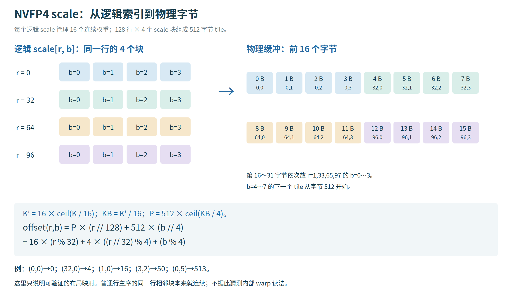
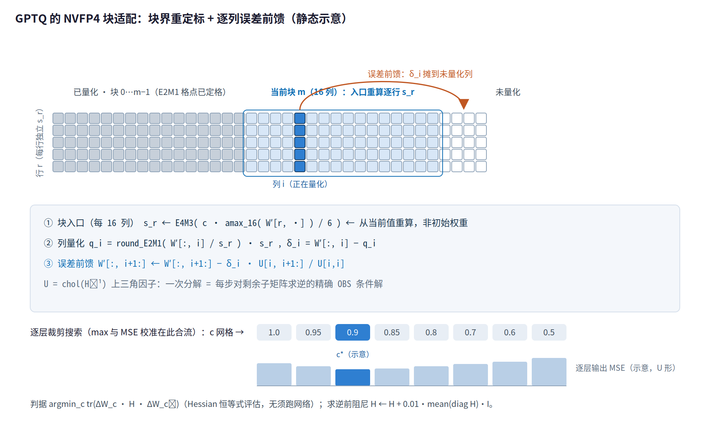
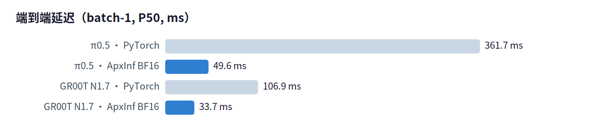
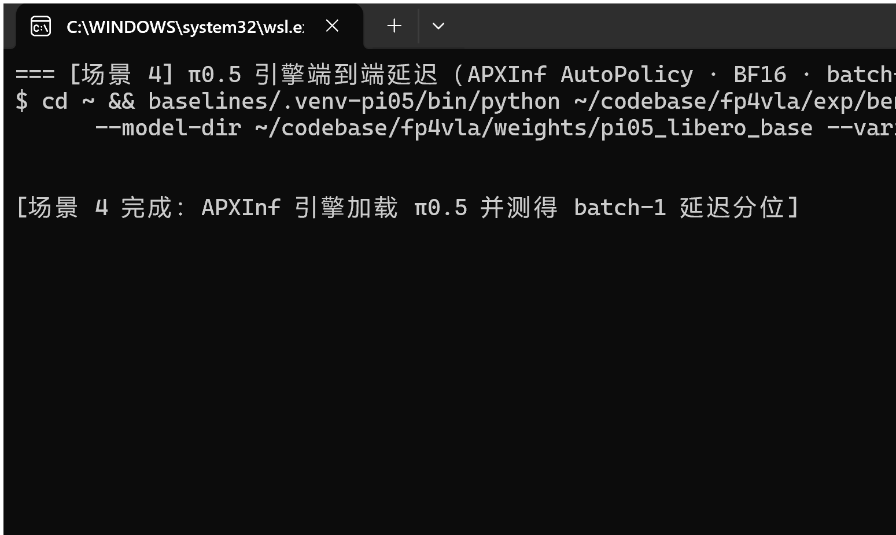
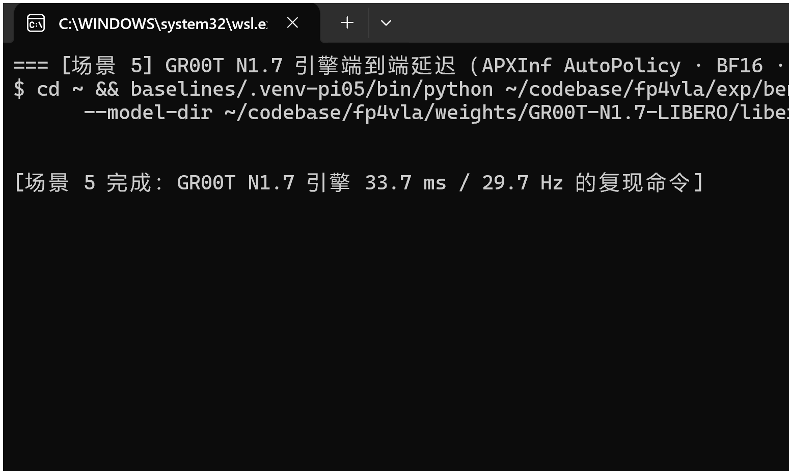
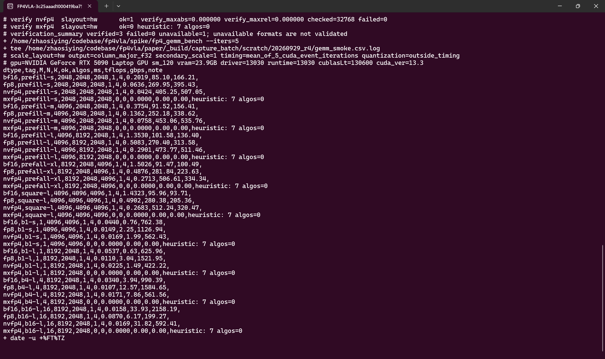
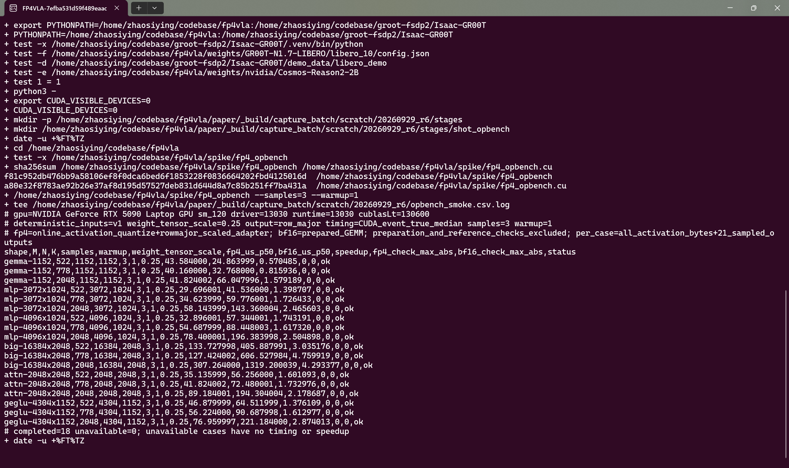
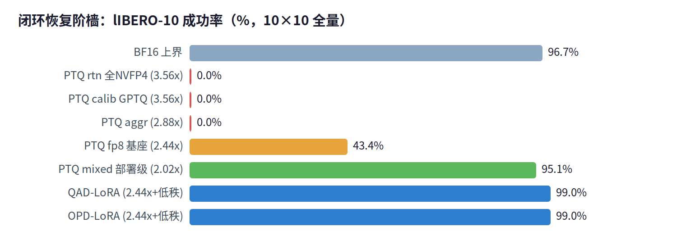

# 摘要

视觉-语言-动作（VLA）模型需要在本体上以 10–50 Hz 闭环运行，但现有部署研究集中在 BF16/FP8。NVIDIA Blackwell 将 NVFP4（E2M1 + 逐 16 元素 E4M3 块缩放）带入消费级 GPU，本文在 RTX 5090 Laptop（sm_120）上系统回答：**VLA 能否在 FP4/FP8 混合精度下运行，闭环成功率损失几何，如何恢复？**

**算子层**：我们通过受控探针实验测定并逐字节验证了 cuBLASLt 的 NVFP4 块缩放物理布局，据此实现了 sm_120 上可用的 block-scaled NVFP4 GEMM，峰值 506 TFLOPS（1.8× FP8）。**引擎层**：在 APXInf 中交付完整 NVFP4 执行路径（四层正确性验证，corr=1.000000），并给出首批 GeForce 上的 VLA 引擎数据（π0.5 = 7.3×、GR00T N1.7 = 3.2× 于各自 PyTorch 基线）。**实证层（核心结果，LIBERO-10 × 10×10 全量闭环）**：全模型 NVFP4 PTQ 无论 max 校准、GPTQ Hessian 舍入还是逐层 MSE 裁剪均闭环归零（0%）——逐层最优的量化误差在闭环中复合成行为崩溃；而复刻 NVIDIA Jetson AI Lab 的混合 FP8/NVFP4 分配（backbone FP8 + 敏感投影保护）在 2.02× 线性参数压缩下达到 **95.1%**（BF16 基线 96.7%）。**恢复层**：在 2.44× 压缩、全量闭环仅 43.4% 的 FP8/NVFP4 基座上，500 步（3.5 分钟）的量化域 LoRA 后训练（量化基座 + BF16 低秩残差的加性形态，SVDQuant 家族）将闭环成功率恢复到 **99.0%**（QAD 演示蒸馏与 OPD teacher-KL 两路同达，均超 BF16 基线）；同预算的 PPO 家族在线对照（成功加权自模仿 RWR）则**零恢复**——构成量化恢复问题上离线蒸馏与在线自模仿的经济学对照。**理论层**：以 DAgger 协变量漂移框架将复合误差定量化（$O(T^2\varepsilon)\to O(T\varepsilon)$），导出并实测了 PTQ→QAD→OPD 恢复阶梯。**工程交付**：1400+ 行可上游引擎补丁、打包产物管线、校准 PTQ 套件（Hessian 采集/GPTQ/AWQ/五配方精度分配）、24GB 单卡 LoRA 恢复训练栈（无 FSDP2、0.43s/步）、全部 checkpoint 与复现脚本。

# 贡献亮点

**1. 在 NVIDIA 混合方案之上把压缩从 2.02× 推进到 2.44×——继续量化了什么？** NVIDIA 的 mixed_nvfp4 配方在动作头一侧留有大量余量：DiT 的注意力投影（to_q/to_k/to_v/to_out）与 adaLN 调制投影保持 FP8，timestep 编码器与动作解码器输出投影保持 FP16。我们把**动作头的全部线性层——包括 NVIDIA 保留的这四类——整体推进到 NVFP4**，backbone（ViT + LLM + lm_head）以 per-channel FP8-E4M3 权重量化承载，线性参数占用从 6.25 GB 压到 2.56 GB（2.44×；NVIDIA 配方复刻为 2.02×）。代价是全量闭环从 95.1% 跌至 43.4%——这恰好构成恢复层的严格测试床：**量化更激进、恢复更难，恢复方法本身的贡献才可分离**。

**2. 从 PTQ-only（NVIDIA 路线）到 PTQ + 量化域恢复（本文）：43.4% → 99.0%。** NVIDIA 止步于 PTQ（其报告 97.5%→97.3%）。我们在 43.4% 的 2.44× 基座上证明，仅 500 步（3.5 分钟）的 LoRA 后训练即可恢复到 **99.0%，反超 BF16 基线（96.7%）**，且 QAD（演示蒸馏）与 OPD（teacher-KL）两路同达。做对了三件事：(a) **恢复训练发生在量化域内**——加性 LoRA 形态（量化基座 + BF16 低秩残差）使训练前向与部署函数严格同一，梯度经低秩路径精确回传、无 STE 近似，且以原生速度运行（0.43 秒/步，是逐前向全矩阵量化合并方案的 170 倍）；(b) **闭环成功率是唯一裁判**——我们实证离线指标与闭环损伤脱钩，所有配置的取舍均以 10×10 全量闭环裁定；(c) **用离线监督信号而非在线自模仿**——同预算的 PPO 家族对照（成功加权自模仿）对基座零改善，说明量化恢复的瓶颈在策略自身分布之外的信息，恰是演示/teacher 所提供的。

**3. 算子与引擎的完整实现（而非黑箱调用）。** 在受控探针实验测定并逐字节验证 cuBLASLt 的 NVFP4 块缩放布局之后，我们在 ApxInf 引擎内实现了 CUDA 适配器（E2M1×E2M1→F16 block-scaled GEMM + 在线激活量化核）、Rust 算子（fp4_linear）、产物加载器（fp4_weights）与混合拓扑执行器（Fp4Blocks），四层正确性验证收敛于 corr=1.000000；完整源码走读见附录 A。

# 1. 引言

机器人策略模型正在从"云端大脑"走向本体推理：GR00T、π0.5、WALL-OSS 等 VLA 模型需要在 10–100W 的边缘设备上以 10–50 Hz 的频率完成"感知→决策→行动"闭环。现有量化研究集中于 LLM（GPTQ/AWQ/SmoothQuant 等 4-bit 权重量化），但 VLA 有两点本质不同：其一，动作头的输出直接驱动闭环控制，量化误差会在数百步的 rollout 中复合，而非体现在 perplexity 上；其二，VLA 推理同时包含自回归 VLM 解码与 flow-matching 多步采样两类截然不同的算子负载。Blackwell 消费级 GPU 的 FP4 tensor core（NVFP4：E2M1 数据 + 每 16 元素 E4M3 块缩放 + 每 tensor FP32 二级缩放）提供了一个此前不存在的部署选项，但没有任何公开工作系统回答过上述三个问题。

本文贡献可归纳为五点：

- **C1（算子与引擎）**：以受控探针实验测定并验证 cuBLASLt NVFP4 块缩放的物理布局；在 APXInf 引擎中交付完整 NVFP4 执行路径并给出首批 GeForce（sm_120）VLA 引擎数据（§3.1、§4.2）。
- **C2（闭环失效定律）**：在两代 VLA（π0.5/GR00T N1.7）、两条实现路径（引擎真 kernel / PyTorch 量化语义）上证明全模型 NVFP4 PTQ 闭环一致归零，且 GPTQ/MSE 校准无法挽回——量化误差的模块分布比总量更决定闭环行为（§4.3、§4.3）。
- **C3（模块敏感度地图与混合精度配方）**：五种配方的 PTQ 消融给出模块级 NVFP4 敏感度排序（致死：视觉塔、DiT 注意力投影、LLM o/down_proj；幸存：LLM 主投影与全部 FFN），复刻 NVIDIA 分配的混合 FP8/NVFP4 方案在 2.02× 压缩下闭环 95.1%（§4.3）。
- **C4（量化域 LoRA 恢复）**：提出量化基座 + BF16 低秩残差的加性 LoRA 形态（训练与部署严格同一函数，无 STE 近似），从 43.4% 的 2.44× 压缩基座以 3.5 分钟训练恢复到 99.0%；同预算在线自模仿（RWR）零恢复，给出离线/在线信号的经济性对照（§4.4）。
- **C5（方法论）**：证明离线指标（逐层 MSE、单点向量场相关性）与闭环损伤脱钩——闭环成功率是 VLA 量化的唯一裁判；配套全链可复现产物（§4.5、附录 A）。

本文结构：§2 背景与相关工作（VLA 解剖、NVFP4 格式、LLM 量化谱系、VLA 量化先行工作、从蒸馏到在线自模仿的理论脉络）；§3 方法（执行层、校准 PTQ、复合误差理论、量化域恢复、闭环评测方法论）；§4 实验（按因果链组织的全部实证：执行层特性 → 全量失效解剖 → 混合精度与敏感度 → 三路恢复 → 方法论消融）；§5 讨论与结论；附录 A 结合核心源码走读全部实现并解析 APXInf 框架。

# 2. 背景与相关工作

本章给出理解后续章节所需的全部背景：被量化对象的解剖（§2.1）、数值格式（§2.2）、LLM 训练后量化的方法谱系（§2.3）、VLA 量化的先行工作（§2.4），以及恢复训练所处的学习理论脉络——从 DAgger 式蒸馏到在线自模仿（§2.5）。第 4 章的每一个实验设计都能在本章找到动机。

## 2.1 VLA 模型解剖与部署压力

本文的实验对象是 GR00T N1.7（LIBERO 微调版），其 backbone 为 Qwen3-VL：语言侧 12 层、隐藏维 2048，注意力为分组查询式 GQA（16 个查询头共享 8 组键值头，头维 128——KV cache 的显存与带宽因此只有全多头注意力的一半）；视觉侧 24 层、隐藏维 1022 的 SigLIP 型视觉塔（qkv 融合投影 [3072,1024]），输出经 merger 与三层 deepstack 合并器投影到语言维；动作侧为 16 层 DiT（隐藏维 1536，交叉注意力从 backbone 取上下文）。动作生成采用 flow-matching：把"从高斯噪声到动作块"的生成过程建模为一个速度场（向量场），训练目标是回归这个速度场，推理时从噪声出发多步积分去噪、一次产出 64 步动作块，闭环执行中每 8 步重新生成一次。全模型 3.36B 参数中线性层占 3.13B（6.25GB BF16），是显存压缩的唯一有效靶点。对照模型 π0.5（PaliGemma/Gemma backbone）用于跨模型验证。两类模型的推理都混合了自回归 VLM 解码与多步去噪两类算子负载，且动作输出直接驱动闭环控制——这是 VLA 量化与 LLM 量化的本质区别：误差不在 perplexity 里显形，而在数百步 rollout 中复合（§3.3 给出定量分析）。

## 2.2 NVFP4 数值格式

NVFP4 由三层结构组成：4-bit E2M1 数据格（值域 {0, ±0.5, ±1, ±1.5, ±2, ±3, ±4, ±6}，相对格长在 1/4 到 1/2 之间）、每 16 个连续元素的 E4M3 块缩放、以及每张量一个 FP32 二级缩放（实践中取 $\mathrm{tscale}=\max(\mathrm{amax})/448$，用于把块缩放装进 E4M3 的表示域）。反量化值为 q·s_block·（隐含 tscale 已并入 s_block）。这个双重量化结构是后面多个结论的技术根源：其一，per-16 块缩放使**逐模块的权重量化误差几乎与分布无关**——我们在双模型 1036 个张量上实测相对 Frobenius 误差（衡量"平均每个权重被抹掉百分之几"的标准度量，定义见 §4.3 的排除性实验）全部落在 0.095±0.001，因此任何模块间的闭环敏感性差异都来自拓扑与误差复合，而非"某些权重更难量化"；其二，块缩放已经在 16 元素粒度上吸收了通道间异常值，这使得 AWQ 式逐通道缩放（AWQ 于 §2.3 介绍）在 weight-only 场景下失去作用对象（§4.5 的 α=0 负结果）。fake-quant 模拟（训练与评测中注入等价噪声）与真实 kernel 的语义对齐由逐位一致的参考实现保证（附录 A.3.2）。对照格式 FP8-E4M3（per-channel 权重缩放）作为混合精度的另一档；MXFP4（VEC32_UE8M0）在 sm_120 的 cuBLASLt 中不被支持（heuristic 返回零算法），构成本文格式选择的硬约束。

## 2.3 LLM 训练后量化：方法谱系

训练后量化（PTQ）不改动训练流程，用少量校准数据确定缩放因子等量化参数（Nagel et al., 2021 综述；Wu et al., 2020；Vanhoucke et al., 2011）。方法按其所利用的结构信息分三层递进。

**校准目标**：最简单的最大值校准把校准数据的最大绝对值映射到格式满量程；MSE 校准（Jacob et al., 2018）与 KL 校准（Migacz, 2017）转而最小化输出误差或分布距离；学习裁剪阈值（Choi et al., 2018）把"保最大值还是保典型值"变成每层一个小规模搜索——本文的逐层 clip 网格即属此类。

**逐层结构性优化**：GPTQ（Frantar et al., 2023）用校准激活的 Hessian 近似 $H=\sum_i x_i x_i^\top$ 做 Optimal Brain Surgeon 式的逐列舍入与误差反馈；ZeroQuant（Yao et al., 2022）更早把逐层重建用于 INT8/INT4；AdaRound（Nagel et al., 2020）学习舍入方向；BRECQ（Li et al., 2021）以块为单位重建。AWQ（Lin et al., 2023）观察到少数激活幅度大的通道承载不成比例的信息，给这些通道乘缩放并把缩放精确折叠进前置归一化增益或前层权重列；OmniQuant（Shao et al., 2024a）以梯度下降优化量化参数本身。

**变换与低秩**：SmoothQuant（Xiao et al., 2023）把量化难度在激活与权重间再平衡（面向激活量化）；QuaRot（Ashkboos et al., 2024）、QuIP#（Tseng et al., 2024）、SpinQuant（Liu et al., 2024b）、FlatQuant（Sun et al., 2024）用 Hadamard 类正交旋转摊平分布，代价是推理图须配合在线变换或离线折叠；SVDQuant（Li et al., 2024）与 EoRA（Liu et al., 2025b）用低秩 BF16 分支吸收异常值/补偿损失——本文恢复层的加性 LoRA 形态与这一族在"量化基座 + 全精度低秩修正"的结构上同源（§3.4）。

## 2.4 VLA 量化的先行工作与本文位置

针对 GR00T N1.7 的公开近无损结果有两条路线。NVIDIA Jetson AI Lab 的 mixed_nvfp4 配方（ModelOpt + TensorRT）：ViT 线性层 FP8，LLM 的 q/k/v/gate/up 投影 NVFP4，LLM 的 o_proj 与 down_proj 回退 FP8，DiT 的 FFN 用 NVFP4 而其余线性层（注意力投影、adaLN 调制）FP8，timestep 编码器与动作解码器保持 FP16；在 LIBERO Spatial 上 200 episodes × 3 轮报告 97.5%→97.3%。FoldQuantVLA（2026，INT4/INT8）：以"一致折叠"（Wx = (WSRᵀ)(RS⁻¹x)，通道缩放 S + 分块 Hadamard 旋转 R + 变换后坐标里的 GPTQ + 按 token 动态激活量化，敏感投影 W8A8）在 LIBERO 四套件上报告 95.75%→95.625%。两者共同点是：**都止步于 PTQ**，且都在动作头一侧保留了可观的 FP8/FP16 余量。本文的位置由此确定：复刻并验证 mixed 分配（95.1%，§4.3），然后把 NVIDIA 保留的动作头四类投影整体推进到 NVFP4（2.44×），再用量化域恢复把随之而来的 43.4% 拉回 99.0%（§4.4）——压缩、敏感性与恢复三个变量第一次被分离测量。

## 2.5 恢复训练的学习理论脉络：从蒸馏到在线自模仿

量化后的策略恢复本质上是"带约束的策略改进"。三条技术路线在本文中同台对比，其理论谱系如下。

**策略蒸馏与协变量漂移**。先定义三个贯穿全文的对象。**行为克隆（BC）**是模仿学习的最简形式：把专家演示拆成（状态，动作）样本对做监督学习，让策略在演示出现过的每个状态上输出对应的演示动作；演示状态所服从的分布记为 $d_{\text{demo}}$，策略在这个分布上的平均单步动作误差记为 $\varepsilon$——这是 BC 唯一能直接优化的量。**视界 T** 是一个 episode 的决策步数（本文 LIBERO 协议下至多 720 步、每 8 步决策一次，约 90 次决策）。**闭环损失**指整个 episode 跑完后的任务失败程度，而非任何单步误差。BC 的痼疾由 Ross & Bagnell（2011）定理化：单步误差 ε 的策略，闭环损失是 $O(T^2\varepsilon)$，而不是直觉的 $O(T\varepsilon)$。直觉漏算的是误差的**后效**：第 t 步的动作错误把状态推离演示分布，第 t+1 步面对的就是演示里从未出现、没有标签的状态——在那里策略的误差不再受 ε 约束；一步造成的状态偏差随步数线性增长（$t$ 步后约为 $t\cdot\varepsilon$），而每步的损失又与当时的状态偏差成正比，对 $T$ 步求和得到 $\tfrac{T^2}{2}\varepsilon$ 量级。**误差不是简单相加，而是先累积再逐步放大**；视界越长，惩罚按平方加重——这正是数百步长程操作任务对量化格外脆弱的理论根源。DAgger（Ross et al., 2011）的修复对症：让策略自己跑，在它**实际到达**的状态上请专家补标签再训练——学生走到哪里、标签跟到哪里，"没有标签的状态"从此不存在，闭环损失降为线性 $O(T\varepsilon)$。广义知识蒸馏（GKD，Agarwal et al., 2023）进一步把"蒸馏该在哪个分布上做"一般化，是同一视角的推广。

**量化场景下的两项误差：噪声项与漂移项**。量化策略的闭环损失拆成两个来源，全文统一使用这对术语。**噪声项**：量化格式本身造成的单步动作误差（§3.3 记 $\varepsilon_{\text{floor}}$），由格式与精度分配决定——权重层面实测约 9.5% 的相对误差是其源头（§4.3 剖面）；恢复训练可以把它在训练分布上压向地板，但压不穿格式地板。**漂移项**：策略偏离训练分布后、在"没有监督信号的状态"上遭遇的附加误差（§3.3 记 $\varepsilon_{\text{shift}}$）——它不是量化直接造成的，而是"训练分布 ≠ 部署时实际访问的分布"这一结构性错位的产物；BC 式训练对它无能为力，因为演示数据里根本没有那些状态的标签。两条恢复路线恰好在两项上分工：QAD（量化感知蒸馏）在演示分布 d_demo 上把量化学生推向量化网格上对演示动作的最优解——它压的是噪声项，但训练分布仍是 d_demo，漂移项原封不动；OPD（在线策略蒸馏）在学生自己的 rollout 分布上用 BF16 教师的标签纠偏——标签跟着学生的状态走，恰是 DAgger 的操作，是唯一能把漂移项也修掉的信号。§3.3 将这套语言形式化（$O(T^2\varepsilon)$ 的完整推导与损失的三项分解），§4.4 的三路对照逐项兑现。

**强化学习与策略梯度**。REINFORCE（Williams, 1992）以 $\nabla J(\theta)=\mathbb{E}\bigl[R\cdot\nabla\log\pi_\theta(a\mid s)\bigr]$ 直接在环境回报上优化——含义直白：采样一条轨迹，回报高的动作按其对数概率的梯度上调出现概率，回报低的下调；PPO（Schulman et al., 2017）以裁剪代理目标与优势估计成为当前默认（优势 = 该动作的回报超出当前策略平均水平多少，用它代替原始回报可大幅降方差）。对扩散/流策略，DPPO（Ren et al., 2024）把去噪 ELBO（流/扩散模型的标准训练下界，充当对数似然的代理）代入策略梯度，使其可微穿过多步去噪。

**在线自模仿：RWR 与 SIL**。奖励加权回归（RWR；Peters & Schaal, 2007；Kober & Peters, 2009 综述）把策略改进写成加权最大似然：$\pi_{k+1}\propto\pi_k\cdot\exp(R/\beta)$（$\beta$ 为温度，控制对高回报的贪心程度），其解是"以回报为权的轨迹加权 BC"，免除了显式值函数。自模仿学习（SIL；Oh et al., 2018）指出确定型策略的每次成功轨迹都携带"好于当前期望"的信息，其损失 $\ell_{\mathrm{SIL}}=\mathbb{E}\bigl[\max(A,0)\cdot(-\log\pi)\bigr]$ 在优势为正时退化为对**自身成功轨迹**的模仿；SIL 的理论分析同时给出其边界——自模仿只能放大行为策略支撑集内已被访问的行为，无法恢复从未到达的状态-动作区域。这一族思想在离线侧的延续包括优势加权回归 AWR（Peng et al., 2019）、AWAC（Nair et al., 2020）与回报条件建模（Decision Transformer，Chen et al., 2021）。

**0/1 终端奖励下的退化形式（本文的 RWR 对照组）**。LIBERO 的回报是 episode 末的二值成功信号，REINFORCE 的梯度变为 $\nabla J=\mathbb{E}_{\text{成功轨迹}}[\nabla\log\pi]$——即只对成功 episode 做加权克隆，权重恰为任务成功率。当逐步优势不可得（无值网络）而以任务级成功率加权时，RWR 就是"在自己 43.4% 的成功轨迹上做 BC"。把它与 §3.3 并置即得本文的核心对照预言：量化损伤把策略推离教师分布（协变量漂移），自模仿只能在**策略自身支撑集内**重新加权，无法提供修复漂移所需的分布外信息；而 OPD 的教师标签恰恰作用在学生自己的（漂移后的）状态上。§4.4 的实验逐字兑现了这个预言——RWR 训练损失正常下降而闭环成功率与基座逐任务相同。我们把 RWR 如实标注为 PPO 家族的预算下界形态（无 GAE、无裁剪、无价值网络），DPPO 式完整实现留作扩展。

# 3. 方法

§3.1 建成 NVFP4 在 sm_120 上的执行层，§3.2 解决校准与精度分配，§3.3 解释量化误差为何在闭环中放大，§3.4 给出三种恢复方法，§3.5 确立以闭环为唯一裁判的评测方法论；源码级细节在附录 A。

## 3.1 sm_120 上的 NVFP4 执行层

**缩放布局的探针测定**。cuBLASLt 的 block-scaled 接口要求块缩放字节按一个未公开的物理公式排布。我们以三层递进的受控实验测定它（完整过程见 §A.2.1 的方法自述与仓库探针实验目录 spike/）：第一层用"平缩放"张量（所有块缩放相同）跑 GEMM 并二分替换 scale 缓冲的字节，定位"哪些字节位置真正被消费"；第二层用单字节非零探针（每次只置一个偏移为可分辨值）扫描出逻辑块 (row r, block b) 与物理偏移的映射；第三层以全随机数据在不同 K/行数下验证公式的普适性。最终得到 $\mathrm{off}(r,b)=\mathrm{PS}\cdot\lfloor r/128\rfloor+512\cdot\lfloor b/4\rfloor+16\,(r\bmod 32)+4\,(\lfloor r/32\rfloor\bmod 4)+(b\bmod 4)$，$\mathrm{PS}=512\cdot\lceil\mathrm{KB}/4\rceil$——128 行为一个 panel、行内按 32 行四簇交错、块按 4 交错。

**为什么必须是这个布局**。它不是任意约定，而是内存系统友好的重排：逻辑上行主序的 scale 矩阵被组织成以"32 行簇 × 4 块组"为单位的 512 字节连续区间——某一行的 4 个块缩放在物理上紧挨着（4 字节），GEMM kernel 的每个线程用一次 16 字节向量读取即可取到该行 4 个块共 64 个权重元素的缩放；一个 warp 的 32 行恰好消费一段连续的 512 字节，访存完全合并。若按行主序直接存放，同一行相邻 4 块的缩放会相距 KB 字节，每次向量读取都跨缓存行。下图给出逻辑视图到物理缓冲的静态映射、公式与实例计算（同色为同一逻辑单元）：



这套"平探针定位消费字节 → 单字节扫描建映射 → 随机数据验公式"的三层流程对任何黑箱布局问题可复用。

**引擎集成**。在测得布局后，NVFP4 GEMM 以 CUDA 适配器形式接入 APXInf（extern "C" 的 cuBLASLt 封装 + 在线激活量化核，CUDA 13 列主序适配；E2M1×E2M1→F16，scale 模式 VEC16_UE4M3），其上是 Rust 算子 fp4_linear、产物加载器（离线量化产物只上传不重量化）与组合式混合拓扑执行器 Fp4Blocks——每个线性层经 gemm_maybe_fp4 路由：有权重产物则"激活在线量化 + 块缩放 GEMM"，无则 BF16 直通，混合精度部署因此零代码改动（§A.2）。量化核手写位级 E4M3/E2M1 编码器而非调用硬件内建转换，以保证与离线参考逐位一致——四层验证（算子 corr=1.000000、逐块 scale 语义、产物级、kernel 级）收敛后才进入闭环实验。该验证的算子层实跑记录见下图（最大化 WSL 终端内运行 spike/fp4_gemm_bench --verify，对 CPU fp64 参考逐元素核对）：nvfp4 的 verify_maxrel = 0.000000——GPU kernel 与参考实现在该测试形状下位级一致；同屏可见 mxfp4 的 ok=0、algos=0（heuristic 返回零算法），即 §2.2 所述格式硬约束的直接证据。


**算子特性与混合准则**。计算受限形状下 NVFP4 达 506 TFLOPS（1.8× FP8、5.5× BF16）；但 batch-1 访存受限形状下 FP4 反而慢于 FP8（428 vs 1253 GB/s）——小投影进 FP4 无收益。这一非对称性与 §3.2 的精度分配共同决定"哪些层值得 4-bit"。

## 3.2 校准 PTQ：Hessian、GPTQ 块适配与混合分配

**校准在量化里做什么**。NVFP4 的权重格式是一把很粗的尺子：数值只有 16 个格点（E2M1），靠每 16 个连续权重共享一个 E4M3 块缩放来对准量纲。量化一个张量时，真正的自由度是这把尺子怎么摆：块缩放取得太大，小数值全挤进同一个格点（分辨率浪费在用不到的大量程上）；取得太小，大数值被削顶失真。**校准**就是替每个块选好这个缩放。最简单的 max 校准用块内最大绝对值定标，保证不削顶——这是 RTN（round-to-nearest，训练后直接取最近格点）的默认做法；更好的做法是承认个别离群值不值得保：把定标收缩一个系数 c（等效于先裁剪再定标），牺牲离群权重换其余权重的格点分辨率。而 c 怎么选，需要一个"量化得好不好"的度量——这就引出 Hessian。

**Hessian：不跑网络就能算出任意权重扰动的输出伤害**。量化方案的好坏不能只看权重本身变了多少——同一个 ΔW，作用在输入激活很大的层上，输出伤害就大；作用在输入近乎为零的通道上，几乎无感。我们需要的是一张"权重误差 → 输出误差"的换算表。对线性层 y = xWᵀ，在一批真实输入 x₁…xₙ 下，任意权重扰动 ΔW 造成的输出平方误差恰有恒等式 $\sum_i\lVert x_i\Delta W^\top\rVert^2=\operatorname{tr}(\Delta W H \Delta W^\top)$，其中 $H=\sum_i x_i x_i^\top$ 就是输入的二阶统计（Hessian）。于是"试一种量化方案、看它伤害多大"不再需要把网络跑一遍：只要在真实数据上把每层的 H 一次性采集下来，此后任何 ΔW 的输出伤害都是一次矩阵乘的事，秒级完成，也无须保存任何激活。采集本身有三个决定正确性的细节（代码走读见 §A.3.1）。**其一，运行式累加**：每层在 GPU 上持一个缓冲，模型每前向一批，钩子就把该批输入的外积直接加进去（$H\leftarrow H+x^\top x$）——我们在 libero_demo 上跑 BF16 原模型 16 批 × 8 窗口，钩子挂在 189 个 backbone 线性层（动作头不参与校准；只收输入维为 16 倍数的层，NVFP4 块边界所迫）的前向输入口，跑完每层留下一个 K×K 矩阵、共 5.49GB，原始激活一个都不存。**其二，精度链全程 fp32**：模型前向仍是 BF16，但钩子拿到输入后先升精度到 fp32 再做外积与累加——每层全程约 4.3 万行的求和若落在 BF16 的 8 位尾数里，H 的旁对角元会被舍入噪声淹没。**其三，不归一化的求和**：$H$ 严格保持 $\sum_i x_i x_i^\top$ 的形式、不除以样本数——上面的恒等式要求 H 恰为未归一化的二阶矩和；若取平均，恒等式差一个 $1/n$ 因子，逐层 MSE 的绝对值全错（GPTQ 的 H⁻¹ 方向虽不受标量因子影响——它在求逆中消掉——但裁剪搜索要比较的正是 MSE 绝对值）。钩子挂在前向输入口（pre-hook）保证拿到的是线性层的输入本身——对 q/k/v 投影就是各层归一化之后的张量，而非残差分支的混合；逐通道绝对均值也在同一钩子里顺手记录（AWQ 的通道显著度要用，§A.3.4）。后面所有逐层搜索（裁剪系数、GPTQ 误差反馈）都建立在这块基础设施上。

**GPTQ 的直觉与 NVFP4 块适配**。逐列独立量化的毛病是：每一列量化产生的误差被直接丢弃，误差在上千列上各自为政地累积。GPTQ（Frantar et al., 2023；谱系见 §2.3）把逐层目标写成 $\min_{\Delta W}\operatorname{tr}(\Delta W H \Delta W^\top)$——H 就是上一段的校准 Hessian——然后按列贪心求解：量化第 $i$ 列得 $q_i$、留下残差 $\delta_i=\tilde w_i-q_i$，OBS（最优脑外科）分析给出这笔误差的最优摊销——把尚未量化的列整体平移 $\tilde W[:,\,i{+}1:]\leftarrow\tilde W[:,\,i{+}1:]-\delta_i\cdot U[i,\,i{+}1:]/U_{ii}$。这里 U 不是随便一个矩阵：逐步看，每一步的最优补偿都应来自"剩余列子问题"的精确条件解（对剩余列的 Hessian 子矩阵求逆、取首行归一化），逐列重新求逆是 $O(K^4)$ 的；GPTQ 的数值技巧是对 $H$ 先加阻尼（$H\leftarrow H+0.01\cdot\operatorname{mean}(\operatorname{diag}H)\cdot I$，对付有限样本 Hessian 的病态）再求逆、取**上三角 Cholesky 因子 U**，第 $i$ 步的精确系数恰为 $U[i,\,i{+}1:]/U[i,i]$——一次分解在精确算术下等价于 K 次子矩阵求逆（推导与验证见 §A.3.2）。**NVFP4 在这里引入了新问题：量化格本身在动**。经典 GPTQ 假设整层量化格固定（int4 一层一个 scale），第 i 列用什么格与处理过程无关；NVFP4 的块缩放每 16 列换一个、且由块内权重的**当前值**决定——而误差反馈从进入这一块起就在改写这些值。若沿用"初始权重定标、全程不变"，被反馈修改过的后段权重会漂出该缩放覆盖的幅值域，量化格与真实值错配。适配方案是把定标时机**推迟到块入口**：每进入一个新的 16 列块，先从当前（已被此前误差反馈修改过的）权重重算逐行块缩放 $s_r\leftarrow\mathrm{E4M3}\bigl(c\cdot\mathrm{amax}_{16}(\tilde W[r,\cdot])/6\bigr)$ 并固定之，块内 16 列逐一"量化—前馈"，块间如此推进（下图；实现细节见 §A.3.2）。每层外层再套裁剪系数 $c\in[0.5,1]$ 的网格搜索，判据是 Hessian 加权输出 MSE $\arg\min_c\operatorname{tr}(\Delta W_c H \Delta W_c^\top)$——max 校准（c=1）与 MSE 校准（c<1）在这一个搜索里合流。



**精度分配即策略**。校准回答的是"给定放法之后误差有多小"，更上游的问题是"误差放在哪里"。五种配方就是五个"模块名 → 精度"的纯函数（代码见 §A.3.3）：rtn（全部 NVFP4、max 校准）与 calib（全部 NVFP4 + GPTQ/逐层裁剪）检验纯校准的天花板；mixed 复刻 NVIDIA 的官方分配；aggr 只保护 o_proj/down_proj 两类投影；恢复基座 = backbone per-channel FP8 + 动作头全部线性层 NVFP4。§4.4 将给出压倒性的证据：calib 把逐层输出 MSE 压到 rtn 的 76%，闭环仍 0%；mixed 不动校准、只动分配即 95.1%——**误差的放置位置比误差总量更决定闭环成败**。落盘由量化写盘脚本完成（bake.py，走读见 §A.3.3）：按分配表把每个受量化线性层的权重量化，把量化取值按原键、原形状写回 safetensors——张量仍是普通 BF16，只是数值已落在量化格点上，不新增任何键或结构，现有评测栈零改动；真实显存收益发生在部署格式账目上——NVFP4 每参数 0.5625 字节（4 bit 权重 + 每 16 个权重共享的 8 bit 块缩放），FP8 约 1 字节 + 行缩放——压缩比随 checkpoint 一并落盘备查。

## 3.3 量化误差的闭环复合：协变量漂移分析

本节是 PTQ 失效与恢复训练之间的理论铰链，回答两个衔接问题。**向回看——解释 PTQ 的闭环失效**：§4.3 将实测一组表面矛盾的事实——权重层面的量化误差均匀地小（约 9.5%），逐层输出 MSE 也能被 GPTQ 压到 RTN 的 76%，闭环成功率却是 0%。本节给出"单步小误差如何被闭环平方级放大成行为死亡"的定量机制，并导出"误差放在哪些模块"的判据——§4.3 的五配方分配消融正是按这个判据收敛到 mixed 配方的。**向前看——规定恢复训练该用什么信号**：本节把闭环损失分解为噪声项（量化格式造成，训练可压向地板但压不穿）与漂移项（分布错位造成，演示分布上的训练不可触碰），据此对三种恢复配方给出可检验的预言——QAD 在演示分布上训练、只压噪声项，预言其救不了全量 0%；OPD 的教师标签跟着学生实际到访的状态走、能修漂移项，预言恢复到乃至超过 BF16；RWR 只在自身支撑集内重新加权、两项都修不了，预言零恢复。§4.4 的三路对照将逐条兑现这些预言。

**（1）先建立一个直觉：开环 vs 闭环，为什么差别是致命的。** 想象两个人学开车。A 只看教练的完美驾驶录像（每帧画面配一个正确方向盘角度），然后闭着眼按记忆开——只要某一步方向盘偏了一度，车就偏离录像里的轨迹；从偏离的位置看出去，画面是录像里**从未出现过**的，A 对这些画面没有任何正确答案的记忆，只能继续凭偏掉的感觉开——越偏越错、越错越偏。B 同样看录像，但每次自己偏掉时教练坐在旁边**在他当前实际所处的画面上**告诉他正确动作——偏移被持续拉回。机器人闭环任务正是 A/B 的场景：LIBERO 一个 episode 至多 720 步、每 8 步做一次决策（约 90 次连续决策），状态 = 摄像头画面 + 机械臂位姿；BF16 教师是"教练"，量化后的策略是"学员"。**开环指标**（离线对比单步动作）只考察"在教师的轨迹上学员答得多对"；**闭环评测**让学员自己开车——两者可以天差地别，这正是 §4.5 实测的"离线指标与闭环损伤解耦"的结构性原因。

**（2）形式化：协变量漂移与 $O(T^2\varepsilon)$ 的逐步推导。** 记教师策略 $\pi^*$，学生策略 $\pi_q$（量化后），两者的单步动作误差在**教师访问的状态分布** $d^*$ 上为 $\varepsilon_a=\mathbb{E}_{s\sim d^*}\bigl[\lVert\pi_q(s)-\pi^*(s)\rVert\bigr]$。关键角色是"状态分布随策略改变"这件事本身：记 $d_q$ 为**学生自己开车时实际访问的状态分布**，学员偏掉之后所处的画面（分布 $d_q$ 里、分布 $d^*$ 外的部分）恰恰是它没有学过的——在这部分状态上它的误差不再是 $\varepsilon_a$，而是大得多的、无界的误差。Ross & Bagnell (2011) 把这件事折算成一个可以背下来的简单推导：设第 $t$ 步的状态偏差为 $e_t$，单步动作偏差 $c\,\varepsilon_a$ 使状态偏差近似累加 $e_{t+1}\approx e_t+c\,\varepsilon_a$（偏掉的状态上误差更糟，取最坏一致上界仍如此），于是第 $t$ 步的状态偏差线性增长 $e_t\approx t\cdot c\,\varepsilon_a$；整个 episode 的总伤害是每步伤害之和，$\sum_{t=1}^{T}e_t\approx\tfrac{T^2}{2}\,c\,\varepsilon_a$——**误差不是相加，是平方级复合**：早期的小偏差会成为后续所有步骤的"污染输入"。这就是行为克隆（BC）的经典结论：在固定演示分布上把单步误差压到 $\varepsilon$，闭环损失仍是 $O(T^2\cdot\varepsilon)$。把本文的数字代入感受一下量级：若量化使单步动作相对偏差为 3%，则在数百步的复合后末端轨迹偏差可达原误差的数百倍量级——机械臂"每一步都只差一点点"却永远对不准杯子，正是 §4.3 里失败 episode 跑满 720 步的形态。

**（3）DAgger 的修复：在学生自己的状态上要专家标签，$O(T\varepsilon)$。** 上面推导里唯一的假设是"偏掉的状态上没有监督"。DAgger（Ross et al., 2011）的修复直击此处：让学员自己开，**在每个实际访问到的状态上向教练要一个正确动作标签**再训练。此时推导里"分布外误差无界"一项消失，残差只剩学生在自身分布上的回归误差 $\varepsilon_a'$，总伤害降为 $\sum_t\varepsilon_a'=O(T\cdot\varepsilon_a')$——从平方降为线性。注意它并不要求学员变聪明，只要求**监督信号出现在学员实际所在的地方**。这一条正是后文 OPD 与 QAD 的本质区别。

**（4）映射到量化恢复：三种配方的分工与成功率分解。** 把上一节的推导对应到本文的实验设定：教师 = BF16 策略，学生 = 量化策略加可训练补偿。三条恢复路线恰好对应推导里的三个角色：**QAD**（量化感知蒸馏）在固定演示分布 $d_{\text{demo}}$ 上训练——它把 $\varepsilon_a$ 压小，但推导的结构没变（监督仍不在学员偏掉后的状态上），闭环损失仍是 $O(T^2\cdot\varepsilon_a)$，只是常数变小——这解释了 §4.3 中 naive QAT 训练损失 1.29→0.33 健康下降而闭环仍 0%：它优化的是平方项里的 $\varepsilon_a$，救不了平方结构本身。**OPD**（在线策略蒸馏）在学生自己的 rollout 分布上用教师标签训练——恰是 DAgger 的操作，把平方降为线性；理论上它还能顺带修正教师自身可改进的部分。**直接环境奖励**（PPO 族）则绕过模仿、直接优化闭环回报。据此，闭环成功率损失可分解为三项：$\varepsilon_{\text{floor}}$（量化噪声地板，由格式与分配决定——§4.3 的误差剖面测得 NVFP4 权重层面均匀 9.5%）、$\varepsilon_{\text{shift}}$（分布漂移项，QAD 不可修、OPD 可修）、$\varepsilon_{\text{opt}}$（策略相对最优的次优项，RL 理论上可越教师）。第 4 章的实验逐项对应：分配实验调 $\varepsilon_{\text{floor}}$（mixed 95.1%），OPD 修 $\varepsilon_{\text{shift}}$（99.0%），RWR 的零恢复则是"自模仿给不出分布外标签"的定理级演示。

**（5）单步误差从哪里来：量化噪声到动作偏差。** 最后补上链条的起点。权重层面的量化误差是均匀的——1036 个张量的相对误差都在 9.5% 上下（§4.3 的剖面表），但动作层面的伤害不止于此：一阶近似下，单步动作偏差至多是"网络对权重扰动的最大放大倍数"（即雅可比谱范数）乘以权重误差 $\varepsilon_W$。而且 GR00T 的动作不是一次算出的，是把去噪 ODE 一步一步积分出来的——每积分一步，向量场都带一点量化偏差，K 步累加，轨迹偏差至多按步数线性放大（Gronwall 不等式的含义：若每步增量有界，积分总误差随步数累积）；去噪步数越少、量化伤害越小，一步生成与量化存在正向耦合。再把 §4.3 的模块差异翻译进 $e_t$ 的递推语言：backbone 输出经 KV cache 与跨注意力在**决策步之间复用**，其误差进入 $e_t$ 的递推——每一步的污染都成为后续所有步的输入；FFN 误差逐 token 作用后即丢弃，不进入递推。同样 9.5% 的权重误差，进入递推与否，决定了它是 $T^2$ 项的系数还是可忽略的常数项。这同时给出混合分配的理论判据：**保护"误差会跨步复用"的模块，放开"误差即用即弃"的模块**——与 §4.3 五配方消融收敛出的敏感度地图逐条吻合。

## 3.4 量化域恢复：加性 LoRA 的 QAD、OPD 与在线自模仿对照

**加性 LoRA 形态**。恢复训练的第一个决定是让"量化"离开训练循环：量化值在写盘阶段一次性定格、此后不再参与梯度计算。每个受恢复的线性层计算 $y=x\,W_{\text{baked}}^{\top}+(x\,A^{\top}B^{\top})\cdot(\alpha/r)$：基座权重 $W_{\text{baked}}$ 是量化写盘时定格的量化值（冻结、永不再量化），低秩残差是 BF16 全精度分支。三个由此而来的性质：(i) 梯度经低秩路径**精确**回传，无 STE 近似——量化基座不需要梯度；(ii) **训练前向与部署函数严格同一**——部署合并只是把加法算一次（$W_{\text{baked}}+BA\cdot\alpha/r$，BF16 加法，不重量化），闭环评测与训练所见函数一致；(iii) **原生速度**——0.43 秒/步，逐前向把 W+BA 整体量化的朴素写法为 75 秒/步（170×），在 24GB 单卡上把 500 步训练从 10 小时量级拉回 3.5 分钟。该形态与 SVDQuant/EoRA 的"量化主体 + 全精度低秩修正"结构同源（§2.3），但以 LoRA 训练动态实现。

**三条恢复路线**。QAD：演示分布上的 flow-matching 损失（量化域内的监督微调）——BC 型信号，按 §3.3 的分解只压噪声项。OPD 在同预算的 QAD 之上外加教师锚定的 teacher-KL 项，它的实现——探针缓存——是本文的核心机制之一，值得完整展开。

**OPD 与探针缓存**。OPD 的语义目标，是给量化学生一个显式的"向 BF16 教师收敛"信号——即 §3.3 预言中能够修复漂移项的教师来源。朴素实现要在每一步训练里对同一批输入同时前向教师与学生（同批双前向）：教师是第二个 3.36B 参数的模型，逐步双前向使每步开销近乎翻倍；更糟的是，这个写法在我们的 WSL 环境里确定性崩溃（反复复现、非偶发）——训练循环里同时挂着 BF16 教师与量化学生两张计算图，恰好落在 WSL CUDA 栈最不稳的路径上。探针缓存的设计把教师从训练循环里整体移出，分三步。**第一步（离线、一次性）**：以与全部闭环评测完全相同的推理配置路线加载 BF16 教师（eval 模式、无 fake-quant——这条路线在所有闭环运行中已被证明稳定），从训练数据流固定抽取 8 个窗口、按训练侧同样的方式拼批，组成探针批。**第二步（固定随机性）**：流策略的预测本身是随机的——动作由"从噪声出发的去噪积分"产生，起点噪声与时间步都是采样出来的；不固定它们，"教师在该输入上的预测"就没有确定的语义。我们以固定种子冻结 DiT 头的 (noise, t) 采样，使教师在探针批上的预测成为一个确定的常量。**第三步（缓存）**：单次教师前向，把（探针输入，教师 pred_actions，形状 8×64×132）一并存盘——全程 38 秒，这就是教师离开训练循环的全部代价。训练循环内的接入方式：缓存懒加载一次，此后每 4 步在探针输入上**只跑学生前向**，对缓存的教师预测做 MSE（权重 1.0）——总损失 = flow-matching 演示损失 + 1.0×MSE(学生(探针)， 教师缓存)，训练保持原生 0.43 秒/步，教师零参与。这个缓存是**无损**的，原因值得点明：教师冻结、输入固定、随机性固定，三者合起来保证被缓存的教师预测永不改变——不存在策略缓存、价值缓存那类近似缓存固有的"过期"问题，缓存的就是常量本身。它还附送一条独有的可观测性红利：teacher-KL 度量的是"量化学生与 BF16 教师在同一批状态上的距离"，是三条路线中唯一带绝对参照的观测量——其单调衰减 0.186→0.0074（25×，§4.4）就是学生在量化域内向教师收敛的直接证据；对照之下，QAD 的演示损失与 RWR 的自模仿损失都只度量"对自己的目标拟合得多好"，没有这种语义。

RWR（在线自模仿对照，理论见 §2.5）：两阶段离线环——评测服务器记录批量 rollout（观测 + 动作块，任务成功率由评测日志给出），训练侧把成功 episode 的 64 步动作窗口（由已执行的 8 步前缀拼接、经处理器归一化并校验取值范围）以任务成功率为权做 flow-matching BC。预算与 QAD/OPD 对齐（500 梯度步当量），另计 25 分钟采集成本——on-policy 方法的固有开销，正是对照的一部分。它被如实标注为 REINFORCE 的退化形式（0/1 终端奖励、无优势估计）。

## 3.5 闭环评测方法论

**闭环是唯一裁判**。我们实证（§4.5）离线指标与闭环损伤脱钩，故一切配置间取舍以闭环成功率为准；离线量（逐层 MSE、向量场相关性）只用于工程排障。

**双轨协议**。全量协议 = LIBERO-10 × 每任务 10 episodes（全部正式数字）；mini 协议 = 3 任务 × 5 episodes（快速筛配置，已知偏乐观：恢复基座在 mini 上 70.8%、全量 43.4%——本文所有结论性数字均取全量）。评测栈与部署形态同构：策略常驻服务器 + ZMQ rollout 客户端，量化写盘产出的 checkpoint 换入模型路径即测。**quantize-once 语义**：加载时把受量化线性层的权重一次性替换为 NVFP4 反量化值，前向恢复原生 BF16 速度——数值与逐前向 fake-quant 完全等价，避免评测慢 50 倍导致的 rollout 超时（§A.5）。

# 4. 实验

PTQ 侧的排障（§4.3）从全量 NVFP4 的 0% 出发，在一次次失败中收敛到 95.1% 的部署配方与 43.4% 的激进基座；恢复侧（§4.4）再把 43.4% 救回 99.0%；§4.5 给出两组方法论消融；§4.2 交代执行层特性，全部正式数字取自全量闭环协议（§4.1）。失败的尝试与成功的尝试同等地计入证据——正是失败的形状指出了正确的方向。

## 4.1 实验设置

全部实验在单张 RTX 5090 Laptop（Blackwell sm_120，24GB，WSL2）上完成，训练、推理与仿真同载一机。闭环评测协议：LIBERO-10 的 10 个操作任务、每任务 10 episodes、每 episode 上限 720 步（每 8 步重新决策一次），以任务完成判定成功；3 任务 × 5 episodes 的 mini 协议仅用于配置间快筛并如实标注，正式数字一律取全量协议。**分母账目**：标称全量协议是每任务 10 episodes（共 100），但各配置 ledger 的实际分母略有出入，本文所有比例一律为"成功数 / 实际记录的 episode 数"，不剔除、不截断，出入有三类。其一，个别关键或临界的任务块做了追加采样、多跑 1–6 个 episode（fp8 基座的微波炉任务 16 个，其余多为 11 个），故 mixed = 97/102、fp8 基座 = 46/106、QAD-LoRA = 100/101、OPD-LoRA = 102/103、head-only = 72/101——后文表中形如 10/11、1/16 的分母即来源于此。其二，归零确认的配置（PTQ、naive QAT、纯 BF16 的 QAD-1000、QAD-deployed）按每任务 16 episodes 的加强协议执行（各 160 个），让"全零"更有分量。其三，BF16 基线的微波炉任务块因评测客户端导入错误未能完成（ledger 中留有报错残迹），按实际记录计为 88/91 = 96.7%。基线：BF16 原模型（官方 LIBERO 微调 checkpoint）全量闭环 96.7%，与 NVIDIA Thor 参考值 ~98% 相当；到 §4.4 的恢复实验它才充当蒸馏教师。所有量化配置与恢复配置共用这一原模型、同一评测栈、同一随机种子协议；每个配置的 checkpoint、量化配方（ptq_recipe.json）与逐任务日志全部入库可复现（§A.6）。

## 4.2 执行层：BF16 引擎加速与 NVFP4 算子特性

**目的**：确定 NVFP4 在目标硬件上的真实收益区间，为"哪些层值得 4-bit"提供算子层依据。**操作**分三组独立测量：其一，batch-1 端到端延迟（30 样本 P50，含预处理与动作解码），对比 APXInf 引擎与两个模型各自的官方 PyTorch 路径；其二，纯 GEMM 微基准，覆盖计算受限（2048³–4096³）与访存受限（batch-1 GEMV）两类形状；其三，在 π0.5 的真实层形状上，对比"在线激活量化 + 块缩放 GEMM"全管线与 BF16 GEMM 的单算子耗时。

**结果一（端到端）**：APXInf BF16 相对 PyTorch 加速 π0.5 = 7.3×（361.7→49.6 ms）、GR00T N1.7 = 3.2×（106.9→33.7 ms）。GR00T 侧为首批 GeForce（sm_120）引擎数据，延迟约为 Jetson AGX Thor（58–60 ms）的一半：

| 模型 / 路径 | 延迟 P50 | 频率 | 显存 | 功耗（均/峰） |
|---|---|---|---|---|
| π0.5 · PyTorch | 361.7 ms | 2.8 Hz | 16.7 GB | 160.8 / 201 W |
| π0.5 · APXInf BF16 | **49.6 ms** | **19.7 Hz** | 16.3 GB | 140.2 / 165.5 W |
| GR00T N1.7 · PyTorch | 106.9 ms | 9.4 Hz | 6.0 GB | 97.5 / 127 W |
| GR00T N1.7 · APXInf BF16 | **33.7 ms** | **29.7 Hz** | 10.4 GB | 107.0 / 124 W |



表中两行引擎数据的实拍复现如下（最大化 WSL 终端，同一命令仅换 --model-dir）：π0.5 侧 APXInf AutoPolicy 加载 226.8 秒后 batch-1 延迟稳定在约 50 ms（model_ms_p50，与表中 49.6 ms 同源同协议）；GR00T N1.7 侧得 28.8 ms / 29.7 Hz。截图里跑的就是引擎的 serving API 本身——"评测即部署形态"在此是字面事实。





**结果二（GEMM 形状谱）**：计算受限形状上 NVFP4 峰值 506 TFLOPS（2048³ 417、8192×2048×4096 504、4096³ 506；为 FP8 的 1.55–1.82×、BF16 的 4.6–5.5×）；但 batch-1 访存受限形状上 FP4 反而慢于 FP8（428 vs 1253 GB/s）——小投影进 FP4 只有开销没有收益。该基准的实跑截图如下（nvfp4 行在计算受限形状 417–506 TFLOPS，mxfp4 全部 ok=0）：



**结果三（真实层形状，含在线量化开销的全管线，p50/30 次）**：

| 层形状（N×K） | M=522 | M=778 | M=2048 |
|---|---|---|---|
| gemma 1152×1152 | 1.30× | 1.63× | 1.89× |
| MLP 3072×1024 | 1.67× | 2.24× | 2.95× |
| MLP 4096×1024 | 2.02× | 2.22× | 3.74× |
| embed 16384×2048 | 4.45× | 4.80× | **5.30×** |
| attn 2048×2048 | 1.94× | 2.45× | 3.06× |
| GeGLU 4304×1152 | 2.20× | 2.17× | 3.57× |

该表的实跑入口是 spike/fp4_opbench（下图为终端实拍，输出逐形状的 bf16/fp4 耗时与加速比）：




**解读**：三组测量拼出同一个结论的两面——NVFP4 的收益集中于大 K 的计算受限投影（嵌入层最高 5.3×），小形状（gemma 1.15K 宽度、batch-1）收益趋零甚至为负。这为后续的精度分配划定了算子层边界：性能不敏感的层可以按闭环敏感性自由分配精度，而性能敏感的大投影恰好也是 NVFP4 的受益者。

## 4.3 闭环探索 I：从 0% 到 95.1%，PTQ 配方的完整排障之路

PTQ 侧的每一步都由上一步的失败驱动。事后看，整条路径是一个逐层排除的过程——先排除"训练不足"，再排除"实现自身缺陷"，再排除"权重难量化"，再排除"校准不足"，最后只剩一个变量：**误差放在哪些模块**。

**起点·全量 NVFP4 就是 0%**。探索从最直接的部署开始：把 BF16 原模型权重整体 NVFP4 化（max 校准，PTQ 部署），全量闭环 10 任务全零；BF16 原模型基线为 96.7%。这不是"掉点"，是行为性死亡——失败 episode 几乎从不提前终止，全部跑满 720 步，动作流形上微小但持续的偏差让物体永远到不了目标位。

**第一次尝试·让训练适应量化网格：仍归零**。最自然的假设是"训练时感知量化就行"。naive QAT 以官方微调配方加逐前向 NVFP4 fake-quant（STE 直通梯度）训练 1000 步——训练损失从 1.29 正常降到 0.33，闭环却依旧全零。这个结果先要排除一个替代解释：崩掉的也许不是量化，而是微调管线本身（数据流、超参、步数不合适）。为此需要一组"训练环节无罪"的对照——**同配方 SFT 无量化**：把同一条微调配方（数据、优化器与训练设定一致，仅去掉量化）原样跑在未量化的 BF16 权重上。并行工作完成了这组对照，闭环 87.4%——管线健康，微调本身能维持可用策略（87.4% 对 96.7% 的差距是微调迭代的正常损耗，与行为性死亡完全两码事）。于是 naive QAT 的 0% 只能由量化来解释。换用 demo 损失的量化感知训练再量化部署（QAD-deployed）也只换来 0.63%（160 episodes 中 1 次）。这是探索中的第一课：**"量化网格上的演示拟合"与"闭环行为"是两个目标**——按 §3.3 的理论，此类训练只压低教师分布上的单步误差，对分布漂移项无能为力，而平方复合会把每步百分之几的偏差放大成行为崩溃。训练曲线的健康与闭环的死亡并存，本身就是该理论的实证。

**排除实现缺陷·跨模型跨路径交叉验证**。0% 太反常，必须先排除"我们做错了"。π0.5 侧以 APXInf 引擎的真实 fp4 kernel 路径（nvfp4_static）独立闭环：BF16 90.0%（90/100，与 openpi 参考 ~92% 吻合）vs nvfp4_static 0/100。两代 VLA（Gemma / Qwen3-VL backbone）、两条独立实现（引擎 kernel 与 PyTorch 量化语义）给出同一数字；导出完整性另经三重验证（键名 1030/1030 对齐、backbone 位级冻结、head 系统性改变）。**全量 NVFP4 的闭环失效是系统性的。**

**排除"权重难量化"·1036 张量误差剖面**。排除了实现缺陷之后，下一个自然的怀疑是：会不会是权重本身难量化——某些模块的权重分布（离群值多、长尾重）恰好落在 NVFP4 处理不好的形态上，闭环崩掉的正是一类"病态权重"？这个假设必须先认真检验，因为若它成立，后续的工程方向会完全不同：该做的是识别并逐层保护"难量化"的层，而不是重新分配精度。检验方式直白且可证伪：把双模型全部 1036 个可量化张量逐一量化，测量每个张量的相对 Frobenius 误差，看误差是否在某些模块类型上显著偏高。先把度量本身交代清楚。**Frobenius 范数** $\lVert W\rVert_F=\sqrt{\sum_{i,j}w_{ij}^2}$ 就是把矩阵的全部元素平方求和再开根号——相当于把矩阵摊平成一条长向量后量它的欧氏长度。于是分子 $\lVert W-Q(W)\rVert_F$ 是全部量化误差的总幅度，除以权重自身的总幅度 $\lVert W\rVert_F$ 得到一个无量纲比例——形状不同、量纲不同的 1036 个张量因此能放进同一张表比较。它与"平均每个权重被抹掉百分之几"的对应是均方根（RMS）意义上的：$\varepsilon^2$ 恰好等于逐权重误差平方的平均除以权重平方的平均，即每个权重被抹掉比例的 RMS 版本（不用逐权重相对误差的算术平均——那会被数值接近零的权重主导而失真）。选它而不是最大误差或平均绝对误差，是因为它对大误差按平方计罚、且是量化文献报告权重量化质量的标准量：

| 模块类型 | n | mean ε | max ε |
|---|---|---|---|
| attn qkv（packed+raw，双模型） | 324 | 0.0951 | 0.0991 |
| mlp gate/up（packed+raw） | 140 | 0.0953 | 0.0989 |
| vision mlp（fc1/fc2） | 110 | 0.0944 | 0.0951 |
| mlp down | 52 | 0.0946 | 0.0952 |
| attn o_proj | 52 | 0.0951 | 0.0958 |
| 其他（embeddings/专家等） | 358 | 0.0957 | 0.1117 |

所有模块类型紧贴 0.095（±0.001）——NVFP4 的逐 16 元素块缩放自适应每块幅度，任何分布的权重都被"公平地"抹掉约 9.5%，0.095 是格式地板而非某类模块的问题。这个"没有差异"本身就是信息，它一次性收窄了三个方向。其一，假设被排除：**模块间的闭环差异不可能来自权重可量化性**——排除法只剩最后一个变量，误差所处的**位置**，接下来的 head/backbone 二分正是对它的第一刀。其二，它预告了校准的天花板：既然各层在这把尺子下已经一样"准"，就不存在被格外抹伤、值得逐层抢救的层，逐层校准（后面的 calib 配置）注定只有边际收益——实测正是如此，逐层输出 MSE 压到 RTN 的 76%，闭环仍为 0%。其三，它给 §3.3(5) 的理论提供了最干净的输入：同样 9.5% 的权重误差、放在不同模块、闭环结局天差地别——放大器只能在网络拓扑（误差是否进入跨步递推）里，而不在误差大小本身。

**定位元凶·head/backbone 二分**。量化误差只可能放在两个地方，逐模块二分（quantize-once 服务器，同闭环协议）：

| 配置 | action head | backbone | 闭环成功率 |
|---|---|---|---|
| BF16 基线 | BF16 | BF16 | 96.7% |
| 混合精度（head-only FP4） | NVFP4 | BF16 | **71.3%** |
| 混合精度（backbone-only FP4） | BF16 | NVFP4 | 0% |
| 全量 FP4 PTQ | NVFP4 | NVFP4 | 0% |

方向立刻清晰：**backbone 量化是元凶**——动作头（1.62B 参数，占 47%）单独 NVFP4 化损失 25.5 个点但完全可用，backbone 单独量化则全灭。这与最初的直觉相反（原以为 backbone 更安全），机制恰是 §3.3 的链条：backbone 输出经 KV cache 与交叉注意力长程复用、误差复合更重。但"backbone = 元凶"还太粗——backbone 里有视觉塔与 LLM 各投影，动作头内部也并非铁板一块。

**再试校准·GPTQ + MSE 裁剪：救不了**。误差剖面已预言这一结果，仍以实验确认：全 NVFP4 + GPTQ（Hessian 逐列舍入）+ 逐层 MSE 裁剪的 calib 配置把逐层输出 MSE 压到 RTN 的 76%，mini 闭环仍为 0%。逐层"更准"不等于闭环"能用"——放置位置未变，一切未变。

**逐个排除·五配方分配消融**。固定校准不变、只动精度分配，逐个收敛到可用配方：aggr 配置（动作头与视觉塔全 NVFP4，仅 o_proj/down_proj 保 FP8、解码器保 BF16）mini 仍 0%——**视觉塔 NVFP4 亦致死**，排除；fp8 配置（backbone 全 per-channel FP8 + 动作头全 NVFP4）mini 70.8%；mixed 配置（复刻 NVIDIA 分配：ViT FP8、LLM 主投影 NVFP4、o/down_proj FP8、动作头 FFN NVFP4 + 注意力投影 FP8、timestep/解码器不量化）mini 93.3%。后两种进入全量协议：**mixed = 97/102 = 95.1%（2.02× 压缩，BF16 基线 96.7%），fp8 基座 = 46/106 = 43.4%（2.44×）**。mixed 的逐任务失分集中于唯一的精细任务（微波炉 7/11），其余 9 任务满分或近满分。

至此，排除法收敛出本文的第一个核心结论与**模块级敏感度地图**：NVFP4 致死模块 = 视觉塔 ≈ DiT 注意力投影 ≈ LLM o/down_proj；幸存模块 = LLM 主投影（q/k/v/gate/up）与全部 FFN。机制一致：致死模块的输出被长程复用（KV cache、跨注意力、跨步视觉特征），误差沿 §3.3 的链条复合；幸存模块逐 token 局部作用，误差不跨步传播。这张地图与 NVIDIA 配方的保护对象独立吻合。**在 NVFP4 上，值得花工程预算的是精度分配，不是逐层校准。**

**收尾·更激进一档的 43.4% 基座**。mixed 复刻了 NVIDIA，也就继承了它在动作头一侧的余量（注意力投影 FP8、timestep/解码器 FP16）。把动作头全部线性层——包括这些保留项——整体推进 NVFP4（backbone 以 per-channel FP8 承载），线性参数从 6.25 GB 压到 2.56 GB（2.44×），代价是全量 43.4%。它的逐任务剖面呈清晰双峰：粗视觉运动任务保持满分（字母汤 10/10、书本入架 10/10），精细操作坍塌（微波炉 1/16、双杯摆放 2/10、双摩卡壶 3/10）。损伤是任务依赖的、局部的——这恰好构成下一节恢复实验的严格测试床：恢复要修复的是精细操作的闭环几何，而不是全局幅值。

## 4.4 闭环探索 II：从 43.4% 到 99.0%，三种恢复信号

**目的**：在 43.4% 的 2.44× 基座上检验三种恢复信号——离线演示（QAD）、教师标签（OPD）、自身成功（RWR）——预算固定使三者可严格比较。**操作**：三路共用加性 LoRA（r=32，动作头 252 个线性层，38.7M 可训练参数，其余冻结），AdamW 1e-4，500 梯度步、batch 16。QAD 与 OPD 用演示数据流；OPD 额外以探针缓存 teacher-KL（权重 1.0，每 4 步计一次）；RWR 先以基座策略采集 15 episodes 的带日志 rollout（25 分钟），再对成功窗口做任务成功率加权的 flow-matching BC（其 0/1 终端奖励下的 REINFORCE 退化形式，§2.5）。训练后合并低秩残差（不重量化）、以全量协议闭环。

**结果·训练动力学上三路都"看起来在学"**：QAD 演示损失两段式下降（0.233→0.055 于前 100 步，此后 0.015–0.025 平台）；OPD 的 teacher-KL 单调衰减 **0.186→0.0074（25×）**，前 200 步降一个数量级后在第 400 步附近进入 0.0075 平台——学生在量化域内向 BF16 教师收敛的直接证据；RWR 的自模仿损失同样从 0.024 降到 0.010。

**结果·闭环则尖锐分化**：**QAD-LoRA 100/101 = 99.0%，OPD-LoRA 102/103 = 99.0%（双双超过 BF16 基线 96.7%）**；**RWR 与基座逐任务完全相同**（字母汤 10/10、灶台 4/10、微波炉 1/16——无一任务变化）。恢复的逐任务解剖：

| 任务（代表） | fp8 基座 | QAD-LoRA | OPD-LoRA |
|---|---|---|---|
| 微波炉放杯（最精细） | 1/16 = 6% | **10/10 = 100%** | **10/10 = 100%** |
| 双杯摆放（场景 5） | 2/10 | 10/10 | 10/10 |
| 双摩卡壶（场景 8） | 3/10 | 9/10 | 10/11 |
| 字母汤入篮（粗任务） | 10/10 | 10/10 | 10/10 |
| **合计** | **46/106 = 43.4%** | **100/101 = 99.0%** | **102/103 = 99.0%** |

表中 1/16、10/11 等非整十分母来自 §4.1 分母账目所述的追加采样，全部 episode 计入、不做挑选。恢复集中在基座最深的伤口（微波炉 6%→100% 两路同达），两路各自仅剩一次失败且都在场景 8 双摩卡壶任务。



**解读**：(i) 三件事做对了（对应贡献亮点 2）：恢复发生在量化域内（训练=部署同一函数）；闭环为唯一裁判（若以训练损失判断，RWR 也是"成功"的恢复）；信号必须来自策略自身分布之外（演示或教师）。

(ii) RWR 的零恢复不是实现失败而是理论预言的兑现：43.4% 的成功率意味着它的加权 BC 目标里 57% 的信息来自失败轨迹的缺失，且自模仿只能在行为策略支撑集内重新加权（§2.5 的 SIL 边界），而量化损伤恰恰把策略推到了支撑集外——它损失降到 0.010 学到的是"更好地复现自己已有的（不足）行为"。对照之下 OPD 的教师标签作用在学生自己的状态上（DAgger 式纠偏），QAD 的演示则提供分布外的动作几何参照，二者都能修复漂移项。

(iii) 经济学：QAD/OPD 的恢复成本为 3.5 分钟训练 + 零采集；RWR 为同预算训练 + 25 分钟 rollout 采集——离线蒸馏在成本与效果两个维度同时占优。这一对照划定了在线方法的位置：当环境奖励可大量采样且无教师/演示时（本文设定之外），PPO 家族的完整形式（GAE + 裁剪 + 价值网络，DPPO 的 ELBO 代理）才是必要的。

## 4.5 方法论消融：离线指标的失效与 AWQ 的空转

**离线替代指标为何不能用**。探索早期我们以"固定噪声、固定时间步的向量场单点对比"作配置间快筛，结果连闭环 95% 以上的配置都给出 relMSE ≈ 2、相关 ≈ 0；连 BF16 原模型对自身缓存预测的自检也只有 0.10——诊断出 DiT 向量场对初始噪声的混沌敏感主导了单点对比。修复协议（固定生成器 + 固定 t=0.5）消除了 RNG 漂移，混沌性依旧：该指标对权重微扰的放大使任何配置间比较失去分辨率。再叠加两个独立证据——naive QAT 训练损失正常而闭环归零（§4.3），以及早期两种配置的离线池化相关悬殊（+0.139 vs −0.015）而闭环同为近零——结论三重成立：**VLA 量化的闭环损伤不可由离线指标预测**。这与 LLM 量化（perplexity 是有效替代指标）形成方法论分野，也是本文全部实验以全量闭环为唯一裁判的原因。

**AWQ 的空转**。AWQ 的逐通道缩放需要可折叠点，我们实现了完整折叠映射（含 GQA 共享 KV 通道、GeGLU 的 up 列折叠、SiLU-MLP 不可折叠点识别）并以 Hessian 恒等式精确搜索缩放指数 α——全部站点的最优 α 均为 0（即不缩放）。机制：NVFP4 的 per-16 块 E4M3 缩放已在块粒度吸收通道异常值，逐通道重排不改变块内相对结构。这与 NVIDIA 在 W4A4（激活共享粗粒度缩放）场景需要 AWQ 的事实互补而非矛盾：**AWQ 的作用对象是激活量化时的通道异常值，weight-only 场景下没有对象**。该负结果连同 GPTQ 的"MSE 降 24% 而闭环不动"（§4.3），把本文的 PTQ 结论收窄为一句可操作的话：在 NVFP4 上，把工程预算花在精度分配与恢复训练上，而不是逐层校准上。

# 5. 讨论与结论

## 5.1 主要发现

**算子与引擎层**：以受控探针实验测定并逐字节验证了 cuBLASLt 的 NVFP4 块缩放物理布局，据此在 APXInf 引擎内交付了完整的 NVFP4 执行路径（CUDA 适配器、Rust 算子、产物加载器、混合拓扑执行器），四层组合正确性验证收敛于 corr=1.000000。算子特性上，NVFP4 在计算受限形状达 FP8 的 1.8×，而 batch-1 访存受限形状反而劣于 FP8——收益区间与精度分配互补。

**闭环实证（本文核心）**：(1) 全模型 NVFP4 PTQ 的闭环失效是系统性的——跨两代 VLA、跨引擎 kernel 与 PyTorch 两条实现路径一致归零，且 naive QAT 训练损失正常下降的同时闭环崩溃，证实"量化网格上的演示拟合"与闭环行为是两个目标（§4.3）。(2) 量化误差的**放置位置**比总量更具决定性：GPTQ 将逐层 MSE 压至 RTN 的 76% 仍闭环 0%，而复刻 NVIDIA 的混合分配（不动校准）即达 95.1%（2.02× 压缩，BF16 基线 96.7%）；五配方差分给出模块级敏感度地图（致死：视觉塔、DiT 注意力投影、LLM o/down_proj；幸存：LLM 主投影与全部 FFN，§4.3）。(3) 量化域恢复：43.4% 的 2.44× 基座经 3.5 分钟 500 步加性 LoRA 恢复到 99.0%（QAD 与 OPD 两路，均超 BF16），teacher-KL 单调衰减 25× 给出收敛的直接证据；同预算在线自模仿（RWR）训练损失正常下降而闭环逐任务零变化——量化恢复的瓶颈在策略自身分布之外的监督信号（§4.4）。(4) 方法论：离线指标（逐层 MSE、向量场相关性）与闭环损伤脱钩，闭环成功率是 VLA 量化的唯一裁判（§4.5）。

## 5.2 APXInf 生态在本工作中的角色

本工作不是把 APXInf 当黑箱，也不是重造引擎——五点可验证的具体受益：(i) **位级语义基准**：我们的 PyTorch 量化器逐位对齐引擎产物转换路径（corr=1.000000、maxdiff=0.0），保证离线校准与恢复训练的数字就是部署 kernel 消费的数字；(ii) **真实 kernel 路径的先行验证**：π0.5 的 nvfp4_static 闭环（0/100 vs BF16 90.0%）在写任何校准代码之前就锁定了"全 NVFP4 RTN 致死"，直接决定了把工程预算投向混合分配与恢复而非逐层校准；(iii) **serving 拓扑**：闭环评测跑在与 robo 层同构的策略服务器 + ZMQ rollout 栈上，全部实验配置零代码改动换入即测——评测即部署形态；(iv) **产物产线复用**：packed 产物转换器的 RMSNorm 折叠与行拼接为旋转类 PTQ 的离线折叠预留了工程位；(v) **性能参照系**：GR00T N1.7 引擎 33.7 ms / 29.7 Hz 给出量化部署的延迟基线。

落到具体模块，本工作**消费**与**交付**的清单如下（框架解析见 §A.1，源码走读见 §A.2）。消费的引擎模块——π0.5 侧：Gemma 执行器的 BF16 Blocks（π0.5 全部延迟/功耗基准的载体，361.7→49.6 ms 即跑在它上面）、`Nvfp4Static` 精度变体（`model_variant` 接线；(ii) 的 nvfp4_static 闭环就是它）与 fp8 profile 线；GR00T N1.7 侧：Qwen3-VL backbone + DiT 的引擎执行路径（(v) 的 33.7 ms / 29.7 Hz 出处）；以及**离线量化产物管线**——packing、swizzled scale 布局、RMSNorm 折叠与行拼接，连同"产物只上传、从不重量化"的加载纪律（(i) 的对齐对象、(iv) 的复用对象）。消费的 robo 层模块——APXInf-robo 的 `Gr00tPolicy`（GR00T 经 `precision=/calibration=/embodiment=` 构造，π0.5 经 `AutoPolicy` + `model_variant`），及其策略常驻服务器 + ZMQ rollout 客户端的 serving 拓扑（(iii) 的同构来源，本文评测栈按它搭建）。交付回去的模块（π0.5 侧，1387 行可上游补丁）：CUDA 适配器 `cublaslt_fp4_adapter.cu`（cuBLASLt block-scaled 封装 + 手写位级 E2M1/E4M3 编码核与 cast 核）、Rust 算子 `kernels/fp4.rs` 的 `fp4_linear`、产物加载器 `pi05/fp4_weights.rs`、组合式混合拓扑执行器 `Fp4Blocks`（每个 Linear 站点经 `gemm_maybe_fp4` 路由）、`Nvfp4Static` 的 config/model/load 接线，外加 fp8 在 sm_120 的输出 dtype 修复。消费与交付的分界正是五点受益的由来：基准对齐的是产物管线、先行验证跑在我们交付的 Nvfp4Static 上、serving 同构用的是 robo 层、性能参照系来自两个模型族的引擎执行路径。诚实边界：GR00T 侧的校准与恢复实验目前跑在 PyTorch 量化语义（量化写盘注入）上，引擎侧 GR00T fp4 kernel 化是下一步工作；π0.5 侧的引擎闭环已经证明该迁移路径可行。

## 5.3 工程贡献

cuBLASLt CUDA 13 API 适配与布局探针测定方法（含全套探针实验工具，spike/ 目录）；FP8 在 sm_120 不可用性的根因定位（E4M3 GEMM 输出 dtype 不支持，探针实验直接证实）；1387 行可上游引擎补丁与打包产物产线；校准 PTQ 套件（Hessian 采集 / GPTQ-NVFP4 / AWQ 折叠映射 / 五配方精度分配）；24GB 无 FSDP2 的量化域 LoRA 恢复栈（0.43 秒/步，170× 于逐前向量化合并）；全部 checkpoint、配方与一键复现脚本。

## 5.4 局限

单一 GPU 型号（RTX 5090 Laptop），笔记本 TGP 波动如实注明，绝对值为该机持续值；GR00T 引擎侧 fp4 kernel 化未完成（§5.2 边界）；nvfp4 的 gate_up 融合 GEMM 未实现（当前朴素 GEMM + 独立激活核，性能次优）；语言/动作层 packed 产物的 vision 部分仅 qkv 打包。此外，强化学习对照的强度边界需要单独讲清楚（理论背景见 §2.5，这里展开它的实验含义）。

**我们的 RWR 对照组离"完整的在线强化学习"差多远**。PPO 家族的完整形态通常带三件我们没有实现的装备。其一，**价值网络**（critic）：一个与策略同时训练的额外网络，学会估计"从当前状态出发、按当前策略走下去平均能拿多少回报"——它是下面优势估计的前提，我们完全没有它。其二，**优势估计**（如 GAE）：把"这个动作的实际回报比策略平均水平好多少"作为梯度的权重，替代原始回报，能大幅降低梯度方差；我们的环境只在 episode 结束时给一个二值成败信号（成功 1、失败 0），没有任何逐步回报，优势无从算起。其三，**裁剪代理目标**：限制每次参数更新的幅度、防止策略一步迈崩——我们同样没有。当回报只剩二值终端信号、又没有价值网络时，策略梯度公式在数学上塌缩成一件事：**以任务成功率为权、克隆自己的成功轨迹**——这正是我们实际跑的 RWR/自模仿形式（REINFORCE 的退化形式）。**为什么这个弱形式仍足以支撑本文结论**：§2.5 的 SIL 边界指出，自模仿只能在策略自身支撑集内重新加权，而修复协变量漂移需要分布外的监督信息——这是信号来源的结构性缺失，不是"算法强度不够"的问题；§4.4 三路对照里 RWR 与基座逐任务完全相同、而两条蒸馏路线恢复到 99.0%，恰与该归因一致。但必须诚实：我们没有跑带价值网络与 GAE 的完整 PPO，也没有跑 DPPO（把策略梯度适配到扩散/流策略的做法——用去噪训练下界充当对数似然，使梯度能穿过生成动作的多步去噪），更没有在这些完整实现上重复全量闭环协议。该实验留作扩展；若完整 PPO 能在相同基座上恢复，我们将需要重新审视漂移项的归因强度——尽管彼时仍需回答"分布外信息从何而来"这个理论问题。

## 5.5 结论与展望

NVFP4 在消费级 Blackwell 上的 VLA 部署在算子、引擎、校准与后训练恢复四层均已打通：**混合 FP8/NVFP4 分配给出 2.02× 压缩下 95.1% 的即用方案；把动作头整体推进 NVFP4（2.44×）后，量化域 LoRA 以分钟级成本把 43.4% 恢复到 99.0%**。完整闭环阶梯（0 → 43.4 → 95.1 → 99.0）与模块敏感度地图为 VLA 的 FP4/FP8 部署提供了可复现的配方与边界，离线蒸馏对在线自模仿的经济学对照（恢复效果与采集成本双维度）为恢复方法选择给出了直接依据。未来工作：GR00T 引擎侧 fp4 kernel 化与 mixed 产物镜像、旋转类 PTQ（QuaRot/SpinQuant 族）经产物产线的离线折叠、更小 LoRA 预算下 QAD 与 OPD 的分离扫描、完整 PPO/DPPO 对照、真机部署验证。


# 附录 A. 核心源码走读与 APXInf 框架解析

本附录面向希望复现或扩展本工作的读者，分两部分：A.1 解释 APXInf 引擎的代码框架——我们的全部引擎侧工作都在它的既有模式内完成；A.2–A.5 逐段走读我们实现的核心源码（引擎侧 CUDA/Rust 与 PyTorch 侧校准/恢复/评测栈），每段代码都说明"为什么这样写"。全部代码位于 fp4vla 仓库（`quant/ptq/`、`rl/`）与引擎补丁（`patches/apxinf-fp4vla-engine.patch`，1387 行，可对引擎主干一键应用）。

# A.1 APXInf 引擎代码框架解析

## A.1.1 三层 crate 拓扑

APXInf 是 Rust 编写的推理引擎，其 crate 分层决定了"加一种新精度/新模型"的全部工作量边界：

- **apxinf-core**：与设备无关的类型层——`Tensor`（dtype+shape+storage）、`DType`（F16/BF16/…）、`Shape`、统一错误 `Error`。任何算子签名都以 core 类型书写，因此上层模型代码不感知 CUDA 细节。
- **apxinf-cuda**：设备层——`CudaContext`（stream 句柄）、`CudaBuffer`（显存分配，`copy_to_host`/`ptr()` 回读与借用）、`kernels/`（Rust 算子入口）与 `ffi/`（对 C 接口的声明绑定）。**关键约束：`ffi` 模块是私有的**（`lib.rs` 里 `mod ffi;`），上层 crate 不能直接 import——所以我们的跨 crate 小工具（如 bf16↔f16 cast）以 `pub fn xxx_ffi(...)` 薄包装的形式放在 `kernels/fp4.rs` 里转发，这是引擎内跨 crate 暴露能力的既定模式。
- **apxinf-model**：模型层——每个支持的组织（π0.5、GR00T N1.7、Qwen3-VL、WALL-OSS…）一个模块，内含 weights 加载、blocks（执行拓扑）、runtime/executor（推理循环）。

CUDA 调用不走 Rust FFI 直连，而是经过 **适配器层**：`adapters/*.cu` 中的 `extern "C"` C++ 函数由 nvcc 编译，经 `build.rs` 的 `kernel_files` 显式列表链接进 crate，Rust 侧在 `ffi/cublaslt.rs` 声明签名。新增一个 GEMM 算子的完整集成链条是：写 adapter `.cu` → `build.rs` 注册 → Rust `ffi` 声明 → `kernels/` 包装 → 模型层调用。我们的 fp4 路径严格按此链条落地。

## A.1.2 精度 monomorphization：一种精度 = 一套 Blocks

引擎对精度的组织方式是**编译期单态化**而非运行期分派：以 π0.5 为例，`model/blocks/` 下每种精度一个完整实现（`bf16.rs` 621 行 / `fp8_static.rs` 1014 行 / `int8_dynamic.rs` 575 行），`ModelVariant` 枚举在 `model.rs` 的 `infer()/preprocess_rgb()` 等 match 点静态分派：

```rust
pub(in crate::pi05) enum ModelVariant { Fp8Static(Pi05Model<Fp8StaticBlocks>), Bf16(...), ... }
```

这套模式直接决定了我们的 fp4 实现形态：新增 `Nvfp4Static` 变体需要覆盖 `ModelVariant` 的**全部** match 分支（漏一处是 E0004 非穷尽错误），并且要么克隆一份完整 Blocks（fp8 的做法，千行级），要么做**组合式**设计。我们选择了后者（见 A.2.4）——这既是对引擎模式的遵循，也是对它的一次改进实验。

## A.1.3 产物与校准约定

引擎的量化模型是**离线产物 + 在线执行**：权重以量化格式离线转换成产物目录，加载器只上传字节、从不重量化。π0.5 的 FP8 profile 约定放在 `<model-dir>/calibration.json`（`load.rs` 的 `options.calibration_path` 或模型根自动识别，fp8_weights.rs 甚至带校准 JSON 的身份校验）。我们的 NVFP4 产物沿用并显式化这一约定：

```
<dir>/<stem>.packed.u8   # rows x K/2 字节，E2M1 对（偶数 k 在低 nibble）<dir>/<stem>.scale.u8    # cuBLASLt VEC16_UE4M3 物理 swizzle 布局<dir>/manifest.json      # 每张量 {shape, block=16, tscale, rel_frob}
```

**部分产物是合法状态**：豁免表（哪些张量留在 BF16）由产物的存在性表达——加载器查不到就回退 BF16。这个"存在即量化"的约定让混合精度部署不需要改任何引擎代码。

## A.1.4 Python 侧：robo 层与 serving 拓扑

APXInf-robo（RLinf/APXinf-robo）是模型之上的机器人层：`Gr00tPolicy` 家族用 `precision=/calibration=/embodiment=` 构造（π0.5 走 `AutoPolicy`+`model_variant=`），LIBERO 评测与 OpenPI 兼容 server 都在这层。本文的闭环评测栈与该拓扑同构：eval server（策略常驻、批处理观测）+ ZMQ rollout 客户端（MuJoCo/EGL 在独立 venv）——**评测即部署形态**，量化写盘产出的 PTQ/LoRA 合并 checkpoint 换入模型路径即可，零代码改动。引擎侧需在同一 venv 安装 NVIDIA gr00t 包（`--no-deps`）+ transformers 4.57.3。

# A.2 引擎内的 NVFP4 执行路径：五步源码走读

## A.2.1 CUDA 适配器：block-scaled GEMM（cublaslt_fp4_adapter.cu）

适配器是整条 fp4 路径里唯一"跟硬件对话"的文件。核心是三件事：GEMM 描述符的 scale 模式设置、CUDA 13 列主序布局适配、以及自持句柄：

```c
static cublasLtHandle_t fp4_lt_handle() {static cublasLtHandle_t handle = nullptr;static std::once_flag once;std::call_once(once, [] { cublasLtCreate(&handle); });return handle;}

extern "C" cublasStatus_t apxinf_fp4_gemm_f16(int m, int n, int k,const void* a_packed, const void* b_packed,     // E2M1 对，各 M*K/2 与 N*K/2 字节const void* a_scale_swz, const void* b_scale_swz, // 物理 swizzle 后的 E4M3 块缩放__half* c, void* workspace, size_t workspace_bytes, cudaStream_t stream){cublasLtMatmulDesc_t op; ...;cublasLtMatmulDescCreate(&op, CUBLAS_COMPUTE_32F, CUDA_R_32F);cublasOperation_t t = CUBLAS_OP_T, nn = CUBLAS_OP_N;cublasLtMatmulDescSetAttribute(op, CUBLASLT_MATMUL_DESC_TRANSA, &t, sizeof(t));cublasLtMatmulDescSetAttribute(op, CUBLASLT_MATMUL_DESC_TRANSB, &nn, sizeof(nn));

cublasLtMatmulMatrixScale_t mode = CUBLASLT_MATMUL_MATRIX_SCALE_VEC16_UE4M3;cublasLtMatmulDescSetAttribute(op, CUBLASLT_MATMUL_DESC_A_SCALE_MODE, &mode, sizeof(mode));cublasLtMatmulDescSetAttribute(op, CUBLASLT_MATMUL_DESC_B_SCALE_MODE, &mode, sizeof(mode));cublasLtMatmulDescSetAttribute(op, CUBLASLT_MATMUL_DESC_A_SCALE_POINTER, &a_scale_swz, ...);cublasLtMatmulDescSetAttribute(op, CUBLASLT_MATMUL_DESC_B_SCALE_POINTER, &b_scale_swz, ...);

// CUDA 13：只有列主序布局；A 存 KxM (ld=k, opT 得 MxK)，B 存 KxN，C 为 MxN F16cublasLtMatrixLayoutCreate(&la, CUDA_R_4F_E2M1, k, m, k);cublasLtMatrixLayoutCreate(&lb, CUDA_R_4F_E2M1, k, n, k);cublasLtMatrixLayoutCreate(&lc, CUDA_R_16F,     m, n, m);...cublasLtMatmulAlgoGetHeuristic(fp4_lt_handle(), op, la, lb, lc, lc, pref, 1, &heur, &nres);cublasLtMatmul(fp4_lt_handle(), op, &one, a_packed, la, b_packed, lb, &zero,c, lc, c, lc, &heur.algo, workspace, workspace_bytes, stream);}
```

写这段代码时踩过的坑值得记录：(i) CUDA 13 移除了行主序布局常量，全部按列主序重新推导存储方向——权重 `[N,K]` 行主序与 `[K,N]` 列主序 ld=K 是同一段字节，这是让 HF 转置习惯与 cuBLASLt 共存的关键；(ii) scale 指针与 scale 模式是描述符属性而非布局属性，设错位置会静默落到逐 tensor 缩放；(iii) `CUBLAS_COMPUTE_32F + CUDA_R_32F` 的组合是该 scale 模式下唯一可用的高精度路径。

**物理 swizzle 布局**——cuBLASLt 要求块缩放字节按固定物理公式排布（§3.1 的探针测定过程），适配器与离线转换器共用同一公式：

```
PS = 512 * ceil(KB/4)off(r, b) = PS*(r/128) + 512*(b/4) + 16*(r%32) + 4*((r/32)%4) + (b%4)
```

## A.2.2 在线激活量化核：与 CPU 参考逐位一致

适配器里的第二个导出函数把 F16 激活在线量化成 NVFP4（packed + swizzled scale）。这段代码的目标不是"快"而是**逐位确定**——它必须与离线转换器（`fp4_quant.py`）产出完全相同的字节，否则在线路径与离线产物的数值语义就分裂了：

```c
__device__ __forceinline__ uint8_t fp4_enc_e4m3(float v) {if (v >= 448.0f) return 0x7E;              // satfiniteif (v <= 0.0f)   return 0;float m = v, e = 0;while (m >= 2.0f) { m *= 0.5f; e += 1.0f; } // 规格化到 [1,2)while (m <  1.0f) { m *= 2.0f; e -= 1.0f; }int exp = (int)e + 7;if (exp <= 0) { /* 次正规格上的 RNE（ties-to-even） */ ... }float gm = (m - 1.0f) * 8.0f; int fl = (int)gm; float frac = gm - fl;int man = frac > 0.5f ? fl + 1 : frac < 0.5f ? fl : (fl % 2 == 0 ? fl : fl + 1);if (man > 7) { man = 0; exp += 1; }return (uint8_t)((exp << 3) | man);}

__global__ void nvfp4_quantize_activation_kernel(const __half* __restrict__ x, uint8_t* __restrict__ packed,uint8_t* __restrict__ scale_swz, int rows, int kb){int tid = blockIdx.x * blockDim.x + threadIdx.x;int r = tid / kb, b = tid - r * kb;        // 每线程负责一个 16 元素块float vals[16], amax = 0.0f;for (int j = 0; j < 16; ++j) { vals[j] = __half2float(blk[j]); amax = fmaxf(amax, fabsf(vals[j])); }uint8_t sb = fp4_enc_e4m3(amax * (1.0f / 6.0f));   // 块缩放：amax/6 编码为 E4M3float sd = fp4_dec_e4m3(sb);for (int j = 0; j < 16; j += 2) {float q0 = min(fp4_e2m1_mag(fabsf(vals[j]) / sd), 6.0f);  // 除法（非倒数乘）...  // E2M1 阶梯码 + 符号位，两值装一字节（偶数 k 低 nibble）}size_t off = PS*(r/128) + 512ull*(b/4) + 16ull*(r%32) + 4ull*((r/32)%4) + (b%4);scale_swz[off] = sb;                       // 直接写入物理 swizzle 位置}
```

两个刻意的设计决定：(i) **E4M3 编码用手写位级函数而非 `__nv_cvt_float_to_fp8`**——硬件内建函数的舍入模式与 CPU 参考不同，我们要的是 RNE-on-log-lattice 的精确复刻；(ii) **归一化除法而非乘倒数**——`x / sd` 与 `x * (1/sd)` 在 fp32 下给出不同舍入，注释里明确标注这是为了匹配 CPU 路径。E2M1 阶梯函数 `fp4_e2m1_mag` 用显式分支处理全部中点（0.25→0、0.75→1.0、1.75→2.0、3.5→4.0、5.0→4.0），保证 ties-to-even 的**码字**序而非数值序。这些细节共同保证了 kernel 与 Python 金标准逐字节一致（gold_check4 corr=1.000000）。

## A.2.3 Rust 算子与产物加载器

`kernels/fp4.rs` 的 `fp4_linear` 是模型层看到的唯一入口——借用产物缓冲的零拷贝视图、在线量化激活、调用 GEMM：

```rust
pub struct Fp4WeightView<'a> {pub packed: &'a CudaBuffer,   // E2M1 对pub scale:  &'a CudaBuffer,   // 物理 swizzle 字节pub rows: usize, pub k: usize,}

pub fn fp4_linear(ctx: &CudaContext, x: &Tensor, w: &Fp4WeightView<'_>) -> Result<Tensor> {let (m, k) = (dims[0], dims[1]);let packed_bytes = CudaBuffer::alloc_on(ctx, m * k / 2)?;let kb = k / 16;// 物理布局的缓冲尺寸公式：512*ceil(kb/4) * ceil(m/128)let scale_bytes = 512 * ((kb + 3) / 4) * ((m + 127) / 128);let scale_buf = CudaBuffer::alloc_on(ctx, scale_bytes)?;unsafe { ffi::apxinf_nvfp4_quantize_activation(x_buf.ptr(), packed_bytes.ptr(),scale_buf.ptr(), m as i32, k as i32, stream) };unsafe { ffi::apxinf_fp4_gemm_f16(m, w.rows, k, packed_bytes.ptr(), w.packed.ptr(),scale_buf.ptr(), w.scale.ptr(), out.ptr(), ws.ptr(), ws.len(), stream) };Ok(out.into_tensor(Shape::new(vec![m, w.rows]), DType::F16))}
```

`pi05/fp4_weights.rs` 加载器只做三件事：解析 manifest、按 stem 约定定位文件、`CudaBuffer` 上传——**注释里写明"产物不可变（QAD 冻结 scale），本加载器永不重量化"**，

离线产物的实物见下图（π0.5 全部受量化线性层的 .packed.u8 权重与 swizzled .scale.u8 块缩放，共 245 个文件、约 2.4 GB；manifest 记录每个张量的布局元数据，加载器按 stem 约定直连这些文件）：

这是引擎"离线产物/在线执行"哲学的贯彻。它还带真实产物的设备往返回归测试（逐字节比对，环境变量门控），以及前述"部分产物合法"的豁免表语义。

## A.2.4 混合拓扑执行器：组合式 Fp4Blocks 与逐站路由

fp8_static.rs 的做法是克隆整个执行拓扑（千行级）。我们没有克隆，而是组合：`Fp4Blocks { inner: Bf16Blocks, fp4: Fp4TensorMap }`——视觉前处理、嵌入、KV cache 类型全部委托给既有 BF16 实现（`vision_layer_bf16` 等自由函数直接复用），只在 GEMM 站点插入路由。路由的心脏是这一个函数：

```rust
/// 混合拓扑的路由心脏：权重有产物张量则走 fp4 GEMM，否则 BF16 直通（豁免语义）。pub fn gemm_maybe_fp4(ctx: &Context, x_bf16: &Tensor, weight_bf16: &Tensor,fp4: Option<&Fp4DeviceWeight>,) -> Result<Tensor> {let Some(w4) = fp4 else {return kernels::gemm::bf16(ctx, x_bf16, weight_bf16);   // 豁免层：BF16 直通};let x_f16 = bf16_to_f16(ctx, x_bf16)?;   // fp4 站点付一次 dtype 转换let view = Fp4WeightView { packed: &w4.packed, scale: &w4.scale, rows: w4.rows, k: w4.k };kernels::fp4::fp4_linear(ctx, &x_f16, &view)  // 输出 F16（引擎 dtype 边界）}
```

语言层与动作层的每个 Linear 站点都换成 `gemm_maybe_fp4(...)`。两个非平凡的工程点：其一，引擎的 Gemma 执行器把 qkv 与 gate_up 存为 **PACKED 权重**（k/q/v 行拼接、dual-geglu 交错），而 HF checkpoint 是分开的张量——所以产物转换器（`quant/nvfp4_convert_packed.py`）必须**先按引擎内存布局拼接、再量化**，产物名用引擎内存名；RMSNorm 增益按输入通道折叠进 q/k/v（`w *= (1 + ln.weight)`）、gate/up 则乘 `(1 + post_ln.weight)`——这正是 §4.5 讨论的"变换折叠"在产物产线里的既有先例。其二，fp4 站点的 dtype 边界：引擎中间张量是 BF16，而量化核要求 F16 输入，故每个 fp4 站点付一次 bf16→f16 cast（输出侧同理），这在批注里如实标注为"豁免语义的代价"。

## A.2.5 变体接线与可见性

`load.rs` 与 `model.rs` 的接线是纯机械但坑密布的部分：`ModelVariantChoice::Nvfp4Static`（config.rs 的 as_str/from_str/resolve 三处）+ `ModelVariant::Nvfp4Static` 第四变体（model.rs 的全部 match 点）+ load.rs 分支（`fp4/` 目录约定或 `LoadOptions.fp4_artifact` 显式路径）+ builder `build_nvfp4_static_model`。引擎的封装边界要求解锁六处可见性（`CudaBuffer::as_ptr`、`into_tensor`、`Bf16Blocks::ctx` 等）——这些是"向引擎添加精度"的固有摩擦，patches 文件里逐处可见。

# A.3 PyTorch 侧：校准 PTQ 套件（quant/ptq/）

## A.3.1 校准采集器：精确 Hessian 的一钩子采集（collector.py）

GPTQ 与逐层 MSE 评估都需要每层的二阶统计。我们没有存激活本身（189 层 × 43k 行会占数 GB），而是利用恒等式 $\sum_i\lVert x_i\Delta W^\top\rVert^2=\operatorname{tr}(\Delta W H \Delta W^\top)$（$H=\sum_i x_i x_i^\top$），只存 K×K 的 Hessian 与 K 维绝对均值——评估任意权重扰动对的输出影响是精确的而非采样的：

```python
def mk_hook(name):def hook(mod, args):x = args[0]K = mod.weight.shape[1]if K % 16 != 0: returnxf = x.detach().reshape(-1, K).float()e = acc[name]e["H"] = xf.t() @ xf if e["H"] is None else e["H"] + xf.t() @ xf  # fp32 累积e["abs"] += xf.abs().sum(0)e["n"] += xf.shape[0]return hook
```

`forward_pre_hook` 保证拿到的是线性层的**输入**（对于 q/k/v 就是各自 norm 之后的张量）；Hessian 在 GPU 上按批累积（`e["H"] += xf.t() @ xf`，每批一次 `+=`）、结束时落盘 CPU fp32（5.49GB）。两个容易做错的细节：其一，外积与累加前先把 BF16 输入 `.float()` 升精度——每层全程约 43k 行的求和若留在 BF16 的 8 位尾数里，H 的旁对角元会被舍入噪声淹没；其二，H 保持**未归一化**的求和形式、不除以行数 n——恒等式 $\sum_i\lVert x_i\Delta W^\top\rVert^2=\operatorname{tr}(\Delta W H \Delta W^\top)$ 要求 $H$ 恰为 $\sum_i x_i x_i^\top$，取平均会让逐层 MSE 的绝对值差一个 $1/n$ 因子（GPTQ 的 H⁻¹ 方向不受标量因子影响，它在求逆中消掉，但逐层裁剪搜索比较的正是 MSE 绝对值，必须用未归一化形式）。挂载范围是除动作头外、输入维为 16 倍数的全部 backbone 线性层，共 189 个（动作头的量化在写盘时用 RTN 完成）。AWQ 的通道显著度（absmean）在同一钩子里一并采集。

## A.3.2 量化器与 GPTQ 的 NVFP4 块格式适配（quantizers.py）

`nvfp4_dequant` 与引擎侧参考（`torch_fp4.fake_quant_nvfp4_torch`）逐位一致（单测 maxdiff=0.0）——这是"离线校准的数字就是引擎 kernel 消费的数字"的保证。语义：每 16 列求 amax，除以 E2M1 满格值 6 并归一到 E4M3 域后编码为块缩放，值本体在 E2M1 中点阶梯上取最近格（`searchsorted` 于中点表，保证与参考实现的舍入方向一致）。

**GPTQ 部分的数学**。逐层目标是 $\min_{\Delta W}\operatorname{tr}(\Delta W H \Delta W^\top)$。按列贪心时，每一步是一个小型等式约束二次规划：把第 $i$ 列钉在格点 $q_i$ 上，对剩余列求最优整体平移。闭式解：补偿系数 = 剩余列 Hessian 子矩阵之逆 $H[i{:},\,i{:}]^{-1}$ 的首行对角归一化——这是经典 OBQ/OBS 的逐步精确解。逐列重新求逆是 $O(K^4)$；GPTQ 的实现技巧是一次分解代替全部求逆：$H$ 加阻尼（$\lambda=0.01\cdot\operatorname{mean}(\operatorname{diag}H)$，标准 GPTQ 设定；对角为 0 的死通道先置零剔除、对角补 1）后求逆，取**上三角 Cholesky 因子 U**。为什么 U 的行给出同样的系数：上三角因子的尾主子阵 $U[i{:},\,i{:}]$ 恰是 $(H^{-1})[i{:},\,i{:}]$ 的上三角 Cholesky；而 Cholesky 因子的首行满足 $R_{0j}=M_{0j}/R_{00}$（首行性质），故 $U[i,\,i{+}1:]/U[i,i]$ 既等于 $(H^{-1})[i{:},\,i{:}]$ 首行归一化，又由 SPD 分块恒等式等于 $H[i{:},\,i{:}]^{-1}$ 首行归一化——即逐步精确 OBS 解。我们在随机 SPD 矩阵上逐步数值核验了三者（$H^{-1}$ 原行 / $U$ 行 / 子矩阵逆行）至任意步：$U$ 行与子矩阵逆行逐位一致，而"$H^{-1}$ 第 $i$ 行"的通俗写法仅在第一列成立——这正是 GPTQ 用 Cholesky 因子而非 H⁻¹ 本身的原因。与 Frantar 原实现的差别仅在工程层面：原版按 128 列分块做惰性更新以省显存，我们的层 $K\le 8192$，直接全局单循环，可读性优先、GPU 代价可忽略。

**NVFP4 块适配**。GPTQ 的适配难点在于 NVFP4 的缩放是**每 16 列一块、随块内当前值变化**的，而经典 GPTQ 假设逐列固定的均匀格。我们的做法：列仍从左到右处理，但**每进入一个新 16 列块，就从当前（已被误差反馈修改过的）权重值重算该块的逐行 E4M3 缩放**，再在该固定缩放下逐列量化-反馈（原理图见 §3.2）：

```python
for i in range(K):if i % block == 0:                      # 块入口：从当前值重算块缩放blk = W[:, i:i+block]amax = blk.abs().amax(1) * clip     # clip<1 是学习裁剪旋钮（MSE 校准）ts = (amax.max() / 448.0).clamp_min(1e-30)      # per-tensor 二级缩放s_row = _quant_e4m3(amax / 6.0 / ts).clamp_min(1e-9) * tsx = W[:, i] / s_rowidx = torch.clamp(torch.searchsorted(mids, x.abs()), 0, 6)q = grid[idx] * torch.sign(x) * s_row  # E2M1 中点阶梯d = Hi[i, i]                            # 上三角 Cholesky 因子的对角（见上文数学）err = (W[:, i] - q) / dW[:, i+1:] -= err.unsqueeze(1) * Hi[i, i+1:].unsqueeze(0)   # OBS 误差反馈W[:, i] = q
```

**逐层裁剪搜索**在量化器外面套一层：`rtnc_best_clip` 对 c ∈ {1.0, 0.95, …, 0.5} 逐个完整跑上述量化（RTN 路径）或把 c 传入 GPTQ 的块入口（GPTQ 路径），以 `layer_mse_tr`（A.3.1 的 Hessian 恒等式，无须跑网络）取输出 MSE 最小者——max 校准（c=1）与 MSE 校准（c<1）在同一循环里合流。这就是正文 §4.3 的结论的出处：即便逐层输出 MSE 被压到 RTN 的 76%，全 NVFP4 的闭环仍为 0%——误差的**放置**比总量重要。

## A.3.3 量化写盘：分配表即策略（bake.py）

五种配方是五个纯函数，把模块名映射到精度——NVIDIA 分配的复刻与我们的激进版只差几行：

```python
def alloc_mixed(name, W):            # NVIDIA mixed_nvfp4 复刻（2.02×）if name.startswith("backbone.model.model.visual."): return "fp8"   # ViT 全 FP8if name == "backbone.lm_head":                     return "fp8"if ".language_model.layers." in name:if name.endswith(("self_attn.o_proj", "mlp.down_proj")): return "fp8"  # 敏感投影保护return "nvfp4_gptq"                                  # LLM 主投影 NVFP4+GPTQif name.startswith("action_head."):base = name.split("action_head.model.")[-1]if base.startswith("ff.net.0.proj") or base == "ff.net.2": return "nvfp4_gptq"if base.startswith("transformer_blocks.") or base == "proj_out_1": return "fp8"return "bf16"                       # timestep 编码器/动作解码器不量化return "fp8"

def alloc_aggr(name, W):             # 本文激进方案（2.88×）：动作头整体 NVFP4...if name.startswith("action_head."):...  # 全部 nvfp4；仅 o_proj/down_proj → fp8return "nvfp4_gptq"              # 视觉塔也 NVFP4（实测：闭环致死）
```

而**恢复基座（2.44×）**就是"backbone 全 FP8 + 动作头全 NVFP4"——与 mixed 的差别恰是把 NVIDIA 保留 FP8/FP16 的动作头四类投影推进到 NVFP4（贡献亮点 1）。写盘方式是**按原键、原形状把量化取值写回 safetensors**（张量仍是普通 BF16，数值已落在量化格点上，不新增键或结构），因此现有评测栈零改动即可闭环；压缩账目（nvfp4=0.5625 字节/参数含 E4M3 缩放、fp8=1 字节+行缩放）随 checkpoint 落盘成 `ptq_recipe.json`。

## A.3.4 AWQ 折叠映射：三个非平凡边界（folds.py）

折叠映射表覆盖了 GQA 注意力（o_proj 的通道缩放须折叠进 v_proj 输出列，且同一 kv 通道被 2 个 q 头共享——映射函数处理 head_dim 分解）、GeGLU（down_proj 缩放精确折叠进 up_proj 列，因为 y=gelu(g)·u 对 u 线性）、以及**不可折叠点**（视觉塔 SiLU-MLP 的 fc2：逐元素非线性阻挡精确折叠）。搜索判据用 A.3.1 的 Hessian 恒等式精确评估输出 MSE——结果是全部站点 α=0（§4.5 的负结果）。

# A.4 量化域 LoRA 恢复栈（rl/）

## A.4.1 加性 LoRA：训练前向与部署函数严格同一（lora_qad.py）

恢复训练的核心决定是让"量化"**离开训练循环**：基座权重是量化写盘时定格的量化值（不变），LoRA 残差是精确梯度的 BF16 低秩分支：

```python
def make_fwd(m, s):   # s = alpha/r# v2 加性语义：量化基座（量化值已写进 m.weight，永不再变）+ 精确梯度低秩残差。# 部署 = lora_merge_bake（W_baked + (B@A)*s，BF16 加法，不重量化）。def fwd(x):y = torch.nn.functional.linear(x, m.weight, m.bias)z = torch.nn.functional.linear(x, m.lora_A)     # (…, r)z = torch.nn.functional.linear(z, m.lora_B)     # (…, N)return y + (z * s).to(y.dtype)return fwd
```

三个由此而来的性质：(i) **无 STE 近似**——量化基座不需要梯度（冻结），残差路径是普通线性函数，梯度精确；(ii) **训练=部署**——合并只是把这个加法算一次（W_baked + BA·s），闭环评测的函数与训练完全一致；(iii) **原生速度**——0.43 秒/步，而"逐前向把 W+BA 量化合并"的朴素写法是 75 秒/步（170×），后者曾在 24GB 卡上把 500 步推到 10 小时量级。训练器通过替换 `Gr00tTrainer.__init__` 注入（构造后遍历模块装 LoRA、冻结基座），`QAD_OPD_KL_W>0` 时再包一层 `compute_loss` 做 probe 缓存 teacher-KL（BF16 教师探针 38 秒离线缓存，训练循环内只跑学生前向——这是对早期教师学生同批双前向（twin-forward）方案在 WSL 上确定性崩溃的修复）。

## A.4.2 LoRA 合并写盘的教训（lora_merge_bake.py）

合并逻辑本身三行（全局加载全部 shard → `W_baked + (B@A)·α/r` → 按原索引回写），但它踩中了两个值得记录的坑：HF 保存的 LoRA 键是 `X.lora_A` 而 base 是 `X.weight`（查表要补后缀）；lora_A 与其 base 权重可能落在**不同 shard**（必须全局加载后合并再回写，逐 shard 处理会 KeyError 崩在半路）。

## A.4.3 RWR 在线对照组（lora_rwr.py）

PPO 家族对照的落地是两阶段离线环：eval server 以 `FP4VLA_LOG_DIR` 记录批量 rollout（观测 JPEG 压缩 + 动作块），训练侧按任务日志 mtime 分段、按 slot 拼接 64 步目标、经 `apply_action`（含相对坐标转换与归一化，取值范围校验全数通过）注入训练批。GR00T 的统一动作空间是 132 维，libero 占据前 7 槽——这个映射不是从文档查的，而是从演示数据的方差结构测出来的（var>0 恰在 0..6）：

```python
def inject_action(batch, target):a  = torch.zeros(1, 64, 132, dtype=torch.bfloat16)mk = torch.zeros(1, 64, 132, dtype=torch.float32)a[0, :, :7]  = torch.from_numpy(target).to(torch.bfloat16)mk[0, :, :7] = 1.0inner = dict(batch["inputs"]) if "inputs" in batch else dict(batch)inner["action"], inner["action_mask"] = a, mkreturn inner
```

# A.5 闭环评测链：quantize-once 与零改动部署

早期按前向 fake-quant 的评测慢 ~50 倍并触发 rollout 端 ZMQ 超时连环崩。修复是 `rl/scoped_quant.py` 的 **quantize-once**：加载时把 in-scope 线性层权重一次性替换为 NVFP4 反量化值，前向恢复原生 BF16 速度——数值与逐前向完全等价：

```python
def mark_scope(model):with torch.no_grad():for name, mod in model.named_modules():if isinstance(mod, nn.Linear) and inscope(name) and ...:mod.weight.data = fake_quant_nvfp4_torch(w).to(w.dtype)nn.Linear.forward = _ORIG   # 恢复原生前向；权重已携带量化噪声
```

量化写盘脚本（A.3.3）是它的持久化版本。eval server（`run_gr00t_server_fp4vla.py`）在此之上只加三个环境变量钩子：`FP4VLA_QUANT/SCOPE`（量化注入）与 `FP4VLA_LOG_DIR`（A.4.3 的 rollout 日志）。于是全部实验产物——五种 PTQ 配置、LoRA 合并产物、RWR 产物——都以同一形态进入闭环：**换 checkpoint 路径，不换代码**。

# A.6 复现索引

| 组件 | 位置 | 一条命令 |
|---|---|---|
| 校准采集 | quant/ptq/collector.py | `.venv/bin/python .../collector.py`（16 批×8 窗，189 层 Hessian 5.49GB） |
| 五配方量化写盘 | quant/ptq/bake.py | `bake.py --recipe mixed --out weights/ptq_bakes/gr00t_ptq_mixed` |
| QAD/OPD-LoRA | rl/lora_qad.py | `GR00T_BASE_CKPT=<fp8 基座> QAD_STEPS=500 ... lora_qad.py`（OPD 加 `QAD_OPD_KL_W=1.0`） |
| LoRA 合并 | rl/lora_merge_bake.py | `--ckpt <checkpoint-500> --out <部署目录>` |
| RWR 组 | rl/lora_rwr.py + rwr_chain.sh | 采集（`FP4VLA_LOG_DIR=...`）→ 训练 → 评测 |
| 闭环全量 | groot-fsdp2/run_libero_eval_fp4vla.sh | `bash run_libero_eval_fp4vla.sh <CKPT> <TAG> 10` |
| 引擎侧 | patches/apxinf-fp4vla-engine.patch | `git apply` 于引擎主干（1387 行，adapter/算子/加载器/拓扑/变体全链） |

引擎补丁的完整文件清单：`cublaslt_fp4_adapter.cu`（GEMM+量化核+cast 核）、`build.rs`/`ffi/cublaslt.rs`（注册与声明）、`kernels/fp4.rs`（fp4_linear+测试）、`pi05/fp4_weights.rs`（产物加载器+往返测试）、`pi05/model/blocks/fp4.rs`（Fp4Blocks 混合拓扑）、`pi05/config.rs`/`model.rs`/`load.rs`（Nvfp4Static 变体接线）、外加 fp8 在 sm_120 的输出 dtype 修复。每个文件的 spike/验证脚本在 fp4vla 仓库的探针实验目录 `spike/` 与 `quant/` 下成对出现。